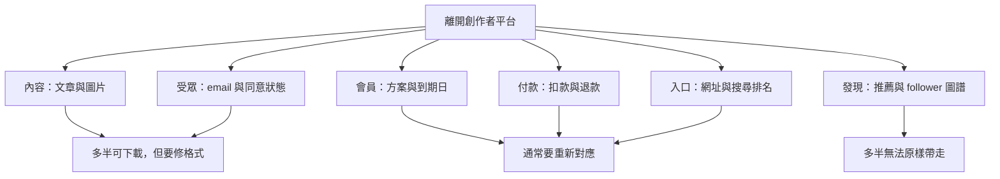
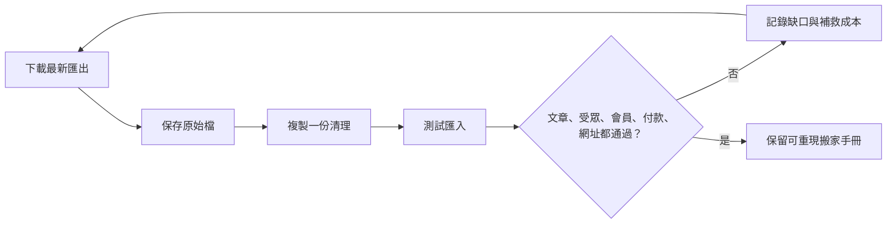

> 🌏 [English version](/en/posts/product/2026-09-17-creator-platform-migration-assets-en)

想像你從夜市搬到自己的店面。桌椅可以上卡車，熟客通訊錄也許能抄走；但原本的位置、人潮、隔壁攤商的介紹，以及客人已經設定好的付款方式，不會自動跟著走。

創作者平台的「匯出」也是這樣。下載到文章 ZIP 或訂閱者 CSV，只證明你拿到一部分檔案，不代表整門生意已經搬完。真正該問的不是「可不可以匯出」，而是**哪一層資產能帶走、哪一層要重建、哪一層本來就屬於平台。**

## 搬家不是一個按鈕，而是六層資產

這六層會被平台介面包在一起，搬家時卻會分開。文章匯入成功，不代表圖片網址沒壞；有 email，不代表仍有寄信同意；知道某人是年繳會員，也不代表新系統能接續原本的自動扣款。

| 資產層 | 常見可攜格式 | 最容易漏掉的東西 | 搬家驗收 |
|---|---|---|---|
| 內容 | HTML、JSON、CSV、ZIP | 圖片、embed、付費牆規則 | 隨機抽 20 篇逐頁比對 |
| 受眾 | email CSV | 退訂、同意狀態、只有 follower 無 email | 比對 active 與 unsubscribed 人數 |
| 會員 | tier、status、到期日 | 權益、折扣、歷史互動 | 每種方案抽樣登入 |
| 付款 | Stripe 或平台帳務 | token、退款、失敗扣款、稅務 | 小批續扣與退款測試 |
| 入口 | domain、redirect、canonical | 舊連結、搜尋排名、寄件信譽 | 監控 404、流量與投遞率 |
| 發現 | 通常沒有完整匯出 | 平台推薦、留言、社交圖譜 | 只能另建獲客管道 |

## 文章帶得走，版型和網址未必帶得走

[Substack 的官方匯出說明](https://support.substack.com/hc/en-us/articles/360037466012-How-do-I-export-my-posts)讓出版者下載文章、訂閱者名單與相關統計。[Medium](https://help.medium.com/hc/en-us/articles/115004745787-Export-your-account-data)也能產生帳號資料 archive。[Beehiiv](https://www.beehiiv.com/support/article/12258595483543-exporting-post-content-or-subscriber-data-from-beehiiv)則說明文章匯出包含已發布、封存與草稿內容。

這些功能很重要，卻只處理「原料」。新平台可能不認得舊平台的 callout、投票、音訊播放器或付費牆標記；圖片仍指向舊 CDN，關站後才一起消失；文章 slug 改變，累積多年的外部連結就落到 404。

因此內容搬家要做三份清單：文章數量、媒體檔數量、舊網址對新網址的 redirect map。三者少一份，都可能出現「後台看起來搬完，讀者打開卻壞掉」。

## Follower、email subscriber 與付費會員不是同一群人

平台上的 follow 是平台內關係。讀者可能按過追蹤，卻沒有把 email 提供給創作者。即使有 email，也要保留退訂與同意狀態，不能把整份 CSV 當成可以重新行銷的名單。

Medium 的官方說明區分了[帳號資料匯出](https://help.medium.com/hc/en-us/articles/115004745787-Export-your-account-data)與 [email subscriptions](https://help.medium.com/hc/en-us/articles/360059837393-Email-subscriptions)。現行說明也明確指出，新 email subscriber 的地址不再分享給作者；作者只能匯出政策變更前已取得的既有名單。Ghost 的 [Medium 搬遷指南](https://docs.ghost.org/migration/medium)仍說明如何匯入這類既有 Audience stats 清單，不能解讀成所有新 follower 或 subscriber 都可攜。這正好說明：作品、平台內追蹤者與作者實際持有的聯絡名單是三種資產。

Patreon 的 [Relationship Manager](https://support.patreon.com/hc/en-us/articles/360045516212-How-to-use-your-Relationship-manager)可匯出會員 CSV，但官方也提醒，部分會員可能選擇不向創作者分享 email。Vocus 的幫助文件可確認付費方案的[訂單明細能匯出 CSV](https://vocus.cc/help_center/TnC9HOz4dEujYDlmdPTg)，卻不能由此推導所有 follower、文章與扣款關係都能完整搬走。公開文件沒寫清楚的地方，應在選平台前直接詢問，而不是等要離開才猜。

## 最難搬的通常不是名單，而是扣款

一張會員 CSV 可以告訴你誰正在付費，卻不一定包含可在新平台繼續扣款的 payment token。會員方案名稱、折扣、年繳到期日、失敗扣款重試與退款紀錄，也可能使用不同資料模型。

Substack 的[搬入說明](https://support.substack.com/hc/en-us/articles/34558456517396-How-do-I-move-from-my-current-platform-to-Substack)要求先建立新的 Stripe 帳號，再匯入名單，並用 complimentary access 暫時保留既有付費讀者的權限。讀者之後仍要重新 Subscribe，讓新的 Stripe 帳號保存付款資料。這不是缺點判決，而是一個重要提醒：**名單搬入與付費關係接續，是兩個專案，讀者也會遇到重新訂閱的摩擦。**

Ghost 的設計把控制權往創作者移動。官方說明站點會[直接連到創作者自己的 Stripe](https://ghost.org/help/are-there-really-no-transaction-fees/)，Ghost 不另抽交易費，但仍有 Stripe 手續費。這讓付款關係比較接近創作者自己的基礎設施，不代表搬家零成本：權限、email、內容與網站仍要逐一驗收。

## 平台給你的流量，本來就不是匯出檔

最常被忽略的是第六層。Substack 的 Recommendations、Medium 的首頁分發、Vocus 的站內探索、Patreon 的平台發現，都不是一串可以帶去下一家的 email。它們比較像商場的人潮：租櫃時能享受，離場後不能要求商場把走道一起搬走。

這也是「平台有抽成」不能單獨判斷划不划算的原因。平台若持續帶來高品質新讀者，抽成可能是獲客費；若大部分讀者都由創作者自己帶入，抽成就更像租用結帳與寄信工具的費用。搬家決策要把失去的推薦流量，與省下的費用及增加的控制權一起算。

## 搬家前先做一次可逆性演習

不要等到帳號受限、價格改變或團隊決定離開時才第一次按 Export。每季做一次小型演習：下載內容與名單、在測試環境匯入、用 sandbox 或自有測試會員檢查付款流程、抽查文章與會員、保存網址對照，並記錄完成所需時間。不要對真實會員發起未告知的測試扣款。

最後的選型問題因此很簡單：如果明天平台消失，你能否在合理時間內恢復內容、聯絡讀者、辨認付費權限並重新開張？答案不必是「完全無痛」。但你應該知道哪些是自己的資產，哪些只是今天租來的便利。

## 參考資料

- [Substack：創作者平台搬家時匯出文章與出版資產](https://support.substack.com/hc/en-us/articles/360037466012-How-do-I-export-my-posts)
- [Substack：從其他平台搬入](https://support.substack.com/hc/en-us/articles/34558456517396-How-do-I-move-from-my-current-platform-to-Substack)
- [Medium：創作者離開平台時匯出帳號資料](https://help.medium.com/hc/en-us/articles/115004745787-Export-your-account-data)
- [Vocus：匯出付費方案訂單資料](https://vocus.cc/help_center/TnC9HOz4dEujYDlmdPTg)
- [Patreon：Relationship Manager 的 follower／email subscriber 與 CSV 匯出界線](https://support.patreon.com/hc/en-us/articles/360045516212-How-to-use-your-Relationship-manager)
- [Ghost：創作者平台會員搬家與匯入](https://ghost.org/help/import-members/)
- [Beehiiv：匯出文章與訂閱者資料](https://www.beehiiv.com/support/article/12258595483543-exporting-post-content-or-subscriber-data-from-beehiiv)
