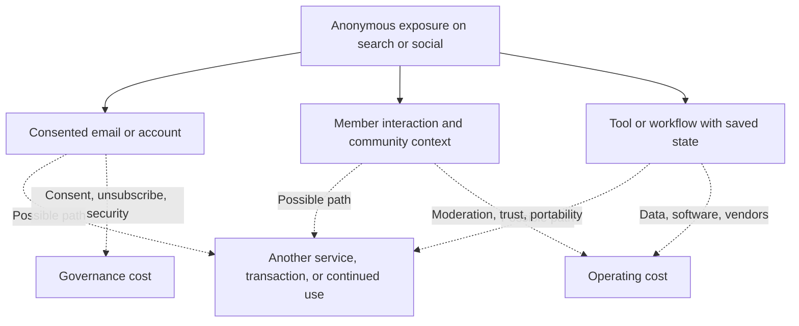
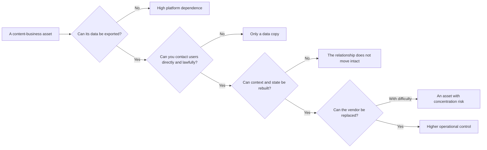

> 🌏 [中文版](/posts/product/2026-09-17-first-party-community-tools)

Imagine renting a stall at a night market. The market supplies the foot traffic; you cannot take the whole street home. A visitor who agrees to leave contact details has entered your customer book. Several regulars who start helping one another may become a community. Give them a measuring tool that remembers their dimensions, and they have a reason to return to unfinished work.

The customer book is not “owned forever.” The data must be kept secure and used within its stated purpose, with deletion and portability handled where required. Email still passes through inbox providers. A community may live on another company's platform. A tool depends on hosting, data, payments, and maintenance.

[Google's AI features in Search](https://developers.google.com/search/docs/appearance/ai-features) assemble answers in the search interface and provide supporting links. A content business therefore cannot assume that every exposure produces a visit to the source, so first-party data, community, and tools deserve more attention. The useful question is not whether they qualify as owned media. It is: **which relationships and jobs can be moved or rebuilt, and which essential switches remain in someone else's hands?**

## Move from rented exposure toward an ongoing job

This is not a required funnel. Some people use a tool before registering, some only join a community, and some subscribe to email without ever paying. The diagram separates asset layers. Exposure creates awareness. Identity allows another interaction within the permission granted. Context and tools may create a reason to complete another job.

Responsibility rises with control. Collecting data, opening a community, or building a tool does not create a free moat.

## First-party data does not mean “collect everything”

This article operationally defines first-party data as an email address or account preference supplied directly by a user, plus behavior inside the company's own product when collected and used for a disclosed purpose. The valuable part is not the number of fields. It is whether the data improves a specific job: restoring a watchlist, resuming progress, or sending a requested alert.

The UK [ICO's data-minimisation guidance](https://ico.org.uk/for-organisations/uk-gdpr-guidance-and-resources/data-protection-principles/a-guide-to-the-data-protection-principles/data-minimisation/) says personal data should be adequate, relevant, and limited to what is necessary for its purpose. It also calls for periodic review and deletion of data no longer needed. The [European Commission's summary of individual rights under GDPR](https://commission.europa.eu/law/law-topic/data-protection/information-individuals_en) covers access, correction, erasure, objection, and portability under specified conditions.

These are European and UK sources, not legal advice for Taiwan. They provide a useful product-design boundary: the cost of first-party data includes consent records, access control, security, export, and deletion—not merely acquiring more email addresses.

## A community is not a follower list

A follower list is a reachable audience arranged by a platform. Reach can change with an algorithm or account decision. A community adds another layer: members know one another exists, answer one another, and accumulate shared context that only the group understands.

More interaction still does not guarantee retention. Cold start, moderation, harassment response, search across old discussions, and identity migration all cost money. If a platform exports member emails but not threads, relationship graphs, and permissions, an operator will still lose important context during a move.

## Tools connect answers to action, but they can also be replaced

An article can explain how to estimate retirement savings. A calculator can accept assumptions, compare scenarios, and save the result. A monitoring tool can notify the user when an input changes. The tool's value is not shorter prose; it completes a job.

That does not make every tool a moat. An answer engine can absorb a simple conversion. Incorrect output destroys trust. Inputs create privacy obligations. APIs, licensed data, security, and mobile behavior require maintenance. [Google's spam policies](https://developers.google.com/search/docs/essentials/spam-policies) even classify sites that claim to provide functionality but instead route people to deceptive ads as misleading functionality. A tool must first work before its return loop matters.

## Break “ownership” into four questions

| Asset | What may be controlled or exported | Remaining dependencies | Main costs | Outcome to test |
|---|---|---|---|---|
| Email or account | Consented address, preferences, membership state | Inbox provider, email service, identity system | Consent, unsubscribe, deliverability, security | Qualified activation, returns, unsubscribe, conversion |
| On-site behavior | Product events and saved state | Analytics vendor, device limits, privacy rules | Data quality, minimization, retention period | Feature adoption and cohort difference |
| Community | Member identity and some content, depending on export | Community platform, moderation tools, moderators | Cold start, governance, trust, migration | Member-to-member interaction and health |
| Tool or workflow | Software, interface, and user state, depending on architecture | Hosting, data suppliers, APIs, app stores | Development, security, data, support | Task completion, repeat use, payment |
| Transaction relationship | Orders, plans, and service records, subject to contracts and law | Payments, storefront, logistics, financial partners | Compliance, refunds, risk, service | Gross profit, payback, retention |

Email is more portable than a follower list, but delivery remains outside the sender's full control. A tool on a first-party domain is more controllable than a social post, but its infrastructure dependencies do not disappear. Control must be evaluated column by column.

The decision tree deliberately has no “fully owned” destination. Higher operational control still brings legal, security, and operating responsibilities. A more practical goal is to know what fails with each dependency and maintain an export, backup, alternative vendor, and communication plan.

## Use cohorts to find differences, not declare causation

First-party data can become a dormant list. A community can be a few people talking to themselves. A tool can be used only once. Compare acquisition and operating costs, then observe whether these assets are associated with different activation, repeat use, payment, and retention.

A practical exercise is to create a portability inventory for email, membership, community, tool state, and transactions. For each, record the export format, lawful purpose, deletion process, external dependency, and last restore test. Then choose a cohort and compare what happened after tool activation or community participation. Correlation is not causation, but it turns “we own a community” into a claim that can be inspected.

AI search increases uncertainty around the public-text entrance. It does not automatically create first-party relationships, community trust, or useful tools for anyone. These assets matter not because they escape every platform, but because they may connect one answer to another permitted interaction and an unfinished job.

## References

- [Google Search Central: AI features and your website](https://developers.google.com/search/docs/appearance/ai-features)
- [ICO: Data minimisation](https://ico.org.uk/for-organisations/uk-gdpr-guidance-and-resources/data-protection-principles/a-guide-to-the-data-protection-principles/data-minimisation/)
- [European Commission: Information for individuals under GDPR](https://commission.europa.eu/law/law-topic/data-protection/information-individuals_en)
- [Google Search Central: Spam policies](https://developers.google.com/search/docs/essentials/spam-policies)
