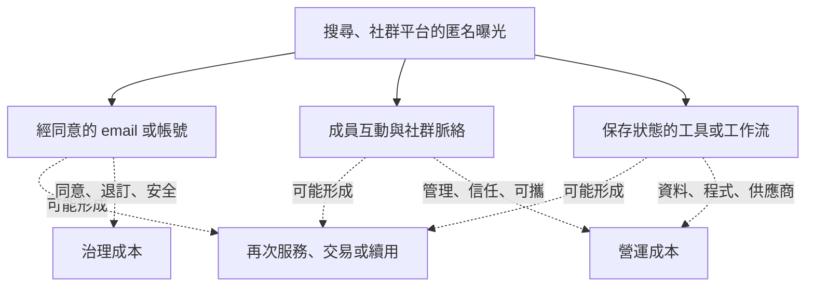
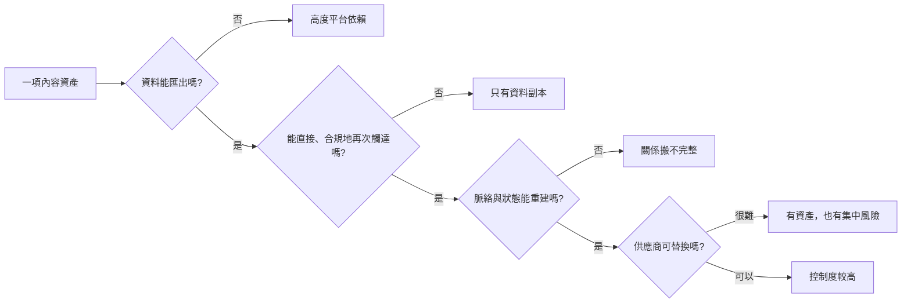

> 🌏 [English version](/en/posts/product/2026-09-17-first-party-community-tools-en)

想像你在夜市租攤位。路過的人潮是市場帶來的；你不能把整條街搬走。有人同意留下聯絡方式，像把電話寫進你的顧客簿。幾位常客開始彼此交換心得，才有了社群。你再送他們一把會保存尺寸的量尺，讓他們下次回來繼續量，這才像工具。

但顧客簿不是「從此都歸你」。資料要安全保存，也要尊重用途、刪除與可攜要求。Email 還得通過 inbox provider，社群可能住在別人的平台，工具也依賴 hosting、資料源、支付與維護。

[Google 的 AI 搜尋功能](https://developers.google.com/search/docs/appearance/ai-features)會在搜尋介面組合答案並附 supporting links。因此，內容業者不能假設每次曝光都會帶來原站造訪，第一方資料、社群與工具也更值得檢查。重點不是把它們叫做 owned media，而是問：**哪些關係與工作能帶走、能重建，又有哪些開關仍在別人手上？**

## 從租來的曝光，一層一層接近工作

這不是必經漏斗。有人會先用工具才註冊，有人只參與社群，有人訂閱 email 卻從未付費。圖的用途是把不同資產分層：曝光讓人知道你；身份讓你在允許範圍內再次服務；脈絡與工具讓人有理由完成下一個動作。

每往內一層，維護責任也增加。蒐集資料、開社群或做工具都不是免費護城河。

## 第一方資料不是「蒐集愈多愈好」

本文把第一方資料操作性地定義為使用者直接提供的 email、帳號偏好，以及他在自家產品裡留下、且依告知用途處理的行為。真正有用的不是欄位數量，而是資料能否改善一個明確工作，例如記住追蹤清單、續接上次進度或寄出使用者要求的提醒。

[英國 ICO 對資料最小化的說明](https://ico.org.uk/for-organisations/uk-gdpr-guidance-and-resources/data-protection-principles/a-guide-to-the-data-protection-principles/data-minimisation/)要求個資與目的相稱、相關，且只保留必要部分；也建議定期檢查並刪掉不再需要的資料。[歐盟執委會整理的 GDPR 個人權利](https://commission.europa.eu/law/law-topic/data-protection/information-individuals_en)還包括存取、更正、刪除、反對與在特定條件下的資料可攜。

這些是歐洲／英國的規範來源，不是台灣法律意見。它們在產品設計上提供一個很實用的提醒：第一方資料的成本要包含同意紀錄、權限、安全、匯出與刪除流程，不能只把 email 數量當資產。

## 社群不是追蹤者清單

一批 follower 是平台替你排好的可觸及對象，演算法或帳號狀態一改，觸及就可能改變。社群至少還多一層：成員知道彼此存在、會互相回答，並累積只有這群人看得懂的共同脈絡。

不過「互動比較多」不等於社群必然留存。冷啟動、版主管理、騷擾處理、搜尋舊討論與身份遷移都要成本。如果平台只允許匯出成員 email，卻帶不走討論串、關係圖與權限，搬家時仍會失去重要資產。

## 工具把答案接到行動，但也會被取代

文章能解釋「退休金怎麼估」，計算器能接收條件、算出情境並保存結果；監控工具還能在條件改變時提醒。工具的價值不是字比較少，而是能完成工作。

這也不代表工具天然有護城河。簡單換算可能直接被答案引擎內建；錯誤結果會快速消耗信任；輸入資料涉及隱私；API、資料授權、資安與行動版都要維護。[Google 的垃圾內容政策](https://developers.google.com/search/docs/essentials/spam-policies)甚至把宣稱有功能、實際只導向欺騙性廣告的網站列為 misleading functionality。工具必須先真的有用，才談得上回訪。

## 「擁有」最好拆成四個問題

| 資產 | 可以掌握或匯出什麼 | 仍依賴誰 | 主要成本 | 應驗證的結果 |
|---|---|---|---|---|
| Email／帳號 | 經同意取得的地址、偏好、會員狀態 | inbox provider、寄信服務、身份系統 | 同意、退訂、deliverability、安全 | 合格啟用、回訪、退訂、轉換 |
| 自有站行為 | 產品內事件與保存狀態 | analytics、裝置限制、隱私規則 | 資料品質、最小化、保存期限 | 功能採用與 cohort 差異 |
| 社群 | 成員身份與部分內容，依平台 export 而異 | 社群平台、管理工具、版主 | 冷啟動、治理、信任與遷移 | member-to-member 互動與健康度 |
| 工具／工作流 | 程式、介面、使用者狀態，依架構而異 | hosting、資料源、API、App store | 開發、資安、資料與客服 | task completion、重複使用與付費 |
| 交易關係 | 訂單、方案與服務紀錄，依合約及法規而異 | 支付、商店、物流或金融夥伴 | 法遵、退款、風險與服務 | 毛利、回收期與留存 |

Email 比 follower 更容易攜帶，不代表送達由你控制；自有網域的工具比第三方貼文更可控，不代表底層依賴消失。真正的控制程度要逐欄看。

這張決策圖沒有「完全擁有」的終點。即使控制度較高，也還有法規、資安與營運責任。比較實際的目標，是知道哪一個依賴故障時會失去什麼，並準備 export、備份、替代供應商與溝通方案。

## 用 cohort 找差異，不把差異當因果

第一方資料可能只是沉睡名單，社群可能只有少數人自言自語，工具可能只被用一次。要判斷它們是否比公開文章更有商業價值，應比較取得成本，並觀察它們是否伴隨較高的啟用、重複使用、付費與留存。

今晚可以做一份「可攜性清單」：列出 email、會員、社群、工具狀態與交易資料，替每項填入匯出格式、合法用途、刪除流程、外部依賴和最後一次還原測試。再選一個 cohort，比較有啟用工具或參與社群的人，後續行為是否真的不同。相關不等於因果，但至少會把「我們擁有社群」改成可檢查的主張。

AI 搜尋提高了公開文字入口的不確定性，卻沒有自動替任何人建立第一方關係、社群信任或好用的工具。這三種資產之所以重要，不是因為它們不受平台影響，而是它們有機會把一次答案，接成下一次被允許的互動與尚未完成的工作。

## 參考資料

- [Google Search Central：AI features and your website](https://developers.google.com/search/docs/appearance/ai-features)
- [ICO：第一方資料的最小化原則](https://ico.org.uk/for-organisations/uk-gdpr-guidance-and-resources/data-protection-principles/a-guide-to-the-data-protection-principles/data-minimisation/)
- [European Commission：個資存取、刪除、可攜與 owned data 邊界](https://commission.europa.eu/law/law-topic/data-protection/information-individuals_en)
- [Google Search Central：工具功能與垃圾內容政策](https://developers.google.com/search/docs/essentials/spam-policies)
