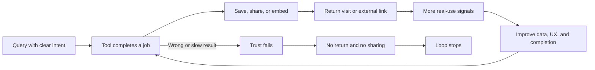
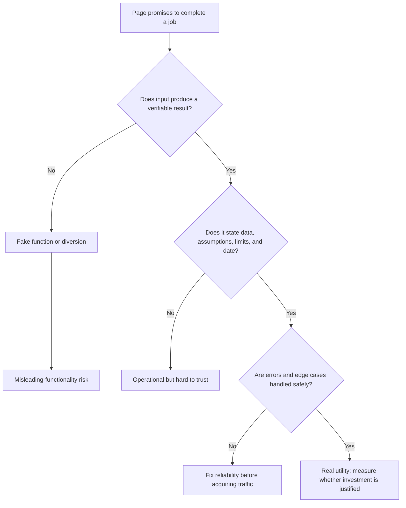
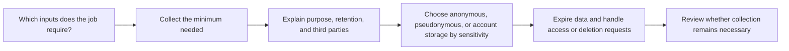

> 🌏 [中文版](/posts/product/2026-09-17-free-tools-seo-compounding)

An article is like a recipe. You may read it from beginning to end the first time, then return only to check the water ratio. A free calculator is like a kitchen scale: every change in ingredients or serving size creates another reason to use it. The recipe explains; the scale completes a recurring job.

That does not mean the scale is automatically more popular, or that a free tool inherently ranks higher. A tool has an opportunity because changing inputs require new results, giving users a reason to return, save, or share. Those behaviors may form a compounding loop. Wrong results, slow loading, or stale data can reverse it.

“Build a calculator and get SEO” is therefore not a strategy. Ask what job the tool completes, whether search engines can understand its entry page, whether every step in the loop is measured, and whether the team can sustain correctness and data responsibility.

## Tools and articles create different next actions

| Comparison | Free article | Free tool |
|---|---|---|
| Core value | Explains a concept and decision context | Uses inputs to calculate, compare, or transform |
| Reason to return | Reference, review, or new content | New inputs, recalculation, or ongoing monitoring |
| First-party signals | Reading, scrolling, and clicks | Consented, appropriately de-identified input, output, and completion behavior |
| Next action | Subscribe, read, or buy | Save, share, export, create an account, or enter the product |
| Maintenance | Editorial updates, sources, dates | Data, code, UX, security, delivery, and support |
| AI-summary exposure | Text answers are easy to restate | Complex work is harder to replace; simple calculations can still be reproduced |

An article is not inferior, and a tool is not inherently valuable. If readers need to understand limitations, compare methods, or build a mental model, an article may be the complete product. A tool has a stronger case when the problem recurs and the inputs change each time.

## “Tool compounding” is a chain of testable hypotheses

Free tools are often said to attract return visits and backlinks. That is a plausible mechanism hypothesis, not a ranking rule published by [Google Search Central](https://developers.google.com/search/docs). Google's documentation supports more basic requirements: pages must be crawlable, indexable, and policy compliant. It does not promise that a tool beats an article.

Measure every arrow instead of substituting total traffic:

- Query to activation: do visitors enter data and receive a result?
- Activation to completion: where do errors, latency, or mobile UX cause exits?
- Completion to return: does the same device or signed-in cohort use it again?
- Completion to sharing: are export, copied links, or embeds actually used?
- Use to improvement: does the team convert failed inputs and support cases into fixes?

Tonight, choose one tool and write down one event name and current value for each stage. If a stage has no event, instrument it before interpreting traffic growth as compounding.

## A real tool fulfills its promise; an input box is not enough

[Google's spam policies](https://developers.google.com/search/docs/essentials/spam-policies) list misleading functionality as spam behavior, including sites that claim to provide a function but instead lead users to deceptive ads. Buttons, progress bars, and animation do not make a tool. It must complete the job it claims to perform.

Acceptance testing must go beyond “the button works.” Test calculations against known answers, probe boundaries with extreme inputs, disconnect an external data source to inspect failure behavior, and place the data timestamp and assumptions near the result. Health, financial, legal, and other high-stakes tools require stronger sourcing, review, and disclaimers.

## Programmatic pages are not synonymous with free tools

A tool may generate result pages for different cities, products, or parameters. The temptation is to swap keywords in one template and publish many pages with almost no added value. [Google's spam policies](https://developers.google.com/search/docs/essentials/spam-policies#scaled-content) call large-scale content created primarily to manipulate rankings, with little original value, scaled content abuse. Generative AI, scraped feeds, and manual assembly can all fall within the policy.

Ask three questions before a programmatic page exists:

1. Does this input materially change the result, limitation, or recommendation rather than merely the place name?
2. Without operating the tool, does the page still explain data sources and context unique to this case?
3. When an update fails, does the system disable stale results and show the date, or pretend the answer remains current?

If all three are unanswered, do not expand the page count. One usable entry page and one complete tool are closer to a product than ten thousand thin pages that differ only by keyword.

## First-party signals are not permission to collect everything

Tools receive more user input than articles. It may be an anonymous unit conversion, or it may reveal income, health, location, or business secrets. The ability to receive data is not permission to retain it forever, train a model on it, or merge it into marketing profiles. The following is a product-design checklist, not a legal rule that is identical across jurisdictions.

Start with a data inventory: list each field, purpose, storage location, retention period, authorized roles, and external services. Remove fields without a defined purpose. Prefer browser-side processing when a simple calculation does not need server storage. Specific legal duties still depend on operating location, user location, and data type.

## Maintenance determines whether the loop compounds or backfires

A free tool costs more than its first build. Data providers change formats, third-party APIs raise prices or disappear, browsers and mobile devices evolve, and formulas become stale after policy or market changes. A tool that keeps publishing wrong answers accumulates a trust liability amplified by search visibility, not an SEO asset.

Assign four owners before launch: formula, data-source monitoring, security and privacy incidents, and shutdown decisions. Define observable failure conditions. If data passes its expiry date, error rates climb, or a source becomes unreachable, stop displaying a precise answer and tell the user what happened.

## Conclusion: prove that the job is complete before claiming search compounding

Free articles reduce the cost of understanding. Free tools complete an interactive job. A tool may generate return visits, sharing, direct relationships, and product activation, but every item is an outcome to verify—not a reward automatically attached to the format.

Do not begin by asking how many programmatic pages can be made. Choose one frequent job with changing inputs and verifiable results. Make it correct, measure completion, define data responsibility, and only then decide whether to expand. If search value compounds, it should be visible inside that usage loop.

## References

- [Google Search Central: Search documentation](https://developers.google.com/search/docs) — technical and policy entry point for appearing in search
- [Google Search Central: Spam policies for Google web search](https://developers.google.com/search/docs/essentials/spam-policies) — misleading functionality and scaled content abuse
- [Google Search Central: SEO Starter Guide](https://developers.google.com/search/docs/fundamentals/seo-starter-guide) — crawling, indexing, and user-centered fundamentals
