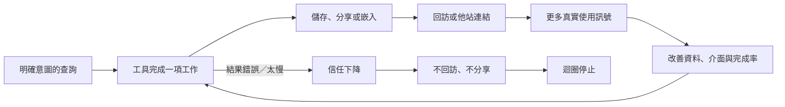
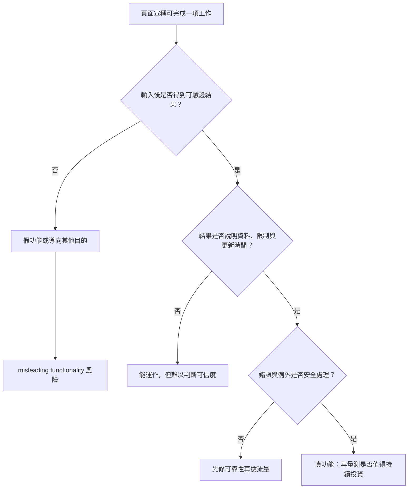
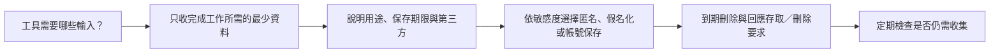

> 🌏 [English version](/en/posts/product/2026-09-17-free-tools-seo-compounding-en)

文章像食譜。第一次做菜時，你從頭讀到尾；下次可能只回來確認水量。免費計算器則像廚房秤：每次換食材或份量，都會重新拿出來使用。食譜在解釋，秤在完成一個反覆出現的工作。

這不代表廚房秤一定比食譜受歡迎，也不代表免費工具天然排得更高。工具的機會在於：只要輸入會變、結果要重算，讀者就有回訪、儲存或分享的理由。這些行為可能形成複利，也可能因結果錯誤、載入太慢或資料過時而反轉。

所以「做個計算器就有 SEO」不是策略。真正的問題是：工具完成了什麼工作？搜尋引擎能不能讀懂入口頁？每一段複利是否有量測？團隊能不能長期維持正確性與資料責任？

## 工具與文章提供不同的下一步

| 比較 | 免費文章 | 免費工具 |
|---|---|---|
| 核心價值 | 解釋概念、提供判斷背景 | 用輸入完成計算、比較或轉換 |
| 回訪理由 | 查閱、複習或等待新內容 | 換一組輸入、重新計算或持續監控 |
| 第一方訊號 | 閱讀、捲動、點擊 | 經同意且適當去識別的輸入、輸出與完成行為 |
| 下一個動作 | 訂閱、閱讀下一篇、購買 | 儲存、分享、匯出、建立帳號或接上產品 |
| 維護成本 | 編輯、來源與發布日期更新 | 資料、程式、介面、資安、寄信與客服 |
| AI 摘要風險 | 文字答案容易被重述 | 複雜工作較難取代；簡單計算仍可被模型重做 |

文章並不低階，工具也不必然更有價值。若讀者需要理解限制、比較方法或建立觀念，文章可能就是完整產品。若問題會反覆出現，而且每次輸入都不同，工具才有機會把一次搜尋變成持續使用。

## 「工具複利」是一串待驗證假說

常見說法是免費工具能帶來回訪與反向連結。這是一個合理的機制假說，不是 [Google Search Central](https://developers.google.com/search/docs) 公布的排名規則。Google 官方文件能支持的是基本門檻：頁面需要能被抓取、索引，並符合搜尋政策；它沒有保證「工具勝過文章」。

每一條箭頭都該有自己的指標，而不是用總流量代替：

- 查詢到啟用：到站的人是否真的輸入資料並取得結果？
- 啟用到完成：錯誤、等待時間與行動版操作在哪一步讓人離開？
- 完成到回訪：同一裝置或登入 cohort 是否真的再次使用？
- 完成到分享：匯出、複製連結或嵌入是否被使用？
- 使用到改善：產品團隊是否把失敗輸入與客服問題轉成修正？

今晚可以先挑一個工具，把這五段各寫出一個事件名稱與目前數值。任何一段沒有事件，就先補量測，不要直接把流量上升解讀成複利。

## 真工具必須完成承諾，不只是做出輸入框

[Google 的 spam policies](https://developers.google.com/search/docs/essentials/spam-policies) 將 misleading functionality 列為垃圾內容行為，其中包括聲稱提供某項功能，實際上卻把使用者導向欺騙性廣告。換句話說，頁面有按鈕、進度條與動畫，不代表它是一個工具；宣稱能做的事必須真的完成。

最低限度的驗收不只是「按得動」。團隊應用已知答案測試計算、用極端輸入測試邊界、拔掉外部資料源看失敗畫面，並在結果附近標出資料時間與假設。若工具涉及健康、財務或法律等高風險決策，還要提高來源、審查與免責提示的標準。

## 程序化頁面不是免費工具的同義詞

一個工具可以為不同城市、產品或參數產生結果頁。風險在於，團隊很容易把同一模板換掉關鍵字，大量發布幾乎沒有新增價值的頁面。[Google 的垃圾內容政策](https://developers.google.com/search/docs/essentials/spam-policies#scaled-content)把主要為操弄搜尋排名、大量生成且缺少原創價值的內容列為 scaled content abuse。無論內容來自生成式 AI、抓取資料或人工組裝，都可能落入政策範圍。

判斷一張程序化頁面是否值得存在，可以問三件事：

1. 這組輸入是否真的改變結果、限制或建議，而不是只換地名？
2. 讀者不操作工具時，頁面是否仍提供該情境獨有的資料來源與說明？
3. 資料更新失敗時，系統會停用舊結果、標示日期，還是假裝仍然正確？

如果三題都答不出來，先不要擴頁數。把一個入口頁和一個完整工具做好，比生出一萬張只有關鍵字差異的薄頁更接近產品。

## 第一方訊號不是任意收集資料的許可

工具比文章更容易收到使用者輸入。輸入可能只是匿名的單位換算，也可能暴露收入、健康、地址或商業機密。能收到資料，不等於可以永久保存、拿去訓練模型或與行銷名單合併。以下是產品設計檢查清單，不是跨司法管轄區都相同的法律要求。

實務上先做資料盤點：欄位、用途、保存位置、保存期限、可存取角色與外部服務各列一欄。沒有明確用途的欄位先刪；不需要傳到伺服器的簡單計算，優先在瀏覽器完成。具體法律義務仍要依營運地、使用者所在地與資料類型另行確認。

## 維護成本決定複利還是反噬

第一次開發只是免費工具成本的起點。資料源會改格式，第三方 API 會調價或停止服務，瀏覽器與行動裝置會改版，公式也可能因政策或市場變化失效。工具若長期顯示錯誤結果，搜尋可見度只會把信任負債一起放大。

上線前至少指定四個責任：誰擁有公式、誰監控資料源、誰處理安全與隱私事件、誰決定停用。再設定可觀測的失效條件，例如資料超過期限、錯誤率升高或來源無法連線時，停止顯示精確結果並告知使用者。

## 結論：先證明工作被完成，再談搜尋複利

免費文章用解釋降低理解成本；免費工具用互動完成一項工作。後者可能帶來回訪、分享、直接關係與產品啟用，但每一項都是需要數據驗證的結果，不是「工具」這個格式自帶的獎勵。

起步時，先選一個高頻、輸入會變、結果能驗證的工作，不要先算能做多少程序化頁面。把它做對、量到完成率、寫清楚資料責任，再決定是否擴張。搜尋價值若會複利，應該能在這條使用迴圈裡被看見。

## 參考資料

- [Google Search Central：Search documentation](https://developers.google.com/search/docs) — 搜尋出現的技術與政策入口
- [Google Search Central：Spam policies for Google web search](https://developers.google.com/search/docs/essentials/spam-policies) — misleading functionality 與 scaled content abuse
- [Google Search Central：SEO Starter Guide](https://developers.google.com/search/docs/fundamentals/seo-starter-guide) — 抓取、索引與以使用者為中心的基本做法
