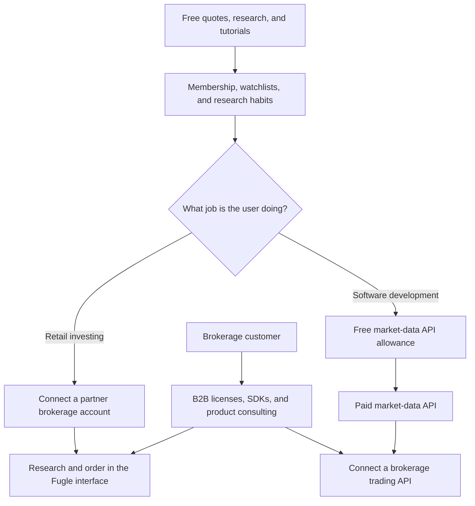
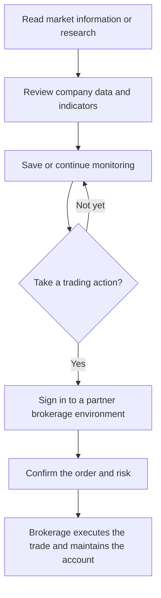
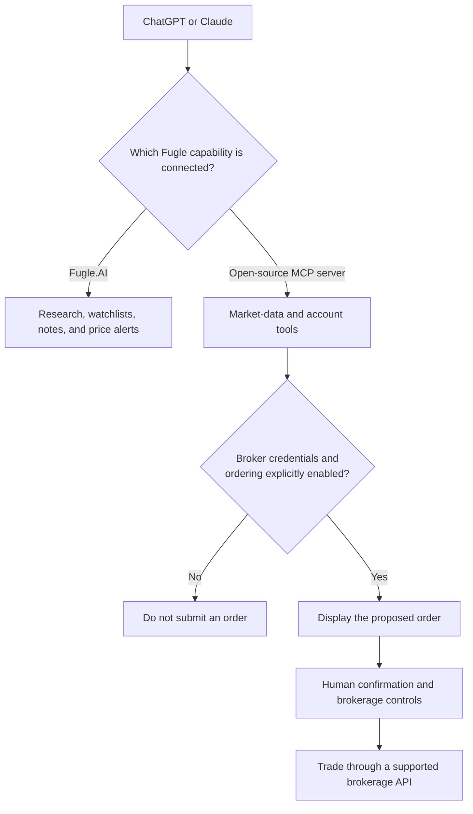

> 🌏 [中文版](/posts/product/2026-09-17-fugle-information-to-trading)

Imagine a store that lends you maps and traffic reports for free and lets you save familiar routes. When you decide to travel, the store does not drive the vehicle. It connects its interface to a licensed transportation company. Developers can also pay for a traffic API and build their own navigation tools.

[Fugle](https://www.fugle.tw/) works in a similar way. Retail investors use it to follow markets, research stocks, and maintain watchlists before signing in to a partner brokerage environment to place an order. Developers can use market-data and trading APIs. Brokerages can buy technology, data licenses, and digital-product expertise.

This path is often compressed into “free content generates trading commissions.” Public evidence does not support that claim. Fugle has described information-service revenue in a media interview and publishes personal API subscriptions and enterprise plans. It does not disclose per-trade revenue sharing, account-opening bounties, or individual brokerage contracts. This article examines how information becomes part of a repeated workflow, not an unevidenced commission rate.

## Fugle has three funnels, not one

The same market-data and research capabilities serve three different customers.

The first funnel takes a retail investor from research to an order. The second moves a developer from a free API allowance to a paid API. The third is paid for by brokerages: Fugle supplies market-data licenses, trading SDKs, documentation, onboarding, and product expertise.

| Path | Free entry point | Who pays | Evidenced paid job | What public sources do not show |
|---|---|---|---|---|
| Retail investor | Quotes, research, reports, and tutorials | Partner brokerage; other retail payers are not public | Information services and order-interface integration | Per-trade sharing or account-opening bounties |
| Individual developer | Basic API access after registration | Developer | Higher limits, more data types, and more connections | Plan margins and free-to-paid conversion |
| Brokerage B2B | API documentation and developer ecosystem | Brokerage | Data licenses, SDKs, implementation, low-latency infrastructure described in an AWS customer story, and consulting | Contract value, minimum commitments, and revenue-sharing formula |

The most important blank is the trading commission. An order button inside an interface does not establish that Fugle receives a share of every executed trade.

## The research interface shortens the path before an order

Investors rarely read one article and immediately buy. They check prices, compare companies, save a stock, wait, validate the idea again, and sign in to a brokerage. Fugle's product value comes from placing several of these steps in one interface.

The final box matters. The brokerage provides the securities account, custody records, settlement, and account ledger. Fugle does not turn the reader into its own brokerage customer.

[Fugle's official notice](https://support.fugle.tw/fugle-member-account/fugle-guidance/15335/) provides a useful stress test. E.SUN Securities and Fugle are separate companies. When order and account functions inside the Fugle app and website ended at the end of 2024, investors' assets stayed at E.SUN and customers moved to E.SUN's own interface. Fugle's market research could continue, but the one-stop trading exit disappeared.

Order integration is therefore both a conversion tool and a dependency. Investors save steps when research and trading share an interface. The platform can also lose the part closest to a transaction when a partner changes direction.

## The E.SUN interruption shows revenue dependence, not a commission model

In 2025, a [Business Next interview with Fugle](https://tw.news.yahoo.com/%E7%8D%A8%E5%AE%B6%E5%B0%88%E8%A8%AA-%E5%AF%8C%E6%9E%9C%E5%88%86%E6%89%8B%E7%8E%89%E5%B1%B1100-%E5%A4%A9-%E6%94%9C%E6%89%8B%E5%85%83%E5%AF%8C%E8%AD%89%E5%88%B8%E7%B5%84%E9%9A%8A-%E7%82%BA%E4%BD%95%E8%BD%89%E5%9E%8B%E5%A4%9A%E5%88%B8%E5%95%86%E6%95%B8%E4%BD%8D%E5%B9%B3%E5%8F%B0-101448858.html) reported that company revenue and active app users fell sharply after the E.SUN integration ended. Those figures came from company executives, not public financial statements or an independent audit, so this article does not treat the precise percentages as verified financial results.

The case still answers an important question. Order integration was more than an extra button. It affected whether people returned to research, whether a brokerage paid for information services, and whether Fugle could jointly operate a digital customer channel with its partner.

Fugle then moved toward a multi-broker model. An official 2026 [account-linking guide](https://support.fugle.tw/fugle-guidance-2/6739/) uses Taishin Securities as its example, while the earlier interview documented the launch of a MasterLink integration. These names should not be merged into an undated list of “all current partners.” App and web orders, trading APIs, historical partnerships, and brokerage mergers are separate surfaces. Product scope and date matter more than list length.

## APIs turn one reading session into an operating dependency

An article ends when the reader closes it. An API becomes part of software, scheduled jobs, and trading strategies. That is why free information can grow a deeper paid layer.

On September 17, 2026, [Fugle's market-data API page](https://developer.fugle.tw/docs/pricing/) showed basic access after registration, followed by paid developer and advanced plans with higher subscription counts, connection limits, request rates, and additional data types. Enterprises could request dedicated infrastructure. This article omits exact prices because the research found only the official snapshot, not a contemporaneous independent confirmation.

A developer upgrades because the software has begun to depend on reliable data, not to read a few more articles. Once a strategy, monitor, backtest, or alert uses an API, switching means rewriting fields, rate-limit handling, error paths, and brokerage adapters.

The brokerage layer is deeper. An [AWS customer story about Fugle](https://aws.amazon.com/tw/events/taiwan/interviews/aws-outposts-cht-fugle/) says brokerages can buy market-data licenses in bulk, while Fugle supplies trading SDKs, documentation, sample code, and onboarding. A separate [Business Next report on Fugle's APIs](https://www.bnext.com.tw/article/82066/quant-trading-fugle) describes a package of market data, brokerage connectivity, and developer support. At that point, Fugle is selling infrastructure that helps a brokerage serve programmatic traders, not an individual piece of information.

## Fugle.AI is not the same product as the order-capable MCP server

AI shortens the path from information to action. It also makes product boundaries easy to overstate.

The [Fugle.AI website](https://www.fugle.ai/) says users can connect Fugle to ChatGPT or Claude to query Taiwan equities, manage watchlists, save investment notes, and set price alerts. It moves research tasks from a standalone app into a conversational interface. The readable page does not advertise order placement.

Separately, Fugle's open-source [`fugle-mcp-server`](https://github.com/fugle-dev/fugle-mcp-server) includes market-data, account, and trading capabilities. It requires brokerage credentials and a certificate, and its configuration contains an `ENABLE_ORDER` switch. The order-capable path therefore requires a brokerage relationship and explicit authorization. Its capability should not be moved onto Fugle.AI's marketing page.

That switch is not a minor implementation detail. A wrong natural-language price answer can still be checked. A misunderstood order can lose real money. Brokerage passwords, identity data, and certificates also belong in a controlled execution environment, not in a chat message.

## AI lowers entry friction; data rights and responsibility remain

AI can make market queries and programming easier. An investor can maintain a watchlist or alert in one sentence. A developer can understand an SDK faster, generate a starting example, and connect data to a workflow.

It does not remove three hard constraints:

- **Data rights and latency.** A model cannot turn delayed data into real-time quotes or bypass market-data licensing.
- **Trading responsibility.** An LLM answer is not brokerage risk control and does not establish suitability for an investor.
- **Secrets.** If certificates, passwords, or identity data leak through a prompt, log, or third-party service, the damage is larger than an inaccurate recommendation.

Fugle's more durable AI-era assets include data access, saved research state, API contracts, brokerage integrations, and technical support. A chat window can shorten the entrance to the workflow. It cannot replace the infrastructure underneath it.

## Map your own funnel tonight

If you are building free content to acquire customers for another business, first draw the path. Split it into five boxes: free entry, user data that remains, repeated job, paid task, and the party that actually fulfills it. Then ask which arrow has measured evidence and which arrow exists only because two buttons sit next to each other.

Fugle shows that the most valuable paid layer is often not information itself, but the steps saved after information enters a decision workflow. It also shows the other side of integration: when a licensed partner must fulfill the final step, the business model needs an exit route for partnership changes.

## References

- [Fugle: Taiwan equity market-data plans and pricing](https://developer.fugle.tw/docs/pricing/) (in Chinese)
- [Fugle: Notice about the E.SUN Securities integration](https://support.fugle.tw/fugle-member-account/fugle-guidance/15335/) (in Chinese)
- [Fugle: Linking a partner brokerage account](https://support.fugle.tw/fugle-guidance-2/6739/) (in Chinese)
- [Fugle.AI: Research, watchlists, notes, and alerts in AI tools](https://www.fugle.ai/) (in Chinese)
- [GitHub: Fugle MCP Server](https://github.com/fugle-dev/fugle-mcp-server) (documentation primarily in Chinese)
- [Business Next: Fugle's multi-broker platform transition](https://tw.news.yahoo.com/%E7%8D%A8%E5%AE%B6%E5%B0%88%E8%A8%AA-%E5%AF%8C%E6%9E%9C%E5%88%86%E6%89%8B%E7%8E%89%E5%B1%B1100-%E5%A4%A9-%E6%94%9C%E6%89%8B%E5%85%83%E5%AF%8C%E8%AD%89%E5%88%B8%E7%B5%84%E9%9A%8A-%E7%82%BA%E4%BD%95%E8%BD%89%E5%9E%8B%E5%A4%9A%E5%88%B8%E5%95%86%E6%95%B8%E4%BD%8D%E5%B9%B3%E5%8F%B0-101448858.html) (in Chinese)
- [Business Next: Fugle's market-data and trading APIs](https://www.bnext.com.tw/article/82066/quant-trading-fugle) (in Chinese)
- [AWS: Fugle's low-latency trading infrastructure](https://aws.amazon.com/tw/events/taiwan/interviews/aws-outposts-cht-fugle/) (in Chinese)
