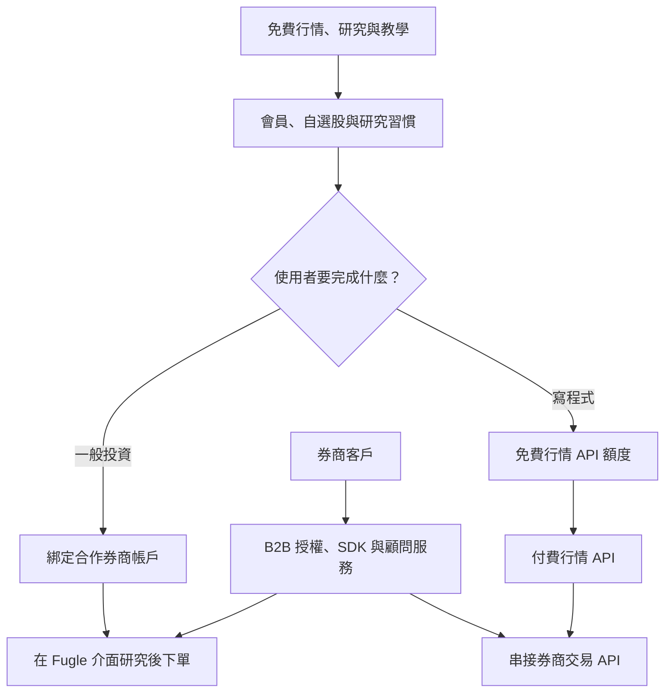
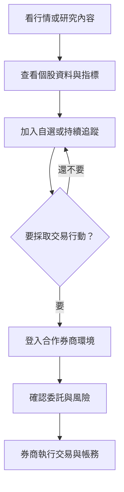
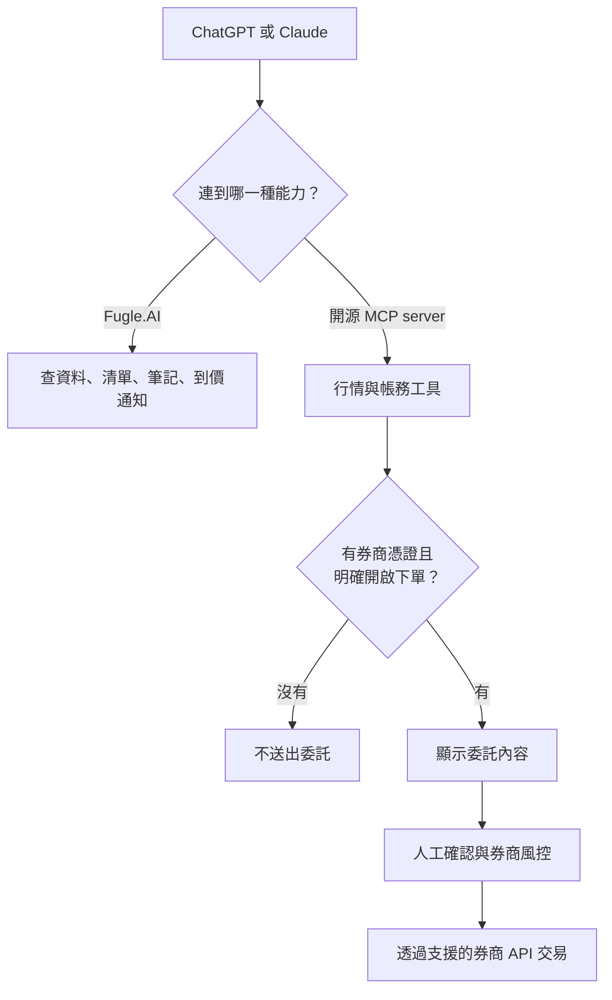

> 🌏 [English version](/en/posts/product/2026-09-17-fugle-information-to-trading-en)

想像一間店免費借你看地圖和路況，還讓你把常走的路存起來。等你真的要出發，它不自己開車載你，而是把介面接到有執照的運輸公司。會寫程式的人，還能付費取得路況 API，自己做導航工具。

[Fugle 富果](https://www.fugle.tw/)做的是類似的事。一般投資人用它看行情、研究股票、管理自選清單，再登入合作券商的環境下單。開發者可以使用行情與交易 API；券商則能採購技術、資料授權與數位產品能力。

這條路徑常被簡化成「免費內容帶來交易佣金」，但公開資料不支持這個說法。Fugle 曾向媒體表示其收入包含資訊服務費，官方也公開個人 API 訂閱與企業方案；至於逐筆交易分潤、開戶獎勵或各券商合約，並未公開。本文要拆的是資訊如何一步步變成工作流程，而不是一個沒有證據的佣金率。

## Fugle 其實有三條漏斗

同一套行情與研究能力，面向三種不同客戶。

第一條是一般投資人的「研究到下單」。第二條是開發者的「免費 API 到付費 API」。第三條則由券商付費，Fugle 提供行情授權、交易 SDK、文件、導入支援與產品顧問能力。

| 路徑 | 免費入口 | 誰付錢 | 可證的付費工作 | 公開資料看不到什麼 |
|---|---|---|---|---|
| 一般投資人 | 行情、研究、報告與教學 | 合作券商；其他零售付費來源未公開 | 資訊服務與交易介面整合 | 每筆交易是否分潤、開戶獎勵 |
| 個人開發者 | 註冊後的基本行情 API | 開發者 | 更高額度、更多資料類型與連線能力 | 各方案毛利、免費轉付費率 |
| 券商 B2B | API 文件與技術生態 | 券商 | 行情授權、SDK、導入、低延遲基礎設施（AWS 客戶案例描述）與顧問服務 | 合約金額、最低保證與分潤公式 |

表格最重要的空白是「交易佣金」。沒有公開合約，就不能因為介面裡有下單功能，直接推論 Fugle 每成交一筆就抽一筆。

## 研究介面縮短了下單前的路

投資人通常不是看到一篇文章就立刻下單。中間還有查行情、比較公司、加入自選、等待價格、重新驗證與登入券商等動作。Fugle 的產品價值，是把其中多個步驟放進同一套介面。

最後一格必須寫清楚：證券帳戶、庫存、交割與帳務屬於券商的服務範圍，不是 Fugle 把讀者變成自己的券商客戶。

[Fugle 的官方公告](https://support.fugle.tw/fugle-member-account/fugle-guidance/15335/)就提供了一次很清楚的壓力測試。玉山證券與 Fugle 是兩家獨立公司。雙方在 Fugle App 與網站內的下單、帳務合作於 2024 年底終止後，投資人的資產仍留在玉山，使用者改到玉山自己的入口操作。Fugle 的研究與行情服務可以繼續，原本的一站式交易出口卻會消失。

這代表下單整合既是轉換工具，也是依賴。投資人因為研究和交易在同一處而少走幾步；平台也可能因合作方改變策略，在一夕之間失去最靠近交易的那一段。

## 玉山中斷證明交易出口會影響收入，但不等於抽佣

2025 年，[《數位時代》的 Fugle 專訪](https://tw.news.yahoo.com/%E7%8D%A8%E5%AE%B6%E5%B0%88%E8%A8%AA-%E5%AF%8C%E6%9E%9C%E5%88%86%E6%89%8B%E7%8E%89%E5%B1%B1100-%E5%A4%A9-%E6%94%9C%E6%89%8B%E5%85%83%E5%AF%8C%E8%AD%89%E5%88%B8%E7%B5%84%E9%9A%8A-%E7%82%BA%E4%BD%95%E8%BD%89%E5%9E%8B%E5%A4%9A%E5%88%B8%E5%95%86%E6%95%B8%E4%BD%8D%E5%B9%B3%E5%8F%B0-101448858.html)引述 Fugle 經營團隊表示，玉山合作中斷後，公司營收與 App 活躍使用者都大幅下降。這是公司受訪說法，不是公開財報或獨立稽核，所以不適合拿精確百分比當成已驗證成果。

但這個案例仍回答了一個重要問題：交易整合不只是畫面右下角多一顆按鈕。它會影響使用者是否回來研究、券商是否願意支付資訊服務費，以及 Fugle 能不能和合作方共同經營數位客戶。

Fugle 後來改走多券商方向。官方 2026 年的[帳戶綁定說明](https://support.fugle.tw/fugle-guidance-2/6739/)以台新證券為操作範例；較早的媒體訪談則記錄元富證券整合上線。這些名稱不能直接拼成一張「目前全部合作券商」清單，因為 App／網站下單、交易 API、歷史合作與券商品牌整併是不同層次。寫這類產品，日期和產品面比名單長度更重要。

## API 把一次閱讀變成持續工作的工具

文章被讀完就結束，API 卻會進入程式、排程與交易策略。這也是免費資訊能長出較深變現層的原因。

[Fugle 的行情 API 定價頁](https://developer.fugle.tw/docs/pricing/)在 2026 年 9 月 17 日顯示，註冊會員可使用基本額度。開發者與進階方案再提高即時訂閱數、連線數、每分鐘呼叫量和可用資料類型；企業則能洽談專屬伺服器等客製能力。本文不列精確牌價，因為本輪只取得官方快照，尚未找到同期獨立來源交叉確認。

開發者會升級，是因為程式開始依賴穩定資料，不是為了多看幾篇內容。當策略、監控、回測和通知都接在同一套 API 上，切換成本也從換網站，變成重寫欄位、額度控制、錯誤處理與券商介接。

券商端更深。[AWS 的 Fugle 客戶案例](https://aws.amazon.com/tw/events/taiwan/interviews/aws-outposts-cht-fugle/)說明，券商可以用 B2B 方式集中採購行情授權，Fugle 也提供交易 SDK、技術文件、範例程式與導入支援。[《數位時代》的 API 報導](https://www.bnext.com.tw/article/82066/quant-trading-fugle)則記錄 Fugle 把行情、交易介接與開發者客服包成一套服務。平台在這一層賣的是讓券商服務程式交易客戶的基礎設施，而非單則資訊。

## Fugle.AI 與可下單 MCP 不是同一件產品

AI 讓「資訊到行動」更短，也最容易讓產品邊界被寫過頭。

[Fugle.AI 官網](https://www.fugle.ai/)公開的能力，是讓使用者在 ChatGPT 或 Claude 查台股、管理追蹤清單、記錄投資筆記與設定到價通知。它把原本要打開 App 完成的研究工作，搬進使用者已經在用的對話介面。官網可讀內容沒有宣稱直接下單。

另一邊，Fugle 的開放原始碼 [`fugle-mcp-server`](https://github.com/fugle-dev/fugle-mcp-server)確實包含行情、帳務與交易能力。它需要券商帳號、密碼與憑證，設定中也有 `ENABLE_ORDER` 開關。換句話說，可下單的是另一條需要券商資格與明確授權的工具路徑，不能把它挪到 Fugle.AI 的行銷頁上。

這個開關不是小細節。自然語言查錯一個價格，使用者還能回頭核對；自然語言誤解一張委託單，後果是真實資金損失。券商密碼、身分資料與憑證也不能貼進聊天視窗，必須留在受控的執行環境。

## AI 讓入口更容易，資料與責任沒有消失

AI 的正面效果，是降低查詢與寫程式的門檻。投資人可以用一句話整理清單和通知，開發者也能更快讀懂 SDK、產生範例，再把行情接進自己的工作流程。

它沒有消除三個硬限制：

- **資料權利與即時性。** 模型不能把延遲資料變成即時行情，也不能跳過市場資料授權。
- **交易責任。** LLM 的答案不是券商的風險控管，也不保證適合某個投資人。
- **秘密資料。** 憑證、帳密與身分資料一旦進入錯誤的 prompt、log 或第三方服務，損失不只是推薦結果不準。

Fugle 在 AI 時代比較耐久的資產，包括行情權限、研究設定、API 規格、券商整合與技術支援。聊天介面可以縮短入口，卻不能替代這些基礎設施。

## 今晚可以做的漏斗盤點

如果你也在做「免費內容替另一門生意獲客」，先畫出自己的路徑。把它拆成五格：免費入口、留下的使用者資料、重複工作、付費任務、真正履約的人。接著逐格檢查。哪一步有數據？哪一步只是因為兩個按鈕放得很近，就被當成因果？

Fugle 的案例顯示，資訊進入決策流程後省下的步驟，往往比資訊本身更容易收費。當最後一步必須依賴持牌合作方，產品做得再順，商業模式仍要替合作中斷留一條退路。

## 參考資料

- [Fugle：台股行情方案及價格](https://developer.fugle.tw/docs/pricing/)
- [Fugle：玉山證券合作功能變更公告](https://support.fugle.tw/fugle-member-account/fugle-guidance/15335/)
- [Fugle：合作券商帳戶綁定與專屬權益](https://support.fugle.tw/fugle-guidance-2/6739/)
- [Fugle.AI：在 AI 工具中查資料、管理清單與通知](https://www.fugle.ai/)
- [GitHub：Fugle MCP Server](https://github.com/fugle-dev/fugle-mcp-server)
- [數位時代：Fugle 的多券商平台轉型](https://tw.news.yahoo.com/%E7%8D%A8%E5%AE%B6%E5%B0%88%E8%A8%AA-%E5%AF%8C%E6%9E%9C%E5%88%86%E6%89%8B%E7%8E%89%E5%B1%B1100-%E5%A4%A9-%E6%94%9C%E6%89%8B%E5%85%83%E5%AF%8C%E8%AD%89%E5%88%B8%E7%B5%84%E9%9A%8A-%E7%82%BA%E4%BD%95%E8%BD%89%E5%9E%8B%E5%A4%9A%E5%88%B8%E5%95%86%E6%95%B8%E4%BD%8D%E5%B9%B3%E5%8F%B0-101448858.html)
- [數位時代：Fugle 的行情與交易 API](https://www.bnext.com.tw/article/82066/quant-trading-fugle)
- [AWS：Fugle 的低延遲程式交易基礎設施](https://aws.amazon.com/tw/events/taiwan/interviews/aws-outposts-cht-fugle/)
