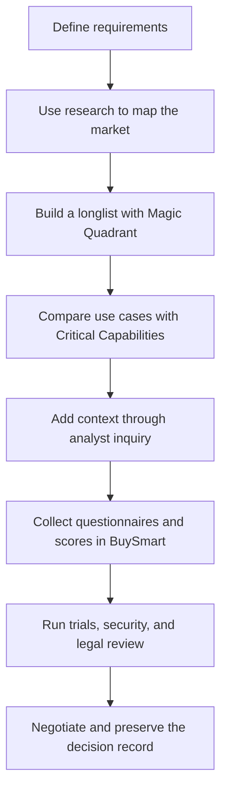
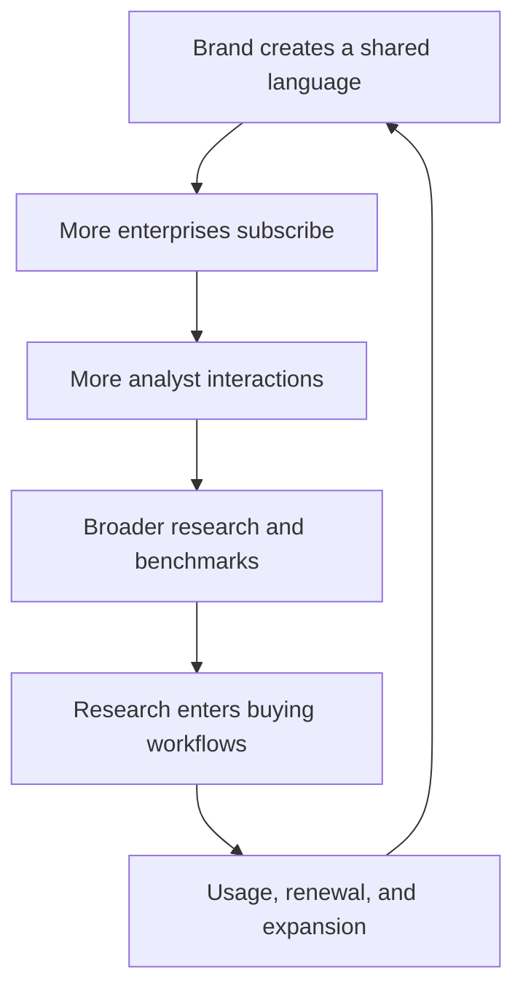

> 🌏 [中文版](/posts/product/2026-09-17-gartner-decision-insurance)

Imagine that a company is about to buy software that every department must use for five years. IT cares about integration. Security worries about data exposure. Finance asks about price. The people doing the work mostly want to know whether the new system will make their jobs harder. Everyone has a defensible concern, but they do not share a map.

[Gartner](https://www.gartner.com/) sells that map—and access to people who help clients read it. It packages market research, analyst inquiry, benchmark data, and procurement tools into subscriptions that help enterprises narrow a vendor list, compare options, and preserve a record of why a decision was made.

That resembles decision insurance. It can lower the cost of research, cross-functional coordination, and explaining a choice after the fact. It does not guarantee that the product will work, and it does not assume the executive's accountability. Gartner's business works because enterprises will pay to make a costly mistake less likely to be inexplicable.

## The chart is only the entrance

The Magic Quadrant is Gartner's most recognizable product, but describing the company as a seller of four-box charts misses most of the business. Its [2025 Form 10-K](https://investor.gartner.com/static-files/ba7bf87c-2680-4780-a345-8679d232b8a6) says Insights subscriptions include published research, data, benchmarks, and direct access to more than 2,400 business and technology experts.

Contracts normally run for at least one year. At the end of 2025, 77% were multiyear.

A software purchase can move through the path below. It is one possible workflow assembled from public product descriptions, not a Gartner-prescribed sequence:

Gartner's own [Magic Quadrant methodology page](https://www.gartner.com/en/research/methodologies/magic-quadrants-research) calls it a first step for understanding a market. It positions providers on Ability to Execute and Completeness of Vision. The page explicitly warns that focusing only on Leaders may be the wrong approach: a Challenger or Niche Player may fit a buyer's goals better.

[Critical Capabilities](https://www.gartner.com/en/research/methodologies/research-methodologies-gartner-critical-capabilities) then compares product capabilities across specific use cases. [BuySmart](https://www.gartner.com.au/en/products/buysmart) goes further into execution: teams can define requirements, build shortlists, send vendor questionnaires, score candidates together, and—under eligible products—request a proposal review. Research stops being a PDF that someone closes after reading. It becomes part of the procurement workflow.

## Why an enterprise pays six figures

Gartner does not publish a universal commercial price list. New York State's [2024 schedule](https://online.ogs.ny.gov/purchase/prices/7300122601pl_gartner.pdf) and Florida's [2025 schedule](https://dms-media.ccplatform.net/content/download/169292/1232619/2024-02%20Florida%2081141902-18-ACS%20Exhibit%20C_Pricing.pdf) instead show that public buyers can purchase a range of products, from self-directed and team-member access to higher-touch offerings. These documents establish clear product tiers; this article does not treat a line item that was not independently rechecked field by field as a general realized price.

Public-sector schedules do not reveal Gartner's average realized price. They should not be used to calculate a universal price increase or average revenue per customer. They still show what kind of product this is: an enterprise service designed to sit inside a budget, a procurement process, and an accountability chain—not a bundle of articles.

| What the enterprise fears | What Gartner supplies | Cost it can reduce | What it cannot assume |
|---|---|---|---|
| The market is too large to scan | Taxonomy, research, Magic Quadrants | Search and initial screening | That no vendor was omitted |
| Functions use different criteria | Evaluation criteria, benchmarks, shared scoring | Alignment and communication | That stakeholders will agree |
| The company's situation is unusual | Analyst inquiry and peer evidence | Interpretation and validation | That advice will fit |
| The decision must be defended later | Shortlists, scores, proposal review | Preserving the rationale | Liability for a bad outcome |

## The moat is the four-layer system around the content

Gartner reported $6.5 billion in 2025 revenue. Insights subscription products accounted for about 78%, according to the company's [10-K](https://investor.gartner.com/static-files/ba7bf87c-2680-4780-a345-8679d232b8a6).

The [full-year results](https://investor.gartner.com/news-releases/news-release-details/gartner-reports-fourth-quarter-2025-financial-results) put year-end contract value at $5.2 billion. An 85% Insights client retention rate is consistent with an ongoing enterprise-service model rather than one built only around reading individual pieces.

The first layer is brand. Buyers, executives, and vendors already understand the same market vocabulary. A shared language has value before anyone agrees with the conclusion.

The second is analyst access and interaction. Gartner says its experts held more than 510,000 direct client interactions in 2025. Inquiry connects static research to the constraints of a particular company, while repeatedly exposing analysts to the problems enterprises are trying to solve.

The third is sales and renewal. Global Technology Sales serves technology users and providers. Global Business Sales extends the model to leaders in HR, supply chain, finance, marketing, and other functions. Gartner can expand within a buying center instead of acquiring every subscriber article by article.

The fourth is workflow. Once requirements, shortlists, questionnaires, scores, and negotiation artifacts live in one process, replacing Gartner means more than losing a research library. The team must rebuild how it works.

It is safer to call this a scale-driven feedback loop than a pure data network effect. Gartner does not publicly claim that every inquiry enters a Magic Quadrant, nor does it disclose the complete weight of every signal.

## A Magic Quadrant is not objective truth

Gartner earns money from technology buyers and from some of the vendors it evaluates. Its [independence statement](https://www.gartner.com/en/research/methodologies/independence-and-objectivity) acknowledges that providers buy Gartner services and conference exhibition space. Gartner's safeguards include prohibiting analysts from owning stock in covered companies or sectors, barring relevant board seats, and maintaining an Office of the Ombuds. Both sides matter. The commercial relationship alone does not prove bias; the safeguards alone do not prove its absence.

The ZL Technologies case is particularly easy to misstate. ZL alleged that its placement as a Niche Player was harmful and that Gartner's commercial relationships with rated vendors affected its judgment. In 2010, a federal district court [dismissed ZL's defamation and trade-libel claims](https://case-law.vlex.com/vid/zl-technologies-inc-v-894873613). The court treated Magic Quadrant placement as qualitative, subjective opinion that could not be proven true or false.

The ruling did not establish that Gartner was unbiased. It established that the challenged rating was not an objective fact actionable under those claims. Buyers should still read the market definition, inclusion criteria, and vendor strengths and cautions, then run references, security review, and product trials of their own.

## Where the insurance fails

The first failure is treating Leaders as the only valid shortlist. That can exclude a provider better suited to local regulation, an existing stack, or a narrow use case. A concrete fix is to divide requirements into non-negotiables and tradeoffs before opening the quadrant. Do not let the quadrant define the requirements.

The second is using an annual market map as if it described today's product. Versions, prices, and capabilities move quickly. Record the research cutoff date in the decision log, then require every finalist to complete the same test with its current release.

The third is buying an expensive account without building a usage cadence. An executive downloading a report occasionally does not create organizational capability. Assign an owner to each major purchase. Record which research informed the decision, what the team asked an analyst, which recommendations it rejected, and why.

The fourth is using outside authority as a liability shield. Gartner can supply a comparison framework; the enterprise still owns its risk tolerance, local constraints, and execution. One question exposes the problem: if Gartner's logo disappeared from the slide, could the team still explain the choice?

## Generative AI threatens the entrance first

Generative AI commoditizes search and summarization before anything else. Market overviews, vendor lists, and report summaries are easier to produce than they were. If Gartner's value stopped at helping a client locate and condense a report, that layer would thin quickly.

Gartner's response is to put AI inside its own interface. In its [third-quarter 2025 results](https://investor.gartner.com/news-releases/news-release-details/gartner-reports-third-quarter-2025-financial-results), the company said it had completed the global beta launch of AskGartner for licensed users, giving them faster access to its insights. That establishes that the product launched. It does not prove higher retention, and it does not justify attributing Gartner's 2025 revenue or share-price movement to AskGartner.

The harder contest sits below the interface. A general-purpose model can synthesize public information, but it does not naturally possess Gartner's private interactions, benchmarks, analyst accountability, or procurement record. The reverse is also true: if another product obtains sufficiently useful data and becomes embedded in the buying workflow, clients will ask how much of the expensive subscription remains irreplaceable.

AI search threatens the entrance. Whether Gartner protects the business depends on whether its brand, expert judgment, and workflow continue to remove meaningful decision cost.

## Decision insurance covers the process

Gartner has pushed the content business far beyond reports. A report is the beginning of analyst service, shared evaluation, procurement negotiation, and a multiyear contract. Enterprises pay because the system makes a complicated choice legible and leaves a record—not because a four-box chart can see the future.

That boundary matters. Good decision insurance helps a team miss fewer questions, identify risk earlier, and explain tradeoffs. Bad usage replaces the team's judgment with somebody else's methodology. Before buying Gartner, ask which cost you are trying to reduce: research, coordination, or anxiety about accountability. Tools can improve the first two. The third cannot be outsourced.

## References

- [Gartner 2025 Form 10-K](https://investor.gartner.com/static-files/ba7bf87c-2680-4780-a345-8679d232b8a6)
- [Gartner full-year 2025 results](https://investor.gartner.com/news-releases/news-release-details/gartner-reports-fourth-quarter-2025-financial-results)
- [Magic Quadrant Research Methodology](https://www.gartner.com/en/research/methodologies/magic-quadrants-research)
- [Critical Capabilities Research Methodology](https://www.gartner.com/en/research/methodologies/research-methodologies-gartner-critical-capabilities)
- [Gartner BuySmart](https://www.gartner.com.au/en/products/buysmart)
- [Gartner Independence and Objectivity](https://www.gartner.com/en/research/methodologies/independence-and-objectivity)
- [New York State Gartner RAS pricing, 2024](https://online.ogs.ny.gov/purchase/prices/7300122601pl_gartner.pdf)
- [State of Florida Gartner RAS pricing, 2025](https://dms-media.ccplatform.net/content/download/169292/1232619/2024-02%20Florida%2081141902-18-ACS%20Exhibit%20C_Pricing.pdf)
- [ZL Technologies, Inc. v. Gartner, Inc., 709 F.Supp.2d 789](https://case-law.vlex.com/vid/zl-technologies-inc-v-894873613)
- [Gartner Q3 2025 results and AskGartner beta](https://investor.gartner.com/news-releases/news-release-details/gartner-reports-third-quarter-2025-financial-results)
