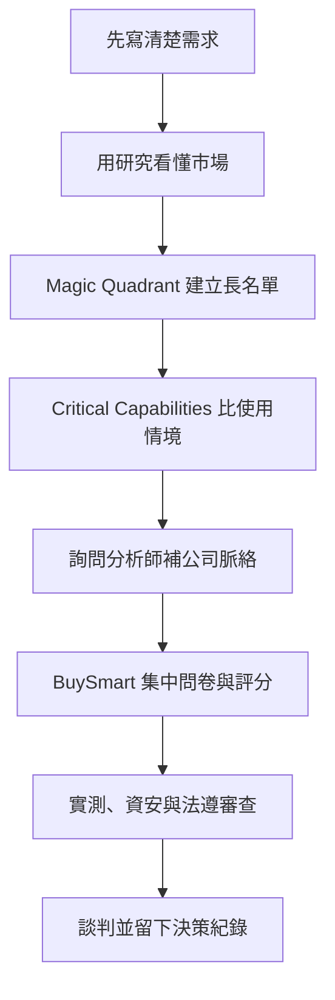
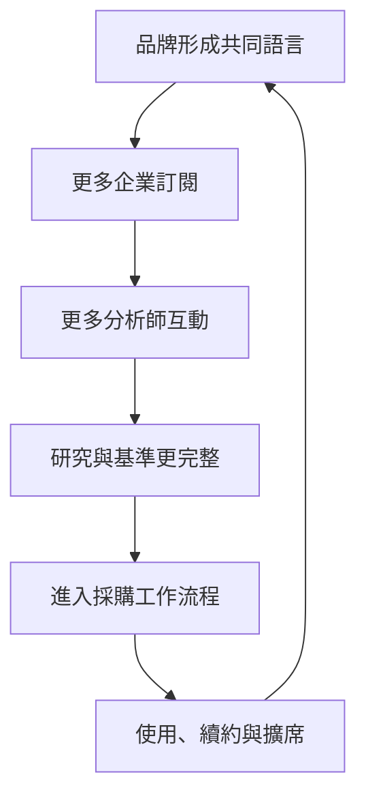

> 🌏 [English version](/en/posts/product/2026-09-17-gartner-decision-insurance-en)

想像公司要花一大筆錢買一套所有部門都得用五年的軟體。資訊部門在意整合，資安部門怕資料外洩，財務部門問價格，真正要用的人只想知道會不會更難操作。每個人都有理由，卻沒有共同的地圖。

[Gartner](https://www.gartner.com/) 賣的就是那張地圖，以及陪你讀圖的人。它把市場研究、分析師問答、基準資料與採購工具包成訂閱，協助企業縮小候選名單、比較供應商，並留下「當初為什麼這樣選」的依據。

這很像決策保險。它降低查資料、跨部門協調與事後說明的成本，卻不保證產品一定選對，更不會替主管承擔結果。Gartner 的生意能成立，正是因為企業願意為「比較不容易犯下無法解釋的錯」付錢。

## 一張圖只是入口，真正賣的是整條流程

Gartner 最有名的產品是 Magic Quadrant，但把公司理解成「賣四格圖」會漏掉大半生意。依 [2025 年 Form 10-K](https://investor.gartner.com/static-files/ba7bf87c-2680-4780-a345-8679d232b8a6)，Insights 訂閱包含報告、資料、基準比較，以及直接接觸超過 2,400 名商業與科技專家。

客戶通常至少簽一年。2025 年底，77% 的合約是多年期。

一次軟體採購，可以沿著下面這條路走。這是本文依公開產品整理的一種可能流程，不是 Gartner 規定的標準步驟：

[Magic Quadrant 的官方說明](https://www.gartner.com/en/research/methodologies/magic-quadrants-research)很克制：它是理解特定市場的「第一步」，用 Ability to Execute 與 Completeness of Vision 來定位供應商。官方甚至直接提醒，只看 Leaders 不一定是最佳做法，Challenger 或 Niche Player 可能更適合你的目標。

接著，[Critical Capabilities](https://www.gartner.com/en/research/methodologies/research-methodologies-gartner-critical-capabilities) 才把產品能力放進不同使用情境比較。[BuySmart](https://www.gartner.com.au/en/products/buysmart) 又往後走一步，讓團隊整理需求、建立短名單、發問卷、共同評分，部分方案還能安排 proposal review。研究不再是讀完就關掉的 PDF，而是進入採購工作流程。

## 為什麼企業願意付到六位數美元

Gartner 官網不公開一般商業客戶的統一定價，紐約州的 [2024 年價目表](https://online.ogs.ny.gov/purchase/prices/7300122601pl_gartner.pdf)與佛州的 [2025 年價目表](https://dms-media.ccplatform.net/content/download/169292/1232619/2024-02%20Florida%2081141902-18-ACS%20Exhibit%20C_Pricing.pdf)則顯示，公部門可採購從 self-directed、team member 到較高接觸度的多種方案。這些公開文件能證明產品存在明顯級距；本文不把未完成逐欄複核的單一價目數字當成一般成交價。

公部門價目不能當成 Gartner 全體客戶的平均成交價，也不能直接推算一般客戶的漲價幅度。至少可以看出，這不是幾篇文章的價格；它是一項會進入企業預算、採購與責任流程的服務。

| 企業擔心的事 | Gartner 提供的東西 | 降低的成本 | 不會替你承擔的事 |
|---|---|---|---|
| 市場太大，不知從哪找 | 市場分類、Magic Quadrant、研究報告 | 搜尋與初步篩選 | 市場一定沒有遺漏 |
| 部門各說各話 | 評估條件、基準資料、共同評分 | 對齊與溝通 | 所有人一定同意 |
| 公司情境很特殊 | 分析師問答、同儕經驗 | 解讀與驗證 | 建議一定適用 |
| 事後要交代選擇 | 短名單、評分與 proposal review | 留存決策依據 | 選錯時免責 |

## 護城河不是內容，而是內容周圍的四層結構

2025 年 Gartner 全年營收為 65 億美元，Insights 訂閱產品約占 78%。這些數字可在 [10-K](https://investor.gartner.com/static-files/ba7bf87c-2680-4780-a345-8679d232b8a6) 核對。

[全年財報新聞稿](https://investor.gartner.com/news-releases/news-release-details/gartner-reports-fourth-quarter-2025-financial-results)另列出年末 contract value 為 52 億美元。Insights 客戶留存率為 85%，與持續提供企業服務、而非只靠單篇閱讀的模式一致。

第一層是品牌。採購者、主管與供應商都看得懂同一套市場語言，光是能在會議裡快速對齊名詞就有價值。

第二層是分析師與互動。Gartner 表示，2025 年專家與客戶有超過 510,000 次直接互動。這些問答讓靜態研究能接上公司的實際限制，也讓研究團隊持續知道企業正在煩惱什麼。

第三層是銷售與續約。Global Technology Sales 服務科技使用者與供應商，Global Business Sales 再把產品賣給人資、供應鏈、財務與行銷等職能。研究可以跨職位擴席，而不是只靠新讀者逐篇訂閱。

第四層是工作流程。當需求、短名單、問卷、評分與議價都留在同一套工具裡，換掉 Gartner 不只是少一批內容，還得重建團隊的做事方式。

這比較像規模帶來的回饋迴路，不宜直接說成純資料的網路效應。公開文件沒有說每次客戶問答都會進入 Magic Quadrant，也沒有公開各項訊號的完整權重。

## Magic Quadrant 不是客觀真理

Gartner 同時向科技買方與被評估的供應商收費。它的[獨立性說明](https://www.gartner.com/en/research/methodologies/independence-and-objectivity)承認，供應商會購買研究服務與研討會展位。官方提出的防線包括：分析師不得持有所評產業股票、不得擔任相關公司董事，並設置 Office of the Ombuds。這些制度值得寫，商業關係也不能藏起來。兩者都不足以單獨證明研究一定有偏或一定無偏。

最容易被誤寫的是 ZL Technologies 案。ZL 曾主張自己被放進 Niche Players，且 Gartner 與受評供應商的商業關係影響評價。2010 年聯邦地方法院[駁回其誹謗與商業誹謗主張](https://case-law.vlex.com/vid/zl-technologies-inc-v-894873613)，判決重點是象限位置屬於定性、主觀、無法證明真假的意見。

這個裁判結果不等於法院證明 Gartner 沒有偏誤。它只表示 ZL 挑戰的評價不是可依誹謗法判定真假的客觀事實。採購者仍應查看市場定義、納入門檻、各家 strengths and cautions，並自己做 reference check、資安審查與產品實測。

## 這份保險最常在哪裡失靈

第一種失靈，是把 Leader 當成唯一短名單。企業會因此錯過更符合在地法規、既有系統或小眾用途的供應商。今晚就能做的修正是：把需求先分成「不能退讓」與「可以交換」，再看象限，不要反過來用象限定需求。

第二種失靈，是拿年度市場地圖代替現在的產品。快速變化的市場裡，版本、價格與功能可能已經移動。把報告的研究截止日寫進採購紀錄，並要求候選供應商用目前版本完成同一組實測。

第三種失靈，是買了高價帳號卻沒有使用節奏。主管偶爾下載報告，不會自動變成組織能力。真正可執行的做法是：每個重大採購指定一位 owner，記錄用了哪些研究、問了分析師什麼、哪些建議最後沒有採用，以及原因。

第四種失靈，是把外部權威當成卸責章。Gartner 能提供比較框架，最後的風險偏好、在地限制與執行責任仍在企業自己手上。最實際的檢查是反問一句：「如果簡報上拿掉 Gartner 的 logo，我們還說得清楚為什麼選它嗎？」

## 生成式 AI 先威脅入口，再考驗護城河

生成式 AI 最先商品化的是搜尋與摘要。市場概覽、供應商清單與報告重點，都比以前更容易取得。如果 Gartner 只賣「幫你找出那份報告」，這層價值會快速變薄。

Gartner 的回應是把 AI 放進自己的產品入口。公司在 [2025 年第三季財報](https://investor.gartner.com/news-releases/news-release-details/gartner-reports-third-quarter-2025-financial-results)宣布，已向全球授權使用者完成 AskGartner 測試版推出，讓客戶更快存取既有洞察。這證明產品已推出，不證明它已提高留存，也不能把 2025 年的營收或股價變化歸因於 AskGartner。

真正的攻防在更深一層。通用模型可以整理公開資訊，卻不自然擁有 Gartner 的非公開互動、基準資料、分析師責任與採購紀錄。反過來說，如果其他工具也能取得足夠好的資料、嵌進企業流程，客戶就會重新問：那個昂貴訂閱還剩多少不可替代的價值？

AI 搜尋威脅的是入口；能不能守住生意，要看 Gartner 的品牌、專家判斷與工作流程是否真的替企業減少決策成本。

## 決策保險真正承保的是過程

Gartner 把內容生意推到很遠。報告只是分析師服務、共同評估、採購談判與多年合約的起點。一張四格圖不會預知未來；企業付高價，是為了讓複雜選擇有一套大家看得懂、能留下紀錄的過程。

這也是最重要的邊界。好的決策保險讓你少漏問題、早點看見風險、說清楚取捨；壞的用法則把別人的方法當成自己的判斷。買 Gartner 之前，先問清楚要降低的是搜尋成本、協調成本，還是責任焦慮。只有前兩項能靠工具改善，第三項不能外包。

## 參考資料

- [Gartner 2025 Form 10-K](https://investor.gartner.com/static-files/ba7bf87c-2680-4780-a345-8679d232b8a6)
- [Gartner 2025 全年財報新聞稿](https://investor.gartner.com/news-releases/news-release-details/gartner-reports-fourth-quarter-2025-financial-results)
- [Magic Quadrant Research Methodology](https://www.gartner.com/en/research/methodologies/magic-quadrants-research)
- [Critical Capabilities Research Methodology](https://www.gartner.com/en/research/methodologies/research-methodologies-gartner-critical-capabilities)
- [Gartner BuySmart](https://www.gartner.com.au/en/products/buysmart)
- [Gartner Independence and Objectivity](https://www.gartner.com/en/research/methodologies/independence-and-objectivity)
- [New York State Gartner RAS pricing, 2024](https://online.ogs.ny.gov/purchase/prices/7300122601pl_gartner.pdf)
- [State of Florida Gartner RAS pricing, 2025](https://dms-media.ccplatform.net/content/download/169292/1232619/2024-02%20Florida%2081141902-18-ACS%20Exhibit%20C_Pricing.pdf)
- [ZL Technologies, Inc. v. Gartner, Inc., 709 F.Supp.2d 789](https://case-law.vlex.com/vid/zl-technologies-inc-v-894873613)
- [Gartner 2025 Q3 results and AskGartner beta](https://investor.gartner.com/news-releases/news-release-details/gartner-reports-third-quarter-2025-financial-results)
