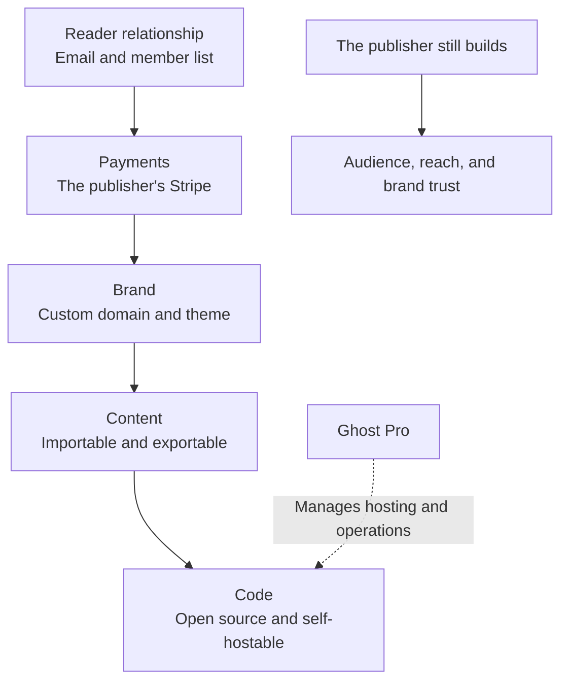
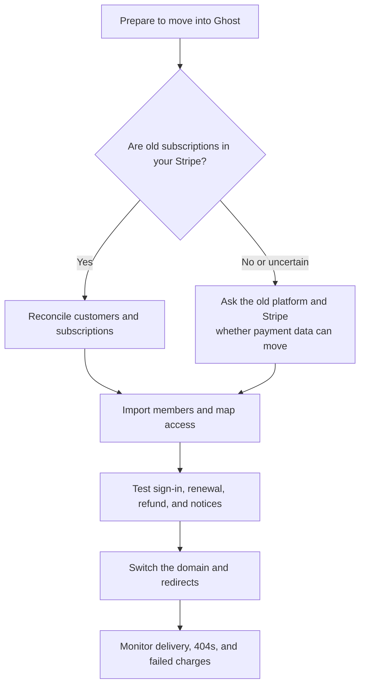
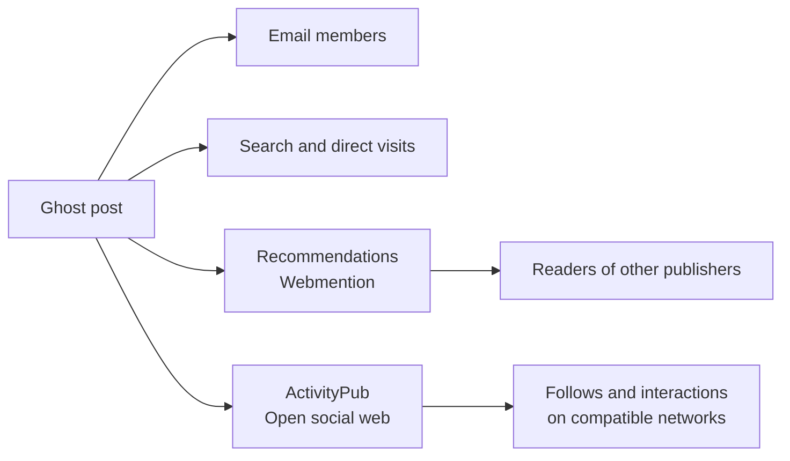

> 🌏 [中文版](/posts/product/2026-09-17-ghost-ownership-not-just-hosting)

Imagine two ways to open a shop. The first is a counter inside a department store. Foot traffic, checkout, and membership systems are ready, but signage, customer journeys, and customer relationships follow the store's rules. The second is your own storefront. You control the address, design, customer book, and merchant account—and you also handle rent, security, and bringing people to the door.

[Ghost](https://ghost.org/) is closer to the second model. It is an open-source publishing and membership system that can be self-hosted or run through the managed Ghost(Pro) service. Its real product is not merely a hosted blog. It gives publishers more control over the site, content, members, and payments, plus options for leaving a hosting provider later.

An independent storefront is neither free nor automatically busy. Ghost's value becomes clearer when control is separated into five layers and evaluated alongside cost and discovery.

## Ownership is five layers of control, not one switch

The upper layers are closest to the day-to-day business. According to [Ghost's member-management documentation](https://ghost.org/help/member-management/), publishers can import and export members and manage lists with labels and notes. A publication can use its own domain and brand, while [migration tools](https://ghost.org/help/import-members/) cover content and members from multiple platforms. Beneath those layers, Ghost's open-source code lets a publisher move from Ghost(Pro) to another hosting arrangement or operate the software independently.

None of this guarantees a frictionless move. Themes, integrations, analytics history, sender reputation, and social identity may still need to be rebuilt. Here, ownership means having more exit paths, not that every path is free.

## A 0% Ghost transaction fee does not mean zero cost

[Ghost's payment documentation](https://ghost.org/help/are-there-really-no-transaction-fees/) is explicit: a site connects directly to the publisher's own Stripe account, and Ghost adds no transaction fee. This differs from a platform that collects the payment and later pays the creator. The payment relationship sits closer to publisher-controlled infrastructure.

The bills do not disappear. Stripe still charges processing fees, Ghost(Pro) charges a hosting subscription, and self-hosting requires servers, email delivery, backups, security updates, and operating time. On September 17, 2026, the official [pricing page](https://ghost.org/pricing/) showed Starter, Publisher, and Business tiers whose prices vary with member count and billing cycle. Starter did not include paid subscriptions, so a paid-membership comparison must begin with a tier that supports them. Without a second fully readable contemporaneous price list, this article does not turn one official snapshot's exact amounts into universal prices.

| Control layer | Closed membership platform | Ghost(Pro) | Self-hosted Ghost |
|---|---|---|---|
| Domain and brand | Varies under platform rules | Custom domain and publisher brand | Custom domain and publisher brand |
| Member data | Often exports selected fields | Import, export, and segmentation | Export plus control of underlying data |
| Payment relationship | Often processed by the platform | Publisher's own Stripe | Publisher's own Stripe |
| Hosting and code | Platform-controlled | Open-source code, managed hosting | Publisher manages code and hosting |
| Discovery | Platform feed or recommendations | Recommendations, ActivityPub, and publisher acquisition | The same, with self-managed operations |
| Primary cost | Revenue share and policy dependence | Member-based subscription and Stripe fees | Hosting, email, backups, security, and labor |

This is not a freedom ranking. Without operational capacity, managed hosting may be more reliable than complete control. When a creator needs an existing audience, a closed platform's revenue share may be an acquisition expense. Control matters only when a team can use it.

## Why owning the Stripe relationship matters more than possessing an email CSV

An email CSV can identify members without containing a payment credential that a new system can charge. Tiers, expiry dates, discounts, failed-payment retries, and refunds may also use incompatible data models.

Ghost's direct connection to the publisher's Stripe account removes one layer of platform collection. Moving existing subscriptions into Ghost can still depend on whose Stripe account the old platform used, whether payment data can be transferred under Stripe's process and applicable rules, and whether the destination supports the migration. [Ghost's Substack migration guide](https://ghost.org/docs/migration/substack/) provides a path for paid subscribers, but it does not establish one-click billing continuity from every source platform.

A complete migration also covers posts, media, URL redirects, sending domains, analytics, and access rules. Before choosing a platform, ask one practical question: if you leave in a year, which files can you obtain, which Stripe account remains yours, and which relationships must readers recreate?

## Ghost has discovery, but not one closed feed

Describing Ghost as a system where publishers must bring every visitor is now incomplete. [Ghost Recommendations](https://docs.ghost.org/recommendations) uses Webmention to transmit recommendations and can recommend any site. Ghost-to-Ghost recommendations also support a one-click subscription experience after a new member signs up.

[Ghost 6.0](https://ghost.org/changelog/6/) integrated an ActivityPub social network into Ghost, allowing publications to participate in compatible parts of the social web. An [independent report from Nieman Lab](https://www.niemanlab.org/2025/08/ghost-makes-it-easier-to-publish-to-the-social-web/) also documented Ghost's move toward social-web distribution.

These features should not be treated as equivalent to Substack or Patreon's in-platform recommendations. Public evidence is insufficient to compare reach, conversion, or revenue contribution. A more accurate conclusion is that Ghost is no longer an island, but discovery is distributed across email, search, publisher recommendations, and open protocols. The publisher still has to build an audience.

## In the AI era, ownership provides options

Ghost's API, open-source code, and integration model let publishers choose AI tools and data flows. This research did not find an official page showing a generative writing assistant in Ghost's core product, so third-party GhostAI or OpenAI integrations should not be presented as native Ghost features.

A custom domain, direct email, and paying members can reduce dependence on search clicks. Public content can still be collected by crawlers, however. Robots rules, licensing, content segmentation, and model-provider governance remain publisher decisions. Ownership gives a publisher the ability to say no or switch tools; it does not automatically create traffic or bargaining power.

## Who should choose Ghost

Ghost is a stronger fit for publishers who already have some audience, care about brand and payment control, and are willing to pay for management or handle setup. It may not be the lowest-friction option for a creator who primarily wants immediate platform distribution, Taiwan-specific payment and invoicing support, or no responsibility for domains, deliverability, and operations.

Make an exit inventory tonight. List the domain, content files, member emails, payment account, recommendation traffic, and sending configuration on your current platform. Mark each one “I control it,” “I can export it,” or “I must rebuild it.” Every blank is a question to ask support before choosing or renewing a platform.

Ghost's product is not the absence of a landlord. It is the ability to choose a landlord and keep a door for moving out. Whether that door is worth managed-service fees or operating time depends on how much long-term control the publisher needs over brand, membership, and payments.

## References

- [Ghost: Pricing](https://ghost.org/pricing/)
- [Ghost: Transaction fees and Stripe](https://ghost.org/help/are-there-really-no-transaction-fees/)
- [Ghost: Member management](https://ghost.org/help/member-management/)
- [Ghost: Import members and platform migrations](https://ghost.org/help/import-members/)
- [Ghost Docs: Substack migration](https://ghost.org/docs/migration/substack/)
- [Ghost Docs: Recommendations and Webmention](https://docs.ghost.org/recommendations)
- [Ghost 6.0: ActivityPub and the social web](https://ghost.org/changelog/6/)
- [Nieman Lab: Ghost moves publishing to the social web](https://www.niemanlab.org/2025/08/ghost-makes-it-easier-to-publish-to-the-social-web/)
