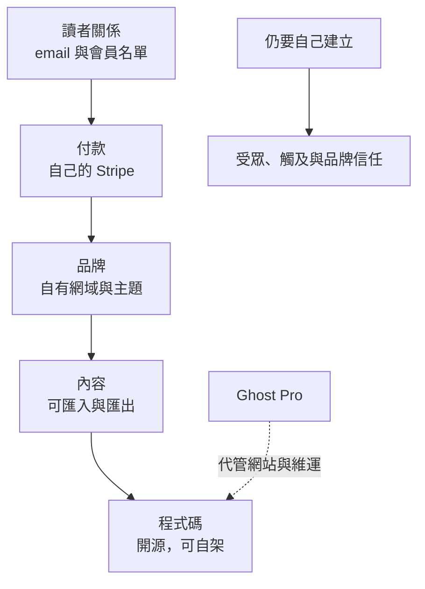
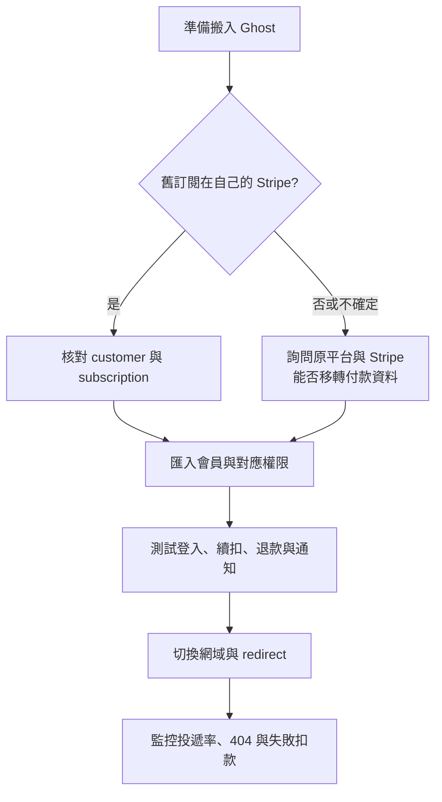
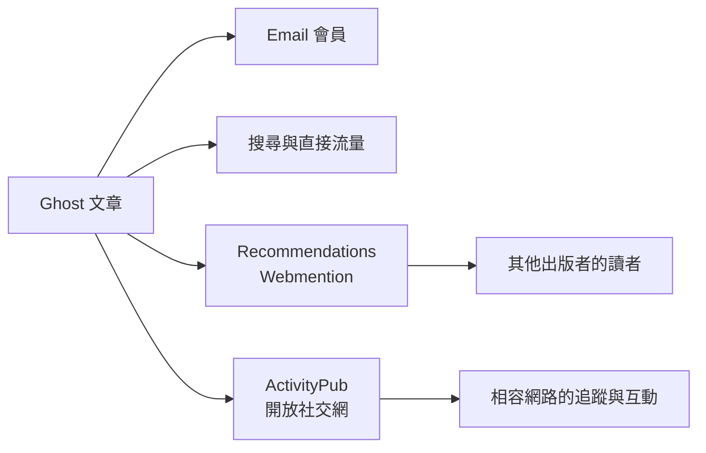

> 🌏 [English version](/en/posts/product/2026-09-17-ghost-ownership-not-just-hosting-en)

想像兩種開店方式。第一種是在百貨公司租櫃位：人潮、收銀與會員系統都有人準備，但招牌、動線與顧客關係要配合百貨規則。第二種是租一間自己的店：門牌、裝潢與會員簿由你決定，收款進自己的帳戶，也得自己處理房租、保全和把客人帶到門口。

[Ghost](https://ghost.org/) 比較接近第二種。它是一套開放原始碼的出版與會員系統，可以自行部署，也能付費請官方的 Ghost(Pro) 代管。它真正賣的不是「幫你架一個部落格」，而是讓出版者在網站、內容、會員與付款上保留更多控制權，以及日後離開代管商的選擇。

但自己的店不等於免費，也不等於自動有人潮。Ghost 的價值要拆成五層看，成本和發現性才不會被口號蓋掉。

## 所有權不是一個開關，而是五層控制權

最上面幾層最接近日常生意。依 [Ghost 的會員管理說明](https://ghost.org/help/member-management/)，出版者可以匯入、匯出會員，使用標籤與備註管理名單。網站可以使用自己的網域與品牌；內容也有[多平台搬遷工具](https://ghost.org/help/import-members/)。再往下，Ghost 的程式碼開放，出版者可以從 Ghost(Pro) 換到別的代管方式，甚至自己維運。

這些能力不保證搬家毫無摩擦。主題、外掛整合、分析紀錄、寄件信譽與社交身分仍可能要重建。「所有權」比較準確的意思是：你有較多退出路徑，不是每條路都不用付代價。

## 0% Ghost 抽成，不代表 0 成本

[Ghost 官方付款說明](https://ghost.org/help/are-there-really-no-transaction-fees/)寫得很明確：網站直接連到出版者自己的 Stripe account，Ghost 不另收 transaction fee。這和平台代收、再把款項分給創作者的模式不同；付款關係更接近出版者自己的基礎設施。

可是帳單不會消失。Stripe 仍收處理費，Ghost(Pro) 收代管訂閱費；若選擇自行部署，則要付主機、寄信、備份、安全更新與維運時間。官方 [pricing 頁](https://ghost.org/pricing/)在 2026 年 9 月 17 日顯示 Starter、Publisher 與 Business 等級，價格會隨會員數與計費週期變動；Starter 不含 paid subscriptions，因此經營付費會員要從支援該功能的方案比較。本文沒有第二份可完整讀取的同期價目，不把單一快照的精確數字寫成普遍價格。

| 控制層 | 封閉會員平台 | Ghost(Pro) | Self-hosted Ghost |
|---|---|---|---|
| 網域與品牌 | 依平台規則，控制程度不一 | 自有網域、出版者品牌 | 自有網域、出版者品牌 |
| 會員資料 | 常能匯出部分欄位 | 可匯入、匯出與分群 | 可匯出，也控制底層資料 |
| 付款關係 | 常由平台代收 | 出版者自己的 Stripe | 出版者自己的 Stripe |
| 主機與程式碼 | 平台控制 | 程式開源，官方代管 | 程式與主機都自行管理 |
| 發現性 | 平台 feed 或推薦 | Recommendations、ActivityPub、自帶流量 | 同左，並自行維運 |
| 主要成本 | 抽成與政策依賴 | 依 members 計價、Stripe 費用 | 主機、寄信、備援、安全與工時 |

這張表不是自由度排行榜。沒有維運人力時，官方代管可能比「完全自己控制」更可靠；需要平台現成人潮時，封閉平台的抽成也可能是在買獲客。控制權只有在團隊能使用它時才有價值。

## 自己的 Stripe，為什麼比一份 email CSV 更接近可攜性

email CSV 能回答「會員是誰」，卻不一定含有新系統可以繼續扣款的 payment credential。付費方案、到期日、折扣、失敗扣款與退款也可能使用不同資料模型。

Ghost 直接連出版者自己的 Stripe，少了一層平台代收。不過，能否把既有訂閱無痛搬進 Ghost，仍取決於舊平台原本使用誰的 Stripe account、付款資料能否依法與依 Stripe 流程移轉，以及目標系統是否支援。[Ghost 的 Substack 搬遷指南](https://ghost.org/docs/migration/substack/)提供付費會員遷移路徑，卻不等於所有來源平台都能一鍵接續扣款。

真正的搬家清單還要包含內容、圖片、網址 redirect、寄件網域、分析資料與會員權限。最安全的做法，是在決定平台前先問一句：如果一年後離開，我能拿到哪些檔案、保留哪個 Stripe account，又有哪些關係必須請讀者重新建立？

## Ghost 不是沒有發現性，而是不用單一封閉 feed

把 Ghost 說成「只能靠自己帶流量」已經不完整。[Ghost Recommendations](https://docs.ghost.org/recommendations) 使用 Webmention 傳遞推薦，可以推薦任何網站；Ghost 站點之間還能在新會員訂閱後提供一鍵推薦訂閱。

[Ghost 6.0](https://ghost.org/changelog/6/) 也把 ActivityPub 社交網路整合進 Ghost，讓內容能進入相容的開放社交網。Nieman Lab 的[獨立報導](https://www.niemanlab.org/2025/08/ghost-makes-it-easier-to-publish-to-the-social-web/)亦確認 Ghost 往 social web 分發的方向。

這些能力不能直接等同 Substack 或 Patreon 的站內推薦。公開資料不足以比較 reach、轉換率與收入貢獻。更準確的說法是：Ghost 已經不是孤島，但它把發現性分散到 email、搜尋、出版者互推與開放協定，出版者仍要經營受眾。

## AI 時代，所有權提供的是選擇權

Ghost 的 API、開放原始碼與整合方式，讓出版者可以自行選擇 AI 工具與資料流。本輪官方資料沒有顯示 Ghost 核心產品內建生成式寫作助手，因此不能把第三方 GhostAI 或 OpenAI 整合寫成 Ghost 官方能力。

自有網域、直接 email 與付費會員，能降低對搜尋點擊的單一依賴；但公開內容仍可能被 crawler 取得。robots、授權、內容分層與模型供應商治理，仍由出版者決定。所有權給你說「不」和換工具的能力，不會自動變成流量或談判力。

## 哪些人適合 Ghost

Ghost 比較適合已有一部分受眾、重視自有品牌與付款控制，而且願意承擔設定或代管費用的出版者。若主要需求是平台立刻分配大量流量、台灣在地金流與發票整合，或完全不想處理網域、寄信與維運，Ghost 未必是最低摩擦的選擇。

今晚可以做一張退出清單：寫下目前平台的網域、內容檔、會員 email、付款帳戶、推薦流量與寄件設定，逐項標成「我控制」「能匯出」「必須重建」。標不出來的那一格，就是選平台或續約前最該問客服的問題。

Ghost 的產品不是沒有房東，而是讓你可以選房東，也保留搬家的門。這扇門值不值得付代管費或維運工時，取決於你是否真的需要品牌、會員與付款關係的長期控制權。

## 參考資料

- [Ghost：Pricing](https://ghost.org/pricing/)
- [Ghost：Transaction fees 與 Stripe](https://ghost.org/help/are-there-really-no-transaction-fees/)
- [Ghost：Member management](https://ghost.org/help/member-management/)
- [Ghost：Import members 與平台搬遷](https://ghost.org/help/import-members/)
- [Ghost Docs：Substack migration](https://ghost.org/docs/migration/substack/)
- [Ghost Docs：Recommendations 與 Webmention](https://docs.ghost.org/recommendations)
- [Ghost 6.0：ActivityPub 與 social web](https://ghost.org/changelog/6/)
- [Nieman Lab：Ghost moves publishing to the social web](https://www.niemanlab.org/2025/08/ghost-makes-it-easier-to-publish-to-the-social-web/)
