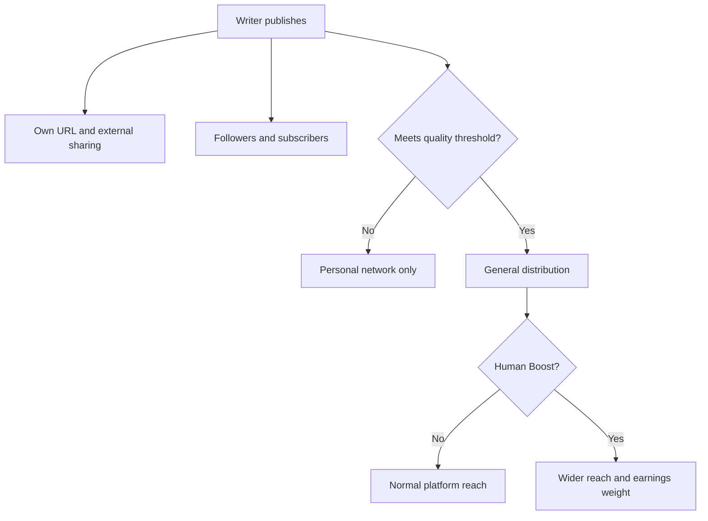
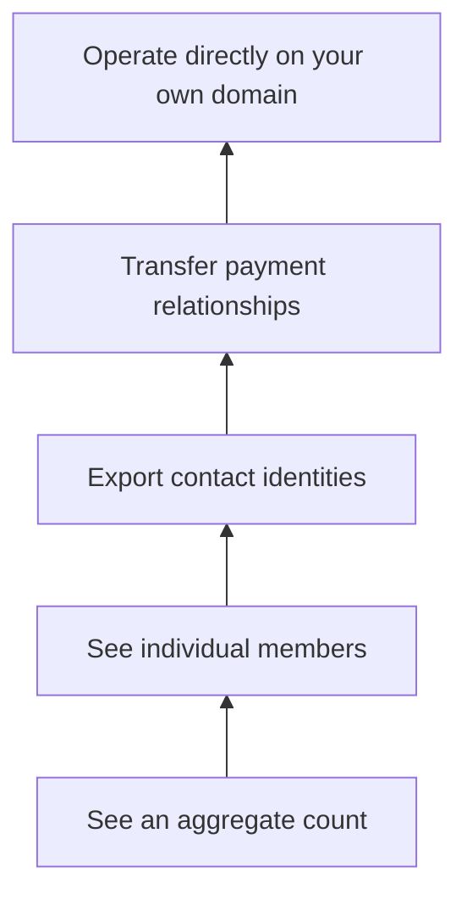

> 🌏 [中文版](/posts/product/2026-09-17-medium-vocus-platform-distribution)

Think of a content platform as the food court inside a department store. You do not have to pull every passerby into your stall yourself. The store provides the location, featured placements, member notifications, and checkout counter. The catch is that customers become members of the store before they become regulars of yours.

[Medium](https://medium.com/) resembles a global department store: a story can appear in recommendations, topic pages, Digests, or the human-curated Boost program. [Vocus](https://vocus.cc/) resembles a Taiwanese one: besides offering platform exposure, it handles local payments, electronic invoices, payouts, and parts of the tax workflow.

Before comparing foot traffic, ask what you can take when you leave. The recipe is your content. The queue count is analytics. A regular customer's contact information is an email address. Recurring billing is the payment relationship. People call all four “audience data,” but they confer very different control.

## Platform Traffic Is a Series of Gates, Not a Bag of Readers

Publishing does not automatically place a story in front of every potential reader. A platform first decides which distribution surfaces the story may enter; readers then decide whether to open it.

[Medium's official distribution guide](https://help.medium.com/hc/en-us/articles/360018677974-What-happens-to-your-story-when-you-publish-on-Medium) describes two systems. The first is the writer's own network: their profile, followers' Following feeds, Digests, and optional email notifications. The second is Medium's wider network: For You, topic pages, App Explore, recommendations under other stories, and the logged-out homepage.

Three parties control different pieces. The writer decides whether to publish and bring external traffic. The reader decides whether to follow, subscribe, and read. Medium controls the gates to strangers. Good writing is a prerequisite, not a delivery guarantee.

Vocus also combines direct and platform distribution. Its [creator landing page](https://vocus.cc/become_creator) promotes newsletters, app notifications, search visibility, and analytics while saying creators control their member lists and data. Its public documentation does not fully explain homepage or featured-placement ranking, however, so publishing on Vocus cannot be translated into a predictable amount of traffic.

A platform offers a chance to be found, not a guaranteed media buy.

## Medium: Reaching a Reader Is Not the Same as Knowing Them

Medium's advantage is its ability to move a story beyond the writer's existing circle. General distribution uses interests and reading behavior. Human curators can Boost selected stories. Publishing through a publication can add that publication's followers and newsletter subscribers.

Earnings are tied to this distribution system. The current [Medium Partner Program explanation](https://help.medium.com/hc/en-us/articles/360036691193-Medium-Partner-Program-earnings-calculation) lists member reading time, claps, highlights, replies, Boost weighting, external and search traffic, email notifications, and new-member conversions among its factors. This is not a fixed rate per thousand views. The platform governs and revises the formula.

The sharper boundary appears in email. [Medium's Email notifications documentation](https://help.medium.com/hc/en-us/articles/360059837393-Email-notifications) explicitly says that writers no longer receive the email addresses of new readers who subscribe to story notifications. Writers can still send through Medium, inspect the subscriber interface, and export older email lists they had previously collected. New subscriber identities remain with the platform.

These statements are therefore not interchangeable:

- I can send a message to a reader.
- I can see a reader in my dashboard.
- I can take that reader's contact information elsewhere.

Medium offers substantial capability for the first two. For new subscribers, it does not offer the third. That is access, not complete ownership.

## Vocus: The 20% Pays for a Taiwanese Operating Layer

Vocus makes a different exchange. Its [current revenue guide](https://creator.vocus.cc/vocus-ti-gong-gei-chuang-zuo-zhe-de-feng-fu-bian-xian-ji-zhi/shou-ru-fen-run-yu-ti-ling-shuo-ming) lists a 20% platform service fee for content plans, with payment processing and taxes deducted separately. A [2021 interview with the founder by Taiwan's Central News Agency](https://www.cna.com.tw/news/acul/202106050023.aspx) reported the same platform rate. Beyond the percentage, Vocus integrates NewebPay, LINE Pay, PayPal, electronic invoicing, payouts, order support, and parts of the withholding workflow for individual Taiwanese creators.

These are material services in Taiwan. Self-hosting a checkout means more than installing a payment button. Someone still has to handle invoices, refunds, reconciliation, consumer disputes, and tax status. Part of the Vocus fee pays to remove that operational friction, not merely to rent traffic.

The operating dashboard still does not establish complete customer ownership. [Vocus's member and order guide](https://vocus.cc/help_center/ru-he-guan-li-sha-long-hui-yuan-ji-ding-dan) verifies two capabilities:

- Creators can inspect active subscribers, one-time buyers, churned members, unpaid members, and some activity indicators.
- They can filter orders by date and plan, then export order details as CSV.

The public documentation does not establish that creators can export a complete member email list. It also does not establish that recurring payment relationships can be transferred to another system. The [Vocus privacy policy](https://vocus.cc/terms/privacy) generally says member information is not disclosed to third parties without authorization, except as needed to provide subscribed products or services.

The narrow, useful conclusion is this: **Vocus demonstrably lets creators manage members and export orders. An order CSV does not prove that complete email identities or payment relationships are portable.**

## Ownership Is a Ladder, Not a Switch

The phrase “my readers” hides several layers of control.

One hundred thousand followers are not one hundred thousand email addresses. Downloading emails is not the same as transferring recurring card authorization. Owning the copyright does not make recommendation traffic portable.

| Control layer | Medium | Vocus | The migration question |
|---|---|---|---|
| Content | Writers can publish and retain their own backups | Its [terms](https://vocus.cc/terms/member) say creators retain copyright and grant a non-exclusive license | Can layout, URLs, and paywalls be rebuilt? |
| Member interface | Followers, subscribers, and activity are visible | Member status, churn, and some activity are visible | Is this merely a dashboard or portable data? |
| Email | New subscriber addresses are not given to writers | No official evidence of a complete email export was found | Can the writer contact readers off-platform? |
| Orders | Readers buy a Medium membership, not an author-specific plan | Order CSV is exportable | Does the file contain identities that may lawfully be remarketed to? |
| Payment relationship | Medium charges members and allocates earnings | The platform and payment processors manage billing | Can recurring billing move without interruption? |
| Discovery | Recommendations, Boost, publications, and search | Search, app, newsletter, and on-site surfaces | Does reach disappear after migration? |

This is why comparing the platforms by fee alone is misleading. Medium primarily offers a global content pool and distribution system. Vocus is closer to an operating back office for Taiwanese creators. They are not selling the same service.

## Taiwanese Creators Must Price Local Friction

An English-language creator might begin with recommendation algorithms and the Partner Program. A Taiwanese creator must also ask which currency readers use, whether local cards work, who issues invoices, and how income is paid and reported.

That can make Vocus valuable even at a higher percentage. When revenue is small, the fixed time cost of assembling payments, support, invoicing, and tax operations may hurt more than the fee. A mature creator who already has accounting, payments, and an independent email list should recalculate whether the 20% still buys incremental value.

Do not migrate tonight. Start by opening the dashboard and creating four columns:

1. Over the last three months, how many readers came from platform recommendations, search, social channels, and your own list?
2. How many from each source became subscribers you can contact again?
3. Which datasets can you download, and which columns are actually in the files?
4. If the platform closed tomorrow, could you send the next message and collect the next payment?

Only then can you tell whether the platform fee buys growth or convenience.

## AI Makes Distribution More Valuable—and Dependence More Dangerous

Generative AI changes both supply and discovery.

On the supply side, producing large volumes of text that look like articles is cheap. Platforms must do more filtering. Medium has put AI directly into its distribution rules: its [official AI policy](https://help.medium.com/hc/en-us/articles/22576852947223-Artificial-Intelligence-AI-content-policy) says lightly edited AI-generated writing cannot enter the Partner Program, while undisclosed AI-generated work receives only Network Only distribution. Platform curation becomes more valuable, but a mistaken platform judgment also carries more weight.

On the discovery side, AI summaries can intercept search clicks. A [2025 Pew Research Center analysis of browsing data](https://www.pewresearch.org/short-reads/2025/07/22/google-users-are-less-likely-to-click-on-links-when-an-ai-summary-appears-in-the-results/) found that people in its US sample clicked traditional search results on 8% of visits when an AI summary appeared, compared with 15% when one did not. This was a US Google sample from a specific month; it is not a measured traffic decline for Medium or Vocus.

The narrow conclusion is that search impressions no longer guarantee visits. In-platform recommendations and direct email may gain relative value. If subscriber identities are not portable, creators may be exchanging deeper dependence for short-term reach.

This research did not find an equally explicit public Vocus policy connecting AI-generated content to distribution. That means “not found in the reviewed public documentation,” not that Vocus has no AI governance or tools.

## Conclusion: Use the Platform as an Entrance, Not the Asset Itself

Medium is useful for testing whether a story can escape an existing audience. Vocus lowers the operating barrier to payments and member management in Taiwan. Both offer real value, and both retain consequential control.

The dangerous mistake is treating dashboard numbers as owned relationships. Followers, member nicknames, order CSV files, email addresses, and recurring payment authorization are separate assets. Reach can be rented. A durable audience must remain contactable, billable, and serviceable outside the platform.

Use platforms to find readers, then deliberately build relationships that can survive a move. That is a better foundation for a lasting content business than arguing about which platform has the most traffic.

## References

- [Medium: What happens to your story when you publish](https://help.medium.com/hc/en-us/articles/360018677974-What-happens-to-your-story-when-you-publish-on-Medium)
- [Medium Partner Program earnings calculation](https://help.medium.com/hc/en-us/articles/360036691193-Medium-Partner-Program-earnings-calculation)
- [Medium: Email notifications](https://help.medium.com/hc/en-us/articles/360059837393-Email-notifications)
- [Medium: Artificial Intelligence content policy](https://help.medium.com/hc/en-us/articles/22576852947223-Artificial-Intelligence-AI-content-policy)
- [Vocus: Revenue sharing and payouts (in Chinese)](https://creator.vocus.cc/vocus-ti-gong-gei-chuang-zuo-zhe-de-feng-fu-bian-xian-ji-zhi/shou-ru-fen-run-yu-ti-ling-shuo-ming)
- [Vocus: Managing salon members and orders (in Chinese)](https://vocus.cc/help_center/ru-he-guan-li-sha-long-hui-yuan-ji-ding-dan)
- [Vocus: Member terms (in Chinese)](https://vocus.cc/terms/member)
- [Vocus: Privacy policy (in Chinese)](https://vocus.cc/terms/privacy)
- [Central News Agency: Vocus and paid Chinese-language creation (in Chinese)](https://www.cna.com.tw/news/acul/202106050023.aspx)
- [Pew Research Center: Do people click on links in Google AI summaries?](https://www.pewresearch.org/short-reads/2025/07/22/google-users-are-less-likely-to-click-on-links-when-an-ai-summary-appears-in-the-results/)
