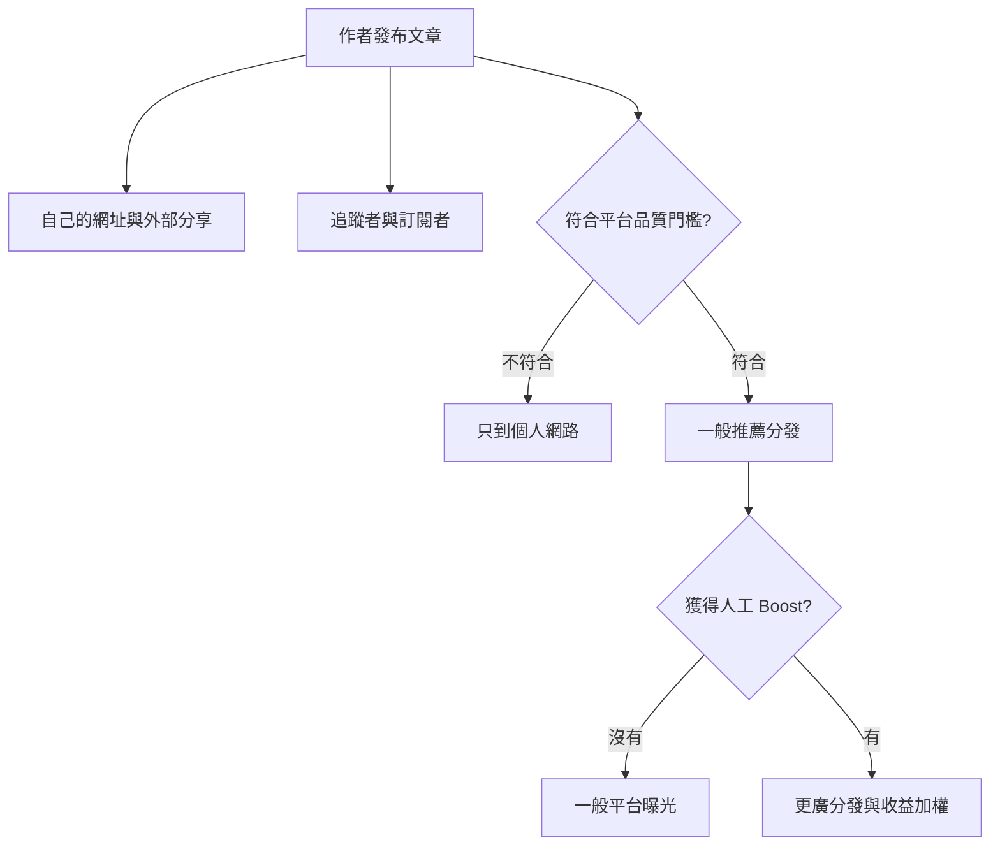
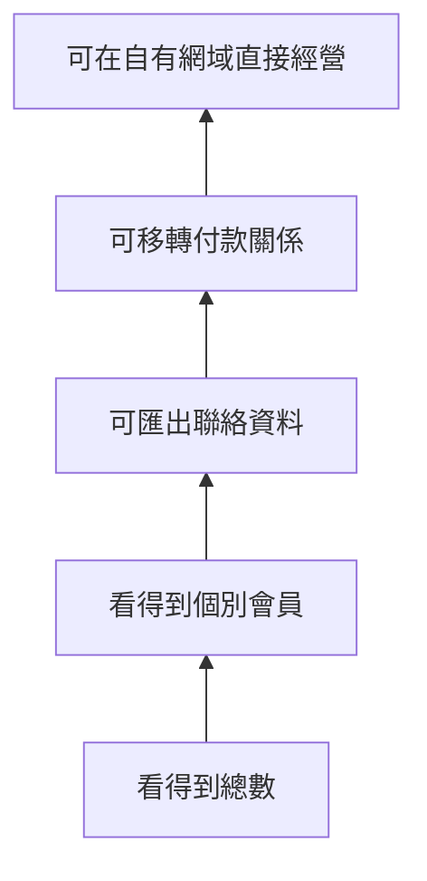

> 🌏 [English version](/en/posts/product/2026-09-17-medium-vocus-platform-distribution-en)

把內容平台想成百貨公司的美食街。你不用自己把路人一個個拉進店裡，百貨會提供地點、推薦櫃位、會員通知與收銀台；代價是顧客先成為百貨會員，再成為你的熟客。

[Medium](https://medium.com/) 像跨國百貨：文章有機會進入推薦、主題頁、Digest 與人工挑選的 Boost。[Vocus 方格子](https://vocus.cc/)則像台灣在地百貨：除了站內曝光，也替創作者處理台幣收款、電子發票、提領與部分稅務流程。

比較流量之前，先看搬走時帶得走什麼。食譜是文章，排隊人數是儀表板，熟客的聯絡方式是 email，持續扣款則是付款關係。這四樣東西看起來都叫「讀者資料」，所有權卻完全不同。

## 平台流量不是一包人，而是一串閘門

創作者按下發布後，文章不會自動送到所有潛在讀者面前。平台先決定文章能進入哪些入口，再由讀者決定要不要點開。

[Medium 的官方分發說明](https://help.medium.com/hc/en-us/articles/360018677974-What-happens-to-your-story-when-you-publish-on-Medium)把路徑分成兩套。第一套是作者自己的網路，包括 profile、followers 的 Following feed、Digest，以及作者選擇寄出的 email notification。第二套是 Medium 的平台網路，包括 For You、主題頁、App Explore、其他文章下方的推薦與登出首頁。

這裡有三種控制權。作者控制是否發布、是否從外部導流；讀者控制是否追蹤、訂閱與閱讀；Medium 控制陌生讀者的曝光入口。文章寫得好是必要條件，不是平台流量的保證書。

Vocus 也同時經營直達與平台入口。它的[創作者招募頁](https://vocus.cc/become_creator)主打電子報、App 推播、搜尋曝光與數據儀表板，也宣稱創作者能掌握會員名單與數據。不過，公開文件沒有交代首頁與精選的完整排序規則，因此不能把「在 Vocus 發文」直接換算成固定流量。

平台提供的是被看見的機會，不是可預測的曝光採購。

## Medium：你能接觸讀者，不代表你認識讀者

Medium 的優勢是讓一篇文章離開作者原有圈子。一般推薦會依讀者興趣與閱讀習慣分發，人工策展的 Boost 則會放大少數文章。加入 publication，還可能觸及該 publication 的 followers 與 newsletter subscribers。

收益也跟分發綁在一起。[Medium 現行 Partner Program 說明](https://help.medium.com/hc/en-us/articles/360036691193-Medium-Partner-Program-earnings-calculation)列出付費會員閱讀時間、claps、highlights、replies 與 Boost 加權等因子。外部流量、搜尋、email notification 與新會員轉換也會影響收益。這不是固定稿費，也不能從一千次瀏覽直接反推收入；公式由平台治理，而且會調整。

更重要的界線藏在 email。[Medium 的 Email notifications 文件](https://help.medium.com/hc/en-us/articles/360059837393-Email-notifications)明寫：新讀者訂閱作者的發文通知時，email 地址不再分享給作者。作者仍能透過 Medium 寄信、查看訂閱者介面，也能匯出以前已取得的 email list，但新訂閱者的身份留在平台裡。

所以這三句話不能混在一起：

- 我能寄信給讀者。
- 我能在後台看到讀者。
- 我能把讀者的聯絡資料帶走。

Medium 對前兩句提供不少能力，第三句對新訂閱者卻不成立。這是使用權，不是完整所有權。

## Vocus：20% 買到的是台灣營運後台

Vocus 的交換條件不同。[現行收入指南](https://creator.vocus.cc/vocus-ti-gong-gei-chuang-zuo-zhe-de-feng-fu-bian-xian-ji-zhi/shou-ru-fen-run-yu-ti-ling-shuo-ming)列出內容方案的平台營運服務費為 20%，第三方金流與稅金另計；中央社在 [2021 年的創辦人專訪](https://www.cna.com.tw/news/acul/202106050023.aspx)也曾報導同一抽成比例。費率之外，平台整合藍新金流、LINE Pay、PayPal、電子發票、提領、訂單客服與台灣個人創作者的部分扣繳流程。

對台灣創作者來說，這些不是小事。自己架站收錢，不只要裝一個付款按鈕，還要處理發票、退款、對帳、消費爭議與稅務身份。Vocus 抽走的不是純粹「流量費」，其中一部分是在替創作者承擔營運摩擦。

但平台後台仍不等於完整客戶所有權。[Vocus 的會員與訂單說明](https://vocus.cc/help_center/ru-he-guan-li-sha-long-hui-yuan-ji-ding-dan)證明創作者能做到兩件事：

- 在會員管理中檢視訂閱中、一次購買、流失與未付費會員，也能看部分互動指標。
- 依日期與方案篩選訂單，並把訂單明細匯出成 CSV。

公開文件沒有證明完整會員 email 名單可以匯出，也沒有證明持續扣款關係能搬到另一套系統。[Vocus 隱私權政策](https://vocus.cc/terms/privacy)原則上也不會任意把會員個資揭露給第三方，除非為提供訂閱產品或服務，或取得會員授權。

因此最保守也最有用的結論是：**Vocus 已證實能讓創作者管理會員並匯出訂單，但不能從訂單 CSV 推導出完整 email 與付款關係可攜。**

## 所有權是一座樓梯，不是一個開關

「我的讀者」常被說得太簡單。真正的控制權至少有五層。

站上有十萬 followers，不代表有十萬個 email。能下載 email，不代表能帶走信用卡授權。內容著作權屬於創作者，也不代表原本的推薦流量會跟著搬家。

| 控制層 | Medium | Vocus | 搬家時真正的問題 |
|---|---|---|---|
| 內容 | 作者可發布與另行備份 | [條款](https://vocus.cc/terms/member)明載著作權歸創作者，非專屬授權平台 | 版型、網址與付費牆能否重建？ |
| 會員介面 | 可看 followers、subscribers 與活動 | 可看會員狀態、流失與部分活動 | 這是 dashboard，還是可攜資料？ |
| Email | 新訂閱者地址不交給作者 | 未找到完整 email 匯出的官方證據 | 能否在站外直接聯絡？ |
| 訂單 | 讀者買 Medium membership，不是作者自己的方案 | 訂單 CSV 可匯出 | CSV 是否含合法可再行銷的身份？ |
| 付款關係 | 由 Medium 統一向會員收費與分配 | 平台與第三方金流處理 | 持續扣款能否不中斷移轉？ |
| 陌生流量 | 一般推薦、Boost、publication、搜尋 | 搜尋、App、電子報與站內版位 | 離開後流量是否歸零？ |

這張表也說明兩個平台不能只比抽成。Medium 主要提供全球內容池與分發；Vocus 更接近台灣創作者的商務後台。創作者買的不是同一種服務。

## 台灣創作者要把在地摩擦算進成本

英文創作者可能先問推薦演算法與 Partner Program。台灣創作者還要多問四件事：讀者用什麼幣別付款、能否順利刷卡、誰開發票、收入如何提領與申報。

這讓 Vocus 即使抽成較高，仍可能對剛開始收費的人有價值。若每月收入還小，自架金流、客服與稅務的固定時間成本可能比抽成更痛。反過來說，成熟創作者若已有會計、金流與自己的 email 名單，就該重新計算 20% 換回來的服務是否仍有增量。

今晚先別搬家。打開後台列出四欄：

1. 過去三個月有多少讀者來自站內推薦、搜尋、社群與自己的名單？
2. 各來源有多少人成為可再次接觸的訂閱者？
3. 哪些資料能下載，下載檔實際有哪些欄位？
4. 若平台明天關閉，下一次收款與寄信能否繼續？

回答完這四題，才知道平台費買到的是成長，還是只是方便。

## AI 讓分發更值錢，也讓平台依賴更危險

生成式 AI 同時改變供給與入口。

供給端上，寫出大量「看起來像文章」的內容變便宜，平台更需要替讀者篩選。Medium 已把 AI 直接寫進分發規則。[官方 AI 政策](https://help.medium.com/hc/en-us/articles/22576852947223-Artificial-Intelligence-AI-content-policy)規定，低度編修的 AI-generated writing 不能放進 Partner Program。未揭露的 AI 生成內容只會送到作者自己的網路，不會取得更廣分發。平台策展因此更重要，平台判斷錯誤的影響也更大。

需求端上，搜尋帶來的點擊正在受 AI 摘要影響。[Pew Research Center 的 2025 年瀏覽資料分析](https://www.pewresearch.org/short-reads/2025/07/22/google-users-are-less-likely-to-click-on-links-when-an-ai-summary-appears-in-the-results/)發現，美國樣本看到 AI summary 時，點擊傳統搜尋結果的比例是 8%；沒看到時是 15%。這是特定月份的美國 Google 樣本，不能直接寫成 Medium 或 Vocus 流量跌幅。

它能支持的窄結論是：搜尋曝光未必能換成網站造訪。平台內推薦與直接 email 的相對價值會提高；如果 email 身份又不能攜出，創作者可能用更深的平台依賴換取短期觸及。

Vocus 本輪沒有找到同樣明確的 AI 內容分發政策。這只能標成「公開文件未找到」，不能寫成 Vocus 沒有治理或沒有 AI 功能。

## 結論：把平台當入口，不要誤認成資產本身

Medium 適合測試文章能否跨出既有讀者圈，Vocus 適合降低台灣收款與會員營運的門檻。兩者都有真實價值，也都保留關鍵控制權。

最危險的誤判，是看到後台數字就以為擁有讀者。followers、會員暱稱、訂單 CSV、email 與付款授權不是同一件事。平台帶來的曝光可以租，真正能累積的資產要能在平台之外繼續聯絡、收款與服務。

先用平台找人，再刻意建立可搬走的關係。這比爭論哪個平台「流量最大」更接近一門能活久的內容生意。

## 參考資料

- [Medium：What happens to your story when you publish](https://help.medium.com/hc/en-us/articles/360018677974-What-happens-to-your-story-when-you-publish-on-Medium)
- [Medium Partner Program earnings calculation](https://help.medium.com/hc/en-us/articles/360036691193-Medium-Partner-Program-earnings-calculation)
- [Medium：Email notifications](https://help.medium.com/hc/en-us/articles/360059837393-Email-notifications)
- [Medium：Artificial Intelligence content policy](https://help.medium.com/hc/en-us/articles/22576852947223-Artificial-Intelligence-AI-content-policy)
- [Vocus：收入分潤與提領說明](https://creator.vocus.cc/vocus-ti-gong-gei-chuang-zuo-zhe-de-feng-fu-bian-xian-ji-zhi/shou-ru-fen-run-yu-ti-ling-shuo-ming)
- [Vocus：如何管理沙龍會員及訂單](https://vocus.cc/help_center/ru-he-guan-li-sha-long-hui-yuan-ji-ding-dan)
- [Vocus：會員服務條款](https://vocus.cc/terms/member)
- [Vocus：隱私權政策](https://vocus.cc/terms/privacy)
- [中央社：好內容值得付費，方格子闖出華文創作平台一片天](https://www.cna.com.tw/news/acul/202106050023.aspx)
- [Pew Research Center：Do people click on links in Google AI summaries?](https://www.pewresearch.org/short-reads/2025/07/22/google-users-are-less-likely-to-click-on-links-when-an-ai-summary-appears-in-the-results/)
