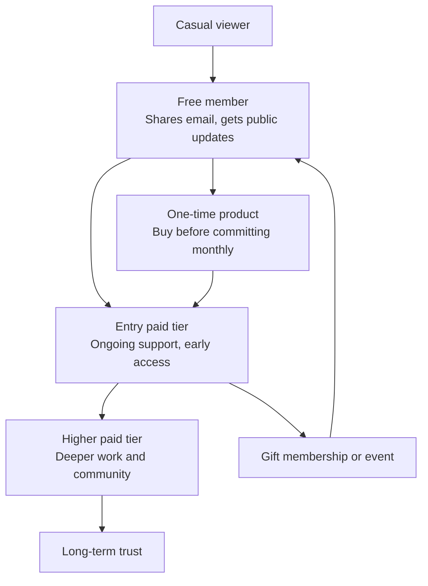
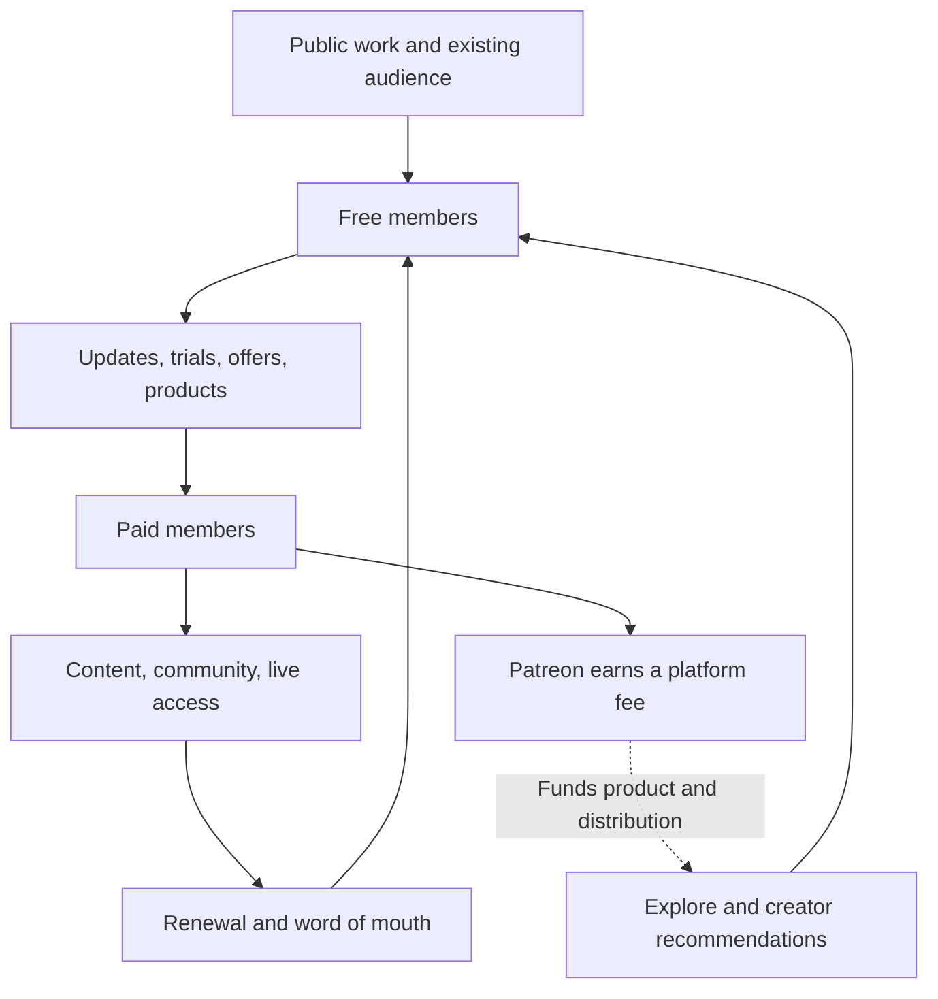

> 🌏 [中文版](/posts/product/2026-09-17-patreon-membership-value-ladder)

Imagine a street performer placing a hat on the ground after a show. Someone who enjoyed the performance can drop in a few dollars, but meeting again is mostly a matter of luck. Patreon builds a membership club next to that hat. A passerby can first join for free. A regular can pay monthly for a particular room. A devoted fan can buy an individual product, attend an event, or give membership to someone else.

[Patreon](https://www.patreon.com/) is therefore more than a payment page. It turns occasional interest into a sequence of relationships: seeing the work, joining for free, making a first purchase, paying regularly, and participating in a community. The creator gives up more than a fee in return. Patreon also operates billing, access controls, interaction history, and in-platform distribution.

The percentage is merely the most visible line on the bill. The more useful questions are which jobs the membership ladder performs—and how many rungs a creator can take along when leaving.

## Patreon sells a ladder

The original Patreon proposition was easy to understand: fans paid a recurring amount to support work they valued. The product now includes free membership, paid tiers, one-time purchases, gift memberships, community chats, native video, and live streaming. In its [2024 retrospective](https://news.patreon.com/articles/celebrating-another-year-of-connecting-creators-and-their-real-fans), Patreon described its own shift from a membership platform toward a media, community, and business platform.

These are not unrelated features. Each one asks for a different degree of commitment:

Free membership lowers the friction of the first step. A one-time product serves someone who wants a specific item without taking on a subscription. Paid tiers then separate different jobs: one person wants to provide reliable support, another wants early access, and another values live sessions, behind-the-scenes material, or status inside a community.

That breadth distinguishes Patreon from a newsletter paywall. YouTubers, podcasters, illustrators, and musicians do not have to compress every benefit into an article. Video, audio, live events, products, and chat can all carry part of the membership offer.

## Free membership is the start of conversion

Patreon connects free and paid membership through a sequence of moments that creators can observe and act on. A creator can send public updates to free members, then use discounts, trials, or products to move some of them further down the ladder.

A [2024 TechCrunch report](https://techcrunch.com/2024/09/17/patreon-launches-features-to-automate-away-creators-administrative-workload-and-help-them-make-more-money) relayed Patreon's test results for Autopilot, which predicts which free members are more likely to upgrade and sends them an offer. Patreon said the test increased the free-to-paid upgrade rate by 19% on average. The company did not publish the sample, baseline conversion rate, confidence interval, or long-term retention. The result establishes that Patreon is productizing conversion; it does not establish that every creator will earn 19% more.

Explore and creator recommendations add discovery. [Patreon said in 2025](https://news.patreon.com/articles/discovery-on-patreon-is-driving-over-200-million-to-creators-per-year) that free membership, recommendations, and Explore collectively drove more than $200 million per year to creators. Patreon did not publish the attribution method. The figure should remain a company-reported claim, not an independently measured average return.

The mechanism is more informative than the headline number:

The dotted line represents an incentive, not a proven causal loop. Patreon earns more when creators earn more, so it has a reason to improve conversion and distribution. Public evidence does not show the incremental membership return on each dollar of platform fees.

## Ten percent is the platform fee, not the total cost

Under [Patreon's official pricing notice](https://support.patreon.com/hc/en-us/articles/36426991446797-A-standard-platform-fee-for-new-creators-effective-after-August-4-2025), creators who publish a new page after August 4, 2025 use the standard 10% platform fee. [TechCrunch's pricing report](https://techcrunch.com/2025/06/16/patreon-will-increase-the-cut-it-takes-from-new-creators/) independently confirms the effective date and the distinction between new and legacy plans.

Existing creators retain legacy pricing, although unpublishing and later republishing a page can move it to the new rate.

The common mistake is to turn “10% platform fee” into “10% total cost.” Patreon's [creator fees overview](https://support.patreon.com/hc/en-us/articles/11111747095181-Creator-fees-overview) separately lists payment processing, currency conversion, and payout fees. Tax treatment, merchandise, and legacy plans can have different terms.

A comparison with fixed-price software therefore cannot stop at `monthly revenue × 10%`. The bundle includes media hosting, entitlement management, community, commerce, conversion, and discovery. The creator needs to ask which of those jobs replace other software and operating work—and which parts of the bundle go unused.

## Exporting email is not the same as owning the relationship

The phrase “my audience is on the platform” collapses several distinct assets. Patreon's [export documentation](https://support.patreon.com/hc/en-us/articles/34784011795469-Exporting-your-audience-s-emails-from-Patreon) lets creators download a CSV of audience contacts. That makes email and some contact data portable. It does not fit an entire membership relationship into a spreadsheet.

| Asset | Can it move? | The real migration friction |
|---|---|---|
| Email and contact list | Exportable as CSV | Check sending eligibility for each recipient's location and the new tool's rules |
| Original media | Portable if the creator retained source files | Rebuild Patreon layouts and metadata |
| Recurring payments | CSV does not contain reusable billing authorization | Members may need to authorize payment again |
| Tiers and entitlements | The concept can be recreated | Map benefits, access, and historical status |
| Comments, chats, interaction history | No complete export promised in the cited documentation | Shared context and community memory are easy to lose |
| Explore and recommendation distribution | Not portable | Rebuild discovery from zero |

The distinction matters. An email address lets a creator announce a move. Without recurring billing authorization, each paying member may still need to complete a new payment flow. Without comments and chats, the most active members remain names on a list, but the context they built together stays behind.

Patreon is neither a system where creators own nothing nor a system with no lock-in because a CSV exists. Contact data is partly portable; billing, interaction context, and distribution remain highly platform-dependent.

## AI makes content abundant, pushing membership toward relationships

This review found no official evidence that Patreon broadly provides a built-in generative writing assistant. That does not establish that Patreon uses no AI. Autopilot already shows a different application: predictive tooling that identifies free members who may be ready to upgrade.

One of Patreon's clearest public AI documents concerns governance. Its [AI policy for Adult/18+ creators](https://support.patreon.com/hc/en-us/articles/34055590411789-Understanding-Patreon-s-AI-policies-for-Adult-18-creators) says that hyperrealistic depictions of real people on those pages require documented explicit consent. AI is both a production tool and an operating cost involving consent, authenticity, moderation, and payment-partner rules.

Generative tools can increase the supply of ordinary images, text, and audio. They do not automatically reproduce the history between a creator and an audience. Membership value is likely to move toward four harder-to-copy elements: the creator showing up consistently, members being able to participate, a community recognizing its own people, and payment unlocking clearly defined access. That is a business inference, not a measured Patreon outcome.

## When Patreon fits

Patreon fits creators who already attract an audience through YouTube, podcasts, social networks, or live work and whose membership benefits cross several media. A practical first check is to sort the current offer into four columns: public work, free membership, recurring paid membership, and one-time purchases. If every cell contains another written post, the creator may not be using the media, community, and commerce capabilities that justify the bundle.

The second check is to download the audience CSV now and write a migration inventory: where source media lives, who controls the domain, who sends email, who bills members, and which comments or entitlements cannot be exported. A fee change, policy dispute, or account problem is a poor time to discover the answer.

For a creator who already operates a mature website, community, and payment system—and barely uses Patreon's hosting, discovery, or community tools—the 10% can become an expensive collection fee. For a small team that genuinely replaces five tools and substantial membership operations with Patreon, judging the product by the percentage alone understates its value.

Patreon's bet is to bring more of the fan relationship onto one ladder. The creator's job is to know which rungs they own and which ones belong to the building.

## References

- [Patreon: Standard 10% platform fee for new creators](https://support.patreon.com/hc/en-us/articles/36426991446797-A-standard-platform-fee-for-new-creators-effective-after-August-4-2025)
- [TechCrunch: Patreon's 2025 pricing change](https://techcrunch.com/2025/06/16/patreon-will-increase-the-cut-it-takes-from-new-creators/)
- [Patreon: Exporting audience emails](https://support.patreon.com/hc/en-us/articles/34784011795469-Exporting-your-audience-s-emails-from-Patreon)
- [Patreon: Discovery tools and company-reported results](https://news.patreon.com/articles/discovery-on-patreon-is-driving-over-200-million-to-creators-per-year)
- [Patreon: 2024 product and membership retrospective](https://news.patreon.com/articles/celebrating-another-year-of-connecting-creators-and-their-real-fans)
- [TechCrunch: Autopilot, free membership, and one-time purchases](https://techcrunch.com/2024/09/17/patreon-launches-features-to-automate-away-creators-administrative-workload-and-help-them-make-more-money)
- [Patreon: Policy for AI-generated work](https://support.patreon.com/hc/en-us/articles/34055590411789-Understanding-Patreon-s-AI-policies-for-Adult-18-creators)
