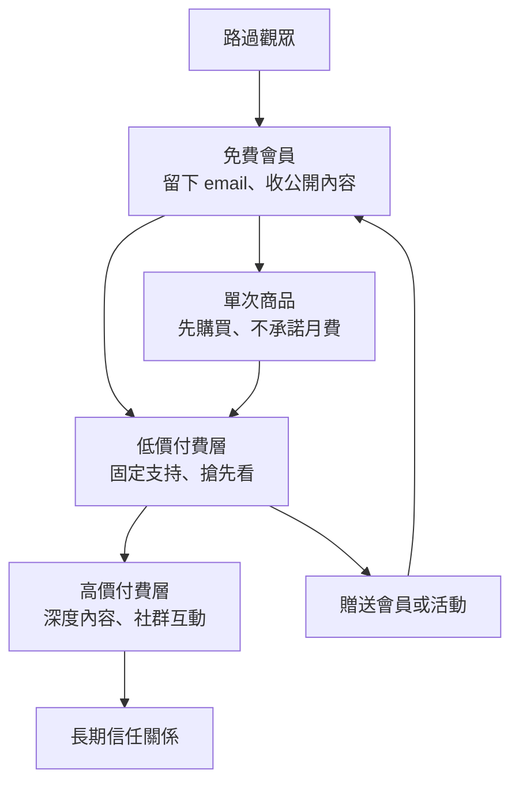
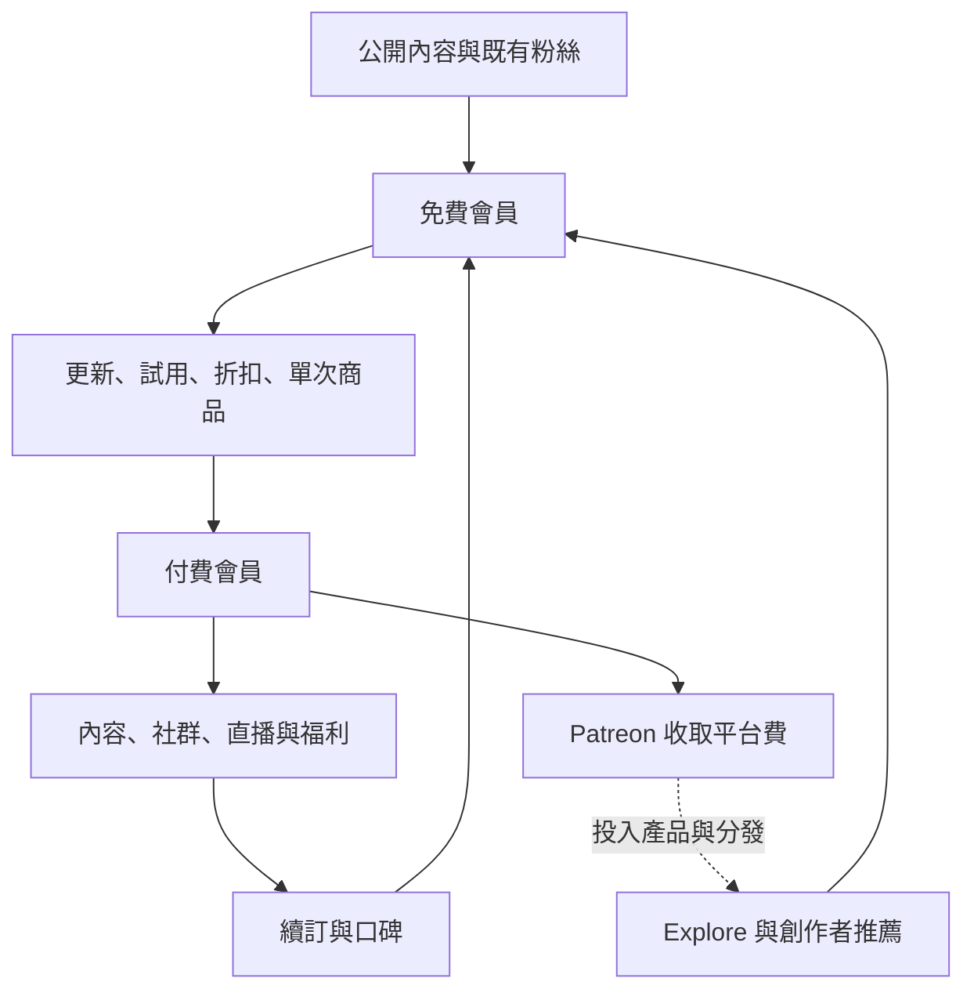

> 🌏 [English version](/en/posts/product/2026-09-17-patreon-membership-value-ladder-en)

想像一位街頭藝人在表演後放下一頂帽子。喜歡的人可以丟一次零錢，下次還會不會遇見，全靠運氣。Patreon 在帽子旁蓋起一間會員俱樂部。路過的人先免費留下聯絡方式，熟客每月付費進不同房間，鐵粉再買單次商品、參加活動，或把會員資格送給朋友。

[Patreon](https://www.patreon.com/) 因此不只是一張收款頁。它把「偶爾喜歡」拆成一連串可以經營的關係：看過內容、免費加入、第一次購買、固定付費、參與社群。創作者付出的代價，也不只是一筆手續費。平台同時掌握扣款、權限、互動紀錄與站內分發。

抽成只是帳面上最顯眼的一格。更重要的是：這條會員階梯替你完成了哪些工作？搬家時又有幾階能一起帶走？

## Patreon 賣的是一座階梯

早期 Patreon 的直覺很簡單：粉絲每月付一筆錢支持喜歡的創作者。現在的產品已經多了免費會員、付費分級、單次商品、贈送會員、community chats、原生影音與直播。Patreon 在 [2024 年回顧](https://news.patreon.com/articles/celebrating-another-year-of-connecting-creators-and-their-real-fans)中，也直接把自己描述成從 membership platform 走向 media、community、business platform。

這些功能不是平行擺著的清單。它們各自處理不同程度的承諾：

免費會員用來降低第一次加入的門檻。單次商品則讓還不想訂閱的人先買一樣東西。付費分級再把不同需求拆開：有人只想穩定支持，有人要搶先看，也有人在意直播、幕後內容或社群裡的身分。

這也是 Patreon 跟單純電子報 paywall 的差別。YouTuber、Podcaster、插畫家或音樂人不必把所有價值壓成文章；影片、音檔、直播、商品與 chat 都能成為會員福利。

## 免費不是終點，是轉換的起點

Patreon 透過一連串可觀察、可觸發的時機，把免費會員接到付費會員。創作者可以先讓免費會員收到公開更新，再用折扣、免費試用或商品把一部分人往下一階帶。

[TechCrunch 2024 年報導](https://techcrunch.com/2024/09/17/patreon-launches-features-to-automate-away-creators-administrative-workload-and-help-them-make-more-money)轉述 Patreon 的測試結果：Autopilot 會預測哪些免費會員較可能升級，再寄出折扣；公司稱測試中的 free-to-paid upgrade rate 平均提高 19%。這個數字缺少公開樣本、原始轉換率與長期留存資料，所以能證明的是「Patreon 正在把轉換做成產品」，不能證明每位創作者都會多賺 19%。

平台還有 Explore 與 creator recommendations。[Patreon 2025 年的官方說法](https://news.patreon.com/articles/discovery-on-patreon-is-driving-over-200-million-to-creators-per-year)是，免費會員、推薦與 Explore 合計每年替創作者帶來超過 2 億美元。歸因方法沒有公開，這只能當公司自報數字，不能當成獨立查核的平均成效。

把已知機制畫出來，會比盯著單一大數字更有用：

最後一條虛線是商業誘因，不是已證實的因果。Patreon 收入隨創作者收入增加，確實有理由改善轉換與分發；公開資料卻不足以證明，每一元平台費都帶回多少增量會員。

## 10% 是平台費，不是全部成本

依 [Patreon 官方費率說明](https://support.patreon.com/hc/en-us/articles/36426991446797-A-standard-platform-fee-for-new-creators-effective-after-August-4-2025)，在 2025 年 8 月 4 日後發布頁面的新創作者，適用 10% standard platform fee。[TechCrunch 的費率報導](https://techcrunch.com/2025/06/16/patreon-will-increase-the-cut-it-takes-from-new-creators/)亦交叉確認了生效時間與新舊方案差異。

既有創作者保留舊方案；若把頁面取消發布後再重新發布，也可能被移到新費率。

最容易寫錯的地方，是把「10% 平台費」說成「總共只扣 10%」。Patreon 的[創作者費用總覽](https://support.patreon.com/hc/en-us/articles/11111747095181-Creator-fees-overview)另列 payment processing、幣別轉換與提領等費用；稅務、商品、merch 或舊方案也可能有不同條件。

所以 Patreon 與固定月費 SaaS 的比較，不能只算一條 `月營收 × 10%`。創作者買到的是媒體代管、會員權限、社群、商品、轉換與發現工具的組合。真正該問的是：其中哪些功能替你省下其他工具和營運時間？哪些功能其實沒有使用？

## 可下載 email，不等於擁有整段關係

「平台上有我的粉絲」這句話，把好幾種資產混在一起了。Patreon 的[官方匯出說明](https://support.patreon.com/hc/en-us/articles/34784011795469-Exporting-your-audience-s-emails-from-Patreon)允許創作者下載 audience contacts 的 CSV。這表示 email 與部分聯絡資料可以帶走；它不表示整段會員關係都能塞進試算表。

| 資產 | 能否帶走 | 搬家時真正的摩擦 |
|---|---|---|
| email／聯絡名單 | 可匯出 CSV | 依收件人所在地與新工具規則確認寄信資格 |
| 原始內容 | 自己留存的檔案可帶 | Patreon 內的版面與 metadata 要重建 |
| 付費續訂 | CSV 不包含可直接重用的扣款授權 | 會員可能得重新授權或刷卡 |
| 會員層級與權限 | 概念可重建 | tier、福利與歷史 entitlement 要重新對應 |
| 留言、chat、互動歷史 | 官方文件未承諾完整匯出 | 社群記憶與關係最容易流失 |
| Explore／推薦分發 | 不可攜 | 換平台後重新累積 |

這個差異很實際。拿到 email，代表你還能通知讀者「我們搬家了」。拿不到續訂授權，代表通知之後，仍可能要求每位付費會員再次完成付款。拿不到留言和 chat，則代表最活躍的那群人雖然還在名單裡，共同累積的脈絡卻留在舊平台。

因此，Patreon 不是「創作者什麼都不擁有」，也不是「有 CSV 就沒有平台綁定」。較準確的說法是：聯絡資料部分可攜，扣款、互動與分發高度平台化。

## AI 讓內容變多，會員價值得往關係移動

本輪查不到 Patreon 已普遍提供內建生成式寫作助手的官方產品證據，不能因此斷言它沒有使用任何 AI。Autopilot 本身就顯示，平台正在用預測工具找出較可能升級的免費會員；這跟「替創作者寫文章」是不同用途。

Patreon 對 AI 最明確的公開材料之一反而是內容治理。[Adult/18+ 創作者 AI 政策](https://support.patreon.com/hc/en-us/articles/34055590411789-Understanding-Patreon-s-AI-policies-for-Adult-18-creators)指出，這類頁面若使用真人的超寫實生成影像，需要留下明確同意文件。AI 在這裡同時是供給工具，也是 consent、真偽與金流規範的營運成本。

生成工具會讓一般圖片、文字或音訊變得更多，卻不會自動創造讀者與創作者之間的歷史。對會員生意來說，較難複製的價值會往四個方向移動：創作者本人持續出現、會員能參與、社群認得彼此，以及付費能換到清楚的 access。這是商業推論，不是 Patreon 已證明的 AI 成效。

## 什麼情況適合 Patreon

Patreon 適合已在 YouTube、Podcast、社群或現場活動累積粉絲，而且會員福利跨越多種媒介的創作者。今晚就能做的檢查，是把現有福利分成四欄：公開內容、免費會員、固定付費、單次購買。如果所有項目都只是一篇文字，Patreon 的影音、社群與商務組合可能沒有被用到。

第二個檢查，是實際下載一次 audience CSV，再寫一張搬家清單：內容放哪裡、誰掌握網域、誰寄信、誰扣款、哪些留言與權限無法匯出。不要等到價值觀衝突、費率變動或帳號問題發生，才第一次確認自己帶得走什麼。

當創作者已經有成熟的自有網站、社群與付款系統，而且幾乎不使用 Patreon 的發現、影音或 community 工具，10% 就可能變成昂貴的代收費。反過來說，若平台真的替一個小團隊省掉五套工具和大量會員營運，單看抽成也會低估它的價值。

Patreon 的賭注，是把更多粉絲關係收進同一座階梯。創作者的功課，則是分清楚哪些階梯屬於自己，哪些只是暫時借用平台的電梯。

## 參考資料

- [Patreon：新創作者 standard 10% platform fee](https://support.patreon.com/hc/en-us/articles/36426991446797-A-standard-platform-fee-for-new-creators-effective-after-August-4-2025)
- [TechCrunch：Patreon 2025 年費率調整](https://techcrunch.com/2025/06/16/patreon-will-increase-the-cut-it-takes-from-new-creators/)
- [Patreon：匯出 audience emails](https://support.patreon.com/hc/en-us/articles/34784011795469-Exporting-your-audience-s-emails-from-Patreon)
- [Patreon：Discovery 工具與公司自報成效](https://news.patreon.com/articles/discovery-on-patreon-is-driving-over-200-million-to-creators-per-year)
- [Patreon：2024 年產品與會員回顧](https://news.patreon.com/articles/celebrating-another-year-of-connecting-creators-and-their-real-fans)
- [TechCrunch：Autopilot、免費會員與單次購買](https://techcrunch.com/2024/09/17/patreon-launches-features-to-automate-away-creators-administrative-workload-and-help-them-make-more-money)
- [Patreon：AI 生成內容政策](https://support.patreon.com/hc/en-us/articles/34055590411789-Understanding-Patreon-s-AI-policies-for-Adult-18-creators)
