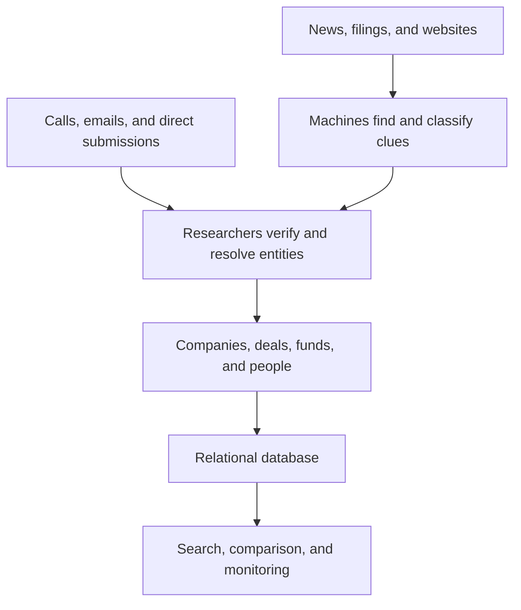
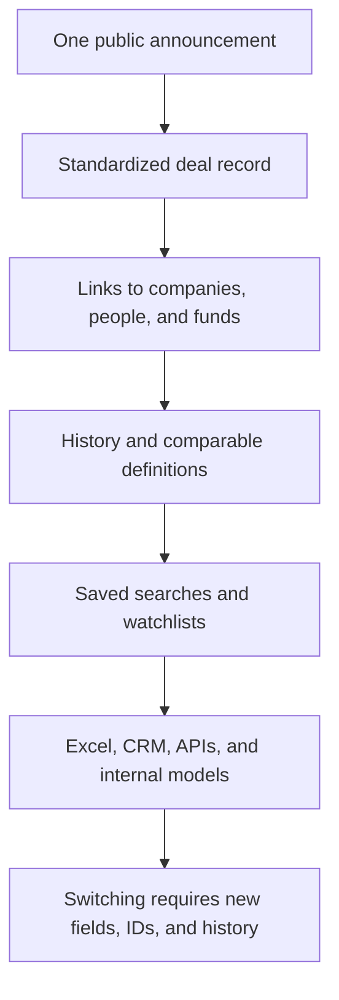
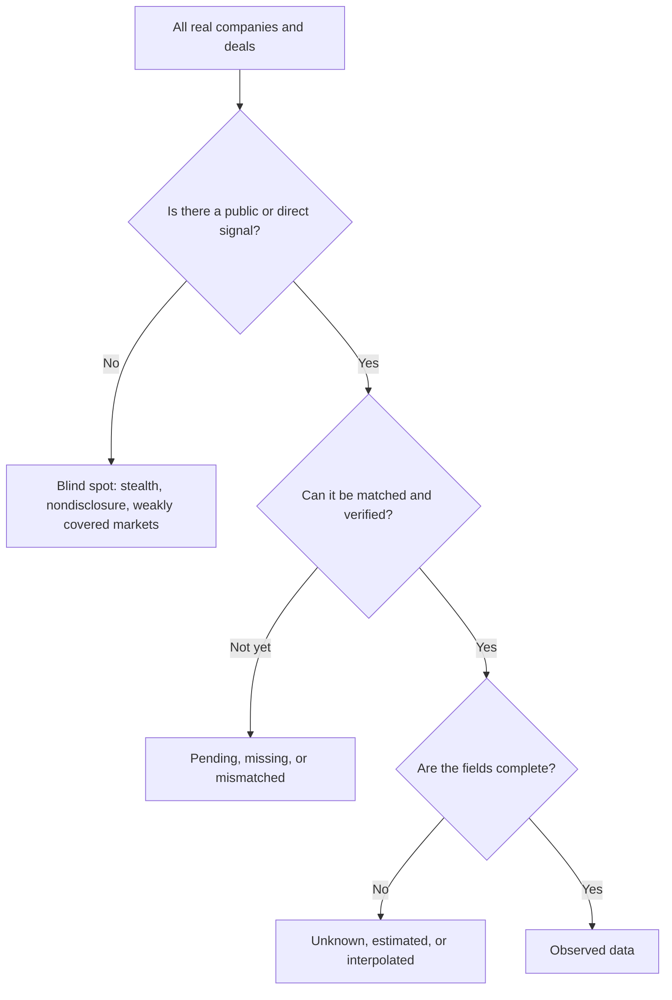

> 🌏 [中文版](/posts/product/2026-09-17-pitchbook-private-market-data)

Imagine a teacher trying to build a seating chart for an entire school with only event photos, scattered attendance sheets, and forms completed by students. A computer can guess whether the Amy in a photo is the same Amy on a class list, but someone still has to check. Once her identity is confirmed, the chart also needs to show her class, clubs, and transfers over time.

[PitchBook](https://pitchbook.com/) does the private-market version of that job. Private companies do not disclose continuously like listed companies, and an investment may not become public until months after it closes. PitchBook collects clues from news, filings, company websites, and people involved, then uses researchers to connect companies, deals, funds, investors, limited partners, and people into a relational map.

The directory earns an enterprise budget only when it can support sourcing, diligence, fund comparisons, presentations, and internal data updates. Once the data flows into Excel models, CRMs, and warehouses, changing providers no longer means switching websites. It means rebuilding fields, identifiers, and historical definitions.

## Machines find the clues; people decide what belongs in the database

PitchBook describes two inputs in its [research process](https://pitchbook.com/help/pitchbook-research-process). Secondary research collects public information such as news and press releases. Primary research uses calls and emails to collect additional information directly from people connected with tracked entities. After discovering a source, the team checks whether the entity fits its scope, builds a profile, and keeps revising it.

This is not a system in which AI scrapes a page and turns it into truth. Machine learning and natural-language processing help find, organize, and filter signals. Researchers resolve entities, complete fields, and perform quality checks. When companies share a name, a fund changes its name, an investor moves jobs, or reports disagree about the same financing round, deciding whether two mentions describe the same thing is the expensive part.

Human verification puts information from different sources and formats into a consistent structure, but it cannot eliminate uncertainty. That is the dividing line between PitchBook and a general search engine: search finds pages, while PitchBook tries to show how the companies, deals, and investors mentioned on those pages connect.

## Data enters the enterprise budget when it enters the work

PitchBook's official [use cases](https://pitchbook.com/use-cases) range from deal sourcing, due diligence, and fundraising to benchmarking, business development, asset allocation, and portfolio management. Different roles care about different fields, but they use the same entities and relationships.

| Buyer | Job to be done | How the data shortens the path |
|---|---|---|
| VC / private equity | Source targets, inspect funding history, find comparables | Turn screening criteria into a candidate list |
| Investment bank / advisor | Build buyer and target lists, find precedent transactions | Move deal, company, and people data into models and decks |
| LP / asset allocator | Find managers, compare funds and exposure | Organize fragmented reports under common classifications and benchmarks |
| Corporate development | Source acquisitions, map competition | Turn market monitoring into an updatable list |
| Data and AI team | Update a CRM, warehouse, or internal model | Retrieve data continuously through APIs or feeds |

The platform is an entry point, not the end of the product. Its [pricing page](https://pitchbook.com/pricing) lists Mobile, Excel, PowerPoint, and a Chrome extension, while treating Direct Data and CRM Integration as additional offerings. PitchBook does not publish a fixed rate card. Quotes vary with seats, firm type, and premium products, so third-party annual price ranges should not be presented as verified list prices.

[Direct Data](https://pitchbook.com/products/direct-access-data) pushes the dependency deeper. Customers can call an API on demand or receive scheduled feeds in `.dat`, `.csv`, Parquet, or database-table formats for companies, deals, investors, and funds. At that point, PitchBook is not merely competing for a browser bookmark. It has become an upstream dependency for reports, models, and automations.

## The moat is not one record; it is the cost of moving the work

A financing announcement is easy to repeat. What is harder to move is its position in years of data: which investments a company previously raised, where else its investors deployed capital, how comparable deals were priced, and where the relevant people work now.

“Data flywheel” is a safer description than an automatic network effect. More records can make new signals easier to match with known entities, and subscription revenue can finance more research and quality control. Customers may submit corrections as well, but PitchBook does not disclose how much of the database comes from customer feedback.

Switching costs also vary. A deal team with frequent searches, extensive saved lists, and API integrations has more to rebuild than a small company that looks up a few businesses each year. Morningstar's [2025 financial results](https://newsroom.morningstar.com/news/news-details/2026/Morningstar-Inc--Reports-Fourth-Quarter-Full-Year-2025-Financial-Results/default.aspx) reflect that difference: PitchBook continued to grow among core investor and advisor customers, while the corporate segment remained soft, particularly among smaller firms with limited use cases.

## From $31.1 million to $671.8 million

When Morningstar announced the acquisition in 2016, it already owned about 20% of PitchBook and expected to pay roughly $180 million for the remaining interest, valuing the company at $225 million. PitchBook had generated $31.1 million in trailing-12-month revenue. The figures appear in both the [official announcement published by PitchBook](https://pitchbook.com/media/press-releases/morningstar-to-acquire-pitchbook-data) and [GeekWire's report that day](https://www.geekwire.com/2016/morningstar-agrees-buy-remaining-stake-venture-capital-data-provider-pitchbook-180-million/). GeekWire drew the transaction details from the announcement, so it confirms what was published rather than providing a second set of books.

By 2024, PitchBook was a segment with an adjusted operating margin of roughly 30%. Morningstar's [2025 results](https://newsroom.morningstar.com/news/news-details/2026/Morningstar-Inc--Reports-Fourth-Quarter-Full-Year-2025-Financial-Results/default.aspx) repeat the prior-year values in the comparison column and provide the latest year; the 2024 figures can also be checked against Morningstar's [full-year 2024 release](https://newsroom.morningstar.com/news/news-details/2025/Morningstar-Inc--Reports-Fourth-Quarter-Full-Year-2024-Financial-Results/default.aspx).

| Year | Segment revenue | Growth | Adjusted operating income | Adjusted operating margin |
|---|---:|---:|---:|---:|
| 2024 | $618.4 million | 12.0% | $186.4 million | 30.1% |
| 2025 | $671.8 million | 8.6% | $210.1 million | 31.3% |

Across the roughly nine years between those endpoints, the nominal revenue endpoint grew to about 21.6 times its earlier level. That should not be treated as pure organic growth from an unchanged product: Morningstar supplied resources, the product expanded, and [LCD credit data moved onto the platform](https://newsroom.morningstar.com/news/news-details/2026/Morningstar-Inc--Reports-Fourth-Quarter-Full-Year-2025-Financial-Results/default.aspx). More importantly, 2025 revenue growth was 8.6%, down from 12.0% in 2024. A database can be sticky and still have to keep proving its use.

## Buying a database does not remove the private market's blank spaces

PitchBook can be mistaken for a complete record of the private market. Its own [report methodology](https://pitchbook.com/news/pitchbook-report-methodologies) is more candid: data can be missing, late, and estimated.

Private transactions often become visible long after they occur. PitchBook therefore estimates deal counts for the most recent four quarters from historical reporting lags, then revises the figures as more transactions are found. Some undisclosed PE and M&A deal values are extrapolated with models. Fund-return data comes primarily from individual LP reports; results for the same fund can differ because of fees, commitment timing, and co-investments, and missing periods may be interpolated.

Anyone charting PitchBook data should ask three questions: is the number reported or estimated, will the latest period continue to be revised, and are the definitions consistent across years? If a company leaves few public traces, has not raised institutional capital, or operates in a less-disclosed, non-dominant-language market, the user should separately test whether coverage is adequate. That is a risk inferred from the source structure, not a PitchBook-published regional coverage audit. Human review can correct mismatches; it cannot prove that the underlying population has no gaps.

## AI makes retrieval easier—and magnifies the underlying data

[PitchBook Navigator](https://pitchbook.com/products/navigator) lets users ask natural-language questions about companies, deals, and market trends, and turn prompts into screeners. That reduces the cost of learning a complex query interface.

[VC Exit Predictor](https://pitchbook.com/help/understanding-vc-exit-predictor) packages historical data into probabilities of an IPO, M&A, or no exit for companies that have completed at least two VC rounds within the past six years and remain VC-backed. PitchBook says the model was 75% accurate in a test of 12,000 companies. The page does not provide an external replication, class distribution, precision, or recall, so the number should be treated as a company-reported product metric—not a guarantee for any one company or a result that applies to every private company.

AI cuts both ways. Natural language can make traditional database interfaces less distinctive, while large customers can combine several feeds with proprietary deal flow in internal models. Yet a general-purpose model does not automatically have licensed, current, entity-resolved private-market data. The easier it becomes to generate an answer, the more valuable traceable and continuously maintained inputs may become.

## Overall

PitchBook shows how far an intelligence business can move beyond publishing. Machines widen discovery, researchers turn clues into a reliable structure, and the product places that structure inside tools enterprises use every day.

The model fits teams that source, transact, research, or monitor markets frequently. If a company only needs to check a handful of businesses each year, public search and one-off research may be enough. If the data already drives lists, models, decks, and internal systems, an annual contract pays for avoiding a rebuild of the entire process.

What PitchBook offers is not permanent correctness. Every private-market database works around missing disclosure. Its commercial value comes from making sources, estimates, relationships, and revisions repeatable enough that uncertainty becomes easier to manage.

## References

- [PitchBook: Research Process](https://pitchbook.com/help/pitchbook-research-process)
- [PitchBook: Solutions and Use Cases](https://pitchbook.com/use-cases)
- [PitchBook: Pricing](https://pitchbook.com/pricing)
- [PitchBook: Direct Data](https://pitchbook.com/products/direct-access-data)
- [PitchBook: Report Methodologies](https://pitchbook.com/news/pitchbook-report-methodologies)
- [PitchBook: Navigator](https://pitchbook.com/products/navigator)
- [PitchBook: VC Exit Predictor](https://pitchbook.com/help/understanding-vc-exit-predictor)
- [PitchBook / Morningstar: 2016 Acquisition Announcement](https://pitchbook.com/media/press-releases/morningstar-to-acquire-pitchbook-data)
- [GeekWire: Morningstar Agrees to Buy Remaining PitchBook Stake](https://www.geekwire.com/2016/morningstar-agrees-buy-remaining-stake-venture-capital-data-provider-pitchbook-180-million/)
- [Morningstar: 2024 Full-Year Financial Results](https://newsroom.morningstar.com/news/news-details/2025/Morningstar-Inc--Reports-Fourth-Quarter-Full-Year-2024-Financial-Results/default.aspx)
- [Morningstar: 2025 Full-Year Financial Results](https://newsroom.morningstar.com/news/news-details/2026/Morningstar-Inc--Reports-Fourth-Quarter-Full-Year-2025-Financial-Results/default.aspx)
