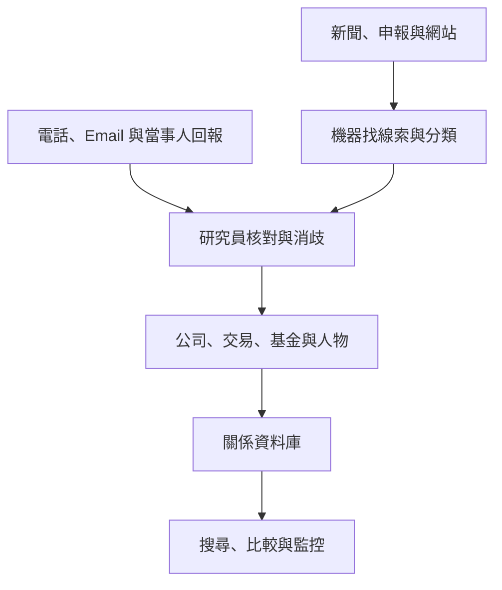
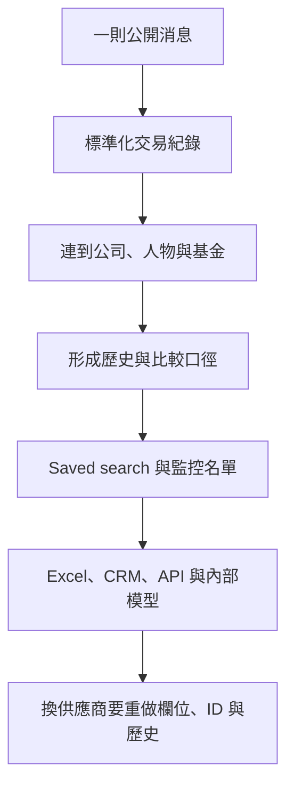
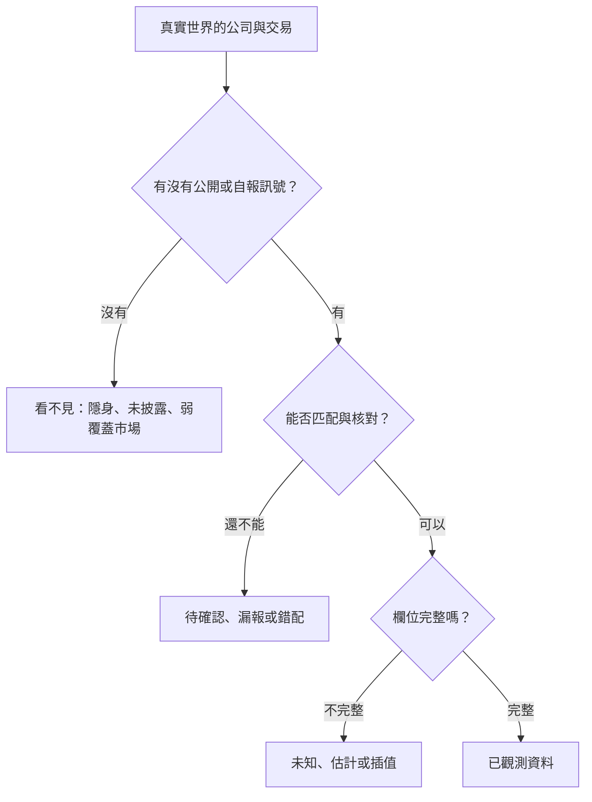

> 🌏 [English version](/en/posts/product/2026-09-17-pitchbook-private-market-data-en)

想像老師要做一張全校座位表，手上卻只有活動照片、零散點名單，以及學生自己填的資料。電腦可以先猜「照片裡的 Amy 是否就是點名單上的 Amy」，再交給人核對。確認身分後，還要記下她在哪一班、參加哪個社團，以及何時轉班。

[PitchBook](https://pitchbook.com/) 做的是私人市場版本。私人公司不必像上市公司一樣持續揭露財務，投資案也可能幾個月後才公開。PitchBook 從新聞、申報、公司網站與當事人回報撿線索，再由研究團隊核對。最後，公司、交易、基金、投資人、有限合夥人和人物會被接成一張關係網。

這份名錄必須能直接拿去找案、盡調、比較基金、做簡報與更新內部系統，才值得企業付費。資料一旦進入 Excel 模型、CRM 和資料倉儲，改用別家就不只是換網站，還得重做欄位、識別碼與歷史口徑。

## 機器先找線索，人再決定能不能入庫

依 [PitchBook 的研究流程](https://pitchbook.com/help/pitchbook-research-process)，資料有兩條入口。次級研究收集新聞與新聞稿等公開資訊；初級研究則透過電話和 Email，直接向被追蹤實體的相關人士補資料。發現線索後，團隊先判斷實體是否符合追蹤範圍，再建立 profile，之後持續修訂。

這不是「AI 自動抓完，資料就是真的」。機器學習與自然語言處理協助找資料、分類和濾掉無關訊號，研究員負責消歧、補欄位與品質檢查。公司同名、基金改名、投資人轉職或同一輪融資有不同報導時，真正費工的是判斷它們是不是同一件事。

人工驗證會把來源不同、格式不同的資訊放進一致結構，但無法消滅不確定性。這也是它跟一般搜尋引擎的分界：搜尋引擎幫你找到頁面，PitchBook 試圖告訴你頁面裡提到的公司、交易與投資人如何互相連接。

## 資料要能進工作，才會進企業預算

PitchBook 的[官方使用情境](https://pitchbook.com/use-cases)從 deal sourcing、due diligence、fundraising，一路延伸到 benchmarking、business development、asset allocation 與 portfolio management。不同角色看的欄位不一樣，卻共享同一組實體與關係。

| 付款者 | 想完成的工作 | 資料如何縮短路徑 |
|---|---|---|
| VC／PE | 找標的、看融資史、比較同業 | 從條件篩選直接形成候選清單 |
| 投資銀行／顧問 | 找買方與標的、做 precedent transactions | 讓交易、人員與公司資料進模型和簡報 |
| LP／資產配置團隊 | 找基金經理、比較基金與曝險 | 用同一分類與基準整理分散報告 |
| Corporate development | 找併購標的、畫競爭地圖 | 把市場監控變成可更新名單 |
| 資料與 AI 團隊 | 更新 CRM、資料倉儲與內部模型 | 透過 API 或 Data Feed 持續取用 |

平台是入口，不是終點。[官方定價頁](https://pitchbook.com/pricing)列出 Mobile、Excel、PowerPoint 與 Chrome extension，也把 Direct Data 和 CRM Integration 列為額外產品。價格沒有公開固定牌價，而是依席次、公司類型與加購項目報價；因此，網路流傳的年度費用不能當成可驗證牌價。

[Direct Data](https://pitchbook.com/products/direct-access-data)把黏著度再往下推一層。客戶可以按需呼叫 API，或定期取得 `.dat`、`.csv`、Parquet 和資料表格式的 feed，把 companies、deals、investors 與 funds 送進自己的系統。到了這一步，PitchBook 不只跟瀏覽器書籤競爭，也成為下游報表、模型與自動化的上游依賴。

## 真正的護城河不是單筆資料，而是搬家成本

一則融資新聞很容易被轉述。難搬的是它在多年資料裡的位置：這家公司過去拿過哪些投資、投資人還投過誰、同產業交易怎麼定價、相關人物目前在哪裡。

這裡比較適合說「資料飛輪」，不宜輕易稱為強網路效應。資料變多後，新訊號確實比較容易匹配既有實體；收入也能再投入研究與品質管理。客戶還可能提交修正，但 PitchBook 沒有公開客戶回饋替資料庫增加多少內容。

切換成本也不是人人都一樣。高頻做交易、建立大量 saved searches，或把 API 接進內部系統的團隊最難搬；一年只查幾次公司的小型企業，很可能在續約時放棄。Morningstar 的 [2025 年財務結果](https://newsroom.morningstar.com/news/news-details/2026/Morningstar-Inc--Reports-Fourth-Quarter-Full-Year-2025-Financial-Results/default.aspx)便指出，PitchBook 的核心投資人與顧問客群仍成長，企業客群尤其用途有限的小公司持續疲弱。

## 從 3,110 萬美元走到 6.718 億美元

Morningstar 在 2016 年宣布收購時，已持有 PitchBook 約 20% 股權，準備以約 1.8 億美元買下其餘權益，整體估值 2.25 億美元。當時 PitchBook 過去十二個月營收為 3,110 萬美元。這些數字同時見於 [PitchBook 刊登的官方公告](https://pitchbook.com/media/press-releases/morningstar-to-acquire-pitchbook-data)與 [GeekWire 當日報導](https://www.geekwire.com/2016/morningstar-agrees-buy-remaining-stake-venture-capital-data-provider-pitchbook-180-million/)。後者的交易資料源自官方公告，算是交叉確認發布內容，不是第二套獨立帳簿。

到 2024 年，PitchBook 已是一個有三成調整後營業利益率的分部。[Morningstar 2025 年結果](https://newsroom.morningstar.com/news/news-details/2026/Morningstar-Inc--Reports-Fourth-Quarter-Full-Year-2025-Financial-Results/default.aspx)在比較欄重列前一年資料，也提供最新年度數字；2024 數字還能在 [Morningstar 當年度財務結果](https://newsroom.morningstar.com/news/news-details/2025/Morningstar-Inc--Reports-Fourth-Quarter-Full-Year-2024-Financial-Results/default.aspx)核對。

| 年度 | 分部營收 | 年增率 | 調整後營業利益 | 調整後營業利益率 |
|---|---:|---:|---:|---:|
| 2024 | 6.184 億美元 | 12.0% | 1.864 億美元 | 30.1% |
| 2025 | 6.718 億美元 | 8.6% | 2.101 億美元 | 31.3% |

兩個端點相差約九年，名目營收端點約為原本的 21.6 倍。不過，這不能全算成原產品自然成長：期間有 Morningstar 資源、產品擴張，以及 [LCD 信貸資料移轉](https://newsroom.morningstar.com/news/news-details/2026/Morningstar-Inc--Reports-Fourth-Quarter-Full-Year-2025-Financial-Results/default.aspx)。更值得注意的是，2025 年營收增幅為 8.6%，低於 2024 年的 12.0%。資料庫可以很黏，仍得持續證明用途。

## 私人市場的空白，不會因為買了資料庫就消失

PitchBook 最容易被誤讀成「私人市場的完整真相」。它的[報告方法頁](https://pitchbook.com/news/pitchbook-report-methodologies)反而清楚說明資料會缺、會晚，也會估。

私人交易常在發生很久後才被發現。因此，最近四季的 deal count 會依過去遲報模式估計，之後再隨新資料回修。部分未公開的 PE 與 M&A 交易金額也會用模型外推。基金報酬主要來自個別 LP 報告；同一基金的不同 LP 可能因費用、承諾時間和共同投資而得到不同結果，缺少的期間還可能以插值補上。

所以，用 PitchBook 畫趨勢時，至少要問三件事：數字是 reported 還是 estimated、最近季度會不會繼續回修、不同年份是否使用相同定義。若公司沒有留下公開痕跡、沒有接受機構投資，或位於較少公開揭露、非主流語言的市場，使用者還要另外檢查 coverage 是否足夠。這是從資料來源結構推導出的風險，不是 PitchBook 公布的區域稽核結果。人工驗證能修正錯配，不能證明母體毫無缺口。

## AI 把查詢變簡單，也把資料品質放大

[PitchBook Navigator](https://pitchbook.com/products/navigator)讓使用者用自然語言找公司、交易與市場趨勢，還能用提示建立 screener。這降低了學習複雜篩選器的成本，也讓平台的介面更容易被使用。

[VC Exit Predictor](https://pitchbook.com/help/understanding-vc-exit-predictor)則把歷史資料包成 IPO、M&A 或沒有 exit 的機率，適用於近六年內至少完成兩輪創投融資、目前仍有創投支持的公司。PitchBook 自評模型在 12,000 家公司的測試中有 75% 準確率。官方沒有在該頁提供外部重現、類別分布或 precision／recall，所以這只能當成公司自己的產品指標，不能拿來保證單一公司的結果，也不能外推到所有私人公司。

AI 對 PitchBook 是雙面刃。自然語言可以讓傳統資料介面變得更不稀奇；大型客戶也能把多家 feed 和自己的 deal flow 接進內部模型。反過來說，通用模型並不會自動擁有合法、即時又已消歧的私人市場資料。AI 愈容易生成答案，能追溯來源、持續更新的資料底座反而愈重要。

## 整體來說

PitchBook 證明，產業情報走到最深處，賣的可以不再是文章，甚至不只是資料庫。它先用機器擴大發現範圍，再用研究員建立可信結構，最後把結構塞進企業每天使用的工具。

這套模式最適合高頻做投資、交易、研究或市場監控的團隊。一年只查幾家公司，公開搜尋與單次研究可能更划算。資料若已經驅動名單、模型、簡報和內部系統，年度合約買到的就是少重做一次整套工作。

它真正提供的也不是「永遠正確」。私人市場不透明，任何資料商都只能在缺漏中工作。PitchBook 收費的理由，是把來源、估計、關係和回修變成一套可以反覆使用的做法，讓不確定性比較容易管理。

## 參考資料

- [PitchBook：Research Process](https://pitchbook.com/help/pitchbook-research-process)
- [PitchBook：Solutions and Use Cases](https://pitchbook.com/use-cases)
- [PitchBook：Pricing](https://pitchbook.com/pricing)
- [PitchBook：Direct Data](https://pitchbook.com/products/direct-access-data)
- [PitchBook：Report Methodologies](https://pitchbook.com/news/pitchbook-report-methodologies)
- [PitchBook：Navigator](https://pitchbook.com/products/navigator)
- [PitchBook：VC Exit Predictor](https://pitchbook.com/help/understanding-vc-exit-predictor)
- [PitchBook／Morningstar：2016 Acquisition Announcement](https://pitchbook.com/media/press-releases/morningstar-to-acquire-pitchbook-data)
- [GeekWire：Morningstar Agrees to Buy Remaining PitchBook Stake](https://www.geekwire.com/2016/morningstar-agrees-buy-remaining-stake-venture-capital-data-provider-pitchbook-180-million/)
- [Morningstar：2024 Full-Year Financial Results](https://newsroom.morningstar.com/news/news-details/2025/Morningstar-Inc--Reports-Fourth-Quarter-Full-Year-2024-Financial-Results/default.aspx)
- [Morningstar：2025 Full-Year Financial Results](https://newsroom.morningstar.com/news/news-details/2026/Morningstar-Inc--Reports-Fourth-Quarter-Full-Year-2025-Financial-Results/default.aspx)
