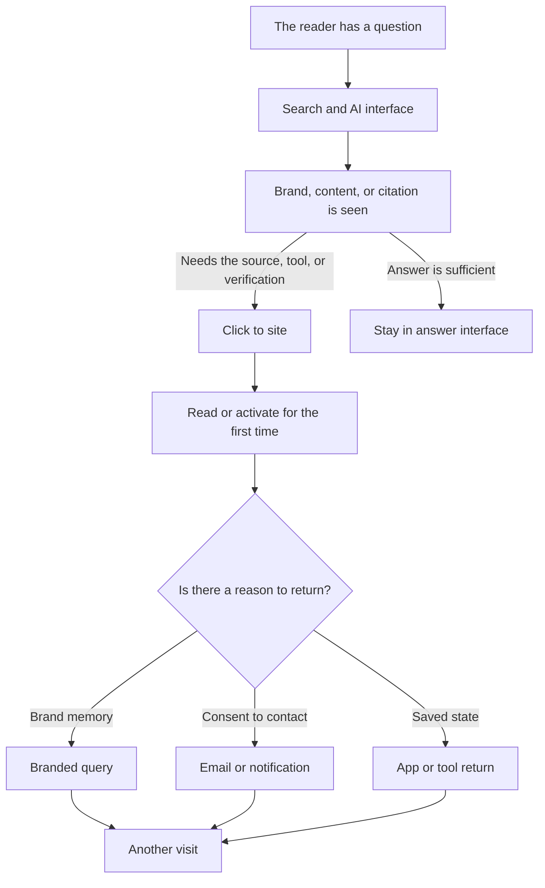
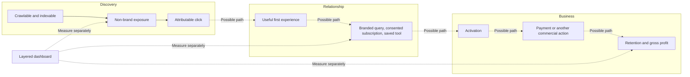

> 🌏 [中文版](/posts/product/2026-09-17-seo-to-brand-direct)

Imagine running a shop inside a large mall. SEO is the directory that sends someone searching for “hiking shoes for rainy weather” to your counter. Direct brand demand begins when a customer remembers the shop's name and later searches for it, opens its app, or returns to a saved tool.

AI search has not demolished the mall or removed the directory. It has added a concierge at the entrance. The concierge may answer the question first and then decide whether the visitor still needs the shop. A publisher can be seen or cited without receiving a visit.

The change is not “SEO is dead.” It is that rankings, clicks, and revenue can no longer be treated as one event. SEO still manages discoverability. Direct brand demand asks a different question: **can the reader return without competing for the same generic query every time?**

## One funnel has become two paths

“Brand seen” does not guarantee memory, and first activation does not guarantee a return. Every arrow needs measurement. The diagram makes one narrower point: search exposure can serve two jobs—winning today's click and creating a chance that the brand is remembered later.

[Google's official guidance for AI features](https://developers.google.com/search/docs/appearance/ai-features) does not support an SEO death narrative. To appear as a supporting link in AI Overviews or AI Mode, a page still needs to be indexed, eligible for Search, and allowed to show a snippet. Google says the existing SEO fundamentals continue to apply. Discoverability remains necessary; it simply does not guarantee a click.

## Direct brand demand is not the Direct channel

A common analytical mistake is to see Direct traffic rise and declare that the brand is stronger. [Google Analytics' official explanation of `(direct) / (none)`](https://support.google.com/analytics/answer/15258820?hl=en) describes traffic with no clear referral source. It can include typed URLs and bookmarks, but also links without campaign parameters, redirects that lose information, and apps that do not pass a referrer. [Google Analytics' configuration reference](https://developers.google.com/analytics/devguides/collection/ga4/reference/config) shows that page referrer and campaign source and medium feed traffic-source identification.

Direct brand demand is therefore a pattern across several behaviors, not one channel label.

| Metric | What it can answer | What it cannot prove alone |
|---|---|---|
| Search impression or AI citation | The content or brand had a chance to be seen | A person visited, remembered, or purchased |
| Non-brand organic click | Generic demand produced an attributable visit | The visitor will return directly |
| Branded query | Someone actively searched with a brand term | Which article caused it or whether the searcher is new |
| Direct returning users | A set of returning visits has no clear source | Every visit came from a typed URL or brand loyalty |
| Newsletter or push activation | A user consented to and activated another entrance | The user will keep opening or eventually pay |
| Saved-tool usage | A user returned to state or a job | The tool caused long-term retention |
| Conversion and retention cohort | What people from an entrance did later | Article-level causality without a sound attribution design |

The table also shows why direct brand demand is not free traffic. Brand memory costs product delivery, editorial quality, service, tool maintenance, and repeated contact. Its advantage is narrower: the next interaction does not depend entirely on winning the same non-brand ranking again.

## Even AI traffic measurement has blind spots

[Google's documentation](https://developers.google.com/search/docs/appearance/ai-features) includes performance from AI Overviews and AI Mode inside Search Console's overall Web search traffic. A site owner can observe total Search performance, but cannot use that report alone to isolate the complete contribution of each AI surface.

[Cloudflare's crawl-to-refer ratio](https://blog.cloudflare.com/ai-search-crawl-refer-ratio-on-radar/) observes the issue from the supply side. It divides platform-associated HTML crawler requests by HTML visits with an identifiable platform `Referer`. Cloudflare notes that native apps may omit the header, which can overstate the ratio by an unknown amount. The metric shows that crawling and attributable referrals are different events. It is not CTR, nor a direct estimate of any publisher's traffic loss.

## Do not replace SEO; give it a next step

Differences across layers are associations to test, not causal effects established by this diagram.

An operator can build a three-layer dashboard. The discovery layer tracks non-brand queries, indexing, and landing pages. The relationship layer tracks branded queries, qualified subscriptions, notification activation, and saved tools. The business layer tracks conversion, gross profit, and cohort retention. Do not turn impressions into estimated revenue or let the last click claim all prior influence.

A practical first step is to take one cohort of new customers from the past three months. Record the first attributable entrance, later use of a brand term, activation of email, app, or tool, and the point of payment. The data will be incomplete. Keep “unknown source” unknown instead of relabeling it as brand.

SEO's new role is not to step aside for direct brand demand. It still helps strangers discover the business, helps search systems understand it, and may place its content inside AI answers. Direct brand demand carries the next leg: giving one exposure a reason to become a voluntary return. The two are an entrance portfolio, not a contest between old and new technology.

## References

- [Google Search Central: AI features and your website](https://developers.google.com/search/docs/appearance/ai-features)
- [Google Search Central: SEO Starter Guide](https://developers.google.com/search/docs/fundamentals/seo-starter-guide)
- [Google Analytics: Understand (direct) / (none) traffic](https://support.google.com/analytics/answer/15258820?hl=en)
- [Google Analytics: Traffic-source configuration fields](https://developers.google.com/analytics/devguides/collection/ga4/reference/config)
- [Cloudflare: The crawl before the fall of referrals](https://blog.cloudflare.com/ai-search-crawl-refer-ratio-on-radar/)
