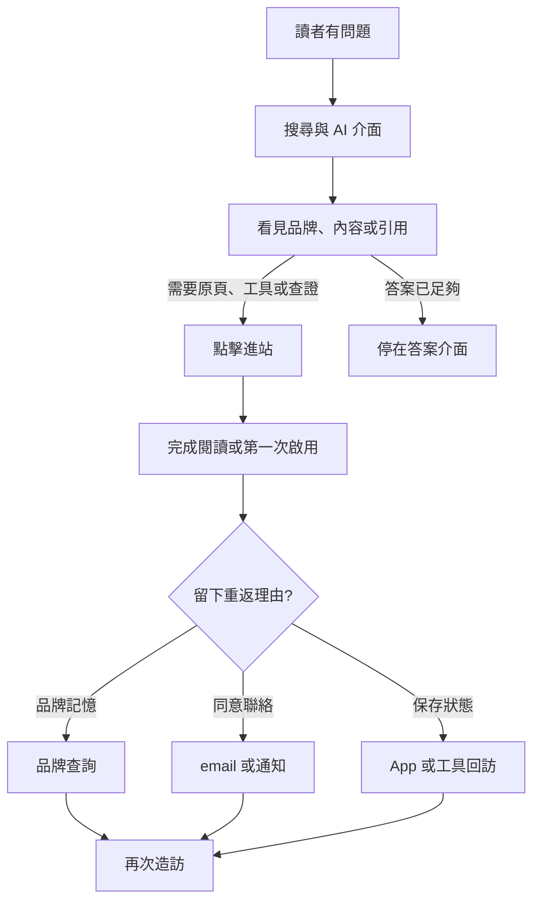
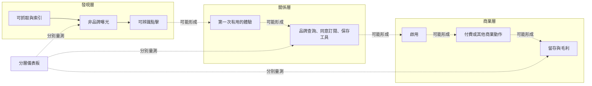

> 🌏 [English version](/en/posts/product/2026-09-17-seo-to-brand-direct-en)

想像你在一座大商場擺攤。SEO 像樓層指示牌：有人搜尋「適合雨天的登山鞋」，指示牌把他帶到你的櫃位。品牌直達則像熟客記得店名，下次會搜尋你的品牌、打開 App，或從收藏的工具回來。

AI 搜尋沒有拆掉商場，也沒有讓指示牌消失。它比較像在入口多了一位導購員：先回答問題，再決定要不要把人帶到櫃位。發布者可能被看見、被引用，卻沒有拿到一次造訪。

所以真正的變化不是「SEO 已死」。而是內容生意不能再把排名、點擊與收入當成同一件事。SEO 繼續處理可發現性；品牌直達要處理的是：**讀者下次能不能在不重新競標同一個泛用關鍵字的情況下回來？**

## 入口從一條漏斗變成兩條路

圖中的「看見品牌」不保證形成記憶，「第一次啟用」也不保證回訪。每一條箭頭都要量測。它只說明：搜尋曝光可以同時服務兩件事——拿到當次點擊，以及建立未來可能被直接想起的品牌。

[Google 對 AI features 的官方說明](https://developers.google.com/search/docs/appearance/ai-features)也不支持「SEO 死亡論」。頁面要成為 AI Overviews 或 AI Mode 的 supporting link，仍須先被索引、符合 Search 技術要求並可顯示 snippet；官方也說既有 SEO fundamentals 仍適用。SEO 的工作還在，只是被找到不等於一定取得點擊。

## 品牌直達不是 Analytics 裡的 Direct

最常見的誤判，是看到 Direct 流量成長，就宣布品牌變強。[Google Analytics 對 `(direct) / (none)` 的官方說明](https://support.google.com/analytics/answer/15258820?hl=en)指出，它代表沒有清楚 referral source 的流量。其中可能有手打網址與書籤，也可能是連結缺少活動參數、redirect 遺失資訊，或 App 沒送 referrer。[Google Analytics 的技術文件](https://developers.google.com/analytics/devguides/collection/ga4/reference/config)也顯示 page referrer 與 campaign source／medium 都會參與流量來源辨識。

因此，品牌直達不是某一個 channel label，而是一組可交叉觀察的行為。

| 指標 | 能回答什麼 | 不能單獨證明什麼 |
|---|---|---|
| Search impression／AI citation | 內容或品牌有機會被看見 | 讀者有進站、記住或購買 |
| 非品牌 organic click | 泛用需求帶來多少可辨識點擊 | 這些人日後會直接回來 |
| 品牌查詢 | 有人主動用品牌詞找你 | 是哪篇內容造成、查詢者是否為新客 |
| Direct returning users | 一批無清楚來源的回訪 | 全部都是手打網址或品牌忠誠 |
| Newsletter／push activation | 使用者同意並真的啟用另一入口 | 一定會持續開啟或付費 |
| Saved tool usage | 有人回來取用保存狀態或完成工作 | 工具本身造成長期留存 |
| Conversion／retention cohort | 某入口帶來的人之後做了什麼 | 沒有合理歸因設計時的單篇因果 |

這張表也提醒一件事：品牌直達不是「免費流量」。品牌記憶要靠產品交付、內容品質、客服、工具維護與持續觸達累積。只是它讓下一次互動不必完全依賴同一個非品牌排名。

## AI 流量目前連量測都有缺口

[Google 官方說明](https://developers.google.com/search/docs/appearance/ai-features)將 AI Overviews 與 AI Mode 帶來的網站表現納入 Search Console Performance 的整體 Web search traffic。這讓站長能看到總體搜尋表現，卻無法只靠這張報表完整拆出每種 AI 介面的獨立貢獻。

[Cloudflare 的 crawl-to-refer ratio](https://blog.cloudflare.com/ai-search-crawl-refer-ratio-on-radar/)從另一側觀察問題：它以平台相關的 HTML crawler requests，除以帶有可辨識 `Referer` 的 HTML visits。Cloudflare 也提醒，原生 App 可能不送 `Referer`，使比率偏高且幅度未知。因此這個指標能說明抓取與可辨識導流並非同一事件，不能當 CTR，更不能直接算成某家網站的流量損失。

## 不要把 SEO 換掉，要替它接下一棒

跨層差異是待驗證的關聯，不是這張圖已證明的因果。

經營者可以把儀表板拆成三層：發現層看非品牌 query、索引與 landing page；關係層看品牌 query、合格訂閱、通知啟用與保存工具；商業層看 conversion、毛利與 cohort retention。不要把 impression 折算成收入，也不要讓最後點擊吃掉前面所有功勞。

今晚就能做的動作，是從近三個月的新客戶選一個 cohort，標記首次可辨識入口、是否在之後使用品牌詞、是否啟用 email／App／工具，以及何時完成付費。資料不必完美；先把「未知來源」留成未知，而不是全塞進品牌。

SEO 的新角色不是替品牌直達讓路。它仍幫陌生人發現你、幫搜尋系統理解你，也可能讓內容進入 AI 答案。品牌直達接的是下一棒：讓一次曝光有機會變成下次主動回來的理由。兩者是入口組合，不是新舊技術的淘汰賽。

## 參考資料

- [Google Search Central：AI features and your website](https://developers.google.com/search/docs/appearance/ai-features)
- [Google Search Central：SEO Starter Guide](https://developers.google.com/search/docs/fundamentals/seo-starter-guide)
- [Google Analytics：Understand (direct) / (none) traffic](https://support.google.com/analytics/answer/15258820?hl=en)
- [Google Analytics：Traffic-source configuration fields](https://developers.google.com/analytics/devguides/collection/ga4/reference/config)
- [Cloudflare：The crawl before the fall of referrals](https://blog.cloudflare.com/ai-search-crawl-refer-ratio-on-radar/)
