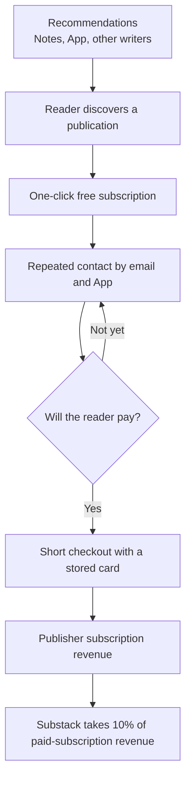
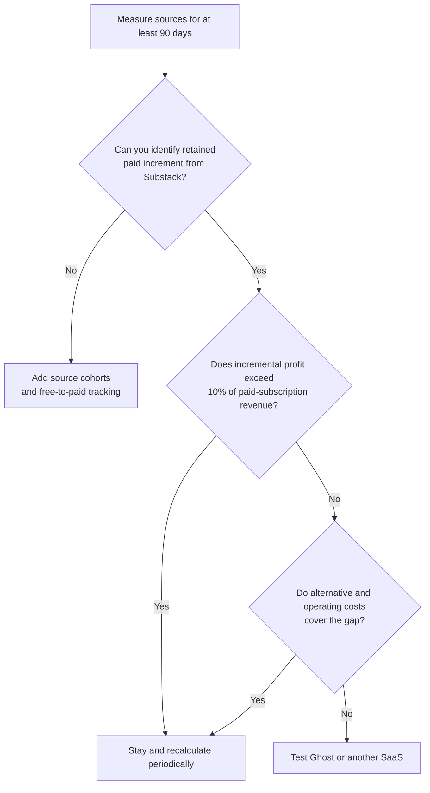
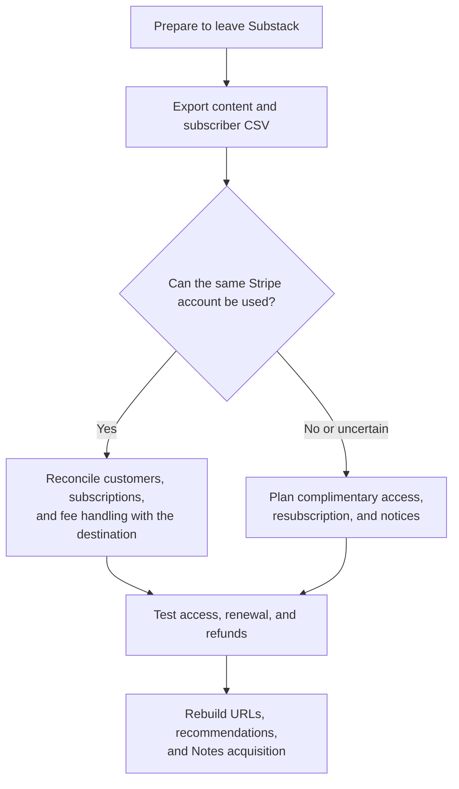

> 🌏 [中文版](/posts/product/2026-09-17-substack-ten-percent-discovery)

Imagine a market that brings customers to its vendors. Instead of fixed rent, it takes 10% from every bowl of noodles—including sales to regulars the vendor brought from home. The market's foot traffic, membership card, and saved payment details can make buying easier. Whether the fee is worthwhile still depends on how many additional customers stay, not on how crowded the stall looks today.

[Substack](https://substack.com/) is that kind of market. Creators can publish and send newsletters for free. Once they enable paid subscriptions, the platform takes 10% of subscription revenue. The fee buys more than hosting: payments, subscription management, recommendations between writers, App and Notes distribution, and a shorter checkout path for readers with stored payment details.

The useful question is not whether 10% is high or low. It is how much retained revenue those capabilities add to a specific publication and which alternative costs they replace. Two publishers can reach opposite answers.

## The 10% buys a conversion chain

[Substack's payment setup documentation](https://support.substack.com/hc/en-us/articles/4405482746132-How-do-I-set-up-my-Stripe-account-on-Substack-to-start-receiving-payments) states the 10% platform fee, and [Axios independently reported the same rate in 2025](https://www.axios.com/2025/07/17/substack-newsletter-funding-creator-economy). Stripe payment and billing fees are separate; purchases inside the iOS app may also incur an Apple fee. “The creator keeps 90%” is therefore incomplete accounting.

The product is designed to create this flywheel:



This diagram describes a product mechanism, not a proven causal effect for every writer. Recommendations, the App, Notes, guest posts, and mentions may introduce readers. Email and paywalls create repeated conversion opportunities. Stripe Connect handles payments, verification, and payouts. A publisher's own acquisition and retention data must show which steps create incremental revenue.

## The 25–30% figure is company-reported, with conflicting definitions

Substack has published figures for paid subscriptions attributed to its network. They should not be drawn as one clean growth line.

| Date | Public claim | Actual definition | What it supports |
|---|---|---|---|
| 2022 | About 10% of paid subscriptions came from the network | Entire network; earlier product | A historical company-reported baseline |
| 2024 | Recommendations drove 25% of new paid subscriptions | New paid subscriptions; one feature | Recommendations had become important, not independently audited |
| 2025 | The network drove 30% of paid subscriptions | Co-founder interview; cohort undisclosed | Latest company claim, not transferable to one writer |
| Current growth page | The network drives 25% of paid subscriptions | Measurement period undisclosed | May differ from 2025 because of version or denominator |

[Substack's 2022 post](https://on.substack.com/p/substack-generates-1-in-3-new-subscriptions), its [current growth page](https://substack.com/growthfeatures), [TechCrunch's 2024 report](https://techcrunch.com/2024/02/22/substack-now-lets-writers-curate-a-network-of-recommended-publications-for-their-subscribers/), and a [2025 Hollywood Reporter interview](https://www.hollywoodreporter.com/business/business-news/substack-number-subscribers-video-trump-1236158048/) use different features, periods, and denominators. The media reports establish when the claims were made, but the numbers still originate with the company or a co-founder rather than an independent audit.

The defensible conclusion is narrower: Substack reports that its network produces roughly one-quarter to three-tenths of paid subscriptions. Public evidence does not reconstruct the measurement or establish the same increment for an individual publisher, particularly one writing in Traditional Chinese.

## You cannot subtract 10% from 25%

“The network drives 25% of paid subscriptions” does not imply a 15% net benefit after the platform fee. Network share measures subscriber source; the platform fee applies to all paid revenue. Prices, retention, refunds, and readers who would have converted anyway all change the answer.

Define four variables:

- `R0`: annual subscription revenue available without Substack.
- `ΔR`: incremental annual revenue created by Substack's network, payment conversion, and operating convenience.
- `C_alt`: annual cost of the alternative platform.
- `C_ops`: additional annual email, payment, support, legal, and development cost outside Substack.

Before differences in Stripe, Apple, taxes, and refunds, the model for the net benefit of staying is:

```text
ΔR - 0.10 × (R0 + ΔR) + C_alt + C_ops
```

The break-even condition is:

```text
0.90 × ΔR > 0.10 × R0 - C_alt - C_ops
```

| Scenario | `R0` | `ΔR` | 10% platform fee | Result before alternative and operating cost |
|---|---:|---:|---:|---:|
| Starting from zero; increment is the main revenue | 0 | 10,000 | 1,000 | +9,000 |
| Existing revenue plus one new cohort | 50,000 | 10,000 | 6,000 | +4,000 |
| Mature list with the same new cohort | 100,000 | 10,000 | 11,000 | -1,000 |
| High revenue without proportional increment | 500,000 | 25,000 | 52,500 | -27,500 |

The amounts are unit-based scenarios for the formula, not dollar forecasts or promises of Substack revenue. Adding `C_alt` and `C_ops` can turn a negative result positive. Poor retention can erase a positive result.



## Exportable email is not an exportable business

The [Substack subscriber dashboard](https://support.substack.com/hc/en-us/articles/360058529871-How-do-I-use-the-subscriber-dashboard-on-Substack) can export all subscribers or a filtered segment as CSV, using all fields or the currently displayed columns. Posts and related publication data also have an official export. Content and email are therefore relatively portable, but formatting, URLs, comments, Notes relationships, and platform recommendations do not move intact.

Paid subscriptions have a more conditional answer. The common claim that every reader must re-enter a card is too absolute. [Ghost's Substack migration guide](https://ghost.org/docs/migration/substack/) says paid memberships can move when conditions are met and the same Stripe account is used. [Platformer's migration announcement](https://www.platformer.news/why-platformer-is-leaving-substack/) likewise said existing subscribers did not need to act.

“The same Stripe account” does not mean zero friction. Ghost's documentation warns that Substack's 10% fee on old subscriptions may require separate coordination to remove. If a publisher directly disables paid subscriptions in Substack, [Substack says](https://support.substack.com/hc/en-us/articles/360060408872-How-do-I-turn-off-paid-subscriptions-on-Substack) existing subscriptions are canceled and prorated refunds are issued. The accurate boundary is that payment migration depends on the Stripe account, source platform, destination, and support process. It requires more than an email CSV, but it does not always require every reader to re-enter a card.



## Platformer shows that two things can be true

Casey Newton announced Platformer's departure from Substack in 2024. His first-party post said the publication's free audience had grown substantially in the prior year and attributed some of that growth to Substack's recommendation and network tools. Because the exact figure lacks a second fully readable independent source, this article keeps only the narrower conclusion: platform distribution provided real value to Platformer.

The same publication still moved to Ghost. As an established publication's existing revenue grows, a 10% cost grows with it; brand, content governance, and control may also receive more weight. This does not prove that every mature writer should leave. It shows that one platform can produce different answers at the launch and mature stages.

## The largest unknown for Traditional Chinese publishers is network density

Substack's recommendation flywheel needs readers already on the platform, adjacent writers willing to recommend one another, and enough same-language content to continue exploring. This research found no network-share cohort for Traditional Chinese or Taiwan, so the platform-wide 25–30% cannot be transferred to that market.

Taiwan-based creators must also verify Stripe availability, cross-border card success, refunds, taxes, and invoicing. Multi-currency payment support does not establish that Substack handles every Taiwan-specific obligation.

The smallest useful test runs for 90 days. Separate direct, Google, social, Substack App, and Recommendations acquisition. For each source, record free-to-paid conversion, 90-day retention, and refunds. If the dashboard cannot answer, add campaigns, UTMs, or staged invitations. Without a creator's own cohort, there is no creator-specific answer to the 10% question.

## AI changes the questions, not the proven answer

Generative AI lowers the cost of supplying content and may raise quality and trust costs for a recommendation network. A [WIRED sample of popular Substack publications](https://www.wired.com/story/substacks-writers-use-ai-chatgpt/) found that some used AI, but detectors can be wrong and the sample cannot estimate a platform-wide share. [Substack's Content Guidelines](https://substack.com/content) address plagiarism, spam, phishing, and inauthentic activity; they do not remove all AI-generated content solely because AI was used.

AI search may also intercept some open-web clicks. In a [2025 Pew sample of U.S. Google users](https://www.pewresearch.org/short-reads/2025/07/22/google-users-are-less-likely-to-click-on-links-when-an-ai-summary-appears-in-the-results/), traditional-result clicks were lower when an AI summary appeared. That supports the direction of building a direct email relationship. It does not prove that AI has raised Substack paid conversion or made the 10% fee more valuable.

The final decision is straightforward: treat the 10% as an acquisition and operations expense that scales with paid-subscription revenue, then recalculate it each quarter using incremental revenue, retention, and replacement costs. Substack's network can be a real product advantage. Until a publisher's own data appears, it is not a guaranteed return.

## References

- [Substack: Stripe setup, platform fee, and payments](https://support.substack.com/hc/en-us/articles/4405482746132-How-do-I-set-up-my-Stripe-account-on-Substack-to-start-receiving-payments)
- [Substack: Subscriber dashboard and CSV export](https://support.substack.com/hc/en-us/articles/360058529871-How-do-I-use-the-subscriber-dashboard-on-Substack)
- [Substack: Disable paid subscriptions](https://support.substack.com/hc/en-us/articles/360060408872-How-do-I-turn-off-paid-subscriptions-on-Substack)
- [Substack: 2022 self-reported network share](https://on.substack.com/p/substack-generates-1-in-3-new-subscriptions)
- [Substack: Growth features](https://substack.com/growthfeatures)
- [Axios: Substack's 10% and 2025 funding](https://www.axios.com/2025/07/17/substack-newsletter-funding-creator-economy)
- [TechCrunch: The 2024 Recommendations network](https://techcrunch.com/2024/02/22/substack-now-lets-writers-curate-a-network-of-recommended-publications-for-their-subscribers/)
- [Hollywood Reporter: A 2025 Substack network interview](https://www.hollywoodreporter.com/business/business-news/substack-number-subscribers-video-trump-1236158048/)
- [Ghost: Migrating from Substack](https://ghost.org/docs/migration/substack/)
- [Platformer: Why Platformer is leaving Substack](https://www.platformer.news/why-platformer-is-leaving-substack/)
- [WIRED: Substack writers and AI](https://www.wired.com/story/substacks-writers-use-ai-chatgpt/)
- [Substack: Content Guidelines](https://substack.com/content)
- [Pew Research Center: AI summaries and search clicks](https://www.pewresearch.org/short-reads/2025/07/22/google-users-are-less-likely-to-click-on-links-when-an-ai-summary-appears-in-the-results/)
