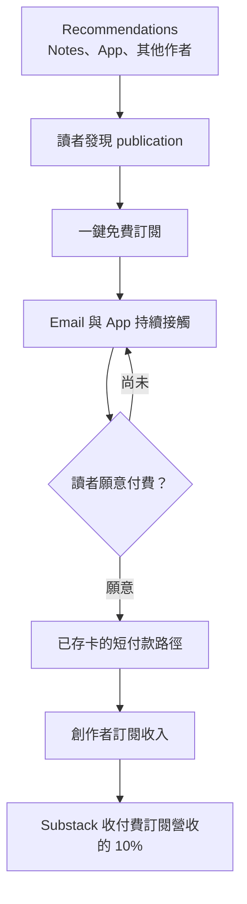
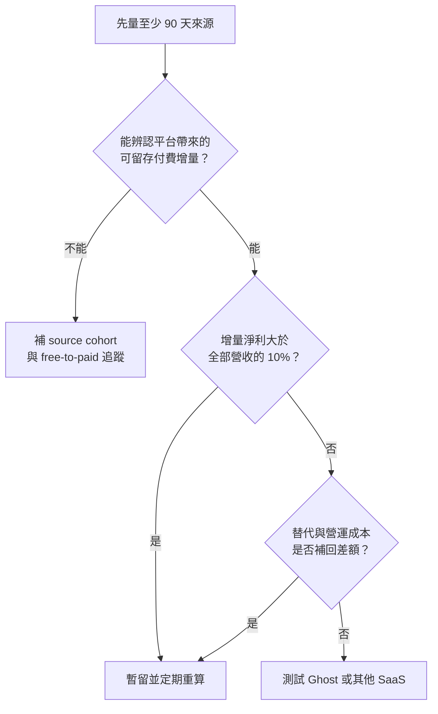
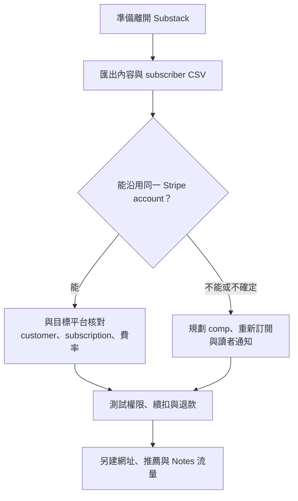

> 🌏 [English version](/en/posts/product/2026-09-17-substack-ten-percent-discovery-en)

想像一座會替攤商拉客的市集。它不收固定租金，而是每碗麵都抽 10%，包括老闆自己從家鄉帶來的熟客。市集提供人潮、會員卡與存好的信用卡，陌生人確實更容易下單；但要判斷划不划算，得數市集新增了多少會留下來的客人，不能只看今天攤位前有多少人。

[Substack](https://substack.com/) 就是這種市集。創作者可以免費發文與寄 newsletter，開啟付費訂閱後，平台從訂閱收入收取 10%。這筆錢買的不只是主機，還包含收款、訂閱管理、作者互薦、App 與 Notes 分發，以及讀者已儲存付款方式所縮短的轉換路徑。

問題不在「10% 很高或很低」，而在這些能力替某一份 publication 增加多少可留存收入，又省下多少替代成本。兩個作者的答案可能完全相反。

## 10% 買到的是一條轉換鏈

[Substack 的付款設定文件](https://support.substack.com/hc/en-us/articles/4405482746132-How-do-I-set-up-my-Stripe-account-on-Substack-to-start-receiving-payments)明載 10% 平台費，[Axios 2025 年的報導](https://www.axios.com/2025/07/17/substack-newsletter-funding-creator-economy)也獨立確認這個費率。Stripe 的付款與 billing 費用另計；iOS app 內付款還可能有 Apple 費用。因此「創作者實拿 90%」不是完整算法。

平台想建立的飛輪長這樣：



這張圖是產品機制，不是每位作者都已驗證的因果效果。Recommendations、App、Notes、guest posts 與 mentions 可能讓新讀者進場；寄信與付費牆讓作者持續轉換；Stripe Connect 則處理付款、身分驗證與 payout。哪一段真正增加收入，要回到作者自己的來源與留存資料。

## 25–30% 是公司自報，而且口徑互相打架

Substack 確實公開過 network 帶來付費訂閱的數字，但不能把它們畫成同一條漂亮的成長曲線。

| 時點 | 公開說法 | 實際口徑 | 能支持的結論 |
|---|---|---|---|
| 2022 | 約 10% paid subscriptions 來自 network | 整體 network；早期產品 | 歷史公司自報基準 |
| 2024 | 25% new paid subscriptions 來自 Recommendations | 新付費訂閱；單一功能 | 推薦已是重要來源，但未經獨立稽核 |
| 2025 | 30% paid subscriptions 來自 network | 共同創辦人受訪說法；cohort 未公開 | 最新公司說法，不能套到單一作者 |
| 現行 growth page | 25% paid subscriptions 由 network 帶來 | 未標統計期間 | 與 2025 的 30% 可能是版本或分母差異 |

[Substack 2022 年官方文章](https://on.substack.com/p/substack-generates-1-in-3-new-subscriptions)、[現行 growth page](https://substack.com/growthfeatures)、[TechCrunch 2024 年報導](https://techcrunch.com/2024/02/22/substack-now-lets-writers-curate-a-network-of-recommended-publications-for-their-subscribers/)與 [Hollywood Reporter 2025 年訪談](https://www.hollywoodreporter.com/business/business-news/substack-number-subscribers-video-trump-1236158048/)用到的功能範圍、時間與分母並不一致。媒體轉述提供了時間脈絡，數字本身仍來自公司或共同創辦人，不是獨立 audit。

所以最嚴格的寫法只能是：Substack 自報其網路帶來約四分之一至三成的付費訂閱；公開資料不足以重建統計口徑，也不能證明某位繁中作者會得到同樣增量。

## 不能拿 25% 直接減 10%

平台說「25% 付費訂閱來自 network」，不等於付 10% 就得到 15% 淨利。network share 是訂戶來源比例，平台費則抽全部付費營收；客單價、留存、退款與原本就會轉換的讀者都會改變答案。

先定義四個變數：

- `R0`：不用 Substack 時，原本能取得的年訂閱營收。
- `ΔR`：Substack 的網路、付款轉換與營運便利帶來的增量年營收。
- `C_alt`：替代平台的年成本。
- `C_ops`：離開 Substack 後增加的寄信、支付、客服、法務與開發成本。

暫不納入 Stripe、Apple、稅與退款差異時，留在 Substack 的淨增益模型是：

```text
ΔR - 0.10 × (R0 + ΔR) + C_alt + C_ops
```

回本條件可以整理成：

```text
0.90 × ΔR > 0.10 × R0 - C_alt - C_ops
```

| 情境 | `R0` | `ΔR` | 10% 平台費 | 暫不計替代與營運成本的結果 |
|---|---:|---:|---:|---:|
| 從零起步，增量就是主要收入 | 0 | 10,000 | 1,000 | +9,000 |
| 已有收入，平台再帶一批讀者 | 50,000 | 10,000 | 6,000 | +4,000 |
| 成熟名單，同樣只增加一批讀者 | 100,000 | 10,000 | 11,000 | -1,000 |
| 高營收作者，增量沒有同步放大 | 500,000 | 25,000 | 52,500 | -27,500 |

表中金額只是同一公式的情境單位，不是美元預測，也不是 Substack 能帶來的收入承諾。把 `C_alt` 與 `C_ops` 加回去，負值也可能轉正；若平台增量留存很差，正值也可能消失。



## 可以匯出 email，不等於整門生意能搬走

[Substack subscriber dashboard](https://support.substack.com/hc/en-us/articles/360058529871-How-do-I-use-the-subscriber-dashboard-on-Substack)可以匯出全部或篩選後的 CSV，也能選擇全部欄位或目前顯示的欄位。文章與相關出版資料也有官方 export。內容與 email 因此相對可攜，但格式、網址、留言、Notes 關係與平台推薦不會原樣跟走。

付費訂閱的答案更細。過去常說搬家一定要所有讀者重新刷卡，這太絕對。[Ghost 的 Substack migration guide](https://ghost.org/docs/migration/substack/)顯示，符合條件並沿用同一 Stripe account 時，paid memberships 可以移轉；Platformer 的[搬家公告](https://www.platformer.news/why-platformer-is-leaving-substack/)也說既有訂戶不需操作。

但「同一 Stripe」不等於零摩擦。Ghost 文件提醒，舊訂閱的 Substack 10% 費用可能仍需另行協調移除。若直接在 Substack 關閉付費訂閱，[官方文件](https://support.substack.com/hc/en-us/articles/360060408872-How-do-I-turn-off-paid-subscriptions-on-Substack)則說既有訂閱會取消並按比例退款。較準確的結論是：付款搬遷取決於 Stripe 帳戶、來源平台與雙方支援，不能只靠 email CSV，也不一定要每位讀者重刷卡。



## Platformer 說明了兩件可以同時成立的事

Casey Newton 在 2024 年宣布 Platformer 搬離 Substack。他在一手公告中說，前一年的免費訂戶明顯成長，並把部分成長歸因於 Substack 的推薦與網路工具。這個數字沒有第二份可完整核對的獨立來源，因此這裡只保留方向：平台分發對 Platformer 確實有價值。

同一個案例最後仍選擇搬到 Ghost。成熟 publication 的原有營收變大後，10% 成本也跟著增加；品牌、內容治理與控制權的權重也會改變。這不證明成熟作者都該搬，只說明同一平台可能在起步期與成熟期產生不同答案。

## 繁中創作者最大的未知，是網路密度

Substack 的推薦飛輪需要三個條件：讀者已在平台、相近作者願意互薦、同語言內容足以讓讀者繼續逛。本輪沒有繁體中文或台灣 cohort 的 network share，不能把全平台的 25–30% 套過來。

台灣創作者還要另外驗證 Stripe 可用性、跨境卡成功率、退款、稅務與發票流程。Substack 提供多幣別與付款能力，不代表它自動處理台灣在地義務。

最小可行測試是追 90 天。把 direct、Google、社群、Substack App 與 Recommendations 分開，對每個來源記錄免費轉付費率、90 天留存與退款。若 dashboard 無法回答，就用活動、UTM 或分批邀請補上。沒有自己的 cohort，就沒有自己的 10% 答案。

## AI 改變的是待驗證問題，不是已證明的答案

生成式 AI 降低內容供給成本，可能讓推薦網路承受更多品質與信任壓力。[WIRED 的抽樣報導](https://www.wired.com/story/substacks-writers-use-ai-chatgpt/)發現部分熱門 publication 使用 AI，但偵測器可能誤判，樣本也不能外推整站比例。[Substack Content Guidelines](https://substack.com/content)處理 plagiarism、spam、phishing 與非真實活動，並未把所有 AI 生成內容一律移除。

另一邊，AI 搜尋可能攔截部分開放網頁點擊。[Pew 2025 年的美國 Google 樣本](https://www.pewresearch.org/short-reads/2025/07/22/google-users-are-less-likely-to-click-on-links-when-an-ai-summary-appears-in-the-results/)觀察到 AI summary 出現時，傳統結果點擊較低。這支持經營直接 email 關係的方向，卻不能證明 AI 已提高 Substack 的付費轉換或使 10% 更值得。

最後的判斷很簡單：把 10% 當成一筆會隨付費訂閱營收成長的獲客與營運費，每季拿自己的增量收入、留存與替代成本重新驗算。Substack 的 network 可以是真實產品價值；在自己的數據出現以前，它還不是一張保證回本的支票。

## 參考資料

- [Substack：Stripe 設定、平台費與付款](https://support.substack.com/hc/en-us/articles/4405482746132-How-do-I-set-up-my-Stripe-account-on-Substack-to-start-receiving-payments)
- [Substack：Subscriber dashboard 與 CSV export](https://support.substack.com/hc/en-us/articles/360058529871-How-do-I-use-the-subscriber-dashboard-on-Substack)
- [Substack：關閉付費訂閱](https://support.substack.com/hc/en-us/articles/360060408872-How-do-I-turn-off-paid-subscriptions-on-Substack)
- [Substack：2022 network share 自報](https://on.substack.com/p/substack-generates-1-in-3-new-subscriptions)
- [Substack：Growth features](https://substack.com/growthfeatures)
- [Axios：Substack 的 10% 與 2025 融資](https://www.axios.com/2025/07/17/substack-newsletter-funding-creator-economy)
- [TechCrunch：2024 Recommendations network](https://techcrunch.com/2024/02/22/substack-now-lets-writers-curate-a-network-of-recommended-publications-for-their-subscribers/)
- [Hollywood Reporter：2025 Substack network 訪談](https://www.hollywoodreporter.com/business/business-news/substack-number-subscribers-video-trump-1236158048/)
- [Ghost：從 Substack 搬遷](https://ghost.org/docs/migration/substack/)
- [Platformer：Why Platformer is leaving Substack](https://www.platformer.news/why-platformer-is-leaving-substack/)
- [WIRED：Substack writers and AI](https://www.wired.com/story/substacks-writers-use-ai-chatgpt/)
- [Substack：Content Guidelines](https://substack.com/content)
- [Pew Research Center：AI summaries 與搜尋點擊](https://www.pewresearch.org/short-reads/2025/07/22/google-users-are-less-likely-to-click-on-links-when-an-ai-summary-appears-in-the-results/)
