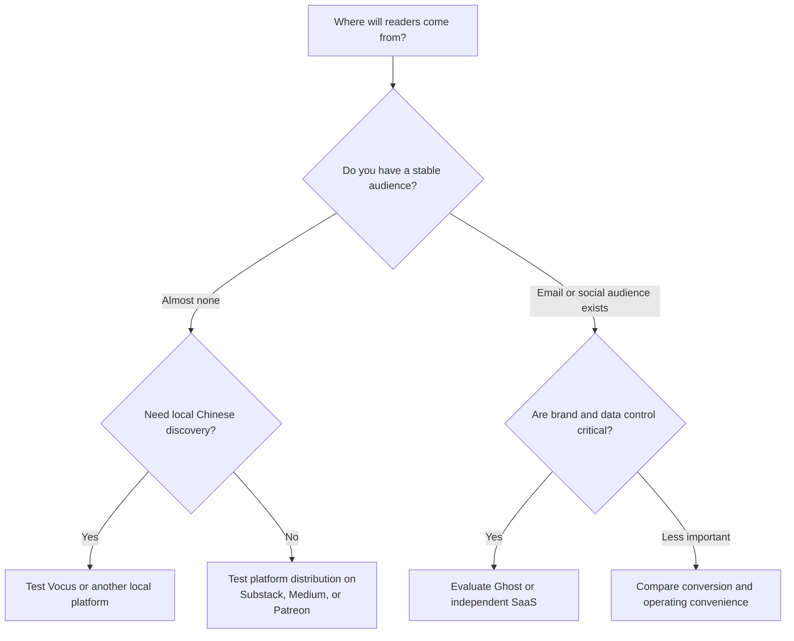
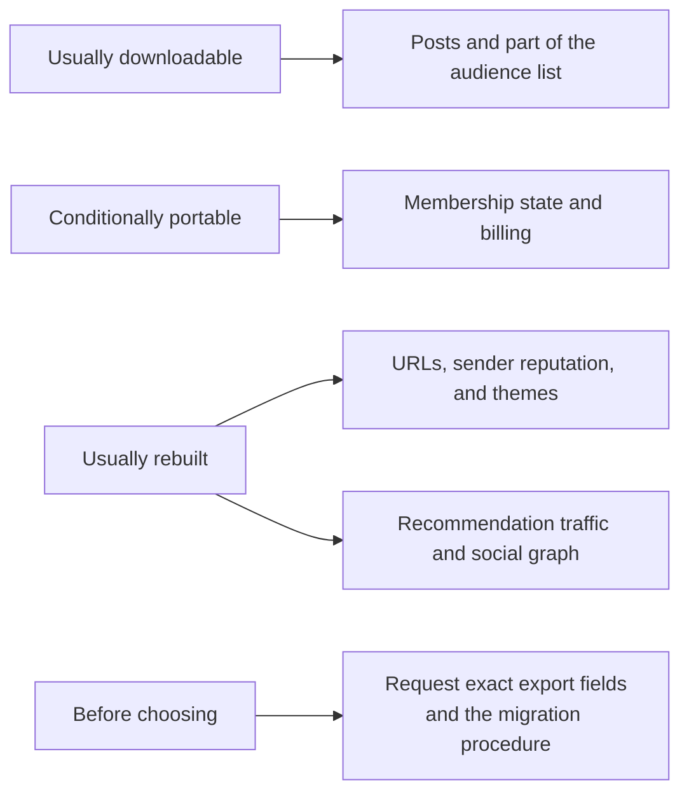
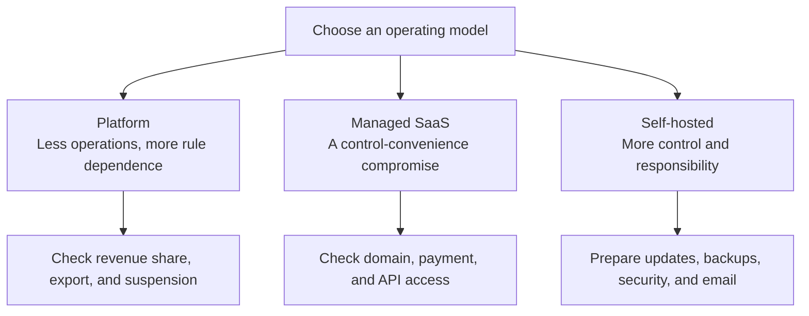

> 🌏 [中文版](/posts/product/2026-09-17-taiwan-creator-platform-choice)

Imagine starting a dessert business. A night-market stall opens quickly and sits near existing foot traffic, but the venue controls the rules and crowd. A department-store counter adds checkout, membership, and promotion in exchange for revenue share and tighter requirements. Your own storefront preserves the sign, customer list, and layout—and makes you responsible for utilities, security, payments, and bringing people to the door.

Creator platforms offer the same tradeoff; “the one with the most features” is not an answer. [Vocus](https://vocus.cc/) and [Patreon](https://www.patreon.com/) resemble counters inside an existing venue. [Substack](https://substack.com/) and [Beehiiv](https://www.beehiiv.com/) combine newsletter SaaS with growth tools. [Ghost](https://ghost.org/) is closer to a standalone shop, either managed through Ghost(Pro) or self-hosted. [Medium](https://medium.com/) emphasizes writing and distribution inside its platform.

Selection should begin with four questions: Can you collect money? Where do readers come from? Which assets must you control? How much can the team operate? Only then should product names enter the discussion.

## Gate one: can payments work from Taiwan?

List the actual transaction before checking whether a landing page says “paid subscriptions.” Do readers use Taiwan-issued or overseas cards? Is the product monthly, annual, or one-time? Who processes refunds? Can the creator's company or individual account use the required payment provider? How will invoicing, taxes, and accounting connect?

This article does not provide legal or tax conclusions. The answer depends on the creator's entity, customer location, transaction, and current rules. Before signing, run one end-to-end transaction with a test account: payment, payout, refund, reconciliation, and customer notices. Then confirm obligations with an accountant or qualified adviser.

Vocus has the advantage of a Taiwan-oriented operating context and local platform readership, but public documentation establishes only a narrow export boundary. Its [official help page](https://vocus.cc/help_center/TnC9HOz4dEujYDlmdPTg) confirms that paid-plan order details can be exported as CSV for order and reward management. It does not establish full export of posts, every follower's email, or billing relationships. Ask support about each item before adoption.

Substack uses Stripe for paid web subscriptions, while Ghost connects payments to the publisher's own Stripe account. Neither fact establishes that Taiwan payments, invoicing, and tax obligations are automatically handled. Patreon manages more of the membership and payment experience, but creators should not assume tiers, benefits, and recurring billing can move intact later.

## Gate two: do you need borrowed traffic or already have readers?

With no audience, an existing platform readership may matter more than a custom domain. Vocus discovery, Medium distribution, Patreon discovery, and Substack's Recommendations, Notes, and App can create in-platform exposure. The tradeoff is that recommendation rules, follower relationships, and some acquisition remain inside the platform.

With an email list, social audience, or search traffic, conversion, retention, and brand become more important. Ghost is no longer a system with no discovery: [Recommendations](https://docs.ghost.org/recommendations) uses Webmention, and Ghost 6 added an [ActivityPub social web](https://ghost.org/changelog/6/). Public evidence does not establish that these channels produce the same reach or conversion as a closed platform. Beehiiv centers referrals, an ad network, and newsletter growth operations, but its recommendation graph still does not travel inside a CSV.

Measure subscriber source, free-to-paid conversion, and retention for at least 90 days. A recommendation network proves that a mechanism exists; a publisher's cohort establishes what it is worth.

## Gate three: which layer must you control?

“Owning the audience” is too vague. Separate the custom domain, content files, email and consent state, member entitlements, payment relationship, and in-platform recommendation or social graph.

[Substack's official export](https://support.substack.com/hc/en-us/articles/360037466012-How-do-I-export-my-posts) includes posts, the subscriber list, and related statistics. Smooth payment migration still depends on the Stripe account and platform support. [Beehiiv](https://www.beehiiv.com/support/article/12258595483543-exporting-post-content-or-subscriber-data-from-beehiiv) exports published, archived, and draft posts plus subscriber data, but that does not establish portability of referral graphs, recommendation placement, or payment tokens.

The [Patreon Relationship Manager](https://support.patreon.com/hc/en-us/articles/360045516212-How-to-use-your-Relationship-manager) can export member data, while some members may choose not to share an email with the creator. Medium's limit is clearer: its current [email documentation](https://help.medium.com/hc/en-us/articles/360059837393-Email-notifications) says email addresses are no longer shared when new readers subscribe; writers can continue exporting existing email lists. Followers, email-notification subscribers, and portable email contacts are not equivalent.

Ghost places the site, member data, and publisher-owned Stripe closer to publisher control. [Ghost adds no transaction fee](https://ghost.org/help/are-there-really-no-transaction-fees/), but Stripe processing, managed hosting, or self-hosting still cost money. Open-source code creates an exit path; it does not make the system free, easy, or immune to outages.

## Gate four: how much will you operate?

Operations means more than servers. Someone must own DNS, sending domains, email deliverability, backups, themes, analytics, permissions, refunds, and incident response.

A platform product removes the most operational work and controls more rules and interfaces. SaaS preserves some domain, list, and integration control while still depending on a vendor. Self-hosted Ghost maximizes control and returns updates, security, backups, and email responsibility to the team. If no one can diagnose DNS when delivery fails, theoretical control may create a different risk.

## A scenario matrix, not a winner

| Your situation | Direction to validate first | Why it may fit | Ask before signing |
|---|---|---|---|
| No audience, Chinese content, local discovery and payments matter | Vocus or another Taiwan platform | Closer to local readers and operations | Which post, email, member, and billing fields can be exported? |
| English or cross-border audience, low initial cost, writer recommendations | Substack | Integrated Recommendations, Notes, App, and payment path | What does 10% of all paid revenue cost, and what increment appears in the target niche? |
| Stable audience; brand, SEO, and payment control matter | Ghost(Pro) or self-hosted Ghost | Custom domain, member data, and publisher-owned Stripe | Taiwan payment suitability, hosting cost, delivery, and incident ownership? |
| Newsletter-first; referrals, advertising, and growth operations are core | Beehiiv | Concentrated growth tools and clear post/subscriber exports | How do referrals, ads, billing, and URLs migrate? |
| Benefits, community, and tier delivery matter more than a long-form site | Patreon | Mature membership and benefit operations | Which members withheld email, and how are benefits and recurring billing rebuilt? |
| Writing and access to Medium readers are the main need | Medium | Short path into in-platform reading and distribution | How will an independent list be built when new subscriber emails are not portable? |

“Validate first” is not a ranking. Choose two directions, publish the same offer at the same price for the same observation window, and record payment success, source, conversion, retention, refunds, and weekly operating time. A feature sheet answers what is possible; the record answers what is worthwhile for this business.

## A selection rehearsal you can run tonight

Create a spreadsheet with the four gates. Give each one three columns: non-negotiable, acceptable, and unverified. Ask each candidate for a real export sample or field list, then use test accounts to run payment, refund, unsubscribe, post export, and email export. Do not run destructive tests on real members.

Now rehearse “the platform disappears tomorrow.” Can you restore content, contact readers who consented to email, identify member access, handle paid subscribers, and redirect old URLs within a reasonable time? An unanswered item does not automatically disqualify the platform. It identifies the concentration risk being accepted.

A Taiwan creator is not choosing one permanently correct platform. The choice is a current exchange: how much traffic to borrow, how much control to give up, how much to pay, and how much to operate. Pass the four gates first, and the product list will shrink to two or three candidates worth testing.

## References

- [Vocus: Export paid-plan order details (in Chinese)](https://vocus.cc/help_center/TnC9HOz4dEujYDlmdPTg)
- [Substack: Export posts and publication data](https://support.substack.com/hc/en-us/articles/360037466012-How-do-I-export-my-posts)
- [Medium: Email notifications and current email-export limits](https://help.medium.com/hc/en-us/articles/360059837393-Email-notifications)
- [Patreon: Relationship Manager](https://support.patreon.com/hc/en-us/articles/360045516212-How-to-use-your-Relationship-manager)
- [Ghost: Import members and migration guides](https://ghost.org/help/import-members/)
- [Ghost: Stripe and transaction fees](https://ghost.org/help/are-there-really-no-transaction-fees/)
- [Ghost Docs: Recommendations and Webmention](https://docs.ghost.org/recommendations)
- [Ghost 6.0: ActivityPub social web](https://ghost.org/changelog/6/)
- [Beehiiv: Export posts and subscriber data](https://www.beehiiv.com/support/article/12258595483543-exporting-post-content-or-subscriber-data-from-beehiiv)
