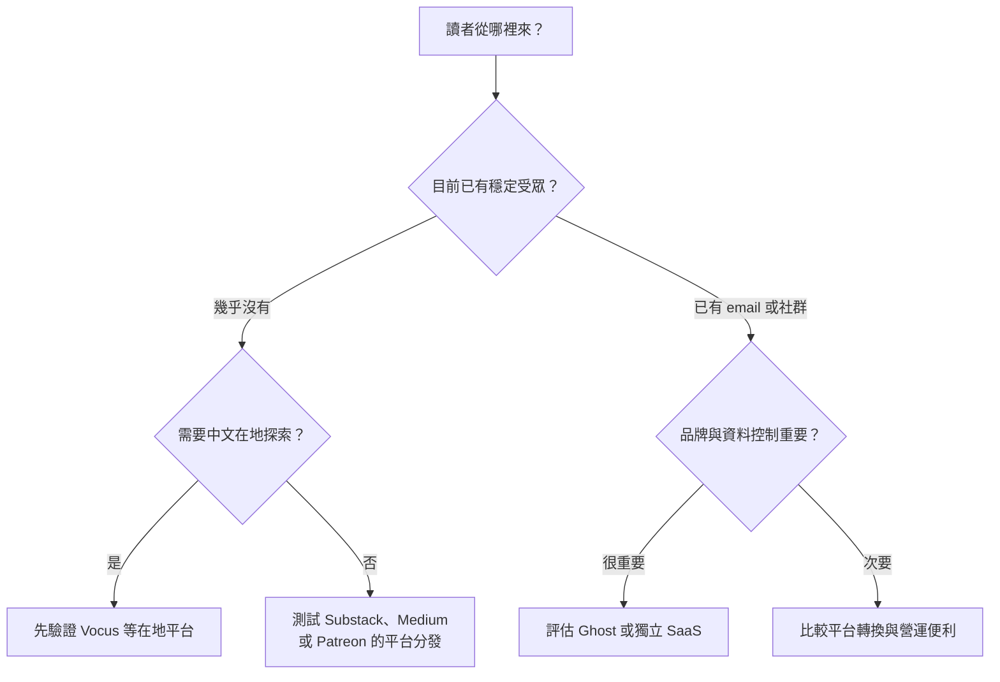
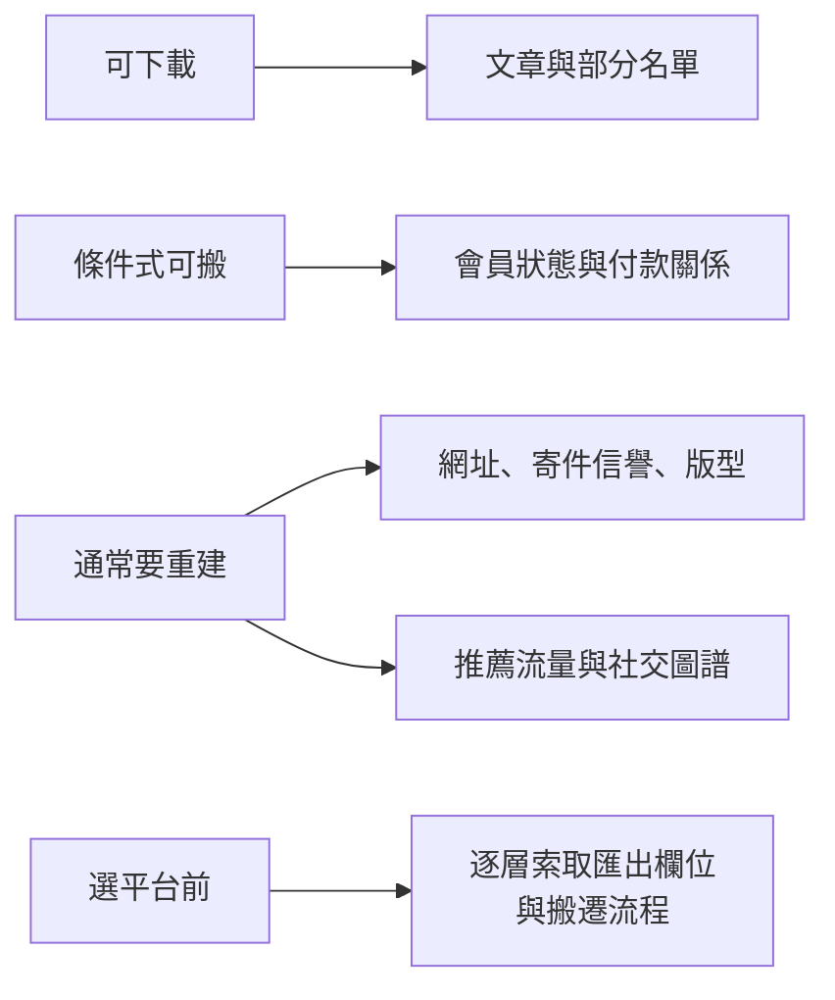
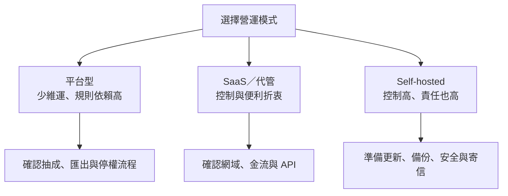

> 🌏 [English version](/en/posts/product/2026-09-17-taiwan-creator-platform-choice-en)

想像你要開始賣手作甜點。夜市攤位開張快，旁邊本來就有人逛，但場地規則和人流不由你決定。百貨櫃位多了收銀、會員與宣傳，代價是抽成和更完整的規範。自己的店面能保留招牌、熟客名單與動線，水電、保全、收款和把人帶到門口也都要自己顧。

創作者平台同樣沒有「功能最多就最好」的答案。[Vocus](https://vocus.cc/) 與 [Patreon](https://www.patreon.com/) 比較像有既有場域的櫃位。[Substack](https://substack.com/) 和 [Beehiiv](https://www.beehiiv.com/) 把 newsletter SaaS 與成長工具綁在一起。[Ghost](https://ghost.org/) 則接近自有店，可以用 Ghost(Pro) 代管，也可以自行部署。[Medium](https://medium.com/) 偏向平台內寫作與分發。

真正的選型順序是先問四件事：錢收不收得到、讀者從哪裡來、哪些資產必須自己掌握，以及團隊願意維運到什麼程度。四道門走完，才有資格談平台名稱。

## 第一門：收款能不能在台灣落地

先列出你的實際交易，不要只看平台首頁有沒有「付費訂閱」按鈕。讀者使用台灣信用卡還是海外卡？按月、按年或單次購買？退款由誰處理？創作者的公司或個人身分能否使用指定金流？發票、稅務與帳務又要怎麼接？

這篇不給法律或稅務結論，因為答案取決於創作者實體、讀者所在地、交易型態與當時規則。能做的是在簽約前拿一筆自有測試交易跑完整流程：付款、入帳、退款、對帳與客服通知都要走一次，再請會計或專業顧問確認義務。

Vocus 的優勢是台灣使用情境與在地平台讀者，但公開文件能證明的匯出範圍有限。[官方幫助頁](https://vocus.cc/help_center/TnC9HOz4dEujYDlmdPTg)確認付費方案的訂單資料明細可匯出 CSV，供訂單與回饋品管理；它沒有因此證明完整文章、所有 follower email 或扣款關係都能搬走。這些項目要在選用前逐項問客服。

Substack 的網頁付費訂閱使用 Stripe；Ghost 也把付款直接連到出版者自己的 Stripe。這兩件事都不能自動推導台灣收款、發票與稅務已經解決。Patreon 代管較多會員與付款流程，移轉時則不能假設方案層級、權益與定期扣款能原封不動帶走。

## 第二門：你需要借人流，還是已有讀者

沒有受眾時，平台既有讀者可能比自有網域更重要。Vocus 的站內探索、Medium 的分發、Patreon 的發現功能，以及 Substack 的 Recommendations、Notes 與 App，都可能帶來平台內觸及。代價是推薦規則、追蹤關係與部分流量留在平台裡。

已有 email、社群或搜尋流量時，重心會轉向轉換、留存與品牌。Ghost 已不是完全沒有發現性：[Recommendations](https://docs.ghost.org/recommendations)使用 Webmention，Ghost 6 也加入 [ActivityPub social web](https://ghost.org/changelog/6/)。不過，公開資料不足以證明它能提供和封閉平台相同的觸及或轉換。Beehiiv 則把推薦、廣告網路與 newsletter 成長工具放在產品中心，仍不代表推薦圖譜能隨 CSV 搬走。

判斷發現性時，至少追蹤 90 天的 subscriber source、免費轉付費率與留存。平台說有推薦網路，只能證明機制存在；你自己的 cohort 才能回答它值多少。

## 第三門：你要控制哪一層

「擁有讀者」太模糊。應拆成自有網域、內容檔、email 與同意狀態、會員權限、付款關係，以及平台內推薦／社交圖譜。

[Substack 官方匯出](https://support.substack.com/hc/en-us/articles/360037466012-How-do-I-export-my-posts)涵蓋文章、subscriber list 與相關統計；付款能否平順搬遷仍取決於 Stripe account 與平台支援。[Beehiiv](https://www.beehiiv.com/support/article/12258595483543-exporting-post-content-or-subscriber-data-from-beehiiv)可匯出 published、archived、draft 文章和 subscriber data，但這不包含 referral graph、推薦 placement 或付款 token。

[Patreon Relationship Manager](https://support.patreon.com/hc/en-us/articles/360045516212-How-to-use-your-Relationship-manager)可以匯出會員資料，但部分會員可能選擇不向創作者分享 email。Medium 的限制更明確：[現行 email 文件](https://help.medium.com/hc/en-us/articles/360059837393-Email-notifications)說，新 email subscriber 的地址不再分享給作者；作者只能繼續匯出既有 email list。Follower、email notification subscriber 與可攜名單不能畫上等號。

Ghost 把網站、會員資料與自有 Stripe 放在出版者較能控制的位置，[Ghost 不另收 transaction fee](https://ghost.org/help/are-there-really-no-transaction-fees/)，仍有 Stripe processing fee、代管或自架成本。開放原始碼提供退出路徑，不等於免費、容易或不會停機。

## 第四門：你願意維運到哪裡

維運不只指伺服器。DNS、寄件網域、email deliverability、備份、theme、分析工具、權限、退款與事故處理，都需要人負責。

平台型產品替創作者包掉最多工作，也掌握最多介面與規則。SaaS 讓你保留部分網域、名單與整合能力，仍依賴供應商營運。Self-hosted Ghost 把控制推得最遠，同時把更新、安全、備援與寄信責任交回團隊。若沒有人能在寄信失敗時查 DNS，理論上的控制權可能只是另一種風險。

## 情境式決策矩陣：沒有總冠軍

| 你的情境 | 優先驗證的方向 | 為什麼可能適合 | 簽約前要問 |
|---|---|---|---|
| 零受眾、中文內容、需要在地探索與收款 | Vocus 等台灣平台 | 在地讀者與營運情境較接近 | 完整文章、email、會員與扣款能匯出哪些欄位？ |
| 英文／跨境、希望低前期成本與作者互薦 | Substack | Recommendations、Notes、App 與付款路徑整合 | 10% 對全部付費收入的成本，繁中／目標 niche 實際增量多少？ |
| 已有穩定受眾，重品牌、SEO 與付款控制 | Ghost(Pro) 或 self-hosted Ghost | 自有網域、會員資料與自己的 Stripe | 台灣金流適用性、代管費、寄信與誰負責事故？ |
| Newsletter-first，referral、廣告與 growth ops 是核心 | Beehiiv | 成長工具集中，內容與 subscriber 有明確匯出 | referral graph、廣告關係、付款與網址如何搬？ |
| 會員福利、社群與 tier delivery 重於長文網站 | Patreon | 會員營運與權益工具較完整 | 哪些會員未分享 email？權益與 recurring billing 如何重建？ |
| 只想寫作並接觸 Medium 既有讀者 | Medium | 平台內閱讀與分發路徑短 | 新 subscriber email 不可攜時，如何另建自有名單？ |

矩陣中的「優先驗證」不是推薦榜。最好的做法是選兩個方向，各用同一份內容、同一個價格與同一段觀察期測試，記錄收款成功率、來源、轉換、留存、退款與每週維運工時。平台功能表回答「能不能」，這份紀錄才回答「對你值不值得」。

## 一個今晚能做完的選型演習

建立一張試算表，列出四道門，每道門只填三格：不可妥協、可以接受、尚待驗證。接著請候選平台提供一份真實 export sample 或欄位清單，並用自有測試帳號跑付款、退款、退訂、文章匯出與 email 匯出。不要用真會員做破壞性測試。

最後再做一次「明天平台消失」演習。你能否在合理時間恢復內容、聯絡同意收信的讀者、辨認會員權限、處理已付款訂戶，並把舊網址導到新家？答不出來的地方不代表一定不能選，卻指出了你正在承擔的集中風險。

台灣創作者真正要決定的是一組目前最適合的交換：借多少人流、交出多少控制、付多少錢，以及願意承擔多少維運。先過四道門，平台名稱自然會縮成兩三個可實測的候選。

## 參考資料

- [Vocus：匯出付費方案訂單資料](https://vocus.cc/help_center/TnC9HOz4dEujYDlmdPTg)
- [Substack：匯出文章與 publication data](https://support.substack.com/hc/en-us/articles/360037466012-How-do-I-export-my-posts)
- [Medium：Email notifications 與現行 email export 限制](https://help.medium.com/hc/en-us/articles/360059837393-Email-notifications)
- [Patreon：Relationship Manager](https://support.patreon.com/hc/en-us/articles/360045516212-How-to-use-your-Relationship-manager)
- [Ghost：Import members 與 migration guides](https://ghost.org/help/import-members/)
- [Ghost：Stripe 與 transaction fee](https://ghost.org/help/are-there-really-no-transaction-fees/)
- [Ghost Docs：Recommendations 與 Webmention](https://docs.ghost.org/recommendations)
- [Ghost 6.0：ActivityPub social web](https://ghost.org/changelog/6/)
- [Beehiiv：匯出文章與 subscriber data](https://www.beehiiv.com/support/article/12258595483543-exporting-post-content-or-subscriber-data-from-beehiiv)
