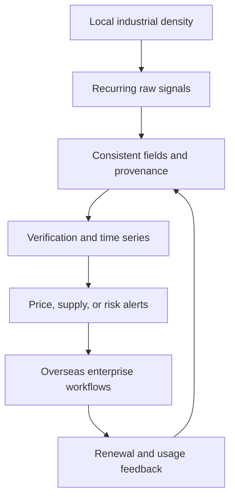
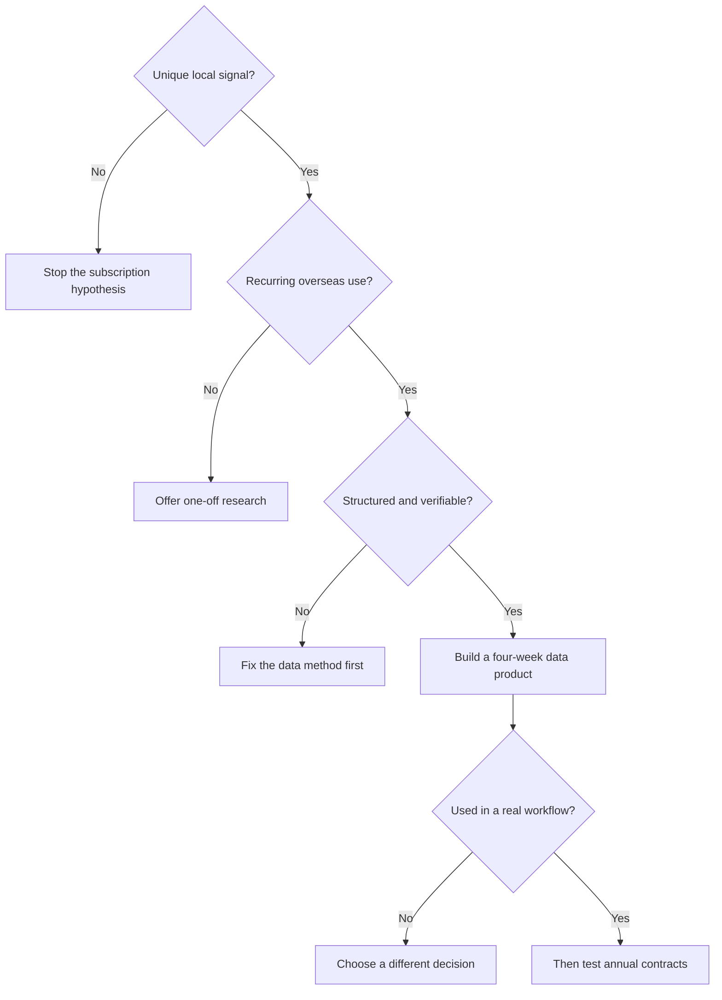

> 🌏 [中文版](/posts/product/2026-09-17-taiwan-vertical-intelligence-opportunity)

Think of an industry as a long night market. Visitors see what each stall is selling today. Delivery drivers, landlords, and electricians behind the scenes know which section is suddenly short of supplies, which equipment has developed a waiting list, and which vendor is preparing to expand.

In semiconductors, electronics manufacturing, and parts of industrial production, Taiwan is more than a visitor to the market. Design, fabrication, packaging, assembly, and supplier coordination all happen there. A vertical intelligence company can turn those backstage signals into consistent fields for procurement, strategy, investment, and risk teams far away.

The answer is therefore not to build another DIGITIMES or launch another industry-news site. Whether Taiwan can produce another vertical intelligence company depends on a narrow market passing five gates at once: local access produces unique signals, buyers use the information repeatedly, the data can be structured, its collection and verification are lawful, and overseas customers will pay.

## TrendForce Shows That a Second Model Already Exists

Taiwan has more than the supply-chain reporting and research model represented by DIGITIMES. According to [TrendForce's official company history](https://www.trendforce.com.tw/about), founder Frank Ko established the DRAMeXchange B2B platform in 2000 around memory research and pricing, then expanded into displays, LEDs, green energy, communications, automotive technology, and AI.

Memory was a strong starting point. Prices and supply-demand balances change frequently, so procurement teams cannot revisit the market once a decade. Data from different periods can also be compared under common definitions. Missing a turning point can leave a buyer paying more or holding excess inventory. Those properties allow intelligence to grow from a one-off report into a recurring subscription.

On the same page, TrendForce describes a three-part research process: collect information with global OEMs, ODMs, and major manufacturers; build on supply-chain and capacity surveys; then track historical prices, analyze supply and demand, and produce forecasts. Being inside an industry increases the chance of receiving signals. Consistent collection, longitudinal comparison, and regular updates turn that position into a product.

TrendForce also reports in the [same company profile](https://www.trendforce.com.tw/about) that most of its customers are overseas and lists offices in Taipei, Shenzhen, Silicon Valley, New York, and Tokyo. Its scale and customer mix are company-reported, not independently audited. The narrower conclusion remains useful: **intelligence can be produced in Taiwan without limiting revenue to Taiwan.**

## Replicate the Production Line, Not the Company's Appearance

TrendForce's product names, report templates, and website design are not the core. The diagram below is this article's proposed production line for a new entrant to test, not a TrendForce-published map of its internal process.

Remove any stage and the model weakens. Relationships without structure stay inside an analyst's head. Public data alone can be found by the buyer. Attractive reports may not be used often enough to support annual contracts. A Taiwan-only customer base may impose a low ceiling.

The intelligence also needs to lead into an action. An equipment lead-time alert should let procurement adjust an order. New-capacity data should help a sales team build a list. A supplier-concentration warning should help a risk team monitor alternatives. Information that ends with “interesting” remains content. Fields that change a meeting, purchase, or monitoring process begin to resemble an enterprise product.

## Five Gates: Do Not Scale Before All Five Open

| Gate | Question | What passing looks like | Failure mode |
|---|---|---|---|
| Unique local signal | Does Taiwan provide an earlier or more accurate view? | Access to suppliers, equipment, capacity, or professional networks | Rewriting global public news |
| Recurring demand | Does the same buyer repeat the decision weekly or monthly? | Prices, lead times, supply, compliance, or risk keep changing | The buyer needs one report and leaves |
| Structured fields | Can signals be updated under consistent definitions? | Companies, periods, and regions can be compared | Every engagement starts as custom consulting |
| Lawful verification | Can rights, sources, and confidence be traced? | Each record retains provenance and verification status | Dependence on unauthorized data or one rumor |
| Overseas buyer | Will someone outside Taiwan pay because errors are costly? | Global brands, material suppliers, equipment vendors, or investors use it | A high-priced product remains trapped in a small local market |

These gates are not a market-sizing model. They are a way to reject the wrong problem early. A large industry does not automatically create paid demand for intelligence. Taiwan's strength in an industry does not guarantee that any database built there can sell abroad.

## Competition Includes Institutions and Free Data, Not Just Media

A new entrant is not starting on empty land. Taiwan already has three layers of baseline intelligence.

The first is industry media and corporate press releases, which provide event updates. The second is public data from government agencies, exchanges, and associations. The [Taipei Exchange Industry Value Chain Information Platform](https://ic.tpex.org.tw/), for example, maps companies to value chains. It also states that company-level information is entered by the companies themselves and that the platform does not assume responsibility for omissions or errors. A public directory reduces discovery cost; it does not mean every record has been verified.

The third layer is institutional research, including ITRI's [IEK](https://ieknet.iek.org.tw/) and III's [MIC](https://mic.iii.org.tw/). Their presence shows that institutional research suppliers already exist. During research, the IEK services page repeatedly timed out, while MIC's site returned a web-application-firewall response. This article therefore does not infer membership features, policy-research offerings, or advisory packages that were not read in full. These institutions also have different governance and funding structures from private companies, so a direct revenue comparison would be misleading.

This environment forces a new entrant to define its incremental value. If the product merely summarizes news, republishes government statistics, or paraphrases institutional reports, a customer has little reason to add another annual bill. A defensible increment is more likely to be an earlier original signal, a consistent longitudinal dataset, comparable company fields, an alert inside procurement or risk workflows, or verification unavailable in public data.

## Taiwan Offers an Observation Surface, Not an Automatic Moat

The US Department of Commerce's [Taiwan semiconductor market guide](https://www.trade.gov/country-commercial-guides/taiwan-semiconductors-including-chip-design-ai) places IC design, foundries, packaging, equipment, and talent within one connected value chain. Exact market-share figures vary by source and year, so this article does not rely on a percentage from one page. The more stable point is that Taiwan is a critical node in the global semiconductor supply chain, with several adjacent activities concentrated within one geography.

That density creates a broad observation surface. Equipment installation, material qualification, capacity changes, and talent movement leave signals in overlapping communities. Researchers who understand both the technical and commercial context are also better positioned to decide which changes deserve attention.

Proximity does not grant permission to use every piece of data. Company-submitted fields, anonymous interviews, customer operational data, and public filings carry different rights and reliability. An intelligence company that fails to retain source, collection method, and verification level can turn a geographic advantage into legal and trust risk.

The domestic market is not a reliable ceiling either. High-priced B2B intelligence needs English output, cross-region definitions, time-zone discipline, and international sales from the beginning. A product built only for local readers can easily slide from an enterprise decision tool into a low-priced content subscription.

## Research These Verticals—Do Not Call Them Proven Markets

Applying the five gates suggests several research hypotheses: advanced packaging and equipment lead times, AI-server components, industrial energy and water, precision-manufacturing supply risk, and selected medical-device manufacturing chains.

They deserve investigation because they may combine Taiwanese industrial density, recurring change, and costly decisions. That is not proof of a market. This article has no paid-customer interviews, contracts, renewal rates, or complete competitive maps for those opportunities. They belong on a research list, not a startup recommendation list.

Each idea needs fresh answers. Who repeatedly makes a slow decision because data is missing? What substitute do they use today? Can the information be acquired lawfully? If the intelligence disappeared tomorrow, would the buyer lose time, money, or risk control? If those questions remain unanswered, success in semiconductors or at TrendForce cannot answer them by proxy.

## A Four-Week Test: Validate the Workflow Before the Annual Contract

A founder does not need ten analysts or a complete website on day one. Spend four weeks testing one recurring enterprise decision, such as equipment lead times, material prices, or supplier risk.

In week one, interview overseas buyers and identify the slowest step in their current process and the cost of a wrong call. In week two, build only five to ten consistent fields and attach a source and confidence level to each record. In week three, ask a small number of design partners to use the data in a real procurement, risk, or weekly-review process. In week four, check whether it reduced search time, surfaced a change earlier, or altered one identifiable decision.

Evidence for “go” is not an interviewee saying the idea sounds interesting. It is a buyer placing the data into an existing workflow and identifying a decision that became faster. A “no-go” is useful too. If buyers only want one report, sell research or consulting. If fields cannot be kept consistent, solve the data method. If Taiwan provides no unique signal, do not force the idea into a subscription.

## Conclusion: The Next Company Should Begin as a Data Factory

Taiwan can produce another vertical intelligence company, and TrendForce shows that DIGITIMES is not the only possible model. What can be copied is not the appearance of a Taiwanese technology publication. It is the ability to process a local observation advantage into longitudinal fields and deliver them into global enterprise workflows.

The starting point is not the hundredth article. Tonight, choose one recurring decision, list no more than ten required fields, and show the table to one overseas buyer before their next meeting. If that small table compounds over time and changes an action, it may deserve to become an intelligence company. Otherwise, even excellent industry content remains a guide map to the night market.

## References

- [TrendForce Company Profile (in Chinese)](https://www.trendforce.com.tw/about)
- [US Department of Commerce: Taiwan - Semiconductors including chip design for AI](https://www.trade.gov/country-commercial-guides/taiwan-semiconductors-including-chip-design-ai)
- [Taipei Exchange Industry Value Chain Information Platform (in Chinese)](https://ic.tpex.org.tw/)
- [Taiwan Trend Research](https://www.twtrend.com/en/)
