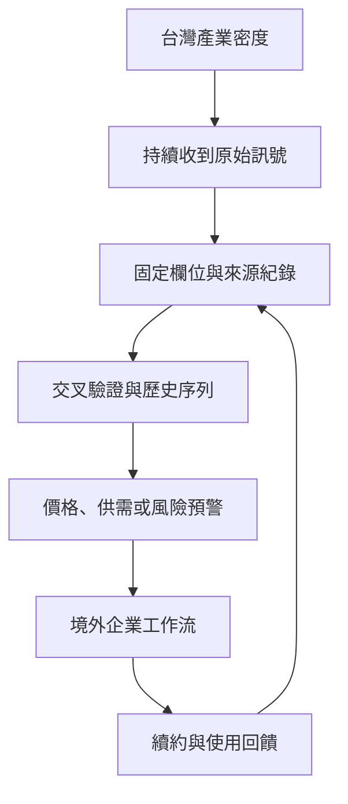
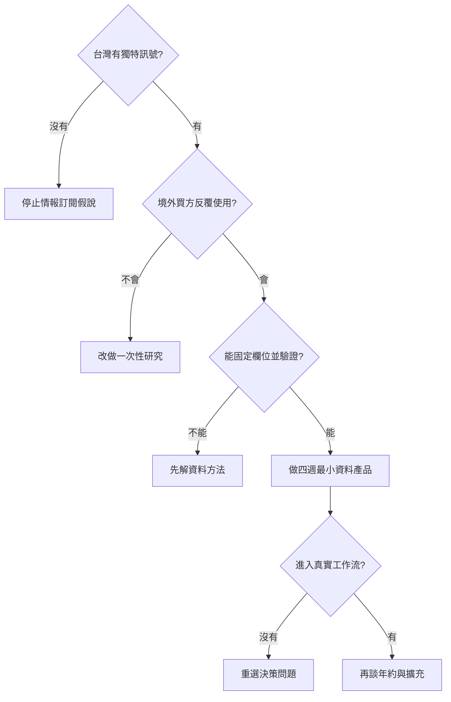

> 🌏 [English version](/en/posts/product/2026-09-17-taiwan-vertical-intelligence-opportunity-en)

把一個產業想成很長的夜市。遊客看到攤位今天賣什麼，後台的送貨員、房東與水電師傅卻知道哪一區突然缺料、哪種設備開始排隊、哪個攤商準備擴店。

台灣在半導體、電子代工與部分製造業裡，不只是逛夜市的遊客。許多設計、生產、封裝、組裝與供應商協調都在這裡發生。垂直情報公司的機會，是把後台每天出現的零碎訊號做成固定欄位，賣給遠方的採購、策略、投資與風險團隊。

答案因此不是「再做一家 DIGITIMES」，也不是再開一個產業新聞網站。台灣能不能長出下一家垂直情報公司，要看一個窄領域能否同時通過五道門。台灣必須掌握獨特訊號，買方會反覆使用，資料能固定成欄位，來源合法且可驗證，而且境外客戶願意付錢。

## TrendForce 顯示：第二種答案存在

台灣不只有以供應鏈新聞與研究見長的 DIGITIMES。[TrendForce 官方公司介紹](https://www.trendforce.com.tw/about)稱，創辦人林啓東在 2000 年先建立 DRAMeXchange B2B 平台，從記憶體研究與價格資訊出發。公司後來才擴張到顯示器、LED、綠能、通訊、汽車與 AI 等領域。

記憶體是很好的起點。價格會變，供需會變，採購團隊不能十年才看一次；不同時間的資料又能用同一種定義比較。企業若晚一步看到供需轉折，可能付出更高採購成本或留下過多庫存。這些特性讓情報有機會從單篇報告長成持續訂閱。

TrendForce 在同一頁把研究方法寫成三段。它與全球 OEM、ODM 與主要製造商合作蒐集資料，以供應鏈與產能調查建立基礎，再做歷史價格追蹤、供需分析與預測。人在產業裡，只代表比較容易收到訊號；能用固定定義蒐集、跨期比較與持續更新，才把位置優勢變成產品。

它也在[同一份公司介紹](https://www.trendforce.com.tw/about)中自報多數客戶來自境外，並在台北、深圳、矽谷、紐約與東京設點。這些規模與客戶占比是公司自己的說法，沒有獨立稽核資料可交叉確認。能從中得到的窄結論是：**情報從台灣生產，不代表收入只能來自台灣。**

## 可複製的是生產線，不是公司外觀

TrendForce 的產品名稱、報告版型或網站設計都不是核心。下面是本文提出、可供新進者檢驗的情報生產線，不是 TrendForce 公布的內部流程圖。

這條線少一段都不行。只有人脈，資料會留在分析師腦中；只有公開資料，買方可以自己找。只有漂亮報告，使用頻率可能撐不起年約；只有台灣客戶，市場上限又可能太低。

資訊還要能進入下一個動作。採購團隊收到設備交期預警後，要能調整訂單；業務團隊看到新產能後，要能建立名單；風險團隊發現供應集中後，要能追蹤替代來源。當情報停在「讀完覺得有趣」，它仍是內容。當欄位會改變會議、採購或監控流程，才接近企業產品。

## 五道門：缺一個就先不要擴張

| 判斷門檻 | 要問的問題 | 通過時的樣子 | 沒通過會怎樣 |
|---|---|---|---|
| 台灣獨特訊號 | 台灣的位置是否讓你更早或更準看到變化？ | 能接觸供應商、設備、產能或專業網路 | 只是重寫全球公開新聞 |
| 反覆需求 | 同一位買方是否每週或每月都要重做判斷？ | 價格、交期、供需、法遵或風險持續變動 | 一份報告買完就結束 |
| 固定欄位 | 訊號能否用一致定義長期更新？ | 可比較公司、時間與地區 | 每案都從零開始做顧問專案 |
| 合法驗證 | 資料權利、來源與信心能否追溯？ | 每筆資料保留來源與驗證層級 | 依賴未授權資料或單一傳聞 |
| 境外買方 | 台灣以外是否有人因決策代價而付費？ | 全球品牌、材料商、設備商或投資機構使用 | 高價產品困在有限的台灣市場 |

這五道門的用途是淘汰錯題，不是估算市場規模。產業很大，不代表情報有付費需求；台灣很強，也不保證在台灣做任何資料庫都能賣到國外。

## 競爭者不只媒體，還有法人與免費資料

新公司不是在空地上起跑。台灣已經有三層基礎情報供給。

第一層是產業媒體與公司新聞稿，提供事件快訊。第二層是政府、交易所與協會的公開資料。例如[櫃買中心產業價值鏈資訊平台](https://ic.tpex.org.tw/)整理公司在產業鏈的位置，但頁面也明示公司資料由各公司自行輸入，平台不替錯誤或遺漏負責。公開目錄能降低找公司的成本，卻不等於資料已經查證。

第三層是法人研究體系，包括工研院的 [IEK 產業情報網](https://ieknet.iek.org.tw/)與資策會的 [MIC 產業情報研究所](https://mic.iii.org.tw/)。它們的存在說明市場已有機構型研究供給。研究時，IEK 服務頁多次抓取逾時，MIC 官網也被網站防護擋住，因此本文不推定未讀到全文的會員功能、政策研究或顧問方案。它們與私營公司的治理及資金結構也不同，不能直接放進同一張營收比較表。

這個競爭環境迫使新進者說清楚增量。若產品只是整理新聞、轉貼政府統計或重述法人報告，客戶沒有理由再付一筆年費。能收費的差異比較可能是更早的原始訊號、更一致的長期資料、跨公司可比欄位、放進採購與風險流程的預警，以及公開資料沒有的驗證。

## 台灣的優勢是觀測面，不是自動護城河

美國商務部的[台灣半導體市場指南](https://www.trade.gov/country-commercial-guides/taiwan-semiconductors-including-chip-design-ai)把 IC 設計、晶圓代工、封裝、設備與人才放在同一條價值鏈中。不同來源對精確市占數字與年份會有差異，因此這裡不引用單一頁面的百分比。較穩妥的事實是：台灣是全球半導體供應鏈的關鍵節點，多個相連環節集中在同一地理範圍。

密度帶來更大的觀測面。設備裝機、材料驗證、產能調整與人才流動會在相近社群裡留下訊號；懂技術與商業脈絡的研究者，也更容易判斷哪個變化值得追。

接近供應鏈不等於可以任意使用資料。公司自填欄位、匿名訪談、客戶操作資料與公開申報，各有不同權利與可靠度。情報公司若沒有保留來源、取得方式與驗證層級，位置優勢反而會變成法律與信任風險。

台灣市場也不是可靠天花板。高價 B2B 情報要從第一天就處理英文、跨區定義、資料時區與國際銷售。若產品只服務台灣讀者，很容易從企業決策工具退回低價內容訂閱。

## 哪些方向值得研究，但還不能說已經成立

套用五道門後，可以提出幾個研究假說。候選包括先進封裝與設備交期、AI 伺服器零組件、工業能源與水資源、精密製造供應風險，以及特定醫材製造鏈。

它們可能同時具備台灣產業密度、反覆變動與高決策代價，因此值得查。市場證據目前仍然缺席。本文沒有這些方向的付費客戶訪談、合約、續約率或競爭全貌；它們只列入下一輪研究名單。

每一個方向都要重新問：誰每天因為缺資料而做慢決定？他目前用什麼替代？資料能不能合法取得？

接著拿走這份情報，觀察買方是否會損失時間、金錢或風險控制能力。答不出來，就不能拿半導體與 TrendForce 的成功替它背書。

## 四週驗證：先測工作流，再談年約

創業者不用先雇十位分析師，也不用先做完整網站。四週內只測一個會重複發生的企業決策，例如設備交期、材料價格或供應商風險。

第一週，訪談境外買方，找出他們目前最慢的一步與判斷錯誤的代價。第二週，只建五到十個固定欄位，替每筆資料留下來源與信心。第三週，讓少數設計夥伴把資料放進真實週會、採購或風險流程。第四週，檢查它是否縮短查找時間、提早發現變化，或真的改變一項決策。

通過標準，是買方願意把資料放進既有流程，並指出哪個決策因此變快。「有興趣」不算。

沒有通過也能決定下一步。買方只想買一次報告，就做研究或顧問；欄位無法一致，就先解資料方法。台灣沒有獨特訊號，就停止情報訂閱假說。

## 結論：下一家公司應該先像資料工廠

台灣有機會再長出垂直情報公司，TrendForce 已經說明答案不只一種。下一家公司應該複製的，是把台灣觀測優勢加工成長期欄位，再送進全球企業工作流的能力。「台灣科技媒體」的外觀並不重要。

真正的起點也不是寫第一百篇文章。今晚先選一個反覆決策，列出十個以內的必要欄位，找一位境外買方看他會不會在下一次會議使用。那張小表格若能持續累積、改變動作，才值得往情報公司走；否則，再漂亮的產業內容也只是一張夜市導覽圖。

## 參考資料

- [TrendForce 公司介紹](https://www.trendforce.com.tw/about)
- [美國商務部：Taiwan - Semiconductors including chip design for AI](https://www.trade.gov/country-commercial-guides/taiwan-semiconductors-including-chip-design-ai)
- [櫃買中心產業價值鏈資訊平台](https://ic.tpex.org.tw/)
- [台灣趨勢研究](https://www.twtrend.com/en/)
