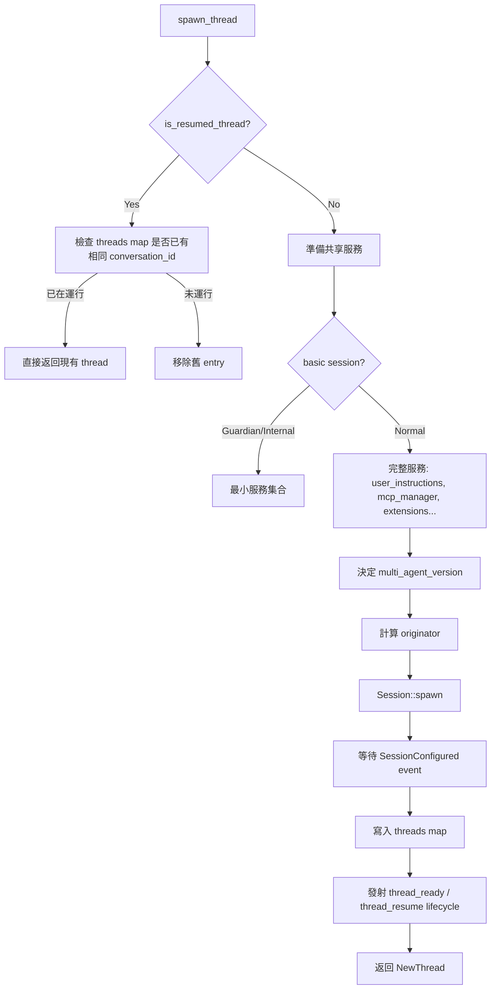

> 🌏 [中文版](/posts/tech/2026-08-31-codex-thread-manager-deep-dive)

## TL;DR

- **ThreadManager** = `Arc<ThreadManagerState>` + 少量便利方法；真正狀態在 `ThreadManagerState`
- **ThreadManagerState** 持有：`threads: DashMap<ThreadId, CodexThread>`、`thread_store`（SQLite）、`agent_graph_store`（subagent 圖）、`models_manager`、`mcp_manager`、`auth_manager` 等服務
- **四大啟動路徑**全走 `spawn_thread(ThreadSpawnRequest)`：`start_thread`（新建）、`resume_thread_with_history`（恢復）、`fork_thread`（分叉）、`spawn_subagent`（子代理）
- **ForkSnapshot** 兩種語義：`TruncateBeforeNthUserMessage(n)` 切在第 n 條 user message 前；`Interrupted` 模擬當下中斷，補 `<turn_aborted>` marker
- **AgentControl** 持有 `Weak<ThreadManagerState>`，讓 thread 能「向上」請求分叉/列舉而不形成循環引用

---

## 情境

你在 Codex TUI 輸入 `/fork`、或 CLI 下 `--resume <id>`、或讓主 agent 用 `spawn` 工具產生子代理。這些操作背後都經過同一個函式：

```rust
// thread_manager.rs:1864
async fn spawn_thread(&self, request: ThreadSpawnRequest) -> CodexResult<NewThread>
```

這篇把鏡頭拉近 `ThreadManager`，看它怎麼統管 thread 生命週期、怎麼把歷史切成想要的形狀、怎麼讓子代理繼承父代理的上下文。

---

## 問題

`ThreadManager` 看起來只是個 `HashMap<ThreadId, CodexThread>` 包裝，但實際上它必須處理：

1. **共享服務注入**——每個 thread 都需要 `models_manager`、`mcp_manager`、`auth_manager`、`thread_store`……逐個傳參太冗長
2. **多種啟動語義**——新建、恢復、分叉、子代理，各有不同的 `initial_history`、`session_source`、`fork_persistence`
3. **向上委派**——thread 內部要能發起 `/fork`、列舉 subagent 樹，但 `ThreadManager` 不能被 thread 持有（循環引用）
4. **持久化邊界**——記憶體中的 `CodexThread`、SQLite `ThreadStore`、JSONL `Rollout` 三層怎麼同步
5. **分叉語義精確化**——`/fork` 要不要包含未完成的 turn？`--fork <id>` 要不要繼承 prompt cache key？

---

## 嘗試過程

### 1. 兩層架構：`ThreadManager` + `ThreadManagerState`

```rust
// thread_manager.rs:224-227
pub struct ThreadManager {
    state: Arc<ThreadManagerState>,  // 核心狀態，可被 clone 到處傳
    _test_codex_home_guard: Option<TempCodexHomeGuard>,
}
```

`ThreadManager` 本身很薄，主要方法都委派給 `state`。`ThreadManagerState` 才是真正的「核心協調者」：

```rust
// thread_manager.rs:343-366
pub(crate) struct ThreadManagerState {
    threads: Arc<RwLock<HashMap<ThreadId, Arc<CodexThread>>>>,  // 記憶體中的活躍 thread
    thread_created_tx: broadcast::Sender<ThreadId>,             // 新 thread 事件廣播
    thread_id_generator: ThreadIdGenerator,                     // 可換的 ID 產生器
    auth_manager: Arc<AuthManager>,
    models_manager: SharedModelsManager,
    environment_manager: Arc<EnvironmentManager>,
    starting_mcp_runtimes: Mutex<Vec<Weak<AtomicBool>>>,        // 追蹤啟動中的 MCP runtime
    skills_service: Arc<HostSkillsService>,
    plugins_manager: Arc<PluginsManager>,
    mcp_manager: Arc<McpManager>,
    code_mode_session_provider: Arc<dyn CodeModeSessionProvider>,
    extensions: Arc<ExtensionRegistry<Config>>,
    user_instructions_provider: Arc<dyn UserInstructionsProvider>,
    thread_store: Arc<dyn ThreadStore>,                         // SQLite 持久化
    agent_graph_store: Option<Arc<dyn AgentGraphStore>>,        // Subagent 圖譜
    attestation_provider: Option<Arc<dyn AttestationProvider>>,
    external_time_provider: Option<Arc<dyn TimeProvider>>,
    session_source: SessionSource,
    installation_id: String,
    analytics_events_client: Option<AnalyticsEventsClient>,
    ops_log: Option<SharedCapturedOps>,                         // 測試用
}
```

**設計亮點**：
- 所有服務都是 `Arc`，`spawn_thread` 時直接 `Arc::clone` 傳給 `Session::spawn`
- `agent_graph_store` 是 `Option`——無狀態模式（`--no-session`）時為 `None`
- `ops_log` 只在測試模式啟用，生產環境零開銷

### 2. 統一啟動入口：`spawn_thread(ThreadSpawnRequest)`

所有路徑最終都呼叫 `ThreadManagerState::spawn_thread`（1864 行起），參數封裝在 `ThreadSpawnRequest`：

```rust
// thread_manager.rs:266-296
struct ThreadSpawnRequest {
    options: StartThreadOptions,           // 所有啟動參數
    auth_manager: Arc<AuthManager>,
    agent_control: AgentControl,           // 向上委派介面
    parent_thread_id: Option<ThreadId>,    // 父 thread（subagent 用）
    forked_from_thread_id: Option<ThreadId>, // 分叉來源
    fork_persistence: ForkPersistence,     // Copied / Referenced
    inherited_environments: Option<TurnEnvironmentSnapshot>,
    inherited_exec_policy: Option<Arc<ExecPolicyManager>>,
    user_shell_override: Option<Shell>,
}
```

`spawn_thread` 做的事（精簡流程）：



**關鍵細節**：
- `reserved_thread_id` 只能用於 `InitialHistory::New`，不能用於 resume（1900-1904 行）
- `basic session`（Guardian/Internal）跳過 `user_instructions`、`extensions`、`mcp_manager`，用最小配置啟動（1932-1939 行）
- `source_changed_during_startup` 追蹤啟動期間 MCP runtime 是否變更，啟動完成後觸發 `request_mcp_runtime_refresh`（1973-1981、2047-2049 行）

### 3. ForkSnapshot：兩種分叉語義

```rust
// thread_manager.rs:174-193
pub enum ForkSnapshot {
    TruncateBeforeNthUserMessage(usize),  // 切在第 n 條 user message 前
    Interrupted,                          // 模擬當下中斷
}
```

**語義差異**：

| ForkSnapshot | 適用場景 | 行為 |
|-------------|---------|------|
| `TruncateBeforeNthUserMessage(n)` | 用戶想「從第 n 輪對話重來」 | 嚴格切在 user message 邊界；超出範圍且源 thread 在 mid-turn 時，切在當前 turn 開頭，丟掉未完成 turn |
| `Interrupted` | `/fork`、`spawn_subagent` | 若源歷史在 mid-turn，補上 `<turn_aborted>` marker（同真實 interrupt）；已在 turn boundary 則不變 |

實作在 `fork_history_from_snapshot`（2277-2308 行）：

```rust
fn fork_history_from_snapshot(
    snapshot: ForkSnapshot,
    history: InitialHistory,
    interrupted_marker: InterruptedTurnHistoryMarker,
) -> InitialHistory {
    match snapshot {
        ForkSnapshot::TruncateBeforeNthUserMessage(n) => {
            truncate_before_nth_user_message(history, n, snapshot_state)
        }
        ForkSnapshot::Interrupted => {
            // 先切到上一個 turn boundary，再補 interrupted marker
            let history = truncate_before_nth_user_message(history, usize::MAX, snapshot_state);
            append_interrupted_boundary(history, turn_id, started_at, interrupted_marker)
        }
    }
}
```

**給 CLI/TUI 的對應**：
- `codex --fork <id>` → `TruncateBeforeNthUserMessage(0)`（完整複製，等同 `Full`）
- TUI `/fork` → `Interrupted`（保留到上一個完整 turn，模擬中斷）
- `spawn_subagent` → `Interrupted`（子代理從「被中斷的父代理」繼承上下文）

### 4. AgentControl：向上委派的鑰匙

`CodexThread` 內部需要「請求 ThreadManager 做事」（如發起子代理、列舉 subagent 樹），但不能持有 `Arc<ThreadManagerState>`（會形成循環）。解法：

```rust
// thread_manager.rs:1411-1417
pub(crate) fn agent_control(&self) -> AgentControl {
    AgentControl::new(
        Arc::downgrade(&self.state),  // Weak reference!
        self.state.thread_id_generator.clone(),
        None,
    )
}
```

`AgentControl` 定義在 `core/src/spawn.rs`，持有 `Weak<ThreadManagerState>`，關鍵方法：

```rust
// spawn.rs (精簡)
pub struct AgentControl {
    thread_manager: Weak<ThreadManagerState>,
    thread_id_generator: ThreadIdGenerator,
    rollout_budget: Option<RolloutBudget>,
}

impl AgentControl {
    // 發起子代理：upgrade Weak → 呼叫 ThreadManager::spawn_subagent
    pub async fn spawn_subagent(&self, config: Config, parent_thread_id: ThreadId) -> CodexResult<NewThread> {
        let tm = self.thread_manager.upgrade()?;
        tm.spawn_subagent(parent_thread_id, StartThreadOptions::new(config)).await
    }

    // 列舉 subagent 樹
    pub async fn list_live_agent_subtree_thread_ids(&self, thread_id: ThreadId) -> CodexResult<Vec<ThreadId>> {
        let tm = self.thread_manager.upgrade()?;
        tm.list_agent_subtree_thread_ids(thread_id).await
    }

    // 確保 V2 子代理已載入
    pub async fn ensure_v2_agent_loaded(&self, config: Config, child_thread_id: ThreadId, parent: Option<Arc<CodexThread>>) -> CodexResult<()> { ... }
}
```

這就是「向上委派」模式：thread 不持有 manager，只持有能「借用」manager 的 `AgentControl`。

### 5. Subagent 圖譜：`AgentGraphStore` 追蹤邊狀態

`ThreadManagerState` 持有 `agent_graph_store: Option<Arc<dyn AgentGraphStore>>`，介面定義在 `agent-graph-store/src/`：

```rust
// agent-graph-store/src/types.rs
pub enum ThreadSpawnEdgeStatus {
    Open,   // 子代理尚存或可恢復
    Closed, // 子代理已關閉
}
```

```rust
// agent-graph-store/src/store.rs (trait)
pub trait AgentGraphStore: Send + Sync {
    async fn record_thread_spawn(
        &self,
        parent_thread_id: ThreadId,
        child_thread_id: ThreadId,
    ) -> Result<(), AgentGraphStoreError>;

    async fn update_thread_spawn_edge_status(
        &self,
        parent_thread_id: ThreadId,
        child_thread_id: ThreadId,
        status: ThreadSpawnEdgeStatus,
    ) -> Result<(), AgentGraphStoreError>;

    async fn list_thread_spawn_descendants(
        &self,
        thread_id: ThreadId,
        status_filter: Option<ThreadSpawnEdgeStatus>,
    ) -> Result<Vec<ThreadId>, AgentGraphStoreError>;
}
```

**寫入時機**：
- `spawn_subagent` 成功後 → `record_thread_spawn(parent, child)`
- 子代理關閉 → `update_thread_spawn_edge_status(parent, child, Closed)`

**查詢用途**：
- `ThreadManager::list_agent_subtree_thread_ids`（911-945 行）合併 SQLite 持久化邊 + 記憶體中活躍子代理
- TUI 顯示 subagent 樹、匯出時包含子會話

### 6. 四大啟動路徑對照表

| 入口方法 | InitialHistory | SessionSource | ForkPersistence | 典型場景 |
|---------|---------------|---------------|----------------|----------|
| `start_thread` | `New` | `Exec` / `Tui` | `Copied` | 使用者開新對話 |
| `resume_thread_with_history` | `Resumed(conversation_id, history)` | 從 history 推導 | `Copied` | `--resume <id>`、TUI `/resume` |
| `fork_thread` | `Resumed` → 經 `fork_history_from_snapshot` 轉換 | `Fork` | `Copied` | `--fork <id>`、TUI `/fork` |
| `spawn_subagent` | 父 thread 歷史 → `ForkSnapshot::Interrupted` | `SubAgent(ThreadSpawn{parent})` | `Copied` | 主 agent 用 `spawn` 工具 |

**共同點**：全走 `start_thread_inner` → `spawn_thread`，差異只在 `ThreadSpawnRequest` 的幾個欄位。

---

## 解法

`ThreadManager` 以 **「薄外殼 + 重內核 + 統一啟動管道」** 解決上述問題：

1. **服務集中在 `ThreadManagerState`**——`spawn_thread` 一次 `Arc::clone` 所有服務傳給 `Session`，避免層層傳參
2. **`ThreadSpawnRequest` 封裝所有變數**——`initial_history`、`session_source`、`fork_persistence`、`parent_thread_id`……四大路徑只需組裝不同的 Request
3. **`Weak<ThreadManagerState>` 打破循環**——`AgentControl` 讓 thread 能向上委派，不持有強引用
4. **`ForkSnapshot` 精確定義分叉語義**——`TruncateBeforeNthUserMessage` 給用戶可控制的切點，`Interrupted` 給系統級分叉（fork/subagent）
5. **`AgentGraphStore` 獨立持久化關係**——SQLite 記錄邊狀態，記憶體補充活躍子代理，查詢時合併

---

## 為什麼會這樣

| 設計決策 | 根因 |
|----------|------|
| `ThreadManager` + `ThreadManagerState` 分離 | `ThreadManager` 需要 `Clone`（給 CLI/TUI 多處持有），`State` 需要 `Arc` 共享可變狀態；分離後 `ThreadManager` 只是 `Arc<State>` 的新型別包裝 |
| `spawn_thread` 統一所有啟動路徑 | 避免四條路徑各自複製「建立 Session、註冊 thread、發 lifecycle event」的樣板碼 |
| `ForkSnapshot` 用 enum 而非 bool/struct | 未來可擴展 `TruncateToLastSamplingBoundary`、`WaitUntilNextSamplingBoundary`（TODO 註解已預留） |
| `agent_graph_store` 為 Option | `--no-session` 模式無 SQLite，無法建圖；也方便測試注入 mock |
| `originator` 計算有 fallback 鏈 | `metrics_service_name` → `persisted` → `inherited` → `env` → `default`，支援多入口（Desktop/Web/CCA/ChatGPT）區分來源 |

---

## 學到的事

1. **「薄 Manager + 重 State」是 Rust 共享狀態的常見模式**——Manager 提供便利 API，State 持有 `Arc<RwLock<...>>` 真實資料
2. **統一啟動管道比多個專用函式更易維護**——`ThreadSpawnRequest` 當作「參數物件」，新增啟動模式只需加欄位，不改流程
3. **`Weak` 解決「子物件需要呼叫父物件」的循環引用**——`AgentControl` 是經典應用
4. **分叉語義要用 Enum 明確表達意圖**——`Interrupted` vs `TruncateBeforeNthUserMessage` 對應不同使用者心智模型
5. **Subagent 圖譜分「持久化邊」與「活躍邊」**——SQLite 記錄歷史關係，記憶體補充運行中子代理，查詢時合併

---

## 參考資料

- [thread_manager.rs](https://github.com/openai/codex/blob/main/codex-rs/core/src/thread_manager.rs) — ThreadManager、ThreadManagerState、spawn_thread、fork_thread、ForkSnapshot 完整實作
- [spawn.rs](https://github.com/openai/codex/blob/main/codex-rs/core/src/spawn.rs) — AgentControl、Session::spawn、SessionSpawnArgs
- [agent-graph-store/src/types.rs](https://github.com/openai/codex/blob/main/codex-rs/agent-graph-store/src/types.rs) — ThreadSpawnEdgeStatus 定義
- [agent-graph-store/src/store.rs](https://github.com/openai/codex/blob/main/codex-rs/agent-graph-store/src/store.rs) — AgentGraphStore trait
- [session/src/session.rs](https://github.com/openai/codex/blob/main/codex-rs/core/src/session/session.rs) — CodexThread、Session、SessionIo
- [AGENTS.md#The_codex-core_crate](https://github.com/openai/codex/blob/main/AGENTS.md#The-codex-core-crate) — core crate 膨脹防護、測試規範