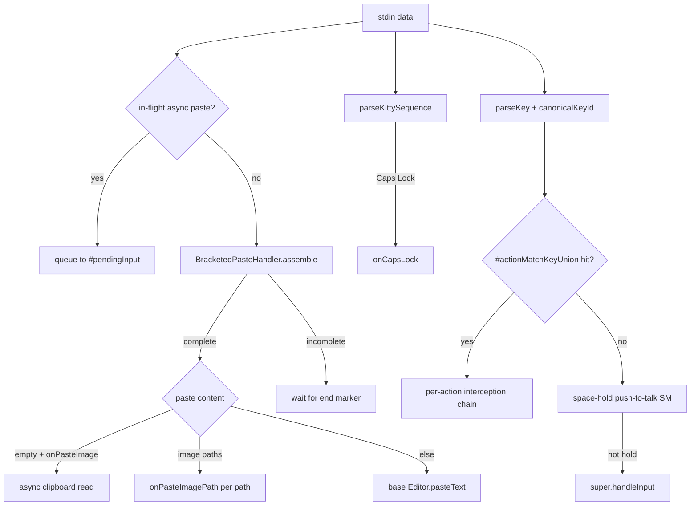

## TL;DR

OMP builds a complete TUI engine from scratch (`packages/tui` + `packages/coding-agent/src/tui`) without React/Ink. Core designs:

- **Differential rendering**: Component `render(width)` returns array references; unchanged content returns the **same reference**, containers and renderer use reference equality to skip work, diffing only the viewport, never touching history scrollback.
- **Explicit history contract**: `TerminalFrameProvider` returns two channels — `history` (monotonic id + rows) and `viewport`. History is append-only; viewport is diffed per-frame. Composer decides retirement under capacity pressure in `renderFrame()`.
- **Composer multi-modal input**: `CustomEditor.handleInput()` integrates bracketed paste, image path detection, space-hold push-to-talk (STT), Kitty keyboard protocol, Caps Lock detection, configurable action keys (interrupt/clear/exit/model selector/history search/external editor/queue dequeue/retry/copy prompt).
- **Inline selector**: `SelectList` + `autocomplete` built into editor, supporting fuzzy filter, wrap description, mouse hover, scrollbar.
- **Vim mode**: Editor includes word jump (`Ctrl+]`/`Ctrl+Alt+]`), kill ring (`Ctrl+W`/`Ctrl+Y`/`Alt+Y`), undo stack, character jump mode.
- **Keybindings system**: `KeybindingsManager` uses canonical key ids for unified matching, supports user overrides, conflict detection, extension custom handlers.
- **Double-escape**: `StdinBuffer` detects bare `\x1b\x1b` at flush and splits into two independent ESC events, preventing `parseKey` from swallowing the gesture (`packages/tui/src/stdin-buffer.ts:784-785`).
- **Render loop & frame budget**: `TUI.#scheduleRender()` adapts throttle based on `#lastFrameCostMs` (`MIN_RENDER_INTERVAL_MS = 33ms`, cap 200ms), output backlog gate pauses new frames at 256KB pending bytes.

---

## Context

Building an interactive terminal UI for a coding agent presents several core challenges:

1. **Startup speed**: React/Ink requires JS bundling, VDOM initialization, reconciliation — cold start is significantly slower than raw terminal writes.
2. **Per-frame budget**: Terminals run at 30-60 fps. Large transcripts (thousands of lines of markdown, tool output, images) would stall the event loop if fully repainted.
3. **Native experience**: IME candidate positioning, bracketed paste, Kitty graphics/keyboard protocol, mouse reporting, DECCARA, synchronized output (DEC 2026) require precise control.
4. **History/viewport separation**: When users scroll up to read history, new messages must not disturb scrollback. On resize, history should replay per policy (rebuild/append/preserve), not be destroyed.

OMP chose to build its own TUI engine, published as a standalone package (`@oh-my-pi/pi-tui`) for reuse by extensions, custom tools, and hooks.

---

## Problem

### Why Not React / Ink?

| Dimension | React/Ink | OMP TUI |
|-----------|-----------|---------|
| **Cold start** | JS bundle, VDOM init, reconciliation | Direct ANSI writes, ~1ms to interactive |
| **Memory** | VDOM tree + fiber nodes + component instances | Component tree + string arrays only, no virtual nodes |
| **Repaint strategy** | Full tree diff → ANSI output | **Reference equality**: unchanged components return same array reference, container memoizes, renderer diffs line-by-line |
| **Terminal capabilities** | Indirect via Ink props/yoga layout | Direct CSI/OSC/APC/DCS control; Kitty graphics, DECCARA, synchronized output, DSR anchor recovery |
| **Input handling** | Ink `stdin.setRawMode` + custom parser | `StdinBuffer` assembles fragmented CSI/OSC/DCS/APC/SS3; bracketed paste, Kitty keyboard protocol, key release filtering |

Ink suits "CLI tools written in React"; OMP needs a "terminal-native coding agent frontend" — different abstraction levels.

---

### What Does Differential Rendering Solve?

Traditional terminal UIs `console.clear()` + full repaint every frame, causing:
- Flicker (even with alt screen)
- Destruction of user's scrollback reading position
- PTY buffer saturation from massive ANSI output → backpressure

OMP's solution:

1. **Component contract** (`packages/tui/src/tui.ts:184-230`):
   ```ts
   interface Component {
     render(width: number): readonly string[]  // Same content → same reference
     handleInput?(data: string): void
     invalidate?(): void
   }
   ```

2. **Container memoization** (`tui.ts:470-496`):
   ```ts
   render(width: number): readonly string[] {
     for (let i = 0; i < count; i++) {
       const childLines = children[i]!.render(width)
       if (refs[i] !== childLines) unchanged = false
       refs[i] = childLines
     }
     if (unchanged) return this.#memoLines!  // Return cached reference
     // Otherwise re-concat
   }
   ```

3. **Viewport-only diff** (`tui.ts:#doRender` ~line 1400+): renderer diffs `#providerWindow` (previous frame's painted rows) line-by-line, writes only changed rows (`ERASE_LINE` + new content + `CRLF`), untouched rows emit zero bytes.

4. **Product decides finality**: `TerminalFrameProvider` returns `HistoryBatch{id, rows, kind}`. Renderer writes **once, acks once**, never infers finality from viewport row position (`docs/tui-core-renderer.md:42-49`).

---

## Attempts & Evolution

### 1. Render Loop & Frame Budget

`TUI.#scheduleRender()` (`tui.ts:1550+`) implements adaptive throttling:

```ts
#scheduleRender(force = false, opts?) {
  if (this.#stopped) return
  const now = this.#renderScheduler.now()
  // Input grace window: after keystroke, allow one immediate frame
  if (!force && now < this.#inputRenderGraceUntilMs) return
  // Output backlog gate: pause if PTY buffer > 256KB
  if (this.terminal.pendingOutputBytes > TUI.#MAX_PENDING_OUTPUT_BYTES) {
    this.#renderTimer = this.#renderScheduler.scheduleRender(
      () => this.#scheduleRender(force, opts),
      TUI.#OUTPUT_BACKLOG_RETRY_MS  // 10ms retry
    )
    return
  }
  // Adaptive floor from last frame cost
  const adaptiveFloor = Math.min(
    this.#lastFrameCostMs * 1.5,
    TUI.#MAX_ADAPTIVE_RENDER_MS  // 200ms cap
  )
  const delay = Math.max(TUI.#MIN_RENDER_INTERVAL_MS, adaptiveFloor)
  if (!force && now - this.#lastRenderAt < delay) {
    this.#renderTimer = this.#renderScheduler.scheduleRender(
      () => this.#doRender(force, opts),
      delay - (now - this.#lastRenderAt)
    )
    return
  }
  this.#doRender(force, opts)
}
```

- `MIN_RENDER_INTERVAL_MS = 33ms` (~30 fps)
- `#lastFrameCostMs` records last `#doRender()` duration; slow frames automatically stretch next interval, preventing busy-loop
- Output backlog gate stops queueing frames to an already-stalled stdout (`tui.ts:749-759`)

### 2. Composer Multi-Modal Input Pipeline

`CustomEditor.handleInput()` (`custom-editor.ts:918-1142`) is the single entry point:



Key details:

- **Bracketed paste assembly**: Terminals may flush `\x1b[200~`, `payload`, `\x1b[201~` across multiple reads. `BracketedPasteHandler` assembles complete payload at editor layer before dispatch (`custom-editor.ts:935-974`).
- **Image path detection**: `extractImagePastePathsFromText()` tries splitter first (quoted, shell-escaped spaces), falls back to `extractWholeTextImagePath()` for macOS screenshot filenames (spaces, no quotes) (`composer-attachments.ts:302-307`, `custom-editor.ts:960-966`).
- **Space-hold push-to-talk**: Detects OS key-repeat "fast & steady" signature (`SPACE_HOLD_MECHANICAL_RUN=2` consecutive mechanical gaps), backspaces typed spaces on confirm, fires `onSpaceHoldStart/End` (`custom-editor.ts:817-895`).
- **Kitty keyboard protocol**: `parseKittySequence()` parses modifier bits; Caps Lock = bit 64 (`custom-editor.ts:928-932`).
- **Async paste serialization**: `#pasteInFlight` counter ensures `Enter` and follow-up keys queue behind clipboard read, preventing submit with empty `pendingImages` (`custom-editor.ts:918-924`, `#trackAsyncPaste`/`#onPasteSettled`).

### 3. Inline Selector (Autocomplete / Slash Command)

`Editor` embeds `#autocompleteList: SelectList` (`editor.ts:527-538`), appended after editor rows in `render()` when `#autocompleteState !== null` (`editor.ts:1301-1311`):

```ts
if (this.#autocompleteState && this.#autocompleteList) {
  const viewportRows = this.viewportRowsProvider?.() || ...
  this.#autocompleteList.setMaxVisible(
    Math.max(3, Math.min(this.#autocompleteMaxVisible, viewportRows - result.length - 2))
  )
  result.push(...this.#autocompleteList.render(width))
}
```

`SelectList` (`select-list.ts`) supports:
- **Fuzzy filter**: `fuzzyFilter()` + `overflowSearch` option
- **Wrap description**: `wrapDescription: true` + `maxDescriptionRows`; navigation stays per-item, scrollbar tracks visual rows
- **Mouse hover**: Implements `MouseRoutable`, `routeMouse()` delegates to `routeSelectListMouse()`
- **Scrollbar**: `ScrollView` auto-computes thumb size/position from `visualTotal`

Autocomplete trigger logic in `Editor.#handleInputChunk()` (`editor.ts:1327+`): Tab trigger, char-input debounce, force mode, text-assist (ghost text/autocorrect/spelling) each with independent request IDs; input events cancel stale requests.

### 4. Vim Mode & Editing Primitives

`Editor` includes (`editor.ts`):
- **Word navigation**: `moveWordLeft/Right` via `Intl.Segmenter` at grapheme cluster level, CJK/emoji aware
- **Kill ring**: Emacs-style `Ctrl+W` (kill word back), `Ctrl+K` (kill to line end), `Ctrl+Y` (yank), `Alt+Y` (yank pop), `KillRing` capacity 100
- **Undo stack**: `MAX_UNDO_STACK = 100`, each edit pushes prior state
- **Character jump**: `Ctrl+]` / `Ctrl+Alt+]` enters jump mode, next char determines target
- **Atomic tokens**: `atomicTokenPattern` (`COMPOSER_TOKEN_REGEX`) treats `[Image #N]`, `[Paste #N]` chips as indivisible — backspace deletes whole token

### 5. Keybindings System

`KeybindingsManager` (`keybindings.ts:247-338`):
- **Canonical key id**: `canonicalKeyId()` normalizes `ctrl+a`, `Ctrl+A`, `C-a` → `ctrl+a`; modifiers ordered `ctrl > shift > alt > super`
- **Match keys set**: Each action builds `Set<string>` of all aliases (incl. shifted symbols), `matchesCanonical()` = single `has()` lookup
- **User override**: `setUserBindings()` rebuilds, detects conflicts (same key → multiple actions)
- **Extension custom handlers**: `CustomEditor.#customMatchKeys` merged into union probe, priority after built-in actions

### 6. Double-Escape Behavior

Problem: Rapid double-Escape arrives as `\x1b\x1b` in one read. `parseKey()` returns `undefined`, swallowing the gesture.

Fix in `StdinBuffer.#flush()` (`stdin-buffer.ts:779-786`):

```ts
if (buffered === `${ESC}${ESC}`) {
  sequences.push(ESC, ESC)  // Split into two independent ESC events
}
```

Triggers at flush (timeout or buffer full), preserves double-escape gesture (`CHANGELOG.md:639`, `test/stdin-buffer.test.ts:210`).

### 7. Selector Controller (SelectList)

`SelectList` (`select-list.ts:97-604`) is a standalone component supporting:
- **Keyboard**: `tui.select.up/down/pageUp/pageDown/confirm/cancel` (wrap-around)
- **Type-to-filter**: `#handleSearchInput()` accumulates printable chars, `fuzzyFilter()` instantly narrows `#filteredItems`
- **Mouse**: `routeMouse()` + `hitTest(line)` resolves visual row → item index
- **Scrollbar**: `ScrollView` computes thumb from `visualTotal` (incl. wrap rows), `setScrollOffset(visualOffset)` syncs

---

## Solution

### Core Architecture

```
┌─────────────────────────────────────────────────────────────┐
│                        ProcessTerminal                       │
│  (stdin → StdinBuffer → sequences → TUI.#handleInput)       │
└─────────────────────────────┬───────────────────────────────┘
                              │
                              ▼
┌─────────────────────────────────────────────────────────────┐
│                           TUI                                │
│  ┌─────────────┐  ┌──────────────┐  ┌────────────────────┐  │
│  │ Component   │  │ Render       │  │ Focus / Overlay    │  │
│  │ Tree        │──▶│ Scheduler    │  │ Manager            │  │
│  │ (Container) │  │ (adaptive)   │  │ (CURSOR_MARKER)    │  │
│  └──────┬──────┘  └──────┬───────┘  └────────────────────┘  │
│         │                │                                    │
│         ▼                ▼                                    │
│  ┌──────────────────────────────────────────────────────┐   │
│  │              TerminalFrameWriter                      │   │
│  │  history batch (once) + viewport diff + cursor park   │   │
│  └──────────────────────────────────────────────────────┘   │
└─────────────────────────────┬───────────────────────────────┘
                              │
                              ▼
┌─────────────────────────────────────────────────────────────┐
│                     Composer (TerminalFrameProvider)        │
│  ┌──────────┐  ┌──────────┐  ┌──────────────────────────┐  │
│  │ Header   │  │ Editor   │  │ TranscriptContainer      │  │
│  │ (Welcome)│  │(Custom)  │  │ (active/settled/committed)│ │
│  └────┬─────┘  └────┬─────┘  └─────────────┬────────────┘  │
│       │             │                      │                │
│       └─────────────┴──────────────────────┘                │
│                         │                                    │
│              renderFrame(viewport) → TerminalFramePlan       │
└─────────────────────────────────────────────────────────────┘
```

### Composer.renderFrame() Flow

`composer.ts:210-249`:

1. **Root composition**: Pre-runtime `[header, bootstrapGap, editor, statusHost]`; post-runtime `[...runtimeChildren, statusHost]`
2. **Chrome first**: Render header/editor/status to measure row consumption
3. **Capacity pressure**: `#offerHistory()` retires header only when `renderedHeader.length + chromeRows + liveRows > rows`; transcript similarly via `peekFinalizedBatch(width, capacity)` retiring minimal settled prefix
4. **Transcript viewport**: `transcript.renderViewport(width, remainingRows, frame)` renders only fitting tail
5. **Compose & slice**: `[...before, ...active, ...after]` then `slice(-rows)` guarantees physical height bound

This enables "stay live & reflow while space exists; retire in order when pressure hits."

### Resize Anchor Recovery

`tui.ts:#beginResizeAltPaint()` ~1151, `#beginResizeAnchorProbe()` ~1252, `#resolveResizeAnchor()`:

1. On resize, borrow alt buffer (`\x1b[?1049h`); normal buffer reflows in terminal
2. After settle window (120ms), return to normal buffer (`\x1b[?1049l`)
3. Send DSR (`\x1b[6n`) for CPR; cursor column = unique tag per request (`#cprColumnTags` Map), reply self-identifies via column
4. 200ms timeout fallback: `min(reportedRow - parkedOffset, height - staleReflowedRows)`, second term handles kitty clamping cursor on height shrink
5. Multiplexer (tmux) uses clip model: no rewrap, `staleRows = preResizeWindow.length`, anchor = `height - staleRows`

Validated in `test/resize-anchor-recovery.test.ts` against real kitty behavior.

### IME-Safe Cursor Layout

`Editor.setImeSafeCursorLayout(true)` (`editor.ts:717-720`) enables last-row empty right chrome (`imeSafeCursorTail: true`) when cursor at line end with no inline hint, giving terminal-native IME preedit room without shifting box chrome (`editor.ts:1176-1181`, `composer/types.ts:71-73`).

---

## Why These Decisions

| Decision | Rationale |
|----------|-----------|
| **Custom TUI over Ink** | Startup speed, memory, precise terminal capability control, history/viewport semantic separation |
| **Reference equality diff** | O(1) no-change detection, avoids per-char comparison; components only allocate new arrays on actual change |
| **Explicit history batch + monotonic id** | Product declares finality; renderer never guesses; retry/coalesce safe; ack handshake prevents duplicate writes |
| **Viewport-only diff** | Scrollback never polluted by ordinary repaints; user reading history sees new content only in viewport region |
| **Composer independent of session** | Welcome header & editor draft interactive before session ready; InteractiveMode mounts transcript container without replacing header |
| **Space-hold via mechanical gaps** | Human rapid taps are fast but jittery; OS key-repeat is metronomic; 2 consecutive steady gaps = high-confidence hold |
| **Bracketed paste assembly at editor layer** | Real terminals/SSH/mux fragment CSI/OSC/DCS across reads; `StdinBuffer` reassembly is correctness prerequisite |
| **Cursor marker (APC) over DSR** | `CURSOR_MARKER = \x1b_pi:c\x07` zero-width, terminal-ignored; renderer finds & positions hardware cursor in same frame, no extra round-trip |
| **Synchronized output (DEC 2026)** | Enabled by default, DECRQM confirms terminal support; prevents visual tearing from cursor moves mid-paint |
| **Image budget + purge** | Kitty images transmit-once place-many; over cap → delete old image IDs + full repaint text fallback, no history replay |

---

## Lessons Learned

1. **Terminal rendering is a flow control problem, not a UI problem**: PTY buffer, backpressure, resize rewrap, scrollback push are flow semantics — Web frontend mental models (VDOM/diff) don't map directly.

2. **History must be explicit, not implicit**: Relying on "lines exceed screen height → retire" breaks on resize, multiplexer, user scroll. OMP enforces finality declaration via `TerminalFrameProvider` contract.

3. **Component reference equality is the cheapest memoization**: No `React.memo`, `useMemo`, dependency arrays needed; immutable data + reference check = natural change detection.

4. **Input pipeline must assemble fragmented sequences**: Real terminals/SSH/mux split a single CSI/OSC/DCS across multiple `read()` calls; `StdinBuffer` reassembly is a correctness prerequisite.

5. **Space-hold needs statistical detection, not a single threshold**: "Fast & steady" mechanical repeat signature is more robust than "how long held."

6. **Double-escape is an edge case but critical**: Rapid double-Escape is a common "cancel→exit" gesture; if swallowed by parser, users mash Escape causing cascade misfires.

7. **Resize anchor recovery must handle multiplexer**: tmux clips, doesn't rewrap; direct terminals rewrap but cursor tracks logical line. Two models, separate math.

8. **Frame budget must be adaptive**: Fixed 30fps wastes CPU when idle, drops frames under load; dynamic delay from `#lastFrameCostMs` balances responsiveness and CPU.

---

## References

- [OMP TUI Core Renderer Contract](https://github.com/oh-my-pi/oh-my-pi/blob/main/docs/tui-core-renderer.md)
- [OMP TUI Runtime Internals](https://github.com/oh-my-pi/oh-my-pi/blob/main/docs/tui-runtime-internals.md)
- [OMP TUI Integration Guide](https://github.com/oh-my-pi/oh-my-pi/blob/main/docs/tui.md)
- `packages/tui/src/tui.ts` — Component contract, Container memo, TUI render loop, frame writer, resize anchor recovery
- `packages/tui/src/components/editor.ts` — Editor, autocomplete, kill ring, undo, word navigation, IME-safe layout
- `packages/tui/src/components/select-list.ts` — SelectList, fuzzy filter, wrap description, mouse, scrollbar
- `packages/tui/src/keybindings.ts` — KeybindingsManager, canonical key id, conflict detection
- `packages/tui/src/stdin-buffer.ts` — StdinBuffer, sequence reassembly, double-escape handling
- `packages/tui/src/components/composer/types.ts` — ComposerStyle, chrome contract
- `packages/coding-agent/src/modes/composer.ts` — Composer, TerminalFrameProvider, history retirement policy
- `packages/coding-agent/src/modes/components/custom-editor.ts` — CustomEditor, multi-modal input, space-hold, bracketed paste, action keys
- `packages/coding-agent/src/modes/composer-attachments.ts` — Image/text attachment chip tokens, atom table