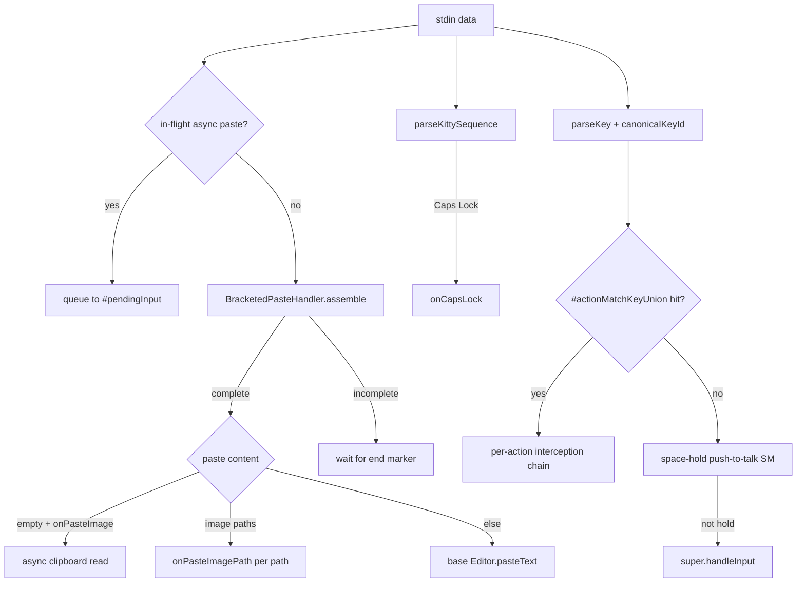

## TL;DR

OMP 完全自建了一套 TUI 引擎（`packages/tui` + `packages/coding-agent/src/tui`），不依賴 React/Ink。核心設計：

- **Differential rendering**：Component `render(width)` 回傳陣列參考；未變內容回傳同一個 reference，容器與 renderer 以 reference equality 判斷無需重繪，只 diff viewport、不碰 history scrollback。
- **Explicit history contract**：`TerminalFrameProvider` 回傳 `history`（monotonic id + rows）與 `viewport` 兩通道；history 只 append、viewport 逐幀 diff。Composer 在 `renderFrame()` 依容量壓力決定何時退休 header/transcript 區塊。
- **Composer 多模輸入**：`CustomEditor.handleInput()` 整合 bracketed paste、image path 檢測、space-hold push-to-talk（STT）、Kitty keyboard protocol、Caps Lock 偵測、configurable action keys（interrupt/clear/exit/model selector/history search/外部編輯器/queue dequeue/retry/copy prompt 等）。
- **Inline selector**：`SelectList` + `autocomplete` 在 editor 內建，支援 fuzzy filter、wrap description、mouse hover、scrollbar。
- **Vim mode**：Editor 內建 word jump（`Ctrl+]`/`Ctrl+Alt+]`）、kill ring（`Ctrl+W`/`Ctrl+Y`/`Alt+Y`）、undo stack、character jump mode。
- **Keybindings 系統**：`KeybindingsManager` 以 canonical key id 統一比對，支援 user override、conflict detection、extension custom handlers。
- **Double-escape**：`StdinBuffer` 在 flush 時偵測 bare `\x1b\x1b` 拆成兩個獨立 ESC 事件，避免被 parseKey 吞掉（`packages/tui/src/stdin-buffer.ts:784-785`）。
- **Render loop & frame budget**：`TUI.#scheduleRender()` 依 `#lastFrameCostMs` 自適應節流（`MIN_RENDER_INTERVAL_MS = 33ms`，上限 200ms），output backlog gate 在 256KB 時暫停佇列新幀。

---

## 情境

在建構 coding agent 的互動式終端介面時，團隊面臨幾個核心挑戰：

1. **啟動速度**：React/Ink 需要 bundle、reconciliation、virtual DOM，冷啟動顯著慢於原生終端寫入。
2. **每幀預算**：終端每秒 30-60 幀，大型 transcript（數千行 markdown、工具輸出、圖片）若全量重繪會卡死事件循環。
3. **原生體驗**：IME 候選框位置、bracketed paste、Kitty graphics/keyboard protocol、mouse reporting、DECCARA、synchronized output (DEC 2026) 等終端特有能力需要精確控制。
4. **History 與 viewport 分離**：使用者往上捲閱讀歷史時，新訊息不應干擾 scrollback；resize 時 history 應依 policy（rebuild/append/preserve）重播，而非破壞。

OMP 選擇自建 TUI 引擎，並在 `packages/tui` 公開為獨立套件（`@oh-my-pi/pi-tui`），供 extensions、custom tools、hooks 複用。

---

## 問題

### 為什麼不用 React / Ink？

| 維度 | React/Ink | OMP TUI |
|------|-----------|---------|
| **冷啟動** | 需要 JS bundle、VDOM 初始化、reconciliation | 直接寫入 ANSI escape sequences，~1ms 進入互動 |
| **記憶體** | VDOM tree + fiber nodes + component instances | 只有 component tree + 字串陣列，無虛擬節點 |
| **重繪策略** | 全樹 diff，再輸出 ANSI | **Reference equality**：未變 component 回傳同一陣列 reference，容器 memoize、renderer 逐行 diff |
| **終端能力** | 需透過 Ink props/yoga layout 間接控制 | 直接操作 CSI/OSC/APC/DCS，支援 Kitty graphics、DECCARA、synchronized output、DSR anchor recovery |
| **Input 處理** | Ink 的 `stdin.setRawMode` + 自家 parser | `StdinBuffer` 組裝 fragmented CSI/OSC/DCS/APC/SS3，bracketed paste、Kitty keyboard protocol、key release filtering |

Ink 適用於「用 React 寫 CLI 工具」；OMP 需要的是「終端原生的 coding agent 前端」，兩者抽象層級不同。

---

### Differential rendering 解決什麼？

傳統終端 UI 每幀 `console.clear()` + 全量重繪，會導致：
- 閃爍（即使用 alt screen）
- 破壞使用者正在閱讀的 scrollback
- 大量 ANSI 輸出塞滿 PTY buffer，導致 backpressure

OMP 的解法：

1. **Component contract**（`packages/tui/src/tui.ts:184-230`）：
   ```ts
   interface Component {
     render(width: number): readonly string[]  // 同內容回傳同一 reference
     handleInput?(data: string): void
     invalidate?(): void
   }
   ```

2. **Container memoization**（`tui.ts:470-496`）：
   ```ts
   render(width: number): readonly string[] {
     // 逐子元件呼叫 render()，比對 reference
     for (let i = 0; i < count; i++) {
       const childLines = children[i]!.render(width)
       if (refs[i] !== childLines) unchanged = false
       refs[i] = childLines
     }
     if (unchanged) return this.#memoLines!  // 直接回傳舊 reference
     // 否則重新 concat
   }
   ```

3. **Viewport-only diff**（`tui.ts:#doRender` ~line 1400+）：renderer 只對 `#providerWindow`（上一幀 painted rows）做逐行字串比對，只寫入變化的行（`ERASE_LINE` + 新內容 + `CRLF`），未變行完全不動。

4. **History 由產品決定 finality**：`TerminalFrameProvider` 回傳 `HistoryBatch{id, rows, kind}`，renderer **只寫入一次、ack 一次**，絕不從 viewport 位置推斷 finality（`docs/tui-core-renderer.md:42-49`）。

---

## 嘗試過程

### 1. Render loop 與 frame budget

`TUI.#scheduleRender()`（`tui.ts:1550+`）實作自適應節流：

```ts
#scheduleRender(force = false, opts?) {
  if (this.#stopped) return
  const now = this.#renderScheduler.now()
  // Input grace window: keystroke 後給一個 frame budget 立即重繪
  if (!force && now < this.#inputRenderGraceUntilMs) return
  // Output backlog gate: PTY buffer > 256KB 時暫停
  if (this.terminal.pendingOutputBytes > TUI.#MAX_PENDING_OUTPUT_BYTES) {
    this.#renderTimer = this.#renderScheduler.scheduleRender(
      () => this.#scheduleRender(force, opts),
      TUI.#OUTPUT_BACKLOG_RETRY_MS  // 10ms 重試
    )
    return
  }
  // Adaptive floor from last frame cost
  const adaptiveFloor = Math.min(
    this.#lastFrameCostMs * 1.5,
    TUI.#MAX_ADAPTIVE_RENDER_MS  // 200ms 上限
  )
  const delay = Math.max(TUI.#MIN_RENDER_INTERVAL_MS, adaptiveFloor)
  if (!force && now - this.#lastRenderAt < delay) {
    this.#renderTimer = this.#renderScheduler.scheduleRender(
      () => this.#doRender(force, opts),
      delay - (now - this.#lastRenderAt)
    )
    return
  }
  this.#doRender(force, opts)
}
```

- `MIN_RENDER_INTERVAL_MS = 33ms`（~30 fps）
- `#lastFrameCostMs` 記錄上一幀 `#doRender()` 耗時，慢幀會自動拉長下一幀間隔，避免 busy-loop
- Output backlog gate 防止對已堵塞的 stdout 繼續塞資料（`tui.ts:749-759`）

### 2. Composer 多模輸入管線

`CustomEditor.handleInput()`（`custom-editor.ts:918-1142`）是所有輸入的總入口：



關鍵細節：

- **Bracketed paste 組裝**：終端可能把 `\x1b[200~`、`payload`、`\x1b[201~` 分多次 flush，`BracketedPasteHandler` 在 editor 層組裝完整 payload 再派發（`custom-editor.ts:935-974`）。
- **Image path 檢測**：`extractImagePastePathsFromText()` 先用 splitter（支援 quoted、shell-escaped spaces），失敗再落回 `extractWholeTextImagePath()` 處理 macOS screenshot 檔名（含空格、無引號）（`composer-attachments.ts:302-307`、`custom-editor.ts:960-966`）。
- **Space-hold push-to-talk**：偵測 OS key-repeat 的「快且穩」特徵（`SPACE_HOLD_MECHANICAL_RUN=2` 次連續 mechanical gap），確認後回刪已輸入的空白並觸發 `onSpaceHoldStart/End`（`custom-editor.ts:817-895`）。
- **Kitty keyboard protocol**：`parseKittySequence()` 解析 modifier bits，Caps Lock 是 bit 64（`custom-editor.ts:928-932`）。
- **Async paste serialization**：`#pasteInFlight` 計數器確保 `Enter` 等後續按鍵在 clipboard read 完成前排隊，避免 submit 時 `pendingImages` 還是空的（`custom-editor.ts:918-924`、`#trackAsyncPaste`/`#onPasteSettled`）。

### 3. Inline selector（autocomplete / slash command）

`Editor` 內建 `#autocompleteList: SelectList`（`editor.ts:527-538`），`render()` 時若 `#autocompleteState !== null` 就在 editor rows 後附加 dropdown（`editor.ts:1301-1311`）：

```ts
if (this.#autocompleteState && this.#autocompleteList) {
  const viewportRows = this.viewportRowsProvider?.() || ...
  this.#autocompleteList.setMaxVisible(
    Math.max(3, Math.min(this.#autocompleteMaxVisible, viewportRows - result.length - 2))
  )
  result.push(...this.#autocompleteList.render(width))
}
```

`SelectList`（`select-list.ts`）支援：
- **Fuzzy filter**：`fuzzyFilter()` + `overflowSearch` 選項
- **Wrap description**：`wrapDescription: true` + `maxDescriptionRows`，navigation 仍以 item 為單位，scrollbar 追蹤 visual rows
- **Mouse hover**：實作 `MouseRoutable`，`routeMouse()` 轉給 `routeSelectListMouse()` 處理
- **Scrollbar**：`ScrollView` 自動計算 thumb size/position

Autocomplete 觸發邏輯在 `Editor.#handleInputChunk()`（`editor.ts:1327+`）：Tab 觸發、字元輸入 debounce、force 模式、text-assist（ghost text/autocorrect/spelling）各自獨立請求 ID，input 事件會取消 stale request。

### 4. Vim mode 與 editing primitives

`Editor` 內建（`editor.ts`）：
- **Word navigation**：`moveWordLeft/Right` 使用 `Intl.Segmenter` 以 grapheme cluster 為單位，支援 CJK/emoji
- **Kill ring**：Emacs 風格 `Ctrl+W` (kill word back)、`Ctrl+K` (kill to line end)、`Ctrl+Y` (yank)、`Alt+Y` (yank pop)，`KillRing` 容量 100
- **Undo stack**：`MAX_UNDO_STACK = 100`，每次編輯操作 push 前一狀態
- **Character jump**：`Ctrl+]` / `Ctrl+Alt+]` 進入 jump mode，下一個字元決定跳轉目標
- **Atomic tokens**：`atomicTokenPattern`（`COMPOSER_TOKEN_REGEX`）讓 `[Image #N]`、`[Paste #N]` chip token 整體刪除，不會被 backspace 破壞

### 5. Keybindings 系統

`KeybindingsManager`（`keybindings.ts:247-338`）：
- **Canonical key id**：`canonicalKeyId()` 將 `ctrl+a`、`Ctrl+A`、`C-a` 正規化為 `ctrl+a`，modifier 依 `ctrl > shift > alt > super` 排序
- **Match keys set**：每個 action 建立 `Set<string>` 包含所有 alias（含 shifted symbols），`matchesCanonical()` 單次 `has()` 查詢
- **User override**：`setUserBindings()` 重建，檢測 conflict（同一 key 映射多個 action）
- **Extension custom handlers**：`CustomEditor.#customMatchKeys` 合併進 union probe，優先級在 built-in actions 之後

### 6. Double-escape 行為

問題：使用者快速按兩下 Escape，終端可能在同一 read 中收到 `\x1b\x1b`。`parseKey()` 對此回傳 `undefined`，導致雙 ESC 被吞掉。

解法在 `StdinBuffer.#flush()`（`stdin-buffer.ts:779-786`）：

```ts
if (buffered === `${ESC}${ESC}`) {
  sequences.push(ESC, ESC)  // 拆成兩個獨立 ESC 事件
}
```

這在 flush 時機（timeout 或 buffer 滿）觸發，確保 double-escape gesture 不丟失（`CHANGELOG.md:639`、`test/stdin-buffer.test.ts:210`）。

### 7. Selector controller（SelectList）

`SelectList`（`select-list.ts:97-604`）是獨立 component，支援：
- **Keyboard**：`tui.select.up/down/pageUp/pageDown/confirm/cancel`（wrap-around）
- **Type-to-filter**：`#handleSearchInput()` 累積 printable chars，`fuzzyFilter()` 即時縮小 `#filteredItems`
- **Mouse**：`routeMouse()` + `hitTest(line)` 解析 visual row → item index
- **Scrollbar**：`ScrollView` 以 `visualTotal`（含 wrap rows）計算 thumb，`setScrollOffset(visualOffset)` 同步

---

## 解法

### 核心架構圖

```
┌─────────────────────────────────────────────────────────────┐
│                        ProcessTerminal                       │
│  (stdin → StdinBuffer → sequences → TUI.#handleInput)       │
└─────────────────────────────┬───────────────────────────────┘
                              │
                              ▼
┌─────────────────────────────────────────────────────────────┐
│                           TUI                                │
│  ┌─────────────┐  ┌──────────────┐  ┌────────────────────┐  │
│  │ Component   │  │ Render       │  │ Focus / Overlay    │  │
│  │ Tree        │──▶│ Scheduler    │  │ Manager            │  │
│  │ (Container) │  │ (adaptive)   │  │ (CURSOR_MARKER)    │  │
│  └──────┬──────┘  └──────┬───────┘  └────────────────────┘  │
│         │                │                                    │
│         ▼                ▼                                    │
│  ┌──────────────────────────────────────────────────────┐   │
│  │              TerminalFrameWriter                      │   │
│  │  history batch (once) + viewport diff + cursor park   │   │
│  └──────────────────────────────────────────────────────┘   │
└─────────────────────────────┬───────────────────────────────┘
                              │
                              ▼
┌─────────────────────────────────────────────────────────────┐
│                     Composer (TerminalFrameProvider)        │
│  ┌──────────┐  ┌──────────┐  ┌──────────────────────────┐  │
│  │ Header   │  │ Editor   │  │ TranscriptContainer      │  │
│  │ (Welcome)│  │(Custom)  │  │ (active/settled/committed)│ │
│  └────┬─────┘  └────┬─────┘  └─────────────┬────────────┘  │
│       │             │                      │                │
│       └─────────────┴──────────────────────┘                │
│                         │                                    │
│              renderFrame(viewport) → TerminalFramePlan       │
└─────────────────────────────────────────────────────────────┘
```

### Composer.renderFrame() 流程

`composer.ts:210-249`：

1. **Root composition**：`#runtimeMounted` 前是 `[header, bootstrapGap, editor, statusHost]`；後是 `[...runtimeChildren, statusHost]`
2. **Chrome first**：渲染 header/editor/status 佔用的 rows
3. **Capacity pressure**：`#offerHistory()` 只有在 `renderedHeader.length + chromeRows + liveRows > rows` 時才退休 header；transcript 同理，`peekFinalizedBatch(width, capacity)` 只退休必要的 settled prefix
4. **Transcript viewport**：`transcript.renderViewport(width, remainingRows, frame)` 只渲染放得下的 tail
5. **Compose & slice**：`[...before, ...active, ...after]` 最後 `slice(-rows)` 保證不超過物理高度

這設計讓「有空間時不退休、保持 live reflow；空間不足時按序退休」成為可能。

### Resize anchor recovery

`tui.ts:#beginResizeAltPaint()` ~1151、`#beginResizeAnchorProbe()` ~1252、`#resolveResizeAnchor()`：

1. Resize 時借用 alt buffer（`\x1b[?1049h`），normal buffer 由終端自行 reflow
2. Settle 窗口（120ms）後回歸 normal buffer（`\x1b[?1049l`）
3. 發送 DSR（`\x1b[6n`）請求 CPR，cursor column 當作 tag（每請求獨佔一 column，`#cprColumnTags` Map），reply 自帶 column 可精確歸因
4. Timeout 200ms fallback：`min(reportedRow - parkedOffset, height - staleReflowedRows)`，第二項處理 height shrink 時 kitty clamp cursor 而非 scroll 的情況
5. Multiplexer（tmux）不 rewrap，改用 clip model：`staleRows = preResizeWindow.length`，anchor 直接 `height - staleRows`

完整驗證在 `test/resize-anchor-recovery.test.ts` 對照 kitty 實測。

### IME-safe cursor layout

`Editor.setImeSafeCursorLayout(true)`（`editor.ts:717-720`）啟用後，最後一行在 `renderRow()` 時若 cursor 在行尾且無 inline hint，會輸出空的 right chrome（`imeSafeCursorTail: true`），讓終端原生 IME preedit 有空間顯示而不推動 box chrome 換行（`editor.ts:1176-1181`、`composer/types.ts:71-73`）。

---

## 為什麼會這樣

| 設計決策 | 理由 |
|-----------|------|
| **自建 TUI 而非 Ink** | 啟動速度、記憶體、終端能力精確控制、history/viewport 語義分離 |
| **Reference equality 做 diff** | O(1) 判斷無變化，避免逐字串比較；component 只需在內容變時分配新陣列 |
| **Explicit history batch + monotonic id** | 產品決定 finality，renderer 不猜測；retry/coalesce 安全；ack handshake 防重複寫入 |
| **Viewport-only diff** | Scrollback 永不被普通重繪汙染；使用者閱讀歷史時新訊息只在 viewport 區域出現 |
| **Composer 獨立於 session** | Welcome header、editor draft 在 session 尚未 ready 時即可互動；InteractiveMode 後 mount transcript container 不替換 header |
| **Space-hold 用 mechanical gap 偵測** | 人類連打空白雖快但抖動大；OS key-repeat 近乎節拍器，連續 2 次穩定 gap 即可高信心判定 |
| **Bracketed paste 在 editor 層組裝** | 終端/SSH/mux 可能分 chunk 送達；base `Editor.handleInput` 只處理單次完整 payload |
| **Cursor marker (APC) 而非 DSR** | `CURSOR_MARKER = \x1b_pi:c\x07` 零寬、終端忽略，renderer 在同一幀內找到並定位硬體游標，無額外 round-trip |
| **Synchronized output (DEC 2026)** | 預設啟用，DECRQM 確認終端支援才維持；避免 paint 過程中 cursor 移動造成視覺 tearing |
| **Image budget + purge** | Kitty images transmit-once place-many；超過 cap 時刪舊圖像 ID + 全量重繪 fallback 文字，不 replay history |

---

## 學到的事

1. **Terminal rendering 是流控問題，不是 UI 問題**：PTY buffer、backpressure、resize rewrap、scrollback push 都是流控語意，不能用 Web 前端思維（VDOM/diff）硬套。

2. **History 要 explicit，不能 implicit**：依賴「行數超過螢幕高度就退休」會在 resize、multiplexer、user scroll 時失效。OMP 用 `TerminalFrameProvider` 契約強制產品宣告 finality。

3. **Component reference equality 是最廉價的 memoization**：不需要 `React.memo`、`useMemo`、dependency array；immutable data + reference check 就是天然的 change detection。

4. **Input pipeline 必須組裝 fragmented sequences**：真實終端/SSH/mux 會把一個 CSI/OSC/DCS 拆多次 `read()` 送達；`StdinBuffer` 重組是正確性前提。

5. **Space-hold 需統計學判定，不能靠單一 threshold**：機械重複的「快且穩」特徵比單純「按多久」更魯棒。

6. **Double-escape 是 edge case 但關鍵**：快速雙擊 Escape 是常見「取消→退出」手勢；若被 parser 吞掉會導致使用者以為沒反應而狂按，產生連鎖誤觸。

7. **Resize anchor recovery 必須處理 multiplexer**：tmux 不 rewrap、改 clip；direct terminal rewrap 但 cursor 會隨 logical line 移動。兩種模型要分開算，不能用同一公式。

8. **Frame budget 要自適應**：固定 30fps 在輕載時浪費 CPU、重載時掉幀；依 `#lastFrameCostMs` 動態調整 delay 才能兼顧響應度與 CPU 使用率。

---

## 參考資料

- [OMP TUI 核心渲染器契約](https://github.com/oh-my-pi/oh-my-pi/blob/main/docs/tui-core-renderer.md)
- [OMP TUI 執行期內部](https://github.com/oh-my-pi/oh-my-pi/blob/main/docs/tui-runtime-internals.md)
- [OMP TUI 整合指南](https://github.com/oh-my-pi/oh-my-pi/blob/main/docs/tui.md)
- `packages/tui/src/tui.ts` — Component contract、Container memo、TUI render loop、frame writer、resize anchor recovery
- `packages/tui/src/components/editor.ts` — Editor、autocomplete、kill ring、undo、word navigation、IME-safe layout
- `packages/tui/src/components/select-list.ts` — SelectList、fuzzy filter、wrap description、mouse、scrollbar
- `packages/tui/src/keybindings.ts` — KeybindingsManager、canonical key id、conflict detection
- `packages/tui/src/stdin-buffer.ts` — StdinBuffer、sequence reassembly、double-escape handling
- `packages/tui/src/components/composer/types.ts` — ComposerStyle、chrome contract
- `packages/coding-agent/src/modes/composer.ts` — Composer、TerminalFrameProvider、history retirement policy
- `packages/coding-agent/src/modes/components/custom-editor.ts` — CustomEditor、multi-modal input、space-hold、bracketed paste、action keys
- `packages/coding-agent/src/modes/composer-attachments.ts` — Image/text attachment chip tokens、atom table