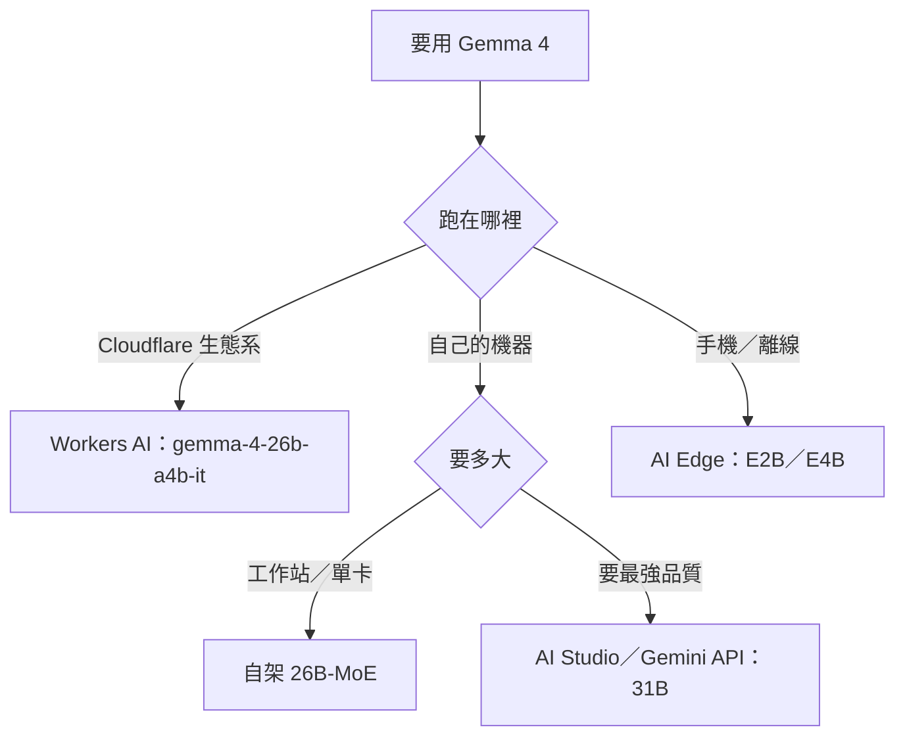

2026 年 4 月 2 日，Google 發佈 [Gemma 4](https://blog.google/innovation-and-ai/technology/developers-tools/gemma-4/)——四個尺寸（E2B／E4B／26B-MoE／31B），31B 拿下 Arena 開源榜第三。但尺寸和分數都不是這次真正的新聞，授權才是：Gemma 4 改用 **Apache 2.0**。此前的每一代 Gemma 都綁著 Google 自家的 Gemma Terms of Use，下載要登入按同意；從 Gemma 4 起，自架、微調、商用散佈不再需要經過 click-through。這是「AI 模型家族」系列的第二十四篇家族深度介紹，追蹤 Gemma 從 2024 年初代到 Gemma 4 的完整路徑，以及它和 [Gemini 主篇](/posts/tech/2026-08-24-ai-model-family-gemini) 的分工。

怎麼解讀文中引用的 benchmark 數字，請參考[AI 模型評測來源指南](/posts/tech/2026-08-24-ai-model-evaluation-sources)。這篇是[AI 模型用途總覽](/posts/tech/2026-08-24-ai-model-landscape-overview)系列的一部分。

## 家族演化時間線

| 版本 | 發佈 | 尺寸 | 關鍵事實 |
|---|---|---|---|
| Gemma 1 | 2024-02 | 2B／7B | Gemini 同源技術下放的首批開放權重，授權為 Gemma Terms of Use |
| Gemma 2 | 2024-06 | 9B／27B | 27B 首次讓開放權重摸到旗艦邊緣 |
| Gemma 3 | 2025-03 | 1B／4B／12B／27B | 多模態進入開放線；稍後補上 270M 極小尺寸 |
| Gemma 3n | 2025-06 | E2B／E4B | MatFormer＋選擇性參數啟動，手機優先的第一代 |
| Gemma 4 | 2026-04 | E2B／E4B／26B-MoE／31B | 授權轉 Apache 2.0；原生支援 function calling 與 agent 工作流 |

兩年、五代。Gemma 的主線一直很單純：**把 Gemini 世代的研究成果，用開放權重、可自架的尺寸重新封裝一次**。每一代的尺寸下限往下探（7B→2B→1B→270M→E2B），上限往上頂（7B→27B→31B），中間穿插醫療、視覺、安全等垂直變體——但只有 Gemma 4 動了授權，這是理解整個家族前後差異的鑰匙。

變體只給一句話定位，不展開：[MedGemma](https://deepmind.google/models/gemma/medgemma/)（醫療文字＋影像理解）、[ShieldGemma 2](https://deepmind.google/models/gemma/shieldgemma-2/)（內容安全分類器）、[FunctionGemma](https://ai.google.dev/gemma/docs/functiongemma)（邊緣端 function calling）、[EmbeddingGemma](https://ai.google.dev/gemma/docs/embeddinggemma)（300M 端側 embedding）、[PaliGemma](https://ai.google.dev/gemma/docs/paligemma)（視覺語言）。完整的官方變體清單見 [DeepMind Gemma 頁面](https://deepmind.google/models/gemma/)。

## 授權陷阱：Gemma 4 是 Apache 2.0，舊代不是

這是全文最重要的一節，因為它太容易搞混——連 [Gemini 主篇](/posts/tech/2026-08-24-ai-model-family-gemini)都曾把 Gemma 開放線一筆寫成 Apache 2.0。精確的切法是：

| | Gemma 1／2／3／3n | Gemma 4 |
|---|---|---|
| 授權 | Gemma Terms of Use（Google 自家條款） | [Apache 2.0](https://ai.google.dev/gemma/apache_2)（另附一份禁止用途政策） |
| 下載方式 | Hugging Face 上 gated，要登入並按同意才能拉權重 | 一般開源下載流程，無 click-through |
| Hugging Face 標籤 | `license:gemma`（例如 [`google/gemma-3n-E2B-it`](https://huggingface.co/google/gemma-3n-E2B-it)） | Apache-2.0 |
| 微調後散佈 | 受原條款約束 | 依 Apache 2.0 處理 |

三個實務含義：

**第一，辨認方法。** 在 Hugging Face 上看到 `license:gemma` 就是舊授權，看到 `apache-2.0` 才是 Gemma 4 世代。不要用「Gemma＝開源」一概而論，兩者的散佈與商用條件完全不同。

**第二，Apache 2.0 不等於零限制。** Gemma 4 另有一份[禁止用途政策](https://ai.google.dev/gemma/prohibited_use_policy)，加上 Google 的商標不在授權範圍內。合規審查時，授權頁和禁止用途政策要一起看。

**第三，舊專案不受追溯。** 已經在用的 Gemma 2／3 權重不會因為 Gemma 4 轉授權而自動變成 Apache 2.0。想換授權基礎，得實際把模型換成 Gemma 4 世代並重跑評估——換模型是最容易破 prompt 的地方，JSON 格式指令尤其要重測。

## 部署三分：Workers AI、自架、手機 AI Edge

Gemma 4 的尺寸矩陣是按硬體切的：E2B／E4B 走行動端與 IoT（極致的運算／記憶體效率），12B／26B／31B 走「個人電腦上的前沿智慧」。官方說法見 [DeepMind Gemma 頁面](https://deepmind.google/models/gemma/)。部署方式對應分成三條路：



### 第一路：Workers AI（最省事）

Cloudflare Workers AI 上核心 Gemma 4 只上了 [`@cf/google/gemma-4-26b-a4b-it`](https://developers.cloudflare.com/workers-ai/models/gemma-4-26b-a4b-it/) 這一個：256K context、Vision、Function calling、Reasoning 全開，定價 $0.10／$0.30 per M input／output tokens。MoE 只啟動約 3.8B 參數，所以延遲比前代 12B 稠密模型還好看。本站已經有一篇實戰記錄——[Gemma on Cloudflare Workers AI](/posts/ai/2026-03-27-gemma-3-cloudflare-workers-ai)——從 Gemma 3 遷移到 Gemma 4 的完整過程，含 RAG pipeline 的 prompt 重測經驗。

三個邊界要記牢：**31B 只在 AI Studio／Gemini API**，不在 Workers AI 上；舊的 `gemma-3-12b-it` 已於 2026-05-30 標為 deprecated，不要再拿它起新專案；[`@cf/aisingapore/gemma-sea-lion-v4-27b-it`](https://developers.cloudflare.com/workers-ai/models/) 是 AI Singapore 以 Gemma 為基座的東南亞語言變體，注意 model ID 前綴是 `@cf/aisingapore` 不是 `@cf/google`。完整的 Workers AI 模型對照見本站[模型目錄](/posts/ai/2026-08-18-workers-ai-model-guide)。

```typescript
// Workers 環境呼叫 Gemma 4，介面與其他 Workers AI 模型相同
const response = await env.AI.run("@cf/google/gemma-4-26b-a4b-it", {
  messages: [
    { role: "system", content: "你是一個台灣社群的 AI 助手。" },
    { role: "user", content: "用三句話介紹 Gemma 4 的授權變化。" }
  ],
  max_tokens: 512,
});
```

### 第二路：自架（Ollama／vLLM，要主權的人走這條）

Apache 2.0 的真正價值在這裡：權重可下載，[Ollama](https://ollama.com/library/gemma4)、vLLM、llama.cpp、Hugging Face Transformers 首日就支援。官方數據：未量化的 bfloat16 權重可塞進單張 80GB H100；量化版跑在消費級 GPU 上，撐 IDE  coding 助手與 agent 工作流。需要微調主權、資料不能出內網、或要長期鎖定 checkpoint（託管 API 的版本不透明，會無預警更動），就走這條。

### 第三路：手機 AI Edge（E2B／E4B，另一個戰場）

E2B／E4B 是為離線設計的：128K context（大尺寸線是 256K），全系原生處理影像，E2B／E4B 另有原生語音輸入，140+ 語言。搭配 AICore、ML Kit、LiteRT 在 Android 與 Raspberry Pi、Jetson Orin Nano 等裝置上全離線執行。本站[行動端小模型盤點](/posts/ai/2026-03-31-mobile-small-models)有這條線的對照。一句話：要離線、低延遲、省電，才需要離開雲端 ID 去碰 E2B／E4B。

## 與 Gemini 主篇的分工：閉源旗艦 vs 開源側翼

Gemma 和 Gemini 的關係，一句話就是 Google 版的雙軌：**Gemini 收營收，Gemma 補生態**。詳情見 [Gemini 主篇](/posts/tech/2026-08-24-ai-model-family-gemini)——閉源旗艦（1M context、原生多模態、$2／$12）只跑在 Google 基礎設施上；Gemma 是給需要自架、微調、資料主權的開發者留的退路，明確不是前沿。Gemma 4 的 Apache 2.0 讓這條退路第一次名副其實，但「開源側翼」的定位沒變：要科學推理最強的模型，還是得回 Gemini 3.1 Pro。

放到開源線的競爭格局裡看：

- **對上 [Qwen](/posts/tech/2026-08-24-ai-model-family-qwen)**：Qwen 尺寸覆蓋最全、HuggingFace 下載量最高，但 2026 年 8 月的 Max 級權重換成了自訂授權而非 Apache 2.0——開源線的「授權純度」現在反而是 Gemma 4 佔優。Qwen 的優勢在中文生態與 Coder／VL 專模型線。
- **對上 [Llama](/posts/tech/2026-08-24-ai-model-family-llama)**：Llama 4 很可能是最後一個主要的開源 Llama，Meta 重心已轉向閉源的 Muse Spark。開源基本盤正在換莊，Gemma 4 的 Apache 2.0 來得正是時候。
- **對上 DeepSeek**：MIT 授權＋前沿品質仍是自架 CP 值的天花板；Gemma 的差異化是 Google 血統的多語言覆蓋（含繁中）與端到端的部署矩陣（雲→工作站→手機一條線）。

## 對 Agent 開發者的意義

- **繁中 RAG 留在 Cloudflare 生態系** → Workers AI 的 `gemma-4-26b-a4b-it`：256K context、$0.10／$0.30，Vision＋Function calling 原生支援，實戰細節見[本站 Gemma 實戰文](/posts/ai/2026-03-27-gemma-3-cloudflare-workers-ai)
- **要 31B 的品質但不想自架** → AI Studio／Gemini API 的 `gemma-4-31b-it`，Arena 開源榜第三（官方 blog 引用的 4 月數據）
- **要微調主權或鎖 checkpoint** → 自架 Gemma 4（Apache 2.0），Ollama／vLLM 首日支援；舊代 Gemma 2／3 的 gated 授權不適用這條
- **手機離線 agent** → E2B／E4B＋AI Edge，128K context，原生語音輸入
- **東南亞多語** → 評估 SEA-LION 變體（`@cf/aisingapore` 前綴），繁中主力仍是 Gemma 4 本體
- **前沿推理／coding** → 這不是 Gemma 的戰場，回 [Gemini 主篇](/posts/tech/2026-08-24-ai-model-family-gemini)選 3.1 Pro 或 3.8 Flash
- **授權審查** → 先看 Hugging Face 的 license 標籤（`gemma` vs `apache-2.0`），再看禁止用途政策；舊專案換授權基礎等於換模型，prompt 要重測

## 整體來說

Gemma 的故事是「用開放權重（open weights）換生態位」。Google 不指望 Gemma 打贏前沿競賽——那是 Gemini 的工作；Gemma 負責讓 Google 的模型出現在 Google 管不到的地方：別人的雲、自架機房、手機裡。Gemma 4 的 Apache 2.0 把這句話從行銷變成法律事實：此前的 Gemma 嚴格說來是「可下載的專有模型」，現在才是開源。

但限制一樣清楚：31B 再強也不是前沿（Arena 開源榜第三意味著前面還有兩名），64K 級以下的輸出上限、科學推理與 coding 基準都落後 Gemini 3.1 Pro 一大截。如果你的場景要的是最強模型，Gemma 從來不是答案；如果你的場景要的是「夠強、可自架、授權乾淨」，Gemma 4 是 Google 第一次真正給出答案的一代。

## 參考資料

- [Introducing Gemma 4（2026-04，官方部落格）](https://blog.google/innovation-and-ai/technology/developers-tools/gemma-4/)
- [Gemma 4 授權：Apache 2.0](https://ai.google.dev/gemma/apache_2)
- [Google DeepMind Gemma 頁面（家族總覽）](https://deepmind.google/models/gemma/)
- [Google Gemma 官方文件](https://ai.google.dev/gemma/docs)
- [Workers AI：gemma-4-26b-a4b-it 模型頁](https://developers.cloudflare.com/workers-ai/models/gemma-4-26b-a4b-it/)
- [`google/gemma-3n-E2B-it`（Hugging Face，授權標 `license:gemma` 且 gated）](https://huggingface.co/google/gemma-3n-E2B-it)
- [Gemini——Google 的原生多模態旗艦](/posts/tech/2026-08-24-ai-model-family-gemini) — 本站（閉源旗艦主篇）
- [Gemma on Cloudflare Workers AI：繁中應用的務實選擇](/posts/ai/2026-03-27-gemma-3-cloudflare-workers-ai) — 本站（實戰）
- [Workers AI 模型目錄](/posts/ai/2026-08-18-workers-ai-model-guide) — 本站
