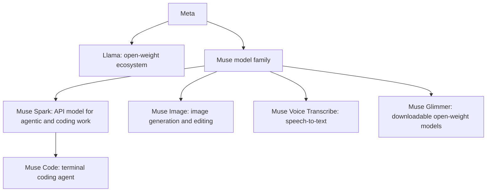

> 🌏 [中文版](/posts/tech/2026-09-19-ai-model-family-muse-spark)

On April 8, 2026, Meta introduced Muse Spark: a natively multimodal reasoning model that can use tools and put visual observations into its reasoning process. By September 2, Muse Spark 1.3 had moved the focus from demonstrating capabilities to finishing long-running work—fewer unnecessary turns, less verbosity, and more reliable coding and tool use. This is the twenty-third family deep-dive in the “AI 模型家族” series.

One distinction matters from the start: Muse Spark is not Llama 5, and it is not an API rename for Llama 4. Llama remains Meta's open-weight ecosystem. Muse Spark is a separate closed-source line entered through the Meta Model API. Mixing the two leads to mistakes about licensing, deployment, and product strategy.

For guidance on interpreting benchmark numbers, see the [AI model evaluation sources guide](/posts/tech/2026-08-24-ai-model-evaluation-sources-en). This article is part of the [AI model landscape overview](/posts/tech/2026-08-24-ai-model-landscape-overview-en). For the harness details behind Muse Code, see [Muse Code: Meta's first coding agent](/posts/tech/2026-08-24-muse-code-meta-coding-agent-en).

## Family timeline

| Date | Release | What changed |
|---|---|---|
| 2026-04-08 | Muse Spark (called 1.0 here for the timeline) | Native multimodal reasoning, tool use, visual chain-of-thought, and multi-agent orchestration; launched in meta.ai and the Meta AI app, with a private API preview |
| 2026-07 (listed as 1.1 in current docs) | Muse Spark 1.1 | The first numbered version in the current Model API documentation, bringing coding, tool use, and multimodal capabilities into a developer-facing API |
| 2026-08-05 | Muse Spark 1.2 + Muse Code | Coding became the main optimization target, accompanied by the terminal-native Muse Code agent |
| 2026-09-02 | Muse Spark 1.3 | The current API workhorse: long-horizon agentic tasks, coding, tools, browser work, and Standard/Contributor data-rights tiers |

There is a naming trap here. Meta's public pages use both “Muse Spark” and API IDs such as `muse-spark-1.1`, `muse-spark-1.2`, and `muse-spark-1.3`. This article calls the April launch 1.0 to make the evolution easier to follow; **1.0 is not a model ID you should put in an API request**. Use the model IDs listed in the current Model API documentation.

## First clarify: Muse is the family, Spark is the model line

Muse is bigger than Spark. Meta's current Muse family has four product lines:

- **Muse Spark** is closed-source and API-hosted. It focuses on multi-step tool loops, coding, long context, and multimodal understanding.
- **Muse Code** is not another model. It is the coding agent or harness built on top of Muse Spark.
- **Muse Glimmer** is a downloadable open-weight line for local deployment and research. It does not reproduce every capability of the Spark API.
- **Muse Image and Muse Voice Transcribe** are specialized modalities in the same family. Their scores should not be compared directly with Spark's coding results.

So “the Muse Spark family” in this article means the version line of Spark itself. “The Muse family” is the larger product family containing Image, Voice Transcribe, and Glimmer.

## From 1.0 to 1.3: from capability demo to working loop

### 1.0: putting multimodality and tools into one model

The first Muse Spark combined text, image, video, document understanding, tool use, and multi-agent orchestration in one product story. Meta also acknowledged that long-horizon agentic systems and coding workflows still needed more investment. In other words, 1.0 established that the model could see, reason, and call tools. It had not yet made “complete dozens of steps without losing control” its only goal.

That is the difference from a conventional chat model. The task is not merely to produce an answer. The model has to connect observation, planning, tool results, and the next action into a loop that can continue.

### 1.1: moving the model into the API workflow

The current official model documentation lists `muse-spark-1.1` as the original numbered version and positions it around coding, tool use, and multimodal understanding. The importance of 1.1 was not a memorable subtitle. It was Meta turning Muse Spark from consumer-product language into an API model that developers could integrate.

That step matters because model capability becomes infrastructure only when it has a stable model ID, context window, tool-calling interface, and billing boundary that an agent harness can rely on.

### 1.2: coding becomes the center, with Muse Code alongside it

On August 5, 2026, Meta released Muse Spark 1.2 and Muse Code. Version 1.2 focused on real coding workflows: reading a repository, proposing changes, calling tools, running tests, and retrying when necessary. Muse Code wrapped that behavior in a terminal agent with persistent sub-agents, worktree isolation, and a recoverable event log.

Keep the layers separate:

- **1.2 is the model version.** It determines understanding, reasoning, tool calling, and output behavior.
- **Muse Code is the agent harness.** It determines how tasks are decomposed, how sub-agents run, how files are isolated, and how crashes are recovered.

A stronger model does not automatically create a better harness. A good harness also cannot turn a model that is unsuitable for long-horizon work into a reliable engineer.

### 1.3: fewer steps, more completed work

Muse Spark 1.3 arrived on September 2, 2026. Meta's release notes describe the improvement in terms of usability: compared with 1.2, the model takes fewer turns when they are not needed, is less verbose, and has a cleaner coding style. In comparisons by Meta engineers, it also used roughly **20% fewer tool calls** and **25% fewer tokens**.

Treat those two numbers as **vendor-reported efficiency gains**, not independent third-party benchmarks. Their real value is the direction they reveal: 1.3 is optimized to reduce friction in the agent loop, not simply to write longer answers.

Version 1.3 keeps the 1M-token context window and accepts text, images, video, PDFs, and other inputs, with text as the main output. The official documentation specifically warns that **audio understanding in Muse Spark 1.3 is not yet fully supported**. For audio understanding, use Muse Spark 1.2 or send speech tasks to Muse Voice Transcribe. “Multimodal” does not mean that every modality is equally mature.

## Standard vs Contributor: the discount buys data rights

Muse Spark 1.3 has two model IDs that are easy to confuse:

| Tier | Model ID | Input (per 1M tokens) | Cached input | Output (per 1M tokens) | Data use |
|---|---|---:|---:|---:|---|
| Standard | `muse-spark-1.3` | $1.25 | $0.15 | $4.25 | Meta's documentation says prompts and completions are not used to train its models |
| Contributor | `muse-spark-1.3-contributor` | $0.10 | $0.002 | $0.20 | Allows Meta to use prompts and completions to improve future models |

Contributor is not a smaller or slower model. The documentation gives it the same 1M context and input/output modalities as Standard. The real difference is **data rights and price**. Contributor input costs 8% of Standard input, while output costs about 4.7% as much. That makes it attractive for quick validation, public-repository experiments, and integrations that do not contain sensitive data.

The trade-off is direct: if a prompt contains unpublished code, customer data, credentials, internal documents, or personal information, Contributor is not just a cheap plan. It is a data-governance decision. The current choice is not a fine-grained per-request opt-out. You either accept Contributor's training rights or use Standard. A practical split is:

- **Public personal projects and disposable prototypes:** Contributor can keep experiments inexpensive.
- **Company repositories, customer data, and regulated work:** use Standard by default; do not send sensitive material to Contributor.
- **Local control, fine-tuning, or fully self-hosted deployment:** look at Muse Glimmer or Llama. Do not assume Muse Spark API weights can be downloaded.

Prices are a snapshot from the official pages checked on September 19, 2026. Recheck Model API pricing, rate limits, and regional availability before scaling.

## Muse Code and Muse Glimmer: two very different ways to use the family

### Muse Code: putting the model into a terminal workflow

Muse Code is Meta's coding agent, built on Muse Spark. Its value is not another chat window. It supplies the infrastructure coding work needs: sub-agents, worktrees, event logs, crash recovery, and tool execution. For people already using OpenCode, Claude Code, or another terminal agent, Muse Code is Meta's own harness implementation. For model selection, it is a useful window into how Muse Spark behaves inside a real coding loop.

If you want to know whether Muse Spark can help you change code, do not run one isolated coding prompt. Use the same set of repository tasks and compare:

1. Whether the first change compiles;
2. Whether the model reads a failing test and corrects it;
3. Whether multi-file changes preserve context;
4. Whether tools are repeated, omitted, or trapped in a loop;
5. Whether the final diff is small enough to review.

That is where a harness like Muse Code actually exposes model quality.

### Muse Glimmer: open weights, but not an API substitute

Muse Glimmer is an open-weight line distilled from Muse Spark. It uses Apache 2.0 and can be downloaded and run on your own hardware. It answers a different question: data cannot leave your domain, you need to self-host, you want to modify the inference stack, or you need control over deployment cost.

Do not treat Glimmer as a free Muse Spark 1.3. Open weights mean deployment freedom; they do not guarantee the same API version, tool ecosystem, 1M context, or service level. Ask first: do you need **Meta's latest hosted agentic behavior**, or **controllable, self-hosted weights**? One product does not necessarily satisfy both needs.

## The relationship with Llama: parallel tracks, not a succession

Llama's advantage is its ecosystem: Hugging Face, Ollama, llama.cpp, vLLM, fine-tuning communities, and local deployment tools are already mature. Muse Spark's advantage is a different product path: a closed model, a hosted API, 1M context, tool calling, and Meta's own coding agent.

Meta's route is therefore closer to this:

- **Llama:** open weights, community deployment, and fine-tuning; a good fit when control and ecosystem compatibility matter.
- **Muse Spark:** closed hosting, fast API access, and agent workflows at the center; a good fit for teams that want the model, tools, and coding harness productized together.
- **Muse Glimmer:** between the two, offering open weights without promising every Spark API capability.

This is not fully captured by saying that “Meta moved from open source to closed source.” More accurately, Meta is keeping Llama's open ecosystem while building a separate closed agentic product line. For developers, the real question is not which one is Meta's future. It is whether your task needs control or a complete hosted workflow.

## How agent builders should choose

| Need | Recommendation | Why |
|---|---|---|
| Build a coding agent or long-horizon tool loop | Muse Spark 1.3 Standard | Current agentic positioning, 1M context, tools, and multimodal inputs; keep data rights under control first |
| Quickly test a public repository or personal prototype | Muse Spark 1.3 Contributor | Low cost, but send only non-sensitive material |
| Want a terminal coding experience | Muse Code + Muse Spark 1.3 | Evaluate the model through sub-agents, worktrees, tests, and retries |
| Need self-hosting, fine-tuning, or data residency | Muse Glimmer | Deployment control matters more than the latest hosted API behavior |
| Need a mature open ecosystem and local inference | Llama | The tooling, community, and deployment examples are the most established |
| Mainly process speech-to-text | Muse Voice Transcribe, or 1.2 | Audio understanding in 1.3 still has an official limitation |
| Need image, video, and PDF understanding | Muse Spark 1.3 Standard | Multimodal input and long context are its home turf, but test your own document types |

Do not make the minimum viable evaluation a single benchmark question. Take 10–20 real tasks and record completion rate, tool-call count, total tokens, retries, latency, and the number of steps requiring human intervention. For an agent model, **one fewer correct tool call can matter more than one extra point on a single-turn benchmark**.

## Four limits to remember

1. **A 1M context is a ceiling, not a guarantee of usable memory.** Large repositories, long videos, and extensive tool results can still dilute attention, raise cost, or bury important details.
2. **Contributor's discount has a data cost.** Cheap does not mean free; it exchanges future model-improvement rights for lower prices.
3. **Muse Code scores are not Muse Spark scores.** The former includes the harness, tools, and workflow; the latter is the model itself.
4. **Label who ran every benchmark.** The tool-call and token improvements reported for 1.3 are Meta's internal comparisons. Third-party reproduction, different harnesses, and different task sets may produce different results.

## Overall

Muse Spark is not “Meta released another larger LLM.” It is Meta tying model behavior, API billing, data rights, and a coding harness into one product. Version 1.0 established the multimodal and tool foundation, 1.2 made coding the main axis, and 1.3 tries to remove wasted turns and tokens from long-horizon agent work.

If your team needs the latest hosted agentic behavior, test 1.3 Standard first. If you are experimenting on public projects, Contributor can be very cost-effective. If you need self-hosting, fine-tuning, or data sovereignty, look at Glimmer and Llama. Do not make Contributor the production default, and do not treat Glimmer as a free substitute for the Spark API.

The important thing to watch is not one release score. It is whether Meta can make all three parts work together: the model makes fewer mistakes, the harness wastes fewer steps, and the developer spends less time supervising the loop.

---

## References

- [Introducing Muse Spark — Meta AI Research, April 8, 2026](https://ai.meta.com/blog/introducing-muse-spark-msl)
- [Introducing Muse Spark 1.3 — Meta AI Research, September 2, 2026](https://research.meta.ai/blog/introducing-muse-spark-1-3)
- [Muse Spark 1.3 — Meta model page](https://developer.meta.com/ai/models/muse-spark)
- [Model API Models — Muse Spark versions, modalities, and context](https://dev.meta.ai/docs/models)
- [Pricing and rate limits — Meta Model API](https://dev.meta.ai/docs/pricing-rate-limits)
- [Muse family overview — Spark, Image, Voice Transcribe, and Glimmer](https://dev.meta.ai/docs/overview)
- [Meet Muse Spark 1.2 and Muse Code — Meta AI Developer Blog](https://developer.meta.com/ai/resources/blog/build-with-muse-code)
- [Muse Code documentation](https://dev.meta.ai/docs/muse-code/)
- [Related post: Muse Code, Meta's first coding agent](/posts/tech/2026-08-24-muse-code-meta-coding-agent-en)
- [Related post: Llama, Meta's open-weight line](/posts/tech/2026-08-24-ai-model-family-llama-en)
