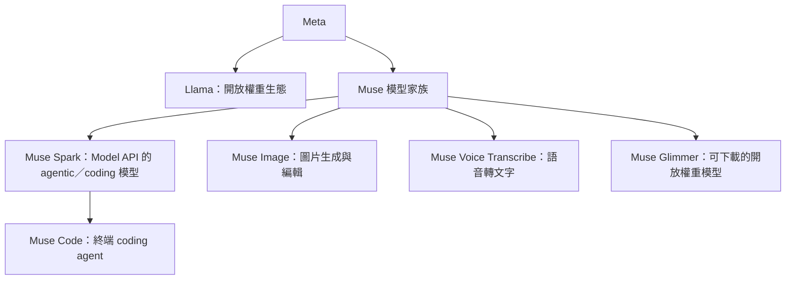

> 🌏 [English version](/posts/tech/2026-09-19-ai-model-family-muse-spark-en)

2026 年 4 月 8 日，Meta 發表 Muse Spark：一個原生多模態、會使用工具，也能把視覺觀察放進推理過程的模型。到了 9 月 2 日，Muse Spark 1.3 已經把重點從「展示能力」推進到「把長程工作做完」——少一點不必要的回合與贅字，多一點 coding、工具呼叫與多步任務的穩定性。這是「AI 模型家族」系列的第二十三篇。

先講清楚：Muse Spark 不是 Llama 5，也不是 Llama 4 的 API 改名。Llama 仍然是 Meta 的開放權重生態；Muse Spark 是另一條閉源、以 Meta Model API 為入口的模型線。把它們混在一起，會同時誤解授權、部署方式與產品策略。

怎麼解讀文中引用的 benchmark 數字，請參考[AI 模型評測來源指南](/posts/tech/2026-08-24-ai-model-evaluation-sources)。這篇是[AI 模型用途總覽](/posts/tech/2026-08-24-ai-model-landscape-overview)系列的一部分；Muse Code 的 harness 細節另見[Meta Muse Code：用訓練權換八折定價](/posts/tech/2026-08-24-muse-code-meta-coding-agent)。

## 家族演化時間線

| 時間 | 版本 | 關鍵里程碑 |
|---|---|---|
| 2026-04-08 | Muse Spark（本文以 1.0 指首發） | 原生多模態推理、工具使用、視覺鏈式思考與多 agent 編排；先在 meta.ai 與 Meta AI app 推出，API 仍是封閉預覽 |
| 2026-07（官方文件列為 1.1） | Muse Spark 1.1 | 成為目前 Model API 文件中的第一個編號版本，開始把 coding、工具使用與多模態能力往開發者工作流收攏 |
| 2026-08-05 | Muse Spark 1.2＋Muse Code | 以 coding 為主要優化方向，並推出終端原生 coding agent Muse Code |
| 2026-09-02 | Muse Spark 1.3 | 最新 API 主力：長程 agentic 任務、coding、工具與瀏覽器操作；Standard／Contributor 兩種資料權利與定價層 |

這裡有一個命名陷阱：Meta 的公開頁面同時使用「Muse Spark」與 `muse-spark-1.1`、`muse-spark-1.2`、`muse-spark-1.3` 這類 API 型號。本文把 2026 年 4 月的首發稱為 1.0，是為了讓演化時間線好讀；**1.0 不是本文建議你在 API 呼叫中使用的 model ID**。實際開發應以官方 Model API 文件列出的型號為準。

## 先釐清：Muse 是家族，Spark 是模型線

Muse 不只有 Spark。Meta 目前的 Muse 家族可以分成四條產品線：

- **Muse Spark**：閉源、透過 API 使用，主打多步工具迴圈、coding、長 context 與多模態理解。
- **Muse Code**：不是另一個模型，而是建立在 Muse Spark 上的 coding agent／harness。
- **Muse Glimmer**：可下載、可在自有硬體運行的開放權重線，適合本地部署與研究，但不等於 Muse Spark API 的完整能力。
- **Muse Image／Muse Voice Transcribe**：同一家族中的專門模態產品，不應該拿來跟 Spark 的 coding 分數直接比較。

因此，這篇的「Muse Spark 家族」指的是 **Spark 的版本線**；「Muse 家族」則是包含 Image、Voice Transcribe 與 Glimmer 的更大產品集合。

## 1.0→1.3：從能力展示到工作迴圈

### 1.0：先把多模態與工具放進同一個模型

首發的 Muse Spark 把文字、圖片、影片、文件理解、工具使用與多 agent 編排放進同一個產品敘事。Meta 當時也承認，長程 agentic 系統與 coding workflow 仍是需要繼續投入的缺口。換句話說，1.0 先證明「模型可以看、可以想、可以叫工具」，還沒有把「連續幾十步都不失控」當成唯一目標。

這也是它與傳統聊天模型的差別：任務不是只產出一段答案，而是把觀察、規劃、工具結果與下一步行動串成一個可延續的 loop。

### 1.1：把模型帶進 API 開發者工作流

目前官方模型文件把 `muse-spark-1.1` 列為原始編號版本，並把它定位在 coding、工具使用與多模態理解。1.1 的意義不在於多了一個可記憶的副標題，而在於 Meta 開始把 Muse Spark 從消費者產品語言，轉成開發者可以串接的 API 模型。

這一步很重要：模型能力只有在穩定的 model ID、context、tool calling 與計費介面上，才會變成 agent harness 可以依賴的基礎設施。

### 1.2：coding 成為主軸，Muse Code 一起登場

2026 年 8 月 5 日，Meta 發表 Muse Spark 1.2 與 Muse Code。1.2 的重心是真實 coding workflow：讀 repo、提出修改、呼叫工具、執行測試，並在必要時重試。Muse Code 則把這套行為包成終端代理，提供 persistent sub-agent、worktree 隔離與可恢復的 event log。

這裡要分開看：

- **1.2 是模型版本**，決定理解、推理、工具呼叫與輸出行為。
- **Muse Code 是 agent harness**，決定任務怎麼拆解、子 agent 怎麼跑、檔案怎麼隔離、崩潰後怎麼恢復。

模型變強不等於 harness 自動變好；反過來，一個好的 harness 也不能把不適合長程任務的模型硬變成可靠工程師。

### 1.3：少跑幾步，把長程任務跑完

Muse Spark 1.3 在 2026 年 9 月 2 日推出。Meta 的發布說明把改進集中在可用性：相較 1.2，模型在不需要時會減少回合、降低贅字，並改善 coding 風格。Meta 工程師的內部比較還報告，1.3 大約少用 **20% 工具呼叫**與 **25% tokens**。

這兩個數字要當成**廠商自報的效率改善**，不是獨立第三方 benchmark。它們真正有價值的地方，是指出 1.3 的優化方向：不是單純把答案寫長，而是減少 agent loop 的摩擦，讓同一個任務用較少的工具往返完成。

1.3 也延續 1M token context，並支援文字、圖片、影片、PDF 等輸入，輸出以文字為主。官方文件特別提醒：**1.3 的音訊理解目前尚未完整支援**；需要音訊理解時，應改用 Muse Spark 1.2，或把語音任務交給 Muse Voice Transcribe。不要把「支援多模態」解讀成每一種模態都已成熟。

## Standard vs Contributor：折扣換的是資料權利

Muse Spark 1.3 有兩個容易混淆的 model ID：

| Tier | Model ID | Input（每 1M tokens） | Cached input | Output（每 1M tokens） | 資料使用 |
|---|---|---:|---:|---:|---|
| Standard | `muse-spark-1.3` | $1.25 | $0.15 | $4.25 | Meta 文件說明 prompt 與 completion 不用於訓練模型 |
| Contributor | `muse-spark-1.3-contributor` | $0.10 | $0.002 | $0.20 | 允許 Meta 使用 prompt 與 completion 改進未來模型 |

Contributor 不是比較小的模型，也不是比較慢的模型。它在官方文件中與 Standard 共用 1M context 與相同的輸入／輸出模態；真正差異是**資料權利與價格**。Contributor 的 input 價格是 Standard 的 8%，output 約是 4.7%，所以它很適合快速驗證、公開 repo 實驗與不敏感的整合測試。

但代價也直接：如果你的 prompt 含未公開程式碼、客戶資料、憑證、內部文件或個人資訊，Contributor 就不只是「便宜方案」，而是一個資料治理決策。目前的選擇不是把每一則請求細粒度切換，而是要嘛接受 Contributor 的訓練授權，要嘛使用 Standard。實務上可以這樣分：

- **個人公開專案、拋棄式 prototype**：可以先用 Contributor 壓低試驗成本。
- **公司 repo、客戶資料、合規場景**：預設 Standard，不要把敏感內容送進 Contributor。
- **需要本地控制、微調或完全自架**：看 Muse Glimmer 或 Llama，不要假設 Muse Spark API 權重可以下載。

價格是 2026-09-19 查到的官方頁面快照；上量前仍要重新確認 Model API 的費率、限流與地區可用性。

## Muse Code 與 Muse Glimmer：兩種完全不同的使用方式

### Muse Code：把模型放進終端工作流

Muse Code 是 Meta 的 coding agent，底層使用 Muse Spark。它的價值不在於再包一層聊天介面，而在於把 coding 任務需要的基礎設施補齊：子 agent、worktree、event log、崩潰恢復與工具執行。對已經在用 OpenCode、Claude Code 或其他終端 agent 的人，Muse Code 是「Meta 自己的 harness 實作」；對模型選型而言，它則是觀察 Muse Spark 在真實 coding loop 中怎麼被使用的窗口。

如果你想評估的是「Muse Spark 能不能幫我改程式」，不要只拿單輪 coding 題測一次。應該用同一批 repo 任務比較：

1. 第一次修改是否可編譯；
2. 測試失敗後會不會讀錯誤並修正；
3. 多檔修改是否保持上下文；
4. 工具呼叫是否重複、遺漏或陷入迴圈；
5. 最後 diff 是否小到可以 review。

這些才是 Muse Code 這類 harness 真正暴露模型品質的地方。

### Muse Glimmer：開放權重，但不是 API 的平替

Muse Glimmer 是 Meta 從 Muse Spark 蒸餾出的開放權重模型線，採用 Apache 2.0，可下載並在自有硬體運行。它解決的是另一類問題：資料不能出域、需要自架、想要修改推論棧，或希望掌握完整部署成本。

不要把 Glimmer 當成「免費版 Muse Spark 1.3」。開放權重代表部署自由，不代表 API 版本、工具生態、1M context 與服務等級完全相同。選型時要先問：你要的是 **Meta 託管的最新 agentic 行為**，還是 **可控制、可自架的模型權重**？這兩個需求通常不會由同一個產品同時滿足。

## 跟 Llama 的關係：不是接班，是雙軌

Llama 的優勢是生態：Hugging Face、Ollama、llama.cpp、vLLM、微調社群與本地部署工具都已經成熟。Muse Spark 的優勢則是另一套產品化路徑：閉源模型、託管 API、1M context、工具呼叫與 Meta 自己的 coding agent。

所以 Meta 的路線比較像：

- **Llama**：開放權重、社群部署、可微調，適合需要控制權與生態相容性的場景。
- **Muse Spark**：閉源託管、快速接入、以 agent workflow 為中心，適合想把模型、工具與 coding harness 一起產品化的團隊。
- **Muse Glimmer**：介於兩者之間，提供開放權重，但不保證複製 Spark API 的全部能力。

這不是簡單的「Meta 從開源轉向閉源」就能概括。更準確的說法是：Meta 同時保留 Llama 的開放生態，另外建立一條閉源的 agentic 產品線。對開發者來說，真正的選型問題不是「哪一條才是 Meta 的未來」，而是「我的任務需要控制權，還是需要託管的完整工作流」。

## Agent 開發者怎麼選

| 需求 | 建議 | 原因 |
|---|---|---|
| 建立 coding agent 或長程工具 loop | Muse Spark 1.3 Standard | 最新 agentic 定位、1M context、工具與多模態輸入；先保留資料權利 |
| 快速驗證公開 repo 或個人 prototype | Muse Spark 1.3 Contributor | 成本低，但只放不含敏感資料的內容 |
| 需要終端 coding 體驗 | Muse Code＋Muse Spark 1.3 | 直接評估模型在 sub-agent、worktree、測試與重試中的表現 |
| 需要自架、微調或資料不出域 | Muse Glimmer | 開放權重與部署控制權優先於託管 API 的最新行為 |
| 需要成熟開放生態與本地推論 | Llama | 工具鏈、社群與部署範例最完整 |
| 主要處理語音轉文字 | Muse Voice Transcribe，或 1.2 | 1.3 的音訊理解仍有官方限制 |
| 需要完整影片、圖片、PDF 理解 | Muse Spark 1.3 Standard | 多模態輸入與長 context 是主場，但仍要針對自己的文件類型實測 |

最小可行評估不要只問「哪個 benchmark 最高」。拿同一組 10–20 個真實任務，分別記錄完成率、工具呼叫數、總 token、重試次數、平均延遲與需要人工介入的步驟。對 agent 模型來說，**少一步正確的工具呼叫，往往比多一分單輪 benchmark 更有價值**。

## 使用時要記住的四個限制

1. **1M context 是上限，不是可用記憶的保證。** 長 repo、長影片與大量工具結果仍可能造成注意力稀釋、成本上升或關鍵資訊被淹沒。
2. **Contributor 的折扣有資料代價。** 便宜不等於免費；它交換的是未來模型改進的使用權。
3. **Muse Code 的分數不能直接等同 Muse Spark 的分數。** 前者包含 harness、工具與工作流設計，後者才是模型本身。
4. **官方 benchmark 要標明是誰測的。** 1.3 的工具呼叫與 token 改善是 Meta 的內部比較；第三方複現、不同 harness 與不同任務集可能給出不同結論。

## 整體來說

Muse Spark 的重點不是「Meta 又發了一個更大的 LLM」，而是 Meta 開始把模型行為、API 計費、資料權利與 coding harness 綁成一個完整產品。1.0 先建立多模態與工具基礎，1.2 把 coding 拉上主軸，1.3 則試圖減少長程 agent 任務中的無效回合與 token 浪費。

如果你的團隊需要最新託管 agentic 行為，先測 1.3 Standard；如果只是公開專案實驗，Contributor 的成本很有吸引力；如果你需要自架、微調或資料主權，轉看 Glimmer 與 Llama。不要把 Contributor 當生產預設，也不要把 Glimmer 當 Spark API 的免費替代品。

Muse Spark 真正值得追蹤的，不是單一版本分數，而是 Meta 能不能把「模型少犯錯、harness 少返工、開發者少監控」這三件事同時做好。

---

## 參考資料

- [Introducing Muse Spark：Meta AI Research，2026-04-08](https://ai.meta.com/blog/introducing-muse-spark-msl)
- [Introducing Muse Spark 1.3：Meta AI Research，2026-09-02](https://research.meta.ai/blog/introducing-muse-spark-1-3)
- [Muse Spark 1.3：Meta 模型頁](https://developer.meta.com/ai/models/muse-spark)
- [Model API Models：Muse Spark 版本、模態與 context](https://dev.meta.ai/docs/models)
- [Pricing and rate limits：Meta Model API](https://dev.meta.ai/docs/pricing-rate-limits)
- [Muse 家族概覽：Spark、Image、Voice Transcribe 與 Glimmer](https://dev.meta.ai/docs/overview)
- [Meet Muse Spark 1.2 and Muse Code：Meta AI Developer Blog](https://developer.meta.com/ai/resources/blog/build-with-muse-code)
- [Muse Code 文件](https://dev.meta.ai/docs/muse-code/)
- [站內延伸閱讀：Muse Code——Meta 的第一個 Coding Agent](/posts/tech/2026-08-24-muse-code-meta-coding-agent)
- [站內延伸閱讀：Llama——Meta 的開放權重路線](/posts/tech/2026-08-24-ai-model-family-llama)
