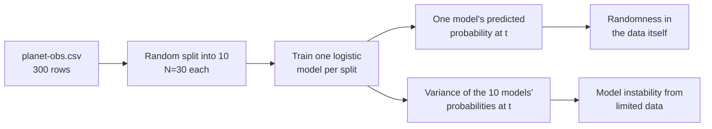

> 🌏 [中文版](/posts/tech/2026-09-29-harvard-cs181-hw2-classification-bias-variance)

> ⚠️ **Version and access**: This post follows [hw2 in the CS181 s26 homeworks repo](https://github.com/harvard-ml-courses/cs181-s26-homeworks/tree/main/hw2) (`hw2_release.tex/pdf/ipynb`) and the [official 2026 schedule](https://docs.google.com/spreadsheets/d/13sqhDtt1mYDFJ_vkeMpSVLg9T-aqdATKlch4VXFeOJQ). The Section 2 and 3 handouts are labeled **Spring 2026**. The lecture scribe notes on the course site come from the **2024 term** (lec08 is dated `2/15/24`), not from 2026 lectures. The course rates **A3, enough for self-study**: homework, data, and section solutions are public, but there are **no current recordings and no homework solutions**. Gradescope and Ed require enrollment.

[Harvard CS181](https://harvard-ml-courses.github.io/cs181-web/) (course number CS 1810 in 2026) titles HW2 **Classification and Bias-Variance Trade-offs**. Per `hw2_release.tex`, it is due February 27, 2026 at 11:59 PM, with four problems worth 30, 15, 30, and 15 points. The first line of the assignment states the scope:

> "This homework is about classification, bias-variance trade-offs, and uncertainty quantification."

[HW1](/posts/tech/2026-08-27-harvard-cs181-hw1-regression-en) was about continuous regression. HW2 switches the output to classes and asks a harder question: **when a model says "the probability of observing it is 0.3," and when 10 models disagree about the same point, is that the same kind of uncertainty?** This post walks through each problem around that question: what it tests and which section to prepare. **No solutions.**

## Course video sources

This article follows official notes, slides, or assignments. This check of the official public pages did not verify a public recording for the material covered here; it does not establish that no recording exists.

Course and recording entries:

- [harvard-cs181 — official course materials and recording index](https://harvard-ml-courses.github.io/cs181-web/syllabus)

## TL;DR

- **The thread through four problems**: Problem 1 goes from the bias-variance decomposition to two kinds of uncertainty. Problem 2 derives the MLE of a generative classifier. Problem 3 applies both to loan-applicant data with five classifiers. Problem 4 returns to gradient descent and ridge.
- **What to read first**: [Section 2](https://harvard-ml-courses.github.io/cs181-web/static/sec02/sec02.pdf) (Model Selection, Regularization, Gradient Descent) for Problems 1 and 4; [Section 3](https://harvard-ml-courses.github.io/cs181-web/static/sec03/sec03.pdf) (Classification) for Problems 2 and 3.
- **Code rules**: Problems 1 and 3 allow `numpy` and `scipy`, but not `scipy.optimize` or `sklearn`.
- **One step for tonight**: clone the repo, open `hw2_release.ipynb`, write `LogisticRegressor.fit` for Problem 1, and run it once on `basis1`.

## Where HW2 sits in the 2026 schedule

Per the official schedule, HW2 is released Friday, February 13, the day HW1 is due. When HW2 is due on February 27, HW3 is released. Its lectures fall in weeks 2–3:

| Week | Lectures (Tue / Thu) | Section | HW2 link |
|---|---|---|---|
| 2 | Evaluation / Model Selection / Validation / Gradient Descent | S1: Regression | CV in Problem 1, Problem 4 |
| 3 | Classification / Evaluation for Classification | S2: Model selection, regularization, gradient descent | Problems 1–3 |
| 4 | Richer Features / Neural Networks I | S3: Classification | Problems 2–3 (S3 runs during HW2) |

The S1 handout is labeled Spring 2025, so it is carried over. S2 and S3 are 2026 handouts, and both ship with a `_soln.pdf`.

The 2024 scribe notes work as supplements, as long as you remember they come from another term:

- [lec04](https://harvard-ml-courses.github.io/cs181-web/static/lec04/04-scribe-notes.pdf): basis expansion, loss options for classification, precision and recall
- [lec05](https://harvard-ml-courses.github.io/cs181-web/static/lec05/05-scribe-notes.pdf): discriminative vs. generative classification
- [lec06](https://harvard-ml-courses.github.io/cs181-web/static/lec06/06-scribe-notes.pdf): model selection, bias-variance, ridge and LASSO, bagging and boosting
- [lec03](https://harvard-ml-courses.github.io/cs181-web/static/lec03/03-scribe-notes.pdf) (probabilistic view, maximum likelihood) and [lec07](https://harvard-ml-courses.github.io/cs181-web/static/lec07/07-scribe-notes.pdf) (Bayesian model selection) are background. The 2026 schedule has no standalone Bayesian lecture.

## The core question: two kinds of uncertainty

Problem 1 puts both kinds of uncertainty on the same chart:

The left branch is "the model thinks this event is inherently probabilistic." The right branch is "change the training data and the model changes its answer." Part 5 asks you to compute both at `t = 0.1` and `t = 3.2` and compare where the uncertainty comes from. The labels aleatoric and epistemic are this post's borrowing. The assignment itself only says "two sources of predictive uncertainty."

## Problem 1: Planet observations and bias-variance (30 points)

A telescope in the northern hemisphere logs observation time (`Time`) and whether the planet was detected (`Observed`) in `data/planet-obs.csv`. The seven parts:

1. **Derive the MSE decomposition**: add and subtract `f(x)` to split the error into noise, bias², and variance. The target expression is given; you fill in the steps. [Section 2 §1.2](https://harvard-ml-courses.github.io/cs181-web/static/sec02/sec02.pdf) is a guided version of the same derivation.
2. **Logistic regression with three bases**: `basis1 = [1, t]` is provided. You choose the other two and state them in your writeup. Each basis runs gradient descent once per mini-dataset, 10 runs total, with learning rate `η = 0.001`, 1,000 steps, and the gradient averaged over data points.
3. **Compare with the true process**: a domain expert gives `f(t) = 0.4 × cos(1.1t + 1) + 0.5`. Use the provided plotting code to draw the true curve, each model, and the mean prediction. Explain in five sentences or fewer how bias and variance show up.
4. **What if N grows**: how do bias and variance change for each basis as N rises above 30? Five sentences or fewer.
5. **Two kinds of uncertainty**: see the previous section.
6. **Data from another telescope**: compare against `planet-obs-alternate.csv` and judge whether the funding agency's request to refit is reasonable. No modeling, ten lines or fewer.
7. **Cross-validation**: run 10-fold CV on the 10 splits and compare average error across the three bases.

**If you get stuck**: parts 3 and 4 hinge on keeping "a single model's curve" and "the mean curve" apart. For part 7, the notebook already provides signatures such as `stack_folds` to fill in.

## Problem 2: MLE for generative classification (15 points)

This problem is pure derivation. The setup is a K-class generative model with class prior `π_k` and Gaussian class-conditionals `N(x | μ_k, Σ)` sharing one covariance. The six parts derive, in order:

- the dataset log-likelihood
- `π̂_k` via a Lagrange multiplier on the constraint `Σπ_k = 1`
- the gradient with respect to `μ_k`, and `μ̂_k`
- the gradient with respect to `Σ`, and `Σ̂`

The problem supplies two [Matrix Cookbook](https://www.math.uwaterloo.ca/~hwolkowi/matrixcookbook.pdf) identities (derivatives of `a^T X^{-1} b` and `ln|det X|` with respect to a matrix) that you may use without proof. It also asks for one sentence each on why `π̂_k` and `μ̂_k` are intuitive.

Three things to confirm before you derive

- With one-hot labels, `y_i` is 1 only in the correct class slot, so the log-likelihood becomes a sum over `k` weighted by that indicator.
- `ln p(D)` splits into a prior term and a class-conditional term. The latter is constant when you differentiate with respect to `π`.
- The derivative with respect to `Σ` must be a matrix. The problem stresses this.

The Generative Models part of [Section 3 §2.2](https://harvard-ml-courses.github.io/cs181-web/static/sec03/sec03.pdf) and its two "Shapes of Decision Boundaries" exercises connect directly to this problem and to Problem 3's decision boundaries.

## Problem 3: Classifying loan applicants (30 points)

`data/hr.csv` holds 27 applicants in three classes: Automatically Rejected (13), Automatically Accepted (8), and Require Guarantor (6). The features are debt-to-income ratio and credit score. The assignment gives the transformed feature vector `x = [debt_income_ratio · 200/7 − 7.5, (credit_score − 500)/140 + 0.5]`.

You implement five classifiers:

| | Classifier | Details specified by the assignment |
|---|---|---|
| a | Gaussian generative, **shared** covariance | may reuse Problem 2 |
| b | Gaussian generative, **per-class** covariance | the staff version switches between a and b in a few lines |
| c | Multi-class softmax logistic regression | L2 with `λ = 0.001`, unregularized bias, `η = 0.001`, at most 200,000 iterations |
| d | Same as c, plus feature map `φ(x) = [ln(x₁+10), x₂²]` | |
| e | kNN with `k = 1` and `k = 5` | distance `(x₁−x₁')²/9 + (x₂−x₂')²` |

Then three questions. Plot every decision boundary and explain what drives the shapes. For an applicant with debt-to-income ratio 0.32 and credit score 350, report each model's class and the probabilities from c and d, and say what to watch for when predicting far from the training data. The last question is about ethics: what goes wrong when you train a loan classifier on past decisions?

**Self-checks**: the repo's [`T2_P3_TestCases.py`](https://github.com/harvard-ml-courses/cs181-s26-homeworks/blob/main/hw2/T2_P3_TestCases.py) provides `test_p3_softmax` and `test_p3_knn`, which compare softmax weights, kNN distances, and the `k=1` and `k=5` predictions. The header calls it "a sanity check for your classification implementations." It must sit in the same folder as your implementation.

The assignment warns that students in past years hit numerical stability issues on Problem 3 and suggests running on Google Colab. Graders take this into account.

## Problem 4: Gradient descent and ridge (15 points)

The data here is built with **highly correlated predictors**, so the OLS objective is ill-conditioned. The first four parts are derivations: the OLS gradient, the full-batch update, the ridge gradient, and a rewrite of the ridge update that makes shrinkage visible.

The last two parts live in the notebook. You implement gradients for both losses, write update steps for SGD, SGD with momentum, and Adam, then plot all six trajectories over contour plots. The assignment notes that in the unregularized case the data matrix is not full rank, so you will see a whole subspace of optima instead of a single point.

[Section 2 §2 (Regularization) and §3 (Gradient Descent)](https://harvard-ml-courses.github.io/cs181-web/static/sec02/sec02.pdf) cover every concept this problem needs, including the geometric intuition for ridge.

## Getting started

1. `git clone https://github.com/harvard-ml-courses/cs181-s26-homeworks` and enter `hw2/`.
2. Set up the environment from the notebook's first cell: `python3 -m venv venv`, `source venv/bin/activate`, `pip install -r requirements.txt` (pins include `numpy==2.2.3`, `scipy==1.15.1`, and `matplotlib==3.10.0`).
3. Start with Problem 1. Write `LogisticRegressor.fit`, run only `basis1`, and confirm the 10 curves plot before adding the other two bases.
4. After writing `SoftmaxRegression` and `KNNClassifier` for Problem 3, call the two tests in `T2_P3_TestCases.py`.
5. For derivations, check your method against the Section 2 and 3 `_soln.pdf` files. The homework itself has no official solutions.

Submission per the assignment: the writeup PDF goes to Gradescope `HW2` with pages assigned per question and all plots included; the `.tex` and code go to `HW2 - Supplemental`.

## Further reading

- [Stanford CS229 2026 notes, Chapter 2: classification and logistic regression](/posts/ai/2026-08-22-stanford-cs229-2026-notes-chapter-02-classification-logistic-regression-en): the same ideas from another course
- [Stanford CS229 guide](/posts/ai/2026-08-21-stanford-cs229-machine-learning-en)
- [Harvard AI/ML course map](/posts/learning/2026-08-22-harvard-ai-ml-course-map-en): where CS181 sits among Harvard courses

## Series navigation

- Previous: [HW1 Regression](/posts/tech/2026-08-27-harvard-cs181-hw1-regression-en)
- Next: [HW3 Kernels, Neural Networks, and Scaling Laws](/posts/tech/2026-09-29-harvard-cs181-hw3-kernels-neural-networks-scaling-en)
- Series overview: [CS181 overview](/posts/tech/2026-08-27-harvard-cs181-overview-en)

## Update Log

- 2026-10-10: Added course video sources and recording access notes.

## References

- [CS181 2026 course website](https://harvard-ml-courses.github.io/cs181-web/)
- [CS181 2026 schedule (course site page)](https://harvard-ml-courses.github.io/cs181-web/schedule)
- [CS181 2026 schedule (Google Sheet)](https://docs.google.com/spreadsheets/d/13sqhDtt1mYDFJ_vkeMpSVLg9T-aqdATKlch4VXFeOJQ)
- [s26 hw2 directory](https://github.com/harvard-ml-courses/cs181-s26-homeworks/tree/main/hw2)
- [hw2_release.tex](https://github.com/harvard-ml-courses/cs181-s26-homeworks/blob/main/hw2/hw2_release.tex)
- [hw2_release.pdf](https://github.com/harvard-ml-courses/cs181-s26-homeworks/blob/main/hw2/hw2_release.pdf)
- [hw2_release.ipynb](https://github.com/harvard-ml-courses/cs181-s26-homeworks/blob/main/hw2/hw2_release.ipynb)
- [T2_P3_TestCases.py](https://github.com/harvard-ml-courses/cs181-s26-homeworks/blob/main/hw2/T2_P3_TestCases.py)
- [Section 2: Model Selection (2026)](https://harvard-ml-courses.github.io/cs181-web/static/sec02/sec02.pdf) / [solutions](https://harvard-ml-courses.github.io/cs181-web/static/sec02/sec02_soln.pdf)
- [Section 3: Classification (2026)](https://harvard-ml-courses.github.io/cs181-web/static/sec03/sec03.pdf) / [solutions](https://harvard-ml-courses.github.io/cs181-web/static/sec03/sec03_soln.pdf)
- 2024 scribe notes: [lec03](https://harvard-ml-courses.github.io/cs181-web/static/lec03/03-scribe-notes.pdf), [lec04](https://harvard-ml-courses.github.io/cs181-web/static/lec04/04-scribe-notes.pdf), [lec05](https://harvard-ml-courses.github.io/cs181-web/static/lec05/05-scribe-notes.pdf), [lec06](https://harvard-ml-courses.github.io/cs181-web/static/lec06/06-scribe-notes.pdf), [lec07](https://harvard-ml-courses.github.io/cs181-web/static/lec07/07-scribe-notes.pdf)
- [The Matrix Cookbook](https://www.math.uwaterloo.ca/~hwolkowi/matrixcookbook.pdf)
- [Global AI/CS course map (A0–A3 access grades)](/posts/learning/2026-08-21-global-ai-cs-course-map-en)
