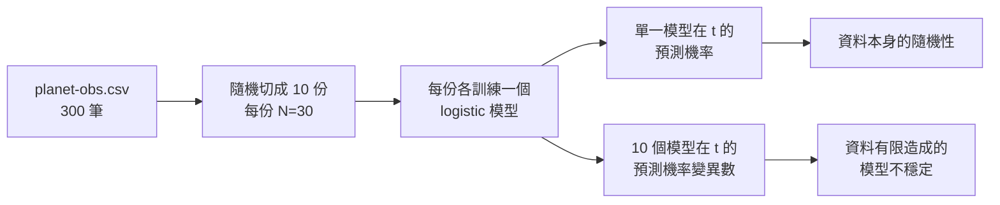

> 🌏 [English version](/posts/tech/2026-09-29-harvard-cs181-hw2-classification-bias-variance-en)

> ⚠️ **版本與存取**：本篇以 [CS181 s26 homeworks 的 hw2](https://github.com/harvard-ml-courses/cs181-s26-homeworks/tree/main/hw2)（`hw2_release.tex/pdf/ipynb`）與 [2026 官方 schedule](https://docs.google.com/spreadsheets/d/13sqhDtt1mYDFJ_vkeMpSVLg9T-aqdATKlch4VXFeOJQ) 為準。Section 2、3 講義標頭是 **Spring 2026**；課站上的 lecture scribe notes 是 **2024 學期**的筆記（lec08 標頭 `2/15/24`），不是 2026 的講課內容。整門課屬 **A3 足以自學**：作業、資料與 section 解答都公開，但**沒有當期錄影、沒有作業解答**，Gradescope／Ed 需要選課。

[Harvard CS181](https://harvard-ml-courses.github.io/cs181-web/)（2026 課號 CS 1810）的 HW2 標題是 **Classification and Bias-Variance Trade-offs**。依 `hw2_release.tex`，截止時間是 2026 年 2 月 27 日 23:59，共四題：30、15、30、15 分。作業開頭一句話講完它的範圍：

> "This homework is about classification, bias-variance trade-offs, and uncertainty quantification."

[上一篇 HW1](/posts/tech/2026-08-27-harvard-cs181-hw1-regression) 還在做連續值迴歸。HW2 把輸出換成類別，同時丟出一個更難的問題：**模型說「觀測到的機率是 0.3」，和「10 個模型在這點各說各話」，是同一種不確定嗎？** 本篇沿著這個問題逐題走，說明每題在考什麼、要準備哪份 section。**不給解答。**

## TL;DR

- **四題的主線**：Problem 1 從 bias-variance 分解推到兩種不確定性；Problem 2 推生成式分類器的 MLE；Problem 3 把前兩題用在貸款申請資料上，實作五種分類器；Problem 4 回頭看梯度下降與 ridge。
- **先讀哪份講義**：[Section 2](https://harvard-ml-courses.github.io/cs181-web/static/sec02/sec02.pdf)（Model Selection／Regularization／Gradient Descent）對 Problem 1、4；[Section 3](https://harvard-ml-courses.github.io/cs181-web/static/sec03/sec03.pdf)（Classification）對 Problem 2、3。
- **程式限制**：Problem 1、3 只能用 `numpy`／`scipy`，不能用 `scipy.optimize` 或 `sklearn`。
- **今晚能做的一步**：clone repo、開 `hw2_release.ipynb`，先把 Problem 1 的 `LogisticRegressor.fit` 寫出來，跑一次 `basis1`。

## HW2 在 2026 課表的位置

依官方 schedule，HW2 在 2 月 13 日（週五）發布，同一天 HW1 截止；2 月 27 日截止時 HW3 發布。它涵蓋的講題落在第 2–3 週：

| 週 | 講題（Tue／Thu） | Section | 對應 HW2 |
|---|---|---|---|
| 2 | Evaluation / Model Selection / Validation ／ Gradient Descent | S1: Regression | Problem 1 的 CV、Problem 4 |
| 3 | Classification ／ Evaluation for Classification | S2: Model selection, regularization, gradient descent | Problem 1–3 |
| 4 | Richer Features ／ Neural Networks I | S3: Classification | Problem 2–3（S3 在 HW2 期間） |

S1 的講義標頭是 Spring 2025，屬沿用版本。S2、S3 都是 2026 版，而且都附 `_soln.pdf`。

2024 的 scribe notes 可以當補充，但要記得它是另一個學期：

- [lec04](https://harvard-ml-courses.github.io/cs181-web/static/lec04/04-scribe-notes.pdf)：basis expansion、分類的損失函數選項、precision／recall
- [lec05](https://harvard-ml-courses.github.io/cs181-web/static/lec05/05-scribe-notes.pdf)：discriminative 與 generative 分類
- [lec06](https://harvard-ml-courses.github.io/cs181-web/static/lec06/06-scribe-notes.pdf)：model selection、bias-variance、ridge／LASSO、bagging／boosting
- [lec03](https://harvard-ml-courses.github.io/cs181-web/static/lec03/03-scribe-notes.pdf)（機率觀點與最大概似）與 [lec07](https://harvard-ml-courses.github.io/cs181-web/static/lec07/07-scribe-notes.pdf)（Bayesian model selection）屬背景，2026 課表沒有獨立的 Bayesian 講題

## 核心問題：兩種不確定性

Problem 1 的設計把兩種不確定性放在同一張圖上：

左邊那條是「模型認為這件事本來就有機率」。右邊那條是「換一批訓練資料，模型就改口」。作業在 1.5 小題要你在 `t = 0.1` 與 `t = 3.2` 兩點各算一次，並比較兩點的不確定性來源。這裡的名詞 aleatoric／epistemic 是本文借用的標籤，作業原文只寫 "two sources of predictive uncertainty"。

## Problem 1：行星觀測與 bias-variance（30 分）

情境是一台北半球望遠鏡，`data/planet-obs.csv` 記錄觀測時間 `Time` 與是否看到行星 `Observed`。七個小題依序是：

1. **推導 MSE 分解**：加減 `f(x)`，把誤差拆成 noise、bias²、variance 三項。題目已經給出目標式，要你補步驟。[Section 2 §1.2](https://harvard-ml-courses.github.io/cs181-web/static/sec02/sec02.pdf) 是同一個推導的引導版練習。
2. **三種基底的 logistic regression**：`basis1 = [1, t]` 已給，另外兩個基底自己選，寫進報告。每個基底在 10 個 mini-dataset 上各跑一次梯度下降，學習率 `η = 0.001`、1,000 步、梯度要對資料點取平均。
3. **對照真實過程**：專家告訴你 `f(t) = 0.4 × cos(1.1t + 1) + 0.5`。用給定的繪圖程式畫出真實曲線、各模型曲線與平均曲線，5 句以內解釋 bias 與 variance 各怎麼呈現。
4. **N 變大會怎樣**：從 30 增加時，三種基底的 bias 與 variance 各怎麼變。5 句以內。
5. **兩種不確定性**：見上一節。
6. **另一台望遠鏡的資料**：比較 `planet-obs-alternate.csv`，判斷資助單位要求重新建模是否合理。不用建模，10 行以內。
7. **Cross-validation**：用 10 份資料做 10-fold，比較三種基底的平均誤差。

**卡住時看哪裡**：第 3、4 小題的關鍵在於分清「單一模型曲線」與「平均曲線」各自代表什麼。第 7 小題的 notebook 已經給了 `stack_folds` 等函式簽名，可以照著填。

## Problem 2：生成式分類的 MLE（15 分）

這題純推導，設定是 K 類生成模型：類別先驗 `π_k`，類條件分布是共享共變異數的 Gaussian `N(x | μ_k, Σ)`。六個小題依序推出：

- 資料集的 log-likelihood
- 用 Lagrange multiplier（約束 `Σπ_k = 1`）推 `π̂_k`
- 對 `μ_k` 的梯度與 `μ̂_k`
- 對 `Σ` 的梯度與 `Σ̂`

題目附了兩條 [Matrix Cookbook](https://www.math.uwaterloo.ca/~hwolkowi/matrixcookbook.pdf) 公式（`a^T X^{-1} b` 與 `ln|det X|` 對矩陣的導數），可以直接引用、不必證明。作業也要求你對 `π̂_k` 和 `μ̂_k` 各說一句「為什麼這個答案很直觀」。

推導前先確認的三件事

- one-hot 編碼下，`y_i` 只在正確類別那一格是 1，log-likelihood 可以寫成對 `k` 的加總乘上指示值。
- `ln p(D)` 會拆成「先驗那一項」與「類條件那一項」，對 `π` 求導時後者是常數。
- 對 `Σ` 求導時，結果必須是一個矩陣。題目特別強調這點。

[Section 3 §2.2](https://harvard-ml-courses.github.io/cs181-web/static/sec03/sec03.pdf) 的 Generative Models 與兩題「Shapes of Decision Boundaries」練習，跟這題和 Problem 3 的決策邊界題直接相關。

## Problem 3：貸款申請分類（30 分）

`data/hr.csv` 有 27 筆申請資料，三個類別：Automatically Rejected（13 筆）、Automatically Accepted（8 筆）、Require Guarantor（6 筆），特徵是負債收入比與信用分數。作業已經給了轉換後的特徵式 `x = [debt_income_ratio · 200/7 − 7.5, (credit_score − 500)/140 + 0.5]`。

要實作的分類器有五種：

| | 分類器 | 作業指定細節 |
|---|---|---|
| a | Gaussian 生成式，**共享**共變異數 | 可沿用 Problem 2 |
| b | Gaussian 生成式，**各類別各自**的共變異數 | staff 版只改幾行就能切換 a／b |
| c | 多類 softmax logistic regression | L2 正則 `λ = 0.001`、bias 不正則、`η = 0.001`、最多 200,000 次迭代 |
| d | 同 c，加特徵轉換 `φ(x) = [ln(x₁+10), x₂²]` | |
| e | kNN，`k = 1` 與 `k = 5` | 距離 `(x₁−x₁')²/9 + (x₂−x₂')²` |

寫完後有三個問題：畫出所有分類器的決策邊界並解釋形狀差異；對「負債收入比 0.32、信用分數 350」這位申請者，報告各模型的分類與 c、d 的機率，並說明在離訓練資料很遠的點預測要注意什麼；最後一題是倫理題，問用過去的核貸決策訓練分類器會有什麼問題。

**自我檢查**：repo 裡的 [`T2_P3_TestCases.py`](https://github.com/harvard-ml-courses/cs181-s26-homeworks/blob/main/hw2/T2_P3_TestCases.py) 提供 `test_p3_softmax` 與 `test_p3_knn` 兩個函式，會比對 softmax 權重、kNN 距離與 `k=1`／`k=5` 的預測。檔頭說明它是 "a sanity check for your classification implementations"，要放在實作檔的同一個資料夾。

作業提醒過去幾年 Problem 3 常有數值穩定問題，建議改在 Google Colab 上跑，評分時也會考慮這點。

## Problem 4：梯度下降與 ridge（15 分）

這題的資料刻意設計成**預測變數高度相關**，讓 OLS 的目標函數病態。前四小題是推導：OLS 梯度、full-batch 更新式、ridge 梯度，以及把 ridge 更新改寫成能看出 shrinkage 的形式。

後兩小題在 notebook 裡：實作兩種損失的梯度，寫出 SGD、SGD + momentum、Adam 三種更新步驟，再畫出六條軌跡的等高線圖。作業提示在無正則的情況下，因為資料矩陣不滿秩，你會看到一整個最佳解子空間，而不是單一點。

[Section 2 §2（Regularization）與 §3（Gradient Descent）](https://harvard-ml-courses.github.io/cs181-web/static/sec02/sec02.pdf) 涵蓋這題需要的全部概念，包括 ridge 的幾何直覺。

## 開工步驟

1. `git clone https://github.com/harvard-ml-courses/cs181-s26-homeworks`，進 `hw2/`。
2. 照 notebook 第一格建立環境：`python3 -m venv venv`、`source venv/bin/activate`、`pip install -r requirements.txt`（鎖定 `numpy==2.2.3`、`scipy==1.15.1`、`matplotlib==3.10.0` 等）。
3. 先做 Problem 1：寫 `LogisticRegressor.fit`，只跑 `basis1`，確認 10 條曲線畫得出來再加另外兩個基底。
4. Problem 3 寫完 `SoftmaxRegression` 與 `KNNClassifier` 後，呼叫 `T2_P3_TestCases.py` 的兩個測試。
5. 推導題對照 Section 2、3 的 `_soln.pdf` 檢查方法，但作業本身沒有官方解答。

繳交方式依作業說明：writeup PDF 交到 Gradescope `HW2`，每題要 assign pages，圖要放進 PDF；`.tex` 與程式碼交到 `HW2 - Supplemental`。

## 延伸閱讀

- [Stanford CS229 2026 筆記第 2 章：分類與 logistic regression](/posts/ai/2026-08-22-stanford-cs229-2026-notes-chapter-02-classification-logistic-regression)：同一套分類概念的另一種講法
- [Stanford CS229 導讀](/posts/ai/2026-08-21-stanford-cs229-machine-learning)
- [Harvard AI／ML 課程地圖](/posts/learning/2026-08-22-harvard-ai-ml-course-map)：CS181 在 Harvard 課程裡的位置

## 系列導覽

- 上一篇：[HW1 迴歸](/posts/tech/2026-08-27-harvard-cs181-hw1-regression)
- 下一篇：[HW3 核方法、神經網路與 Scaling Law](/posts/tech/2026-09-29-harvard-cs181-hw3-kernels-neural-networks-scaling)
- 系列總覽：[CS181 導讀總覽](/posts/tech/2026-08-27-harvard-cs181-overview)

## 參考資料

- [CS181 2026 課程網站](https://harvard-ml-courses.github.io/cs181-web/)
- [CS181 2026 schedule（課站頁面）](https://harvard-ml-courses.github.io/cs181-web/schedule)
- [CS181 2026 schedule（Google Sheet）](https://docs.google.com/spreadsheets/d/13sqhDtt1mYDFJ_vkeMpSVLg9T-aqdATKlch4VXFeOJQ)
- [s26 hw2 目錄](https://github.com/harvard-ml-courses/cs181-s26-homeworks/tree/main/hw2)
- [hw2_release.tex](https://github.com/harvard-ml-courses/cs181-s26-homeworks/blob/main/hw2/hw2_release.tex)
- [hw2_release.pdf](https://github.com/harvard-ml-courses/cs181-s26-homeworks/blob/main/hw2/hw2_release.pdf)
- [hw2_release.ipynb](https://github.com/harvard-ml-courses/cs181-s26-homeworks/blob/main/hw2/hw2_release.ipynb)
- [T2_P3_TestCases.py](https://github.com/harvard-ml-courses/cs181-s26-homeworks/blob/main/hw2/T2_P3_TestCases.py)
- [Section 2：Model Selection（2026）](https://harvard-ml-courses.github.io/cs181-web/static/sec02/sec02.pdf)／[解答](https://harvard-ml-courses.github.io/cs181-web/static/sec02/sec02_soln.pdf)
- [Section 3：Classification（2026）](https://harvard-ml-courses.github.io/cs181-web/static/sec03/sec03.pdf)／[解答](https://harvard-ml-courses.github.io/cs181-web/static/sec03/sec03_soln.pdf)
- 2024 scribe notes：[lec03](https://harvard-ml-courses.github.io/cs181-web/static/lec03/03-scribe-notes.pdf)、[lec04](https://harvard-ml-courses.github.io/cs181-web/static/lec04/04-scribe-notes.pdf)、[lec05](https://harvard-ml-courses.github.io/cs181-web/static/lec05/05-scribe-notes.pdf)、[lec06](https://harvard-ml-courses.github.io/cs181-web/static/lec06/06-scribe-notes.pdf)、[lec07](https://harvard-ml-courses.github.io/cs181-web/static/lec07/07-scribe-notes.pdf)
- [The Matrix Cookbook](https://www.math.uwaterloo.ca/~hwolkowi/matrixcookbook.pdf)
- [世界名校 AI／CS 課程地圖（A0–A3 分級）](/posts/learning/2026-08-21-global-ai-cs-course-map)
