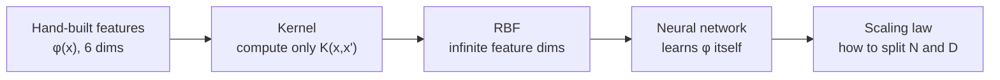

> 🌏 [中文版](/posts/tech/2026-09-29-harvard-cs181-hw3-kernels-neural-networks-scaling)

**Video status: Checked: no corresponding recording link listed on the public official page.** [Source details](#course-video-sources)

> ⚠️ **Version and access**: This post follows [hw3 in the CS181 s26 homeworks repo](https://github.com/harvard-ml-courses/cs181-s26-homeworks/tree/main/hw3) and the [official 2026 schedule](https://docs.google.com/spreadsheets/d/13sqhDtt1mYDFJ_vkeMpSVLg9T-aqdATKlch4VXFeOJQ). Sections 4 and 5 are **Spring 2026** handouts. The NN and SVM scribe notes on the course site come from the **2024 term** (lec10 is dated `2/22/24`). The 2026 Neural Networks II/III, CNN, and scaling-law lectures have no public notes, and this post does not guess at their content. The course rates **A3**: homework and section solutions are public, with no public recording links listed for the corresponding lectures and no homework solutions.

[Harvard CS181](https://harvard-ml-courses.github.io/cs181-web/) titles HW3 **Neural Networks and Kernels**. Per `hw3_release.tex`, it is due March 23, 2026 at 11:59 PM. The three problems are worth 30, 20, and 50 points. Half the grade goes to the third problem: **measuring a scaling law yourself**.

In [HW2](/posts/tech/2026-09-29-harvard-cs181-hw2-classification-bias-variance-en), every feature was a hand-picked basis. HW3 follows one line: hand-built feature maps → kernels that let feature dimension go to infinity → neural networks that learn their own features → how far to scale the model and the data. This post covers each problem's requirements and matching handouts. **No solutions.**

## Course video sources

Checked the official CS1810 Spring 2026 schedule and syllabus. This guide uses homework, section, or exam materials; the corresponding entries do not list a public lecture video. Slides and section materials are provided. No public listing does not mean that a recording never existed.

Official sources:

- [CS1810 Spring 2026 official schedule](https://docs.google.com/spreadsheets/d/13sqhDtt1mYDFJ_vkeMpSVLg9T-aqdATKlch4VXFeOJQ/edit?usp=sharing)
- [CS1810 Spring 2026 syllabus](https://harvard-ml-courses.github.io/cs181-web/syllabus)

Checked on 2026-10-10.

## TL;DR

- **Problem 1 (30 points)**: expand the polynomial kernel into 6 features, see concentric circles become separable in `(x₁, x₂, x₁²+x₂²)`, rewrite ridge in terms of dual coefficients `α`, then take the two limits of the RBF kernel.
- **Problem 2 (20 points)**: shape checks and backprop partials for a two-layer sigmoid MLP, plus one forward-mode autodiff exercise.
- **Problem 3 (50 points)**: a depth-scaled ResNet on Fashion-MNIST. Measure `α̂` and `β̂`, derive the compute-optimal split under `C ≈ 6ND`, and answer the Chinchilla question.
- **Read first**: the assignment points to [Section 4 (Richer Features and Neural Networks)](https://harvard-ml-courses.github.io/cs181-web/static/sec04/sec04.pdf). For Problem 3, add the ResNet and PyTorch parts of [Section 5](https://harvard-ml-courses.github.io/cs181-web/static/sec05/sec05.pdf).
- **Timing**: the March 10 midterm and spring break both fall inside the HW3 window.

## Where HW3 sits in the 2026 schedule

HW3 is released February 27, the day HW2 is due, and is due March 23, the first Monday after spring break, when HW4 is released.

| Week | Lectures (Tue / Thu) | Section |
|---|---|---|
| 4 | Richer Features / Neural Networks I | S3: Classification |
| 5 | Neural Networks II / Neural Networks III / CNNs | S4: Kernel methods and NNs |
| 6 | Representation Learning / Autoencoders / Transformers | S5: NN training and architectures (with a Colab tutorial) |
| 7 | **Midterm (in-class, 3/10)** / Non-parametric Models / Decision Trees | — |
| 8 | Spring Break | — |

The 2024 scribe notes work as supplements if you label the year: [lec08](https://harvard-ml-courses.github.io/cs181-web/static/lec08/08-scribe-notes.pdf) (neural networks, the XOR and rings examples), [lec09](https://harvard-ml-courses.github.io/cs181-web/static/lec09/09-scribe-notes.pdf) (backprop), and [lec10](https://harvard-ml-courses.github.io/cs181-web/static/lec10/10-scribe-notes.pdf) and [lec11](https://harvard-ml-courses.github.io/cs181-web/static/lec11/11-scribe-notes.pdf) (SVMs: max margin, hard and soft margin, the dual). The 2026 schedule has no standalone SVM lecture. HW3 touches support vectors only in Problem 1, part 3(d).

## The line through this assignment



[Section 4](https://harvard-ml-courses.github.io/cs181-web/static/sec04/sec04.pdf) follows nearly the same arc. §1 goes from ridge regression in feature space to kernel methods. §2 covers the perceptron, how neural networks learn features, universal approximation, and ends with a forward/backward pass exercise.

## Problem 1: Kernels and feature maps (30 points)

Four parts:

1. **Expand the polynomial kernel**: expand `K(x, x') = (1 + xᵀx')²` for `x ∈ ℝ²`, find `φ: ℝ² → ℝ⁶`, and check both sides match at `x = (1,0)`, `x' = (1,1)`.
2. **Visualize**: the notebook generates 400 points in concentric circles (inner radius about 0.5, outer about 1.5). Plot them in the original space and judge linear separability. Then make a 3D scatter of `(x₁, x₂, x₁²+x₂²)`. Finally fit ridge regression in feature space with pure `numpy` and `λ = 0.01`, and plot the decision boundary.
3. **From feature space to kernel space**: show that with `α = (K + λI)⁻¹y`, the prediction is `f(x*) = Σ α_n K(x_n, x*)`. The hint is to set `w = Φᵀα` and substitute into the normal equations. Then implement kernel ridge, size each training point by `|α_n|`, see which points carry the most weight, and reason about which would become SVM support vectors.
4. **The RBF kernel**: split `exp(−‖x−x'‖²/2σ²)` into a product of three exponentials, Taylor-expand the coupling term, explain why RBF requires the kernel trick, and prove the limiting behavior as `σ → 0` and `σ → ∞`.

**If you get stuck**: for the proof in part 3, Section 4 §1.2 decomposes `w = w∥ + w⊥` to show the optimum lies in the span of the training features. It is the same idea written another way.

## Problem 2: Neural networks (20 points)

The architecture is `ŷ = σ(W₂ σ(W₁x + b₁) + b₂)` for binary classification with cross-entropy loss. Three parts:

- Give the shapes of `W₁, b₁, W₂, b₂` and the intermediates `a₁, z₁, a₂` in terms of `N`, `M`, and `H`. The problem says outright that checking shapes is a main way to debug.
- For a single data point, find `∂L/∂b₂`, `∂L/∂W₂ʰ`, `∂L/∂b₁ʰ`, and `∂L/∂W₁ʰʲ`.
- Forward-mode autodiff: `f(x₁, x₂) = ln(sin x₁) + x₁ exp(x₂)` is already split into `v₁…v₇`. At `x₁ = π/6`, `x₂ = 1`, compute every intermediate value and its derivative with respect to `x₁`.

<details>
<summary>A suggested warm-up order</summary>

Do the scalar two-layer network in [Section 5 §1.2](https://harvard-ml-courses.github.io/cs181-web/static/sec05/sec05.pdf) first. It has concrete numbers (`x = 2, y = 1, w₁ = 0.5`, ...). Work it by hand, then come back to the vector version. Section 5 also lists the derivatives of ReLU, sigmoid, and tanh, and notes that the sigmoid derivative peaks at 1/4, which matters for vanishing gradients.

</details>

## Problem 3: Neural scaling laws (50 points)

The assignment uses this empirical form:

```text
L(N, D) ≈ a / N^α  +  b / D^β  +  L∞
```

`N` is the number of trainable parameters and `D` the number of training samples. The assignment reads the three terms through bias-variance: `a/N^α` is approximation error, `b/D^β` is estimation error, and `L∞` is irreducible error. It is also explicit:

> "There is no first-principles derivation of *why* this particular functional form holds, it is an empirical observation."

**Architecture**: base channel width `C = 64` stays fixed; only the number of residual blocks `K` changes. The stem is `Conv2d → BatchNorm2d → ReLU → MaxPool2d(2)`, followed by `K` ResBlocks, and the head is `AdaptiveAvgPool2d(1) → Flatten → Linear(C, 10)`. [Fashion-MNIST](https://github.com/zalandoresearch/fashion-mnist) has 60,000 training and 10,000 test images, 28×28, single channel.

Three parts:

| Part | Points | What you do |
|---|---|---|
| (a) | 22 | Write the parameter count `N(K)` and the training code. Fix `K = 12` and train on seven dataset sizes `D ∈ {1000, …, 50000}`. Make two log-log plots, fit `α̂`, `β̂`, and R², and explain why you subtract `L̂∞` before taking the log |
| (b) | 10 | Assume `C_compute ≈ 6ND`, substitute the constraint, minimize over `N`, and show `N* ∝ C^{β/(α+β)}` and `D* ∝ C^{α/(α+β)}`. Use your exponents to say how much `N` and `D` should grow when compute doubles. Then: how does the strategy change if α ≫ β or α ≪ β? |
| (c) | 8 | Predict the loss at `D = 60000` from the fitted law alone, then train it and compare. Also: how much data would `K = 12` need to match the 0.2195 that `K = 18` reaches on the full dataset? |

The last question in (b) cites Chinchilla ([Hoffmann et al., 2022](https://arxiv.org/abs/2203.15556)). The assignment says that work found `α ≈ β` for large language models, so `N` and `D` should scale equally.

**Before you run anything**:

- The notebook ships **precomputed** model-sweep results for `K ∈ {1, 2, 3, 5, 8, 12, 18}` on the full dataset. What you mainly train yourself is the `K = 12` data sweep and the verification run in (c).
- The config uses `MAX_EPOCHS = 40` with early stopping and a fixed seed of 181.
- Some notebook text disagrees with the `.tex`. For example, one markdown cell says dataset sizes run from 500 to 40,000, while the code's `D_VALUES` runs from 1,000 to 50,000. Treat the `.tex` as authoritative and ask on Ed when unsure.
- [Section 5 §3](https://harvard-ml-courses.github.io/cs181-web/static/sec05/sec05.pdf) points to a Google Colab tutorial on training a ResNet on MNIST. The link sits in the S5 column of the official schedule.

## Getting started

1. `git clone https://github.com/harvard-ml-courses/cs181-s26-homeworks`, enter `hw3/`, create a venv from the notebook's first cell, and run `pip install -r requirements.txt`.
2. Start with Problem 1's derivations and the concentric-circles plots. You only need `numpy` and `matplotlib`.
3. Problem 2 is all pen and paper, which makes it good midterm review.
4. Problem 3 needs a GPU or patience. Start the data sweep early and write the (b) derivation while it trains.
5. Submit the writeup PDF to Gradescope `HW3` and the `.tex` and code to `HW3 - Supplemental`.

## Further reading

- [Stanford CS336: scaling laws foundations](/posts/ai/2026-08-22-cs336-scaling-laws-foundations-en) and [practice](/posts/ai/2026-08-22-cs336-scaling-laws-practice-en): the same question at large-model scale
- [CS224N: backprop and neural networks](/posts/ai/2026-08-22-cs224n-backprop-neural-nets-en)
- [CMU 11-785: backpropagation](/posts/ai/2026-08-22-cmu-11785-05-backpropagation-en)

## Series navigation

- Previous: [HW2 Classification and bias-variance](/posts/tech/2026-09-29-harvard-cs181-hw2-classification-bias-variance-en)
- Next: [Midterm checkpoint: auditing HW0–HW3 with the official checklist](/posts/tech/2026-09-29-harvard-cs181-midterm-checkpoint-en)
- Series overview: [CS181 overview](/posts/tech/2026-08-27-harvard-cs181-overview-en)

## Update Log

- 2026-10-10: Added explicit video status and checked recording sources and access notes.

## References

- [CS181 2026 course website](https://harvard-ml-courses.github.io/cs181-web/)
- [CS181 2026 schedule (Google Sheet)](https://docs.google.com/spreadsheets/d/13sqhDtt1mYDFJ_vkeMpSVLg9T-aqdATKlch4VXFeOJQ)
- [s26 hw3 directory](https://github.com/harvard-ml-courses/cs181-s26-homeworks/tree/main/hw3)
- [hw3_release.tex](https://github.com/harvard-ml-courses/cs181-s26-homeworks/blob/main/hw3/hw3_release.tex)
- [hw3_release.pdf](https://github.com/harvard-ml-courses/cs181-s26-homeworks/blob/main/hw3/hw3_release.pdf)
- [hw3_release.ipynb](https://github.com/harvard-ml-courses/cs181-s26-homeworks/blob/main/hw3/hw3_release.ipynb)
- [Section 4: Richer Features and Neural Networks (2026)](https://harvard-ml-courses.github.io/cs181-web/static/sec04/sec04.pdf) / [solutions](https://harvard-ml-courses.github.io/cs181-web/static/sec04/sec04_soln.pdf)
- [Section 5: Neural Network Training and Architectures (2026)](https://harvard-ml-courses.github.io/cs181-web/static/sec05/sec05.pdf) / [solutions](https://harvard-ml-courses.github.io/cs181-web/static/sec05/sec05_soln.pdf)
- 2024 scribe notes: [lec08](https://harvard-ml-courses.github.io/cs181-web/static/lec08/08-scribe-notes.pdf), [lec09](https://harvard-ml-courses.github.io/cs181-web/static/lec09/09-scribe-notes.pdf), [lec10](https://harvard-ml-courses.github.io/cs181-web/static/lec10/10-scribe-notes.pdf), [lec11](https://harvard-ml-courses.github.io/cs181-web/static/lec11/11-scribe-notes.pdf)
- [Hoffmann et al. (2022), Training Compute-Optimal Large Language Models](https://arxiv.org/abs/2203.15556)
- [Fashion-MNIST](https://github.com/zalandoresearch/fashion-mnist)
