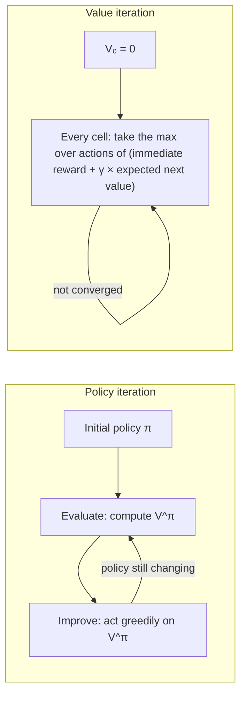

> 🌏 [中文版](/posts/tech/2026-09-29-harvard-cs181-hw6-mdp-planning)

> ⚠️ **Version and access**: Based on [CS1810 Spring 2026 HW6](https://github.com/harvard-ml-courses/cs181-s26-homeworks/tree/main/hw6) (`hw6_release.tex/pdf/ipynb`, `img_input/gridworld.png`, due 2026-05-01), the [Section 10 notes](https://harvard-ml-courses.github.io/cs181-web/static/sec10/sec10.pdf), and the [2026 Lecture 21 MDP slides](https://drive.google.com/file/d/1RGWONNePmR07McdS_6H-vy_QWPSVevKG/view), all opened on 2026-09-29. The slide link comes from a topic cell in the [official schedule](https://docs.google.com/spreadsheets/d/13sqhDtt1mYDFJ_vkeMpSVLg9T-aqdATKlch4VXFeOJQ) (visible only in the xlsx export). The course as a whole is **A3**, but there are no recordings from this term and no homework solutions. This post gives no answers and does not publish convergence counts or final policies.

This is part 13 of the [Harvard CS181 weekly guide](/en/posts/tech/2026-08-27-harvard-cs181-overview-en). The previous part, [HW6 (Part 2)](/en/posts/tech/2026-09-29-harvard-cs181-hw6-hmm-kalman-en), dealt with HMMs, where the state evolves on its own and you only watch. Here the agent starts making decisions.

## Course video sources

This article follows official notes, slides, or assignments. This check of the official public pages did not verify a public recording for the material covered here; it does not establish that no recording exists.

Course and recording entries:

- [harvard-cs181 — official course materials and recording index](https://harvard-ml-courses.github.io/cs181-web/syllabus)

## Where it sits in the term

Per the [2026 official schedule](https://docs.google.com/spreadsheets/d/13sqhDtt1mYDFJ_vkeMpSVLg9T-aqdATKlch4VXFeOJQ), Week 12 covered Single-Agent MDPs on Tuesday (April 14) and Reinforcement Learning I on Thursday; Section 10, "MDPs and Reinforcement Learning", was the Tuesday of Week 13. HW6 was released April 17 and due May 1.

The [Lecture 21 slides](https://drive.google.com/file/d/1RGWONNePmR07McdS_6H-vy_QWPSVevKG/view) state the pivot from the previous lecture in one line: an HMM's state evolves passively through `p(z_{t+1} | z_t)`, while an MDP's state evolves through `p(s_{t+1} | s_t, a_t)`, which depends on the action you pick, and you want to maximize reward. The slides split the next two weeks into three parts: MDPs as "planning with a known model", RL 1 as "learning from unknown environments", and RL 2 as "scaling up with deep RL". Problem 2 belongs to the first.

## The setting: a robot collecting two parts

The [problem](https://github.com/harvard-ml-courses/cs181-s26-homeworks/blob/main/hw6/hw6_release.tex) tells a story: you want a robot to collect two parts in an environment and bring them to a goal, while avoiding areas where it would wear down the floor. You decide to model the environment as the Gridworld below, where each cell shows its reward (from [`gridworld.png`](https://github.com/harvard-ml-courses/cs181-s26-homeworks/blob/main/hw6/img_input/gridworld.png)):

| | Col 1 | Col 2 | Col 3 | Col 4 | Col 5 |
|---|---|---|---|---|---|
| **Row 1** | +4 | 0 | −10 | 0 | +20 |
| **Row 2** | 0 | 0 | −50 | 0 | 0 |
| **Row 3** | 0 (START) | 0 | −50 | 0 | +50 |
| **Row 4** | 0 | 0 | −20 | 0 | 0 |

The middle column is a wall of negative rewards, and the positive rewards sit on both sides: a small +4 near START, with +20 and +50 across the wall.

## Two special rules

**Moves can slip.** The actions are N, S, E, W. A move succeeds with probability 0.8 and slips to either side with probability 0.1 each, but never backwards. Bumping into the edge leaves you in place. Edge cells have no "slip off the map": the problem's example is that moving north from START succeeds with probability 0.9 and slips east with 0.1.

**Rewards arrive when you leave a cell.** Entering a cell gives no reward; you receive it after taking an action in that cell. The problem's example: moving east four times from START with no slipping yields rewards +0, +0, −50, +0, and you are now standing on the +50 cell. Whatever you do next, the next reward is +50.

Both rules are already built into the notebook helpers, so you never compute transition probabilities yourself. The problem says to use `get_reward` and `get_transition_prob` and forbids outside code.

## Mapping the MDP tuple onto the notebook

[Section 10](https://harvard-ml-courses.github.io/cs181-web/static/sec10/sec10.pdf) defines an MDP as `(S, A, P, R, γ)`. In [`hw6_release.ipynb`](https://github.com/harvard-ml-courses/cs181-s26-homeworks/blob/main/hw6/hw6_release.ipynb) these are:

| Element | In the notebook |
|---|---|
| S | 20 integer states, 0 at the top left and 19 at the bottom right (flattened row by row) |
| A | 0–3 for N, S, E, W |
| P | `get_transition_prob(s1, a, s2)`: the probability of landing in `s2` after taking `a` in `s1` |
| R | `get_reward(state)`: depends on the state only, not the action |
| γ | fixed at 0.7 for parts 1–3 |

The policy `pi` and value function `V` are both 1-D arrays of length 20. The policy is deterministic: one action per state.

## How policy iteration and value iteration differ

The two algorithms from Lecture 21 and Section 10:

- **Policy iteration** computes the current policy's value to convergence in every round, then changes the policy based on it. Section 10's Bellman equation says how: `V^π(s) = R(s) + γ Σ_{s'} p(s' | s, π(s)) V^π(s')` (reward written as state-only to match the homework).
- **Value iteration** doesn't wait for evaluation to converge; it takes the max over actions at every step. The slides describe it as merging evaluation and improvement "into one continuous step".

You write three functions:

| Function | What it does | Watch out |
|---|---|---|
| `policy_evaluation(pi, gamma)` | compute `V` for policy `pi` | closed form or iterative; iterative uses tolerance `theta = 0.0001` |
| `update_policy_iteration(V, gamma)` | **one step** of policy improvement from `V` | returns the new `pi` |
| `update_value_iteration(V, gamma)` | **one step** of value iteration | returns both the new `V` and its `pi` |

The outer loop is the provided `learn_strategy`, which calls your one-step updates repeatedly and stops when the largest change in `V` drops below `ct`.

Mechanism: why policy evaluation has a closed form

Once the policy is fixed, the Bellman equation is linear in the 20 unknowns `V(0)…V(19)`. Stack the transition probabilities into a 20×20 matrix `P_π` and the rewards into a vector `r`, and the equation reads `V = r + γ P_π V`, so `V = (I − γ P_π)^(-1) r`. The matrix is invertible when γ is below 1.

The problem allows this route or an iterative one. The iterative method applies `V ← r + γ P_π V` repeatedly until no cell changes by more than `theta`.

## Parts 3–5: thinking prompts

The second half of the problem stops asking for new algorithms and asks what you see and why:

- **Part 3**: plot the policy for each γ ∈ {0.6, 0.7, 0.8, 0.9} and describe the differences in a paragraph, with explanations. Consider: there is a small positive reward near START, the big positive rewards are across a wall of negative ones, and γ sets how much future reward is worth.
- **Part 4**: suppose the game ends on any positive-reward cell (you move to a zero-reward state you can't leave). How should the optimal policy change with γ? The problem wants intuition, not numbers.
- **Part 5**: we built a model, solved it, and then used the policy on a real robot. What's the value of that approach compared with running RL on the robot directly? What are its limitations (some of which also apply to RL)?

Part 5 rewards a second look at the story. The robot's task is "collect two parts, then deliver them", but the Gridworld state is only a location. If the state doesn't record whether the parts have been collected, can the model still express the original task? Lecture 21 raises the limitation when it discusses the Markov property: if states or actions from many steps ago affect later transitions and the state doesn't record them, acting optimally requires a policy that conditions on the whole history.

## Common sticking points

- **Mismatched filename**: the problem text tells you to edit `homework6.ipynb`, but the file in the repo is `hw6_release.ipynb`.
- **Two tolerances**: `theta` is the inner tolerance inside `policy_evaluation`; `ct` is the outer convergence tolerance in `learn_strategy`. Parts 1(d) and 2(c) have you vary `ct` (0.01, 0.001, 0.0001) and watch the iteration count.
- **The initial policy is all zeros**: `learn_strategy` initializes `pi` with `np.zeros`, meaning every cell starts by going north.
- **One step only**: `update_policy_iteration` and `update_value_iteration` each perform a single update; don't write the outer loop yourself.
- **Leave the plotting code alone**: parts 1(c) and 2(b) want the first four iterations' plots on one page, and the problem says not to modify the plotting code.

## Further reading

Posts on this site that approach the same ideas from another angle; they don't replace this one:

- [CS221 Lecture 7: MDPs I: Putting Uncertainty into State Transitions](/en/posts/ai/2026-08-22-stanford-cs221-lecture-07-mdp-value-iteration-en)
- [CS188 MDPs and Reinforcement Learning: From Value Iteration to Q-Learning](/en/posts/learning/2026-08-22-berkeley-cs188-mdp-reinforcement-learning-en)
- [CMU 07-280 Lecture 21: How Bellman Equations Solve Markov Decision Processes](/en/posts/ai/2026-08-22-cmu-07280-lecture-21-markov-decision-processes-en)

## Next

This problem assumes you have `get_transition_prob`. The next part, [HW6 (Part 4): Q-learning Swingy Monkey and Embedded EthiCS](/en/posts/tech/2026-09-29-harvard-cs181-hw6-q-learning-ethics-en), removes that assumption: the agent doesn't know the rules and must learn by trial and error.

## Update Log

- 2026-10-10: Added course video sources and recording access notes.

## References

- [CS1810 Spring 2026 HW6 problem set (hw6_release.tex)](https://github.com/harvard-ml-courses/cs181-s26-homeworks/blob/main/hw6/hw6_release.tex)
- [CS1810 Spring 2026 HW6 notebook (hw6_release.ipynb)](https://github.com/harvard-ml-courses/cs181-s26-homeworks/blob/main/hw6/hw6_release.ipynb)
- [HW6 Gridworld figure (img_input/gridworld.png)](https://github.com/harvard-ml-courses/cs181-s26-homeworks/blob/main/hw6/img_input/gridworld.png)
- [CS1810 2026 official schedule (Google Sheet)](https://docs.google.com/spreadsheets/d/13sqhDtt1mYDFJ_vkeMpSVLg9T-aqdATKlch4VXFeOJQ)
- [CS1810 2026 Lecture 21: Markov Decision Processes slides](https://drive.google.com/file/d/1RGWONNePmR07McdS_6H-vy_QWPSVevKG/view)
- [Section 10: Markov Decision Processes and Reinforcement Learning](https://harvard-ml-courses.github.io/cs181-web/static/sec10/sec10.pdf) ([solutions](https://harvard-ml-courses.github.io/cs181-web/static/sec10/sec10_soln.pdf))
- [CS181 2024 Lecture 21 scribe notes (policy iteration, value iteration)](https://harvard-ml-courses.github.io/cs181-web/static/lec21/21-scribe-notes.pdf)
- [Sutton & Barto, 2018. Reinforcement Learning: An Introduction (2nd ed.)](http://incompleteideas.net/book/RLbook2020.pdf) (listed on the course [Resources page](https://harvard-ml-courses.github.io/cs181-web/resources))
