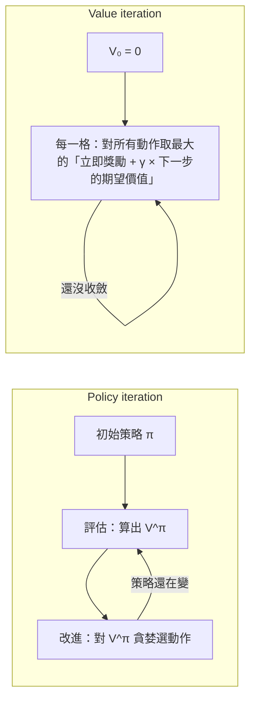

> 🌏 [English version](/en/posts/tech/2026-09-29-harvard-cs181-hw6-mdp-planning-en)

> ⚠️ **版本與存取**：以 [CS1810 Spring 2026 HW6](https://github.com/harvard-ml-courses/cs181-s26-homeworks/tree/main/hw6)（`hw6_release.tex/pdf/ipynb`、`img_input/gridworld.png`，due 2026-05-01）、[Section 10 講義](https://harvard-ml-courses.github.io/cs181-web/static/sec10/sec10.pdf)與 [2026 Lecture 21 MDP 投影片](https://drive.google.com/file/d/1RGWONNePmR07McdS_6H-vy_QWPSVevKG/view)為準，全部於 2026-09-29 實際打開。投影片連結來自[官方課表](https://docs.google.com/spreadsheets/d/13sqhDtt1mYDFJ_vkeMpSVLg9T-aqdATKlch4VXFeOJQ)講題儲存格（xlsx 匯出才看得到）。本課整體為 **A3**，但沒有當期錄影、沒有作業解答。本篇不附答案，也不公布收斂次數或最終策略。

這是 [Harvard CS181 逐週導讀](/posts/tech/2026-08-27-harvard-cs181-overview)的第 13 篇。上一篇 [HW6（二）](/posts/tech/2026-09-29-harvard-cs181-hw6-hmm-kalman)處理的是狀態自己演化、你只能觀察的 HMM。這篇讓 agent 開始做決定。

## 在學期裡的位置

依 [2026 官方課表](https://docs.google.com/spreadsheets/d/13sqhDtt1mYDFJ_vkeMpSVLg9T-aqdATKlch4VXFeOJQ)，Week 12 週二（4 月 14 日）講 Single-Agent MDPs，週四接 Reinforcement Learning I；Section 10「MDPs and Reinforcement Learning」在 Week 13 週二。HW6 在 4 月 17 日發布、5 月 1 日截止。

[Lecture 21 投影片](https://drive.google.com/file/d/1RGWONNePmR07McdS_6H-vy_QWPSVevKG/view)用一句話交代從上一講到這一講的轉折：HMM 的狀態透過 `p(z_{t+1} | z_t)` 被動演化，MDP 的狀態透過 `p(s_{t+1} | s_t, a_t)` 演化，也就是取決於你選的動作，而你要最大化獎勵。投影片把接下來兩週分成三段：MDP 是「已知模型的規劃」，RL 1 是「在未知環境裡學」，RL 2 是「用 deep RL 放大」。Problem 2 屬於第一段。

## 場景：撿兩個零件的機器人

[題目](https://github.com/harvard-ml-courses/cs181-s26-homeworks/blob/main/hw6/hw6_release.tex)的故事是：你想讓機器人在環境裡撿兩個零件、送到目標位置，同時避開某些會磨損地板的區域。你決定把環境建模成下面這張 Gridworld，每格標的是獎勵（依 [`gridworld.png`](https://github.com/harvard-ml-courses/cs181-s26-homeworks/blob/main/hw6/img_input/gridworld.png)）：

| | 第 1 欄 | 第 2 欄 | 第 3 欄 | 第 4 欄 | 第 5 欄 |
|---|---|---|---|---|---|
| **第 1 列** | +4 | 0 | −10 | 0 | +20 |
| **第 2 列** | 0 | 0 | −50 | 0 | 0 |
| **第 3 列** | 0（START） | 0 | −50 | 0 | +50 |
| **第 4 列** | 0 | 0 | −20 | 0 | 0 |

中間那一欄是負獎勵的牆，正獎勵分散在兩側：START 旁邊有一個小的 +4，對面有 +20 和 +50。

## 兩條特殊規則

**動作會打滑。** 動作是 N、S、E、W。往目標方向成功的機率是 0.8，另外各有 0.1 會滑到左右兩側，但不會往後退。撞牆時留在原地。靠邊的格子沒有「滑出地圖」這回事：題目的例子是從 START 往北走，成功 0.9、滑向東 0.1。

**獎勵在離開格子時才拿到。** 進入一格時不給獎勵，要在那一格採取動作之後才給。題目的例子：在沒有打滑的情況下從 START 往東走四次，拿到的獎勵依序是 +0、+0、−50、+0，此時人在 +50 那一格，下一個動作不管是什麼，都會拿到 +50。

這兩條規則已經寫在 notebook 的 helper 裡，你不需要自己算轉移機率。題目明寫要用 `get_reward` 和 `get_transition_prob`，而且不准用外部程式碼。

## MDP 五元組對到 notebook

[Section 10](https://harvard-ml-courses.github.io/cs181-web/static/sec10/sec10.pdf) 把 MDP 定義成 `(S, A, P, R, γ)`。在 [`hw6_release.ipynb`](https://github.com/harvard-ml-courses/cs181-s26-homeworks/blob/main/hw6/hw6_release.ipynb) 裡分別是：

| 元素 | notebook 裡的樣子 |
|---|---|
| S | 20 個整數狀態，0 是左上角、19 是右下角（逐列攤平） |
| A | 0–3 對應 N、S、E、W |
| P | `get_transition_prob(s1, a, s2)`：在 `s1` 採取動作 `a` 後到 `s2` 的機率 |
| R | `get_reward(state)`：只看狀態，不看動作 |
| γ | 第 1–3 小題固定 0.7 |

策略 `pi` 與價值函數 `V` 都是長度 20 的一維陣列。策略是確定性的，每個狀態只對一個動作。

## Policy iteration 與 value iteration 差在哪

Lecture 21 與 Section 10 給的兩個演算法：

- **Policy iteration** 每一輪都把目前策略的價值算到收斂，再根據它改策略。Section 10 的 Bellman 方程告訴你怎麼算：`V^π(s) = R(s) + γ Σ_{s'} p(s' | s, π(s)) V^π(s')`（這裡依作業設定，把獎勵寫成只看狀態）。
- **Value iteration** 不等評估收斂，每一步直接對動作取最大值。投影片的說法是它把評估和改進「合併成一個連續的步驟」。

作業要你寫三個函式：

| 函式 | 做什麼 | 注意 |
|---|---|---|
| `policy_evaluation(pi, gamma)` | 算出策略 `pi` 的 `V` | 可以用閉式解，也可以迭代；迭代時容忍度 `theta = 0.0001` |
| `update_policy_iteration(V, gamma)` | 根據 `V` 做**一步**策略改進 | 回傳新的 `pi` |
| `update_value_iteration(V, gamma)` | 做**一步** value iteration | 同時回傳新的 `V` 和對應的 `pi` |

外層迴圈由已經寫好的 `learn_strategy` 負責，它會反覆呼叫你的一步更新，並在 `V` 的最大變化量小於 `ct` 時停下。

機制：為什麼 policy evaluation 可以用閉式解

策略固定之後，Bellman 方程對 20 個未知數 `V(0)…V(19)` 是線性的。把轉移機率排成 20×20 的矩陣 `P_π`、獎勵排成向量 `r`，方程寫成 `V = r + γ P_π V`，所以 `V = (I − γ P_π)^(-1) r`。γ 小於 1 時這個矩陣可逆。

題目允許這條路，也允許迭代法。迭代法就是反覆套用 `V ← r + γ P_π V`，直到每一格的變化都不超過 `theta`。

## 小題 3–5：思考方向

作業後半段不再要你寫新的演算法，改問你看到什麼、為什麼：

- **第 3 小題**：用 γ ∈ {0.6, 0.7, 0.8, 0.9} 各畫一次策略，寫一段話描述差異並解釋。想一想：START 附近有一個小的正獎勵，大的正獎勵在負獎勵牆的另一邊，而 γ 決定未來的獎勵值多少錢。
- **第 4 小題**：如果踏上任何正獎勵格子之後遊戲就結束（轉到一個獎勵為 0、出不去的狀態），最佳策略會怎麼隨 γ 變化？題目說只要直覺，不需要數字。
- **第 5 小題**：我們先建模、解出策略、再拿到真的機器人上用。這跟直接在機器人上跑 RL 比，好處是什麼？這種建模方式有哪些限制（其中一些 RL 也有）？

第 5 小題值得回頭看故事本身。機器人的任務是「撿兩個零件再送到目標」，但 Gridworld 的狀態只有位置。狀態裡沒有記錄「零件撿了沒」時，這個模型還能表達原本的任務嗎？Lecture 21 講 Markov 性質的限制時提過：如果很多步以前的狀態或動作會影響之後的轉移，而狀態沒有記下來，想要表現最好就得用依賴整段歷史的策略。

## 常見卡點

- **檔名對不上**：題目文字要你改 `homework6.ipynb`，但 repo 裡的檔案叫 `hw6_release.ipynb`。
- **兩個容忍度**：`theta` 是 `policy_evaluation` 內層迭代的容忍度，`ct` 是 `learn_strategy` 外層判斷收斂的容忍度。第 1(d) 與 2(c) 小題要你改的是 `ct`（0.01、0.001、0.0001），觀察收斂所需的迭代次數。
- **初始策略全是 0**：`learn_strategy` 用 `np.zeros` 初始化 `pi`，也就是一開始每一格都往北。
- **只做一步**：`update_policy_iteration` 與 `update_value_iteration` 各只做一次更新，外層迴圈不要自己寫。
- **不要改畫圖程式**：第 1(c) 與 2(b) 小題要你把前四次迭代的四張圖放在同一頁，題目明寫不要修改畫圖程式碼。

## 延伸閱讀

站內從不同角度講同一批概念，不取代本篇：

- [CS221 Lecture 7：MDPs I：把隨機性放進狀態轉移](/posts/ai/2026-08-22-stanford-cs221-lecture-07-mdp-value-iteration)
- [CS188 MDP 與強化學習：從 Value Iteration 到 Q-Learning](/posts/learning/2026-08-22-berkeley-cs188-mdp-reinforcement-learning)
- [CMU 07-280 Lecture 21：Bellman Equation 如何解 Markov Decision Process](/posts/ai/2026-08-22-cmu-07280-lecture-21-markov-decision-processes)

## 下一篇

這題的前提是你知道 `get_transition_prob`。下一篇 [HW6（四）：Q-learning 玩 Swingy Monkey 與 Embedded EthiCS](/posts/tech/2026-09-29-harvard-cs181-hw6-q-learning-ethics) 拿掉這個前提：agent 不知道規則，只能從試錯裡學。

## 參考資料

- [CS1810 Spring 2026 HW6 題目（hw6_release.tex）](https://github.com/harvard-ml-courses/cs181-s26-homeworks/blob/main/hw6/hw6_release.tex)
- [CS1810 Spring 2026 HW6 notebook（hw6_release.ipynb）](https://github.com/harvard-ml-courses/cs181-s26-homeworks/blob/main/hw6/hw6_release.ipynb)
- [HW6 Gridworld 圖（img_input/gridworld.png）](https://github.com/harvard-ml-courses/cs181-s26-homeworks/blob/main/hw6/img_input/gridworld.png)
- [CS1810 2026 官方課表（Google Sheet）](https://docs.google.com/spreadsheets/d/13sqhDtt1mYDFJ_vkeMpSVLg9T-aqdATKlch4VXFeOJQ)
- [CS1810 2026 Lecture 21：Markov Decision Processes 投影片](https://drive.google.com/file/d/1RGWONNePmR07McdS_6H-vy_QWPSVevKG/view)
- [Section 10：Markov Decision Processes and Reinforcement Learning](https://harvard-ml-courses.github.io/cs181-web/static/sec10/sec10.pdf)（[解答](https://harvard-ml-courses.github.io/cs181-web/static/sec10/sec10_soln.pdf)）
- [CS181 2024 Lecture 21 scribe notes（policy iteration、value iteration）](https://harvard-ml-courses.github.io/cs181-web/static/lec21/21-scribe-notes.pdf)
- [Sutton & Barto, 2018. Reinforcement Learning: An Introduction（第二版）](http://incompleteideas.net/book/RLbook2020.pdf)（課程 [Resources 頁](https://harvard-ml-courses.github.io/cs181-web/resources)列出）
