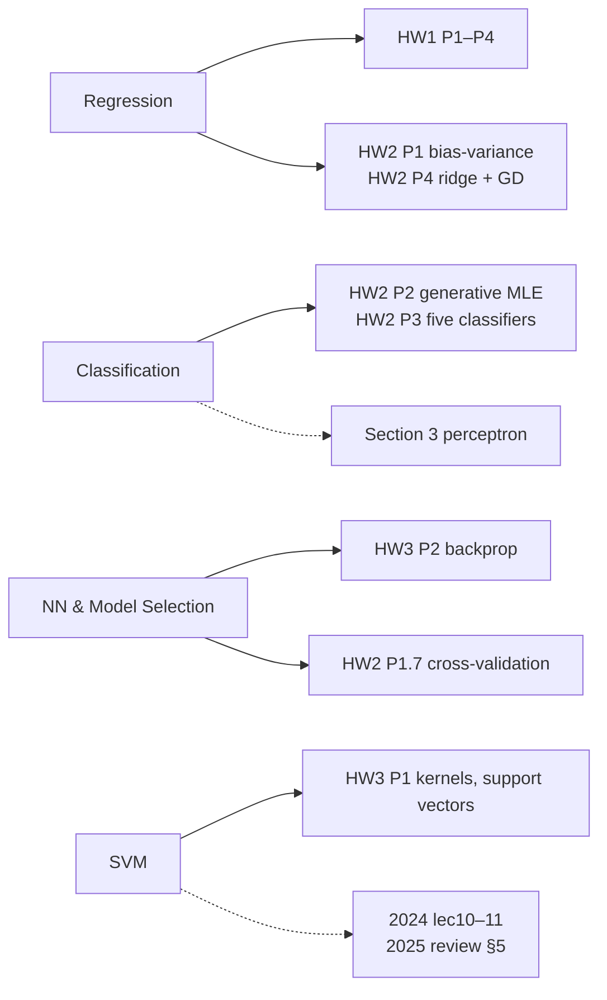

> 🌏 [中文版](/posts/tech/2026-09-29-harvard-cs181-midterm-checkpoint)

> ⚠️ **Version and access**: The exam date and weight come from the [official 2026 schedule](https://docs.google.com/spreadsheets/d/13sqhDtt1mYDFJ_vkeMpSVLg9T-aqdATKlch4VXFeOJQ) and the [2026 syllabus](https://harvard-ml-courses.github.io/cs181-web/syllabus). The exam resources under the course site's `static/` directory come from mixed years: **the midterm practice and midterm review are labeled 2025**, the notation glossary is dated March 2, 2025, and the midterm checklist and concept checks **carry no year**. You can open these PDFs by URL, but the site's navigation does not link them. The 2026 midterm and its solutions are not public.

[Harvard CS181](https://harvard-ml-courses.github.io/cs181-web/) holds its midterm on Tuesday of week 7, March 10, 2026, in class. Per the syllabus, it is worth 15% of the grade. It is closed-book, but you may bring one 8.5×11 sheet of notes, front and back.

The timing matters. HW2 is already in, and [HW3](/posts/tech/2026-09-29-harvard-cs181-hw3-kernels-neural-networks-scaling-en) is still open until March 23. So before the exam you have finished HW0–HW2 and are probably halfway through HW3. This post teaches nothing new. It does one thing: **hold the official checklist against the homework you have done and find where you actually understand something versus where you merely wrote an answer.**

The checklist says so directly:

> "For emphasis: the midterm is not about memorization but will be designed to test your conceptual and analytical understanding."

## TL;DR

- **Scope**: the [midterm checklist](https://harvard-ml-courses.github.io/cs181-web/static/midterm_checklist/midterm_checklist.pdf) has four blocks: Regression, Classification, Neural Networks & Model Selection, and SVMs. Each splits into "items to know" and "things to work through when given formulas," and some list "out of scope" items.
- **Gaps in the 2026 homework**: Bayesian posterior predictive and marginal likelihood, and SVM hard/soft margin, slack, and the parameter `C`, barely appear in 2026 HW0–HW3. Fill them with the 2025 review and the 2024 scribe notes.
- **Order of use**: checklist self-audit → concept checks → timed 2025 practice → check against solutions → back to the sections.
- **One step for tonight**: print the checklist and write, next to each line, the homework problem where you met it. The lines you cannot tag are this week's work.

## The five official resources

| Resource | Version | Contents | When to use |
|---|---|---|---|
| [Midterm checklist](https://harvard-ml-courses.github.io/cs181-web/static/midterm_checklist/midterm_checklist.pdf) | no year | 4 topics, each split into know / work through with formulas / out of scope | Step one, self-audit |
| [Concept checks](https://harvard-ml-courses.github.io/cs181-web/static/concept_checks/concept_checks.pdf) ([soln](https://harvard-ml-courses.github.io/cs181-web/static/concept_checks/concept_checks_soln.pdf)) | no year | 7 pages, 10 topics; the first 4 (linear regression, classification, model selection and NNs, SVMs) are midterm scope | Quick intuition check |
| [Midterm practice](https://harvard-ml-courses.github.io/cs181-web/static/midterm_practice/midterm_practice.pdf) ([soln](https://harvard-ml-courses.github.io/cs181-web/static/midterm_practice/midterm_practice_soln.pdf)) | 2025 | The 2025 Midterm Topic List, then 11 practice problems | Timed simulation |
| [Midterm review](https://harvard-ml-courses.github.io/cs181-web/static/midterm_review/midterm_review.pdf) ([soln](https://harvard-ml-courses.github.io/cs181-web/static/midterm_review/midterm_review_soln.pdf)) | Spring 2025 | Review-session handout: Regression, Classification, Model Selection, Neural Networks, SVM | Filling concept gaps |
| [Notation glossary](https://harvard-ml-courses.github.io/cs181-web/static/notation_glossary.pdf) | 2025-03-02 | Course notation: `X` is the N×D data matrix, `p(D; θ)` and `p(D\|θ)` are the frequentist and Bayesian likelihoods, and so on | When a symbol is unclear |

The 2025 practice opens with a warning: it includes many derivation questions, but the real exam has only a few, mixed with less technical conceptual questions. So don't practice only derivation speed.

## Mapping the checklist to the 2026 homework

The diagram maps the four topics to 2026 homework. Solid lines mean the homework drills it directly; dashed lines mean it shows up only in sections or older notes.

### 1. Regression

"Items to know" include the bias trick, least squares, deriving `w*`, basis functions, ridge and LASSO, how bias-variance relates to overfitting, and how priors relate to regularization in Bayesian linear regression.

- **Drilled**: [HW1](/posts/tech/2026-08-27-harvard-cs181-hw1-regression-en)'s Basis Regression and Probabilistic View of Regression and Regularization (deriving the MAP forms of ridge and LASSO under Gaussian and Laplace priors); [HW2](/posts/tech/2026-09-29-harvard-cs181-hw2-classification-bias-variance-en) Problem 1's bias-variance decomposition and Problem 4's ridge gradient.
- **Gap**: the checklist also lists the posterior, posterior predictive, marginal likelihood, and "given conjugate forms, find a posterior parameter." The 2026 schedule has no standalone Bayesian lecture, and the homework does not drill the last two. Fill them with the [2024 lec07 scribe notes](https://harvard-ml-courses.github.io/cs181-web/static/lec07/07-scribe-notes.pdf) (Bayesian model selection) and problem 5 of the 2025 practice, Bayesian Linear Regression.
- **Out of scope**: second-order or other advanced optimization methods, and conjugacy from memory.

### 2. Classification

"Items to know" include the roles of hinge, 0/1, and logistic loss; the intuition behind gradient descent and what happens when the learning rate is too high or too low; the perceptron's guarantee on linearly separable data; and generative (Naive Bayes) versus discriminative (logistic regression) models.

- **Drilled**: HW2 Problem 2 (generative MLE with a Lagrange multiplier) and Problem 3 (shared and separate covariance Gaussians, softmax, kNN). These match the checklist's "work with the full log-likelihood given priors and class-conditionals" and "compare parametric and non-parametric classifiers."
- **Only in sections**: the perceptron and ROC/AUC have exercises in [Section 3](https://harvard-ml-courses.github.io/cs181-web/static/sec03/sec03.pdf) but no 2026 homework problem. Naive Bayes also has no dedicated 2026 homework problem.

### 3. Neural Networks & Model Selection

"Items to know" cover why activation functions are needed, what backprop is for, the role of cross-validation and regularization in model selection, and using NNs for regression versus classification. "Work through" includes hand-deriving backprop, judging whether a small network can solve a task, and reasoning about architecture changes.

- **Drilled**: HW3 Problem 2's two-layer sigmoid backprop and forward-mode autodiff; HW2 Problem 1's 10-fold cross-validation.
- **Watch the timing**: if you pace yourself by the due date, you may not have finished HW3 Problem 2 before the exam. It happens to be the best pre-exam practice.

### 4. SVMs

"Items to know" include max margin, hinge loss, hard versus soft margin, the effect of `C`, the kernel trick, common kernels, and support vectors.

- **Drilled**: HW3 Problem 1's kernel expansion, the RBF limits, and guessing support vectors from dual coefficients `α`.
- **Gap**: hard/soft margin, slack variables, and `C` get no 2026 homework problem at all. Use [2024 lec10](https://harvard-ml-courses.github.io/cs181-web/static/lec10/10-scribe-notes.pdf), [lec11](https://harvard-ml-courses.github.io/cs181-web/static/lec11/11-scribe-notes.pdf), the SVM chapter of the 2025 review, and concept checks 8 and 9 (how `C` and the RBF `σ²` affect overfitting).
- **Out of scope**: deriving the SVM dual and interpreting its Lagrange multipliers, solving the full quadratic program by hand, and deriving the KKT conditions.

One honest caveat: the checklist carries no year, and its SVM and Bayesian items go beyond the 2026 lecture list. It may be carried over from a previous year. Enrolled students should follow the current scope announced on Ed. Self-learners without Ed access can treat these two blocks as extra preparation that costs little.

## A one-week review plan

1. **Day 1: self-audit.** Print the checklist, tag each line with a homework problem, and circle the ones you can't tag.
2. **Day 2: the first four sections of the concept checks.** Answer each in a sentence or two and compare with the solutions to catch skewed intuitions.
3. **Days 3–4: fill the circled items.** Go back to the Section 2, 3, and 4 handouts and their `_soln.pdf` files. For the Bayesian and SVM gaps, use the 2024 scribe notes and the 2025 review.
4. **Day 5: the 2025 practice, timed.** You don't need all 11 problems, but pick at least one each on regression, classification, NNs, and SVMs.
5. **Day 6: check solutions and build your note sheet.** Put what you keep forgetting on that double-sided sheet, and check notation against the glossary.

**What not to do**: read the solutions as your review. The practice solutions are worth something only after you have written your own answer. Reading them first just convinces you that you already know it.

## Further reading

- [Stanford CS229 guide](/posts/ai/2026-08-21-stanford-cs229-machine-learning-en): most checklist topics, explained by another course
- [Global AI/CS course map](/posts/learning/2026-08-21-global-ai-cs-course-map-en): the basis for the A0–A3 grades

## Series navigation

- Previous: [HW3 Kernels, Neural Networks, and Scaling Laws](/posts/tech/2026-09-29-harvard-cs181-hw3-kernels-neural-networks-scaling-en)
- Next: [HW4 (Part 1): Transformers, from hand-computed attention to multi-head](/posts/tech/2026-09-29-harvard-cs181-hw4-transformer-en)
- Look back: [HW0](/posts/tech/2026-08-27-harvard-cs181-hw0-linear-algebra-review-en), [HW1](/posts/tech/2026-08-27-harvard-cs181-hw1-regression-en), [HW2](/posts/tech/2026-09-29-harvard-cs181-hw2-classification-bias-variance-en)
- Series overview: [CS181 overview](/posts/tech/2026-08-27-harvard-cs181-overview-en)

## References

- [CS181 2026 course website](https://harvard-ml-courses.github.io/cs181-web/)
- [CS181 2026 syllabus](https://harvard-ml-courses.github.io/cs181-web/syllabus) (grading, exam rules)
- [CS181 2026 schedule (Google Sheet)](https://docs.google.com/spreadsheets/d/13sqhDtt1mYDFJ_vkeMpSVLg9T-aqdATKlch4VXFeOJQ)
- [Midterm checklist](https://harvard-ml-courses.github.io/cs181-web/static/midterm_checklist/midterm_checklist.pdf)
- [2025 Midterm practice](https://harvard-ml-courses.github.io/cs181-web/static/midterm_practice/midterm_practice.pdf) / [solutions](https://harvard-ml-courses.github.io/cs181-web/static/midterm_practice/midterm_practice_soln.pdf)
- [Spring 2025 Midterm review](https://harvard-ml-courses.github.io/cs181-web/static/midterm_review/midterm_review.pdf) / [solutions](https://harvard-ml-courses.github.io/cs181-web/static/midterm_review/midterm_review_soln.pdf)
- [Concept checks](https://harvard-ml-courses.github.io/cs181-web/static/concept_checks/concept_checks.pdf) / [solutions](https://harvard-ml-courses.github.io/cs181-web/static/concept_checks/concept_checks_soln.pdf)
- [Notation glossary](https://harvard-ml-courses.github.io/cs181-web/static/notation_glossary.pdf)
- [s26 homeworks](https://github.com/harvard-ml-courses/cs181-s26-homeworks)
- [Section 3: Classification (2026)](https://harvard-ml-courses.github.io/cs181-web/static/sec03/sec03.pdf)
- 2024 scribe notes: [lec07](https://harvard-ml-courses.github.io/cs181-web/static/lec07/07-scribe-notes.pdf), [lec10](https://harvard-ml-courses.github.io/cs181-web/static/lec10/10-scribe-notes.pdf), [lec11](https://harvard-ml-courses.github.io/cs181-web/static/lec11/11-scribe-notes.pdf)
