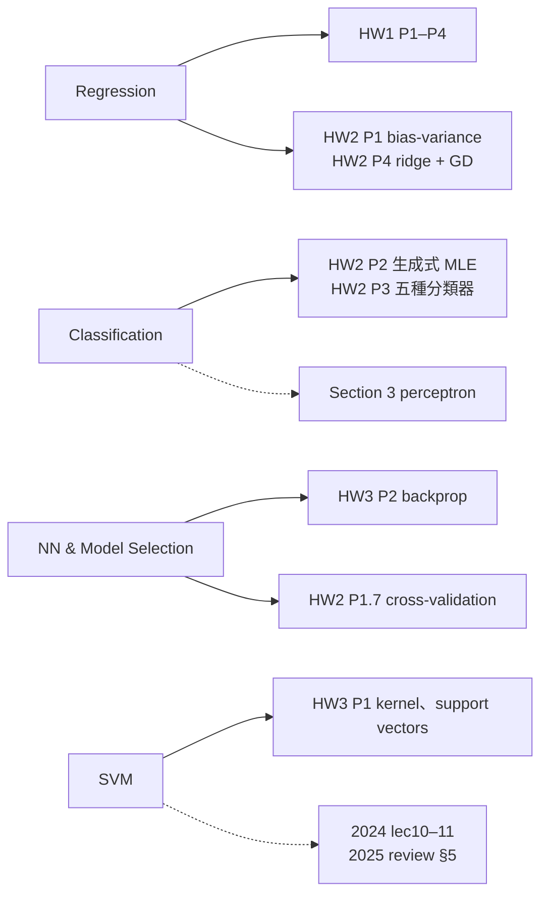

> 🌏 [English version](/posts/tech/2026-09-29-harvard-cs181-midterm-checkpoint-en)

**影片狀態：已查核：官方公開頁未列對應錄影。** [影片來源與說明](#課程影片來源)

> ⚠️ **版本與存取**：考試日期與配分來自 [2026 官方 schedule](https://docs.google.com/spreadsheets/d/13sqhDtt1mYDFJ_vkeMpSVLg9T-aqdATKlch4VXFeOJQ) 與 [2026 syllabus](https://harvard-ml-courses.github.io/cs181-web/syllabus)。課站 `static/` 目錄下的考試資源版本不一：**midterm practice 與 midterm review 標頭是 2025**，notation glossary 標 2025 年 3 月 2 日，midterm checklist 與 concept checks **沒有標年份**。這些 PDF 可以直接用網址開，但課站導覽頁沒有連結。2026 期中考題與解答沒有公開。

[Harvard CS181](https://harvard-ml-courses.github.io/cs181-web/) 的期中考排在第 7 週週二，2026 年 3 月 10 日，在課堂上考。依 syllabus，期中考佔總成績 15%，考試閉卷，但可以帶一張 8.5×11 吋、正反面都能寫的筆記。

這個時間點很特別：HW2 已經交了，[HW3](/posts/tech/2026-09-29-harvard-cs181-hw3-kernels-neural-networks-scaling) 還在做（3 月 23 日才截止）。所以期中考前你寫過 HW0–HW2，HW3 大概寫到一半。本篇不教新東西，只做一件事：**拿官方 checklist 對你寫過的作業，找出哪裡是真的會、哪裡只是寫過。**

官方 checklist 開頭說得很直接：

> "For emphasis: the midterm is not about memorization but will be designed to test your conceptual and analytical understanding."

## 課程影片來源

已核對 CS1810 Spring 2026 官方課表與 syllabus：本文依據作業、section 或考試教材導讀，對應條目未列公開講課影片；官方提供講課投影片與 section 教材。這表示公開課表未提供對應影片，不代表課程從未錄影。

官方來源：

- [CS1810 Spring 2026 official schedule](https://docs.google.com/spreadsheets/d/13sqhDtt1mYDFJ_vkeMpSVLg9T-aqdATKlch4VXFeOJQ/edit?usp=sharing)
- [CS1810 Spring 2026 syllabus](https://harvard-ml-courses.github.io/cs181-web/syllabus)

查核日期：2026-10-10。

## TL;DR

- **範圍**：[midterm checklist](https://harvard-ml-courses.github.io/cs181-web/static/midterm_checklist/midterm_checklist.pdf) 分四塊：Regression、Classification、Neural Networks & Model Selection、SVMs。每塊再分「要知道」「給公式後能推」，部分主題另列「不考」。
- **2026 作業的缺口**：Bayesian 的 posterior predictive、marginal likelihood 與 SVM 的 hard／soft margin、slack、參數 `C`，在 2026 HW0–HW3 裡幾乎沒練到。這幾項要靠 2025 review 與 2024 scribe notes 補。
- **使用順序**：checklist 自評 → concept checks → 2025 practice 限時做 → 對 soln → 回頭補 section。
- **今晚能做的一步**：把 checklist 印出來，每一條旁邊寫下你在哪份作業的哪一題碰過它。寫不出題號的那幾條，就是這週要補的。

## 五份官方資源各是什麼

| 資源 | 版本 | 內容 | 什麼時候用 |
|---|---|---|---|
| [Midterm checklist](https://harvard-ml-courses.github.io/cs181-web/static/midterm_checklist/midterm_checklist.pdf) | 未標年 | 4 大主題，每題分「要知道／給公式能推／不考」 | 第一步，自評 |
| [Concept checks](https://harvard-ml-courses.github.io/cs181-web/static/concept_checks/concept_checks.pdf)（[soln](https://harvard-ml-courses.github.io/cs181-web/static/concept_checks/concept_checks_soln.pdf)） | 未標年 | 7 頁、10 個主題，前 4 個（線性迴歸、分類、模型選擇與 NN、SVM）屬期中範圍 | 快速檢查直覺 |
| [Midterm practice](https://harvard-ml-courses.github.io/cs181-web/static/midterm_practice/midterm_practice.pdf)（[soln](https://harvard-ml-courses.github.io/cs181-web/static/midterm_practice/midterm_practice_soln.pdf)） | 2025 | 前面是 2025 Midterm Topic List，接著 11 道練習題 | 限時模擬 |
| [Midterm review](https://harvard-ml-courses.github.io/cs181-web/static/midterm_review/midterm_review.pdf)（[soln](https://harvard-ml-courses.github.io/cs181-web/static/midterm_review/midterm_review_soln.pdf)） | Spring 2025 | review session 講義：Regression、Classification、Model Selection、Neural Networks、SVM | 補觀念 |
| [Notation glossary](https://harvard-ml-courses.github.io/cs181-web/static/notation_glossary.pdf) | 2025-03-02 | 課程符號表：`X` 是 N×D 資料矩陣、`p(D; θ)` 與 `p(D\|θ)` 分別表示頻率派與貝氏的 likelihood 等 | 看不懂符號時查 |

2025 practice 的開頭特別提醒：這份練習放了很多推導題，但正式考試只會有少量這類題目，其餘是比較不技術性的概念題。所以做 practice 時，不要只練推導速度。

## 用 checklist 對回 2026 作業

下圖是四大主題與 2026 作業的對應。實線是作業有直接練到，虛線是只在 section 或舊講義出現。

### 1. Regression

checklist 的「要知道」包括 bias trick、least squares、`w*` 的推導、基底函數、ridge 與 LASSO、bias-variance 與過擬合的關係，以及 Bayesian linear regression 中先驗與正則化的關係。

- **練過的**：[HW1](/posts/tech/2026-08-27-harvard-cs181-hw1-regression) 的 Basis Regression 與 Probabilistic View of Regression and Regularization（在 Gaussian／Laplace 先驗下推出 ridge／LASSO 的 MAP 形式）；[HW2](/posts/tech/2026-09-29-harvard-cs181-hw2-classification-bias-variance) Problem 1 的 bias-variance 分解與 Problem 4 的 ridge 梯度。
- **缺口**：checklist 還列了 posterior、posterior predictive、marginal likelihood，以及「給定共軛分布形式時求後驗參數」。2026 課表沒有獨立的 Bayesian 講題，作業也沒練到後兩項。可以補的材料是 [2024 lec07 scribe notes](https://harvard-ml-courses.github.io/cs181-web/static/lec07/07-scribe-notes.pdf)（Bayesian model selection）與 2025 practice 的第 5 題 Bayesian Linear Regression。
- **不考**：二階或其他進階最佳化方法，以及背誦共軛關係。

### 2. Classification

「要知道」包括 hinge、0/1、logistic 三種損失的角色，梯度下降的直覺與學習率過大過小會怎樣，perceptron 在線性可分資料上的保證，以及 generative（Naive Bayes）與 discriminative（logistic regression）的差別。

- **練過的**：HW2 Problem 2（含 Lagrange multiplier 的生成式 MLE）、Problem 3（共享與分開共變異數的 Gaussian、softmax、kNN），正好對應 checklist 的「給定先驗與類條件分布，處理完整 log-likelihood」與「比較參數式與非參數式分類器」。
- **只在 section**：perceptron 與 ROC／AUC 在 [Section 3](https://harvard-ml-courses.github.io/cs181-web/static/sec03/sec03.pdf) 有練習題，2026 作業沒有對應題目。Naive Bayes 在 2026 作業裡也沒有單獨出題。

### 3. Neural Networks & Model Selection

「要知道」是 activation function 的必要性、backprop 的用途、cross-validation 與正則化在模型選擇中的角色、NN 做迴歸與分類的差別。「給定資訊後能推」包括手推 backprop、判斷一個小網路能否完成某分類任務、說明架構改動的直覺影響。

- **練過的**：HW3 Problem 2 的兩層 sigmoid 網路 backprop 與 forward-mode autodiff；HW2 Problem 1 的 10-fold cross-validation。
- **注意時序**：如果你照截止日安排進度，考前可能還沒寫完 HW3 Problem 2。它剛好是最好的考前練習。

### 4. SVMs

「要知道」包括 max margin、hinge loss、hard 與 soft margin、參數 `C` 的影響、kernel trick、常見 kernel、support vectors。

- **練過的**：HW3 Problem 1 的 kernel 展開、RBF 的極限行為、以及從 dual 係數 `α` 猜 support vectors。
- **缺口**：hard／soft margin、slack variables、參數 `C` 這幾條，2026 作業完全沒出題。可以用 [2024 lec10](https://harvard-ml-courses.github.io/cs181-web/static/lec10/10-scribe-notes.pdf)、[lec11](https://harvard-ml-courses.github.io/cs181-web/static/lec11/11-scribe-notes.pdf)、2025 review 的 SVM 章節，以及 concept checks 第 8、9 題（`C` 的大小與 RBF `σ²` 對過擬合的影響）補上。
- **不考**：SVM 的 dual 推導與 Lagrange multiplier 詮釋、手解完整二次規劃、KKT 條件推導。

有一點要誠實說：checklist 沒標年份，而它列的 SVM 與 Bayesian 項目比 2026 課表的講題多。它可能是沿用前一年的版本。考前以 Ed 上當期公告的範圍為準；校外自學者拿不到 Ed，就把這兩塊當作「多準備不吃虧」。

## 一週複習節奏

1. **第 1 天：自評**。印 checklist，每條寫上對應作業題號，寫不出來的圈起來。
2. **第 2 天：concept checks 前 4 節**。只寫一兩句答案，對 soln 看直覺有沒有歪。
3. **第 3–4 天：補圈起來的項目**。回到 Section 2、3、4 的講義與 `_soln.pdf`；Bayesian 與 SVM 缺口用 2024 scribe notes 與 2025 review。
4. **第 5 天：限時做 2025 practice**。11 題不必全做，但至少各挑一題迴歸、分類、NN、SVM。
5. **第 6 天：對 soln、做筆記紙**。把自己一直記不住的東西整理到那張雙面筆記上，符號對照 notation glossary。

**不要做的事**：直接讀 soln 當成複習。practice soln 的價值在於你寫完後對答案，先看解答只會讓你以為自己會了。

## 延伸閱讀

- [Stanford CS229 導讀](/posts/ai/2026-08-21-stanford-cs229-machine-learning)：checklist 大部分主題在 CS229 也有另一套講法
- [世界名校 AI／CS 課程地圖](/posts/learning/2026-08-21-global-ai-cs-course-map)：A0–A3 的分級依據

## 系列導覽

- 上一篇：[HW3 核方法、神經網路與 Scaling Law](/posts/tech/2026-09-29-harvard-cs181-hw3-kernels-neural-networks-scaling)
- 下一篇：[HW4（上）Transformer 從手算到多頭注意力](/posts/tech/2026-09-29-harvard-cs181-hw4-transformer)
- 回顧：[HW0](/posts/tech/2026-08-27-harvard-cs181-hw0-linear-algebra-review)、[HW1](/posts/tech/2026-08-27-harvard-cs181-hw1-regression)、[HW2](/posts/tech/2026-09-29-harvard-cs181-hw2-classification-bias-variance)
- 系列總覽：[CS181 導讀總覽](/posts/tech/2026-08-27-harvard-cs181-overview)

## 更新紀錄

- 2026-10-10：標註影片狀態，核對錄影來源與取得方式。

## 參考資料

- [CS181 2026 課程網站](https://harvard-ml-courses.github.io/cs181-web/)
- [CS181 2026 syllabus](https://harvard-ml-courses.github.io/cs181-web/syllabus)（成績配分、考試規則）
- [CS181 2026 schedule（Google Sheet）](https://docs.google.com/spreadsheets/d/13sqhDtt1mYDFJ_vkeMpSVLg9T-aqdATKlch4VXFeOJQ)
- [Midterm checklist](https://harvard-ml-courses.github.io/cs181-web/static/midterm_checklist/midterm_checklist.pdf)
- [2025 Midterm practice](https://harvard-ml-courses.github.io/cs181-web/static/midterm_practice/midterm_practice.pdf)／[解答](https://harvard-ml-courses.github.io/cs181-web/static/midterm_practice/midterm_practice_soln.pdf)
- [Spring 2025 Midterm review](https://harvard-ml-courses.github.io/cs181-web/static/midterm_review/midterm_review.pdf)／[解答](https://harvard-ml-courses.github.io/cs181-web/static/midterm_review/midterm_review_soln.pdf)
- [Concept checks](https://harvard-ml-courses.github.io/cs181-web/static/concept_checks/concept_checks.pdf)／[解答](https://harvard-ml-courses.github.io/cs181-web/static/concept_checks/concept_checks_soln.pdf)
- [Notation glossary](https://harvard-ml-courses.github.io/cs181-web/static/notation_glossary.pdf)
- [s26 homeworks](https://github.com/harvard-ml-courses/cs181-s26-homeworks)
- [Section 3：Classification（2026）](https://harvard-ml-courses.github.io/cs181-web/static/sec03/sec03.pdf)
- 2024 scribe notes：[lec07](https://harvard-ml-courses.github.io/cs181-web/static/lec07/07-scribe-notes.pdf)、[lec10](https://harvard-ml-courses.github.io/cs181-web/static/lec10/10-scribe-notes.pdf)、[lec11](https://harvard-ml-courses.github.io/cs181-web/static/lec11/11-scribe-notes.pdf)
