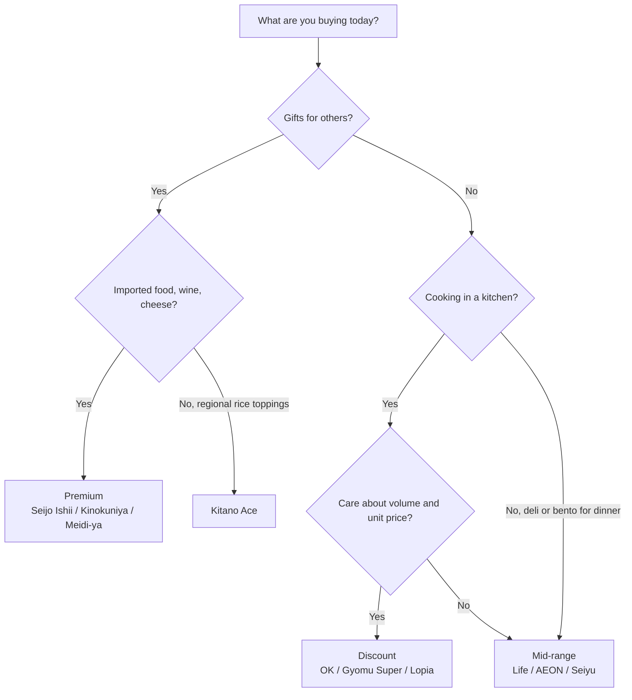

> 🌏 [中文版](/posts/travel/2026-10-02-japan-supermarket-tiers)

A common puzzle when grocery shopping in Japan: why does the same pack of strawberries or box of curry roux cost 30% more in one store than in another? Usually it's because you walked into a different *tier* of store.

Japan has no official supermarket rating, but by positioning and price range the chains fall cleanly into three tiers:

| Tier | Representative chains | Best for |
|---|---|---|
| Premium | Kinokuniya, Seijo Ishii, Meidi-ya, Kitano Ace, Santoku (Tokyo), Ikari (Kansai) | Gifts, imported food, house-brand jams and deli items |
| Mid-range | Life, Maruetsu, AEON, Ito-Yokado, Seiyu, Co-op | Everyday groceries, deli and bento, private-brand snacks |
| Discount | OK, Gyomu Super, Lopia, Trial | Bulk frozen food, meat, room-temperature drinks |

This tiering is based on each chain's published positioning and business model, not on item-by-item price comparisons. Every store has cheaper and pricier items; the sections below go tier by tier.

## Premium supermarkets: gifts and imported food

What premium supermarkets share is that they **import and make things themselves**: a narrower range than a regular supermarket, but a high share of imported food, house brands, and in-house deli items. Most sit in station buildings, department-store food floors, or affluent residential areas, so tourists pass them often.

**[Kinokuniya](https://www.e-kinokuniya.com/corporate/history)** is where Japanese supermarket history starts. It began as a fruit shop in Aoyama, Tokyo, in 1910, and in 1953 converted to a store where customers pick their own goods and pay at a register. The [National Supermarket Association of Japan](https://www.super.or.jp/?page_id=25) recognizes it as Japan's first self-service supermarket. According to Kinokuniya's own history, in 1964 it was also the first to airfreight natural cheese from France to Japan. It is now a [subsidiary of JR East](https://ja.wikipedia.org/wiki/%E7%B4%80%E3%83%8E%E5%9B%BD%E5%B1%8B). Worth buying: its own-brand [all-Japanese Amaou strawberry jam](https://www.super-kinokuniya.jp/c/008/053/1014-4960320020408), listed on its official online shop as room-temperature.

**[Seijo Ishii](https://www.seijoishii.co.jp/company)** started in 1927 as a food shop in Seijo, Setagaya, Tokyo. The company describes its approach as "in-house importing" plus a "central kitchen": it imports its own wine and cheese and makes its own deli items and desserts. After opening its first station store in 1997, it moved heavily into station buildings, so you'll often pass one while traveling. Worth buying: room-temperature in-house baked goods such as the [fermented-butter shortbread and wasanbon polvorones](https://seijoishii.com/pages/hajimetebox). Its official signature Premium Cheesecake is chilled, with a shelf life of about 5 days on the online shop, so eat it on the spot rather than carrying it home.

**[Meidi-ya](https://www.meidi-ya.co.jp/company/story.html)** was founded in Yokohama in 1885 as a ship chandler, supplying food to vessels. It later became the agent for Kirin beer and launched its own "MY" brand jam. Its stores, branded "Meidi-ya Store", are centered on Tokyo, and the company still imports its own food and alcohol. Worth buying: the own-brand MY ["Kajitsu Jikkan" jam series](https://meidi-ya-store.com/product/), room-temperature and easy to carry.

**[Kitano Ace](https://www.ace-group.co.jp/store)** is strictly a specialty food shop that doesn't sell fresh produce. It's known for an entire wall of retort-pouch curries (the section is called "Curry-naru Hondana", a pun on "curry bookshelf") and for regional rice toppings and pickles. Most branches are in department-store food floors and station buildings, making it the easiest place to pick up *gohan no otomo* (rice accompaniments) from around Japan. Worth buying: [ago-iri dashi](https://www.kitano-ace.jp/view/item/000000000297), which the shop labels its top seller on its web shop for 2025 and which keeps at room temperature; it contains bonito and fish, so check Taiwan's quarantine rules before bringing it back.

**[Ikari Supermarket](https://www.ikarisuper.com/info/company)** represents the Kansai region. It opened its first store in Amagasaki, Hyogo, in 1961, and its branches cluster around Ashiya, Nishinomiya, and Kobe. On a trip to Osaka or Kobe, it's the premium supermarket you'll hear about most. Worth buying: baked goods made at its own factory, such as the [Ashiya madeleines and cookies](https://www.ikarisuper-shop.com/products/list?category_id=338); the official pages only say they are made in-house, and I found no "signature item" claim.

**[Santoku](https://santoku.co.jp/company)** is a Tokyo local chain, established in 1949 and headquartered in Okubo, Shinjuku. It calls itself a "high-quality food store" (ハイクオリティフードストア). Stores center on Shinjuku: 29 in Tokyo, 4 in Kanagawa, and 1 in Chiba, mostly in the inner Yamanote area and nearby residential districts, with its own factory supplying bread, sweets, and deli items. If you're staying in Shinjuku or Waseda it is a walkable premium option; it has fewer station-building outlets on tourist routes. Santoku has no room-temperature signature item you can carry to Taiwan: its [in-house workshop "Chef World"](https://santoku.co.jp/workshop) makes bread, sweets, and prepared dishes with short shelf lives, so I left it off the gift list.

**What to do**: if your gift list includes wine, cheese, jam, or retort curry, put this tier on your itinerary; fresh produce here usually isn't good value.

## Mid-range supermarkets: the everyday workhorses

This is where Japanese people shop for groceries every day. Prices are moderate, the range is full, and the selection of deli items and bento is the widest. Every chain has its own private brand (PB), which is the most useful thing to compare.

**[Life](https://www.lifecorp.jp/company/info/about.html)** operates in the two big metro areas, Kinki and the Greater Tokyo Area, with 322 stores as of the end of August 2026, so it's easy to find in central Osaka and Tokyo. It also runs [BIO-RAL](https://www.lifecorp.jp/company/ir/company/business), an organic and natural food sub-brand launched in 2016; look for the BIO-RAL section if you want organic snacks. I found no reliable source for individual BIO-RAL or Life Premium items, so check the in-store section.

**[Maruetsu](https://www.maruetsu.co.jp/company/outline/)** is one of the largest food supermarket chains in the Tokyo area. Founded in 1945 in Urawa, Saitama, it had 308 stores at the end of August 2026 across Tokyo, Kanagawa, Saitama, and Chiba. In 2015 it formed [United Super Markets Holdings](https://www.usmh.co.jp/about) with Kasumi and Maxvalu Kanto, and it belongs to the AEON group. It runs three formats: standard "Maruetsu", the urban small-format "Maruetsu Petit", and the higher-quality "Rincos". The Orange Court store in Shinjuku sits inside a shopping complex and is an example of the first; check in-store notices for hours and range. Worth buying: room-temperature snacks from the U.S.M.H group's shared private brand [eatime](https://eatime-web.com/products_list/sweets), such as seaweed okaki and manuka honey throat candy; the brand is not unique to Maruetsu.

**[Co-op](https://map.coopdeli.coop/mirai/tokyo/shop/toyama.html)** (seikyo, Co-op Mirai) supermarkets are run by a consumer cooperative, with stores in Tokyo, Saitama, and Chiba. The Co-op Toyama store in Shinjuku is open until 11 p.m. and accepts credit cards, PayPay, Suica, and PASMO. Article 12 of Japan's [consumer co-operative law](https://laws.e-gov.go.jp/law/323AC0000000200) bars non-members from using a co-op's business, with listed exceptions that don't cover ordinary stores, and the [official position is that using a co-op means joining as a member](https://jccu.coop/about/question/), with a few exceptions such as alcohol and tobacco ([explained by U-Coop](https://www.ucoop.or.jp/profile/coop/dictionary/)). Anyone who [lives or works in Tokyo, Saitama, or Chiba](https://shop-mirai.coopnet.or.jp/contacts/) can join with a refundable ¥500 share. In practice, [non-members can check out like at any ordinary supermarket](https://coop-takuhai.com/anyone-can-use-the-co-op-deli-shop/), with the cashier at most asking about a point card. That reflects how stores operate today, not an official guarantee, and practice may differ by store, so follow the in-store signage. Without membership you don't get the member points and offers, and I found no official statement on tax-free shopping, so ask staff first if you need it.

**AEON** is a nationwide retail group with many supermarkets and shopping malls. Its private brand is [TOPVALU](https://www.topvalu.net/items/category/100000000), which includes a budget line called "Best Price". Check the [TOPVALU Award 2026](https://www.topvalu.net/topvaluaward2026) winners; room-temperature ones include Best Price shio ramen and the soy-sauce blend spice. A win doesn't mean every store stocks it.

**Ito-Yokado** was the founding business of 7-Eleven's parent company. In September 2025, Seven & i Holdings [completed the sale](https://www.nikkei.com/article/DGXZQOUC012XO0R00C25A9000000) of York Holdings, which owns Ito-Yokado, to the US investment firm Bain Capital. The business is still being restructured under new owners, so check that a branch is still open before you go. Its private brand is the low-price [Seven The Price](https://www.itoyokado.co.jp/7theprice/), whose official page lists dashi stock, miso soup, and chocolate biscuits; I did not verify that each item is still on shelves.

**Seiyu** sits between mid-range and discount. In July 2025 it was [acquired for about ¥380 billion](https://www.nikkei.com/article/DGXZQOUC019910R00C25A7000000) by Trial, a discount retailer from Kyushu, and some stores have been renamed "Trial Seiyu". Its private brand [Minasama no Osumitsuki](https://www.seiyu.co.jp/pb/mo) follows a clear rule: a product only launches if more than 80% of 100+ consumer testers approve. When you don't know which brand to pick, the double-circle logo of this line is a fairly safe bet. The official PB page for September 2026 lists [Saag Dal curry and caramelized almond and cashew nuts](https://www.seiyu.co.jp/pb/mo/), both room-temperature and marked as new or renewed, so they may not stay on sale long.

**What to do**: pick a mid-range supermarket near where you're staying as your supply base, check the deli and bento section in the evening, and buy private-brand snacks as cheap souvenirs.

## Discount supermarkets: big packs, low prices, pick carefully

What this tier shares is trading costs for low prices: few or no sale flyers, drinks stocked at room temperature, and large pack sizes. The stores are bare-bones, but if you're staying in an apartment with a kitchen or want big packs of snacks, this tier is the best value.

**[OK](https://ok-corporation.jp/topics/kansai)** was founded in 1958, operates mainly in the Kanto region, and has recently expanded into Kansai. Its official positioning is "High Quality, Everyday Low Price" (EDLP). A few of its practices stand out:

- **Matching competitors**: if a major competitor within 1 km of the store sells something cheaper (sale items included), OK lowers its price to match and posts a notice saying so
- **Honest Cards**: when a product's quality drops or its price spikes, the store posts a card suggesting customers buy something else
- **Member cash discount**: with an OK member card (¥200 to issue, requiring only a postal code), food purchases excluding alcohol paid **in cash** get about 3% off; cards and e-money don't qualify
- Drinks are stocked at room temperature unless they need refrigeration, and shopping bags cost extra
- **Worth buying**: OK's own [OK Original](https://ok-corporation.jp/feature/showcase.html) line, such as Ceylon tea bags, instant coffee, and fried onions, all room-temperature.

**[Gyomu Super](https://www.kobebussan.co.jp/business/retail.php)** means "business supermarket", but it's open to everyone. Its parent, Kobe Bussan, emphasizes vertical integration: its own factories in Japan plus direct imports from partner factories in about 50 countries. Its official description also makes EDLP central, saying it doesn't need weekly sales or heavy advertising. Frozen food, bulk condiments, and imported snacks are its strengths, and it has stores across Japan. Worth buying: room-temperature retort pouches, such as the [Gorogoro Yasai sweet curry](https://www.gyomusuper.jp/product/search.php) that the official page says is made at a domestic group factory.

**[Lopia](https://lopia.jp/company)** began in 1971 as a butcher shop, "Niku no Takaraya", in Fujisawa, Kanagawa. As of September 2026 it has 170 stores, and meat is still its signature. Readers in Taiwan may already know it from its Taiwan branches; the Japanese stores are likewise known for large packs at low prices. Lopia's official private-brand page calls Marukoshi Jozo's garlic ponzu a [big hit](https://lopia.jp/growth), a room-temperature seasoning you can carry; its signature in-house sausages are a meat product and can't be brought into Taiwan.

**Trial** is a discount supermarket chain from Kyushu. After acquiring Seiyu, it began expanding its small-format "Trial GO" stores into the Greater Tokyo Area. The official store-manager ranking is mostly [bread, chilled desserts, and frozen pasta](https://www.trial-net.co.jp/mag/detail/21300/), best eaten in Japan, and I found no reliably sourced room-temperature gift item.

**What to do**: if you're staying somewhere with a kitchen, or want to stock up on bulk snacks and condiments, look for an OK or Gyomu Super nearby; to use OK's member discount, bring cash.

## Choosing a store by what you're buying

## Three things to know before checkout

1. **Check whether the price includes tax**: Japanese price tags often print the pre-tax price (*hontai kakaku*) largest. According to the [National Tax Agency](https://www.nta.go.jp/publication/pamph/shohi/aramashi/pdf/003.pdf) (in Japanese), food other than alcohol is taxed at the reduced 8% rate, while alcohol and household goods are taxed at 10%. Seeing both rates on one receipt is normal.
2. **Bags cost money**: since July 1, 2020, [plastic shopping bags must be charged for nationwide](https://www.meti.go.jp/policy/recycle/plasticbag/plasticbag_top.html) (in Japanese), so the cashier will ask whether you need one. Bringing your own bag is easiest.
3. **Payment method can change the price**: most large supermarkets accept credit cards, but OK's member discount is cash-only. If a card terminal offers to charge you in your home currency, choose yen; see the DCC section in [Should frequent Japan and Korea travelers open a foreign currency account?](/posts/travel/2026-08-17-foreign-currency-account-japan-korea-en) for why.

## Limits of this tiering

- **Regions differ a lot**: the chains here are mostly Tokyo- and Osaka-based. Hokkaido, Kyushu, and Tohoku each have strong local chains worth looking up when you're there.
- **The item matters more than the store**: premium supermarkets carry cheap private-brand items too, and imported alcohol at a discount store isn't always the cheapest. The tier only tells you which way a store leans overall.
- **The three newest additions aren't price-compared**: Santoku, Maruetsu, and Co-op are placed by their own positioning and store format, not item-by-item prices; I put Co-op Toyama in mid-range based on its format as an ordinary supermarket.
- **Recommended items come only from what official pages show**: Life and Co-op are not listed because I found no reliable item-level source; official pages mostly carry no date, so whether an item is still on shelves, or a given store stocks it, is for the store to say. Items containing meat or fresh produce face quarantine limits when entering Taiwan, so check the rules before you leave.
- **The industry is consolidating**: Seiyu and Ito-Yokado both changed owners in 2025, so store names, store counts, and private brands may keep changing. The information in this post was checked in October 2026.

## Update log

- 2026-10-03: added recommended products for each supermarket, limited to items I could confirm on official pages
- 2026-10-03: corrected the Co-op eligibility wording: officially membership-based, but non-members can usually check out in practice
- 2026-10-03: added Santoku (premium) and Maruetsu and Co-op (mid-range), three supermarkets around Shinjuku, Tokyo

## References

- [History of Kinokuniya | Kinokuniya Co., Ltd.](https://www.e-kinokuniya.com/corporate/history) (in Japanese)
- [Association overview | National Supermarket Association of Japan](https://www.super.or.jp/?page_id=25) (in Japanese)
- [Kinokuniya | Wikipedia](https://ja.wikipedia.org/wiki/%E7%B4%80%E3%83%8E%E5%9B%BD%E5%B1%8B) (in Japanese)
- [Seijo Ishii corporate information](https://www.seijoishii.co.jp/company) (in Japanese)
- [History of Meidi-ya | Meidi-ya](https://www.meidi-ya.co.jp/company/story.html) (in Japanese)
- [Store list | Ace Co., Ltd. (Kitano Ace)](https://www.ace-group.co.jp/store) (in Japanese)
- [Company overview | Ikari Supermarket](https://www.ikarisuper.com/info/company) (in Japanese)
- [Company profile | Santoku Co., Ltd.](https://santoku.co.jp/company) (in Japanese)
- [Company overview | Life Corporation](https://www.lifecorp.jp/company/info/about.html) (in Japanese)
- [Business overview | Life Corporation IR](https://www.lifecorp.jp/company/ir/company/business) (in Japanese)
- [Company overview | Maruetsu](https://www.maruetsu.co.jp/company/outline/) (in Japanese)
- [About U.S.M.H | United Super Markets Holdings](https://www.usmh.co.jp/about) (in Japanese)
- [Co-op Toyama store information | Co-op Mirai](https://map.coopdeli.coop/mirai/tokyo/shop/toyama.html) (in Japanese)
- [Joining at the store | Co-op Mirai](https://shop-mirai.coopnet.or.jp/contacts/) (in Japanese)
- [FAQ | Japanese Consumers' Co-operative Union](https://jccu.coop/about/question/) (in Japanese)
- [Consumer Co-operative Act | e-Gov Law Search](https://laws.e-gov.go.jp/law/323AC0000000200) (in Japanese)
- [Co-op dictionary | U-Coop](https://www.ucoop.or.jp/profile/coop/dictionary/) (in Japanese)
- [Can non-members shop at Co-op Mirai stores? | Coop de Takuhai](https://coop-takuhai.com/anyone-can-use-the-co-op-deli-shop/) (in Japanese; third-party, not official, page carries delivery-service promo links)
- [TOPVALU food | AEON](https://www.topvalu.net/items/category/100000000) (in Japanese)
- [Product page | Kinokuniya online shop](https://www.super-kinokuniya.jp/c/008/053/1014-4960320020408) (in Japanese)
- [First-time box | Seijo Ishii.com](https://seijoishii.com/pages/hajimetebox) (in Japanese)
- [Products | Meidi-ya Store](https://meidi-ya-store.com/product/) (in Japanese)
- [Ago-iri dashi | Kitano Ace web shop](https://www.kitano-ace.jp/view/item/000000000297) (in Japanese)
- [Western and baked sweets | Ikari Supermarket online shop](https://www.ikarisuper-shop.com/products/list?category_id=338) (in Japanese)
- [Chef World | Santoku Co., Ltd.](https://santoku.co.jp/workshop) (in Japanese)
- [eatime sweets | U.S.M.H](https://eatime-web.com/products_list/sweets) (in Japanese)
- [TOPVALU Award 2026 | AEON](https://www.topvalu.net/topvaluaward2026) (in Japanese)
- [Seven The Price | Ito-Yokado](https://www.itoyokado.co.jp/7theprice/) (in Japanese)
- [Minasama no Osumitsuki | Seiyu](https://www.seiyu.co.jp/pb/mo/) (in Japanese)
- [Recommended products | OK](https://ok-corporation.jp/feature/showcase.html) (in Japanese)
- [Product information | Gyomu Super](https://www.gyomusuper.jp/product/search.php) (in Japanese)
- [Growth and private brands | Lopia](https://lopia.jp/growth) (in Japanese)
- [Store managers' popular product ranking | Trial](https://www.trial-net.co.jp/mag/detail/21300/) (in Japanese)
- [Seven & i completes sale of Ito-Yokado and others | Nikkei](https://www.nikkei.com/article/DGXZQOUC012XO0R00C25A9000000) (in Japanese)
- [Trial completes ¥380 billion acquisition of Seiyu | Nikkei](https://www.nikkei.com/article/DGXZQOUC019910R00C25A7000000) (in Japanese)
- [Minasama no Osumitsuki | Seiyu](https://www.seiyu.co.jp/pb/mo) (in Japanese)
- [Features of OK, the supermarket with everyday low prices | OK Corporation](https://ok-corporation.jp/topics/kansai) (in Japanese)
- [Gyomu Super business | Kobe Bussan](https://www.kobebussan.co.jp/business/retail.php) (in Japanese)
- [Company overview | Lopia](https://lopia.jp/company) (in Japanese)
- [Overview of consumption tax: reduced-rate items | National Tax Agency](https://www.nta.go.jp/publication/pamph/shohi/aramashi/pdf/003.pdf) (in Japanese)
- [Plastic shopping bag charges | Ministry of Economy, Trade and Industry](https://www.meti.go.jp/policy/recycle/plasticbag/plasticbag_top.html) (in Japanese)
