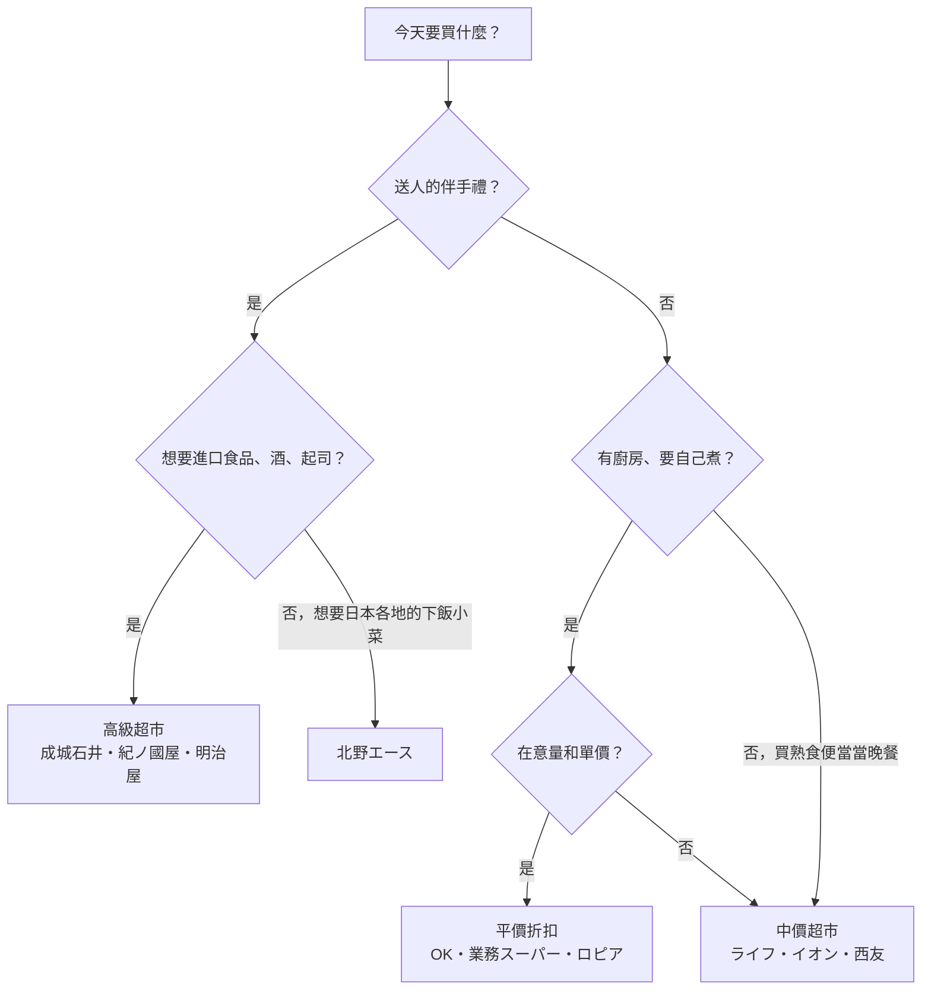

> 🌏 [English version](/posts/travel/2026-10-02-japan-supermarket-tiers-en)

去日本逛超市，常見的困惑是：同樣一盒草莓、一包咖哩塊，為什麼這家比那家貴三成？答案多半是你走進了不同「等級」的店。

日本超市沒有官方評等，但依照定位與價格帶，可以很清楚地分成三層：

| 等級 | 代表品牌 | 適合買什麼 |
|---|---|---|
| 高級 | 紀ノ國屋、成城石井、明治屋、北野エース、いかり（關西） | 伴手禮、進口食品、自家品牌果醬與熟食 |
| 中價 | ライフ、イオン、イトーヨーカドー、西友 | 日常食材、熟食便當、各家 PB 零食 |
| 平價折扣 | OK、業務スーパー、ロピア、トライアル | 大包裝冷凍食品、肉品、常溫飲料 |

這份分級依據的是各家公開的定位與商業模式，不是逐品項比價。同一家店裡一定有比較便宜和比較貴的東西，下面會逐級說明。

## 高級超市：買伴手禮與進口食品

高級超市的共同點是**自己進口、自己做**：選品比一般超市窄，但進口食品、自家品牌與熟食的比例高。多數開在車站大樓、百貨地下街或高收入住宅區，觀光客動線上很容易碰到。

**[紀ノ國屋](https://www.e-kinokuniya.com/corporate/history)** 是日本超市史的起點。它 1910 年在東京青山以水果行起家，1953 年改成客人自己挑貨、到收銀台結帳的店，[全國超市協會](https://www.super.or.jp/?page_id=25)把它認定為日本第一家自助式超市。依紀ノ國屋自己的沿革，1964 年它也率先從法國空運天然起司進日本。現在是 [JR 東日本的子公司](https://ja.wikipedia.org/wiki/%E7%B4%80%E3%83%8E%E5%9B%BD%E5%B1%8B)。

**[成城石井](https://www.seijoishii.co.jp/company)** 1927 年從東京世田谷成城的食品店起家，官方把自己的做法寫成「自社輸入」加「セントラルキッチン」（中央廚房）：葡萄酒、起司自己進口，熟食與甜點自己做。1997 年開出第一家車站店之後，大量進駐車站大樓，旅途中很容易順路經過。

**[明治屋](https://www.meidi-ya.co.jp/company/story.html)** 1885 年在橫濱創業，原本是幫船隻補給食品的「船舶納入業」，後來代理麒麟啤酒、推出自家「MY」品牌果醬。店名叫「明治屋ストアー」，以東京為中心展店，至今仍自己進口食品與酒類。

**[北野エース](https://www.ace-group.co.jp/store)** 嚴格說是食品選物店，不賣生鮮。它的招牌是整面牆的調理包咖哩（店內專區叫「カレーなる本棚」），以及各地的拌飯料、醬菜。店多半開在百貨地下街與車站大樓，想帶日本各地的「ご飯のお供」（下飯小菜）回家，這裡最方便。

**[いかりスーパー](https://www.ikarisuper.com/info/company)** 是關西代表。1961 年在兵庫尼崎開第一家店，店舖集中在芦屋、西宮、神戶一帶。去大阪、神戶旅行時，它是關西最常被提到的高級超市。

**怎麼做**：伴手禮清單裡有葡萄酒、起司、果醬或調理包咖哩時，把這一級排進行程；生鮮蔬果在這裡買通常不划算。

## 中價超市：日常補給的主力

這一級是日本人每天買菜的地方。價格中等、品項齊全，熟食與便當的選擇最多。各家都有自己的 PB（自有品牌），這是比價時最值得看的東西。

**[ライフ](https://www.lifecorp.jp/company/info/about.html)**（Life）在近畿圈與首都圈兩大都會區展店，2026 年 8 月底共 322 家，大阪和東京市區很好找。它另外經營有機與天然食品的子品牌 [BIO-RAL](https://www.lifecorp.jp/company/ir/company/business)（2016 年起），想買有機零食可以留意店內的 BIO-RAL 專區。

**イオン**（AEON）是全國性大型零售集團，旗下超市、購物中心數量多，自有品牌是 [トップバリュ](https://www.topvalu.net/items/category/100000000)（TOPVALU）。PB 裡還細分出主打低價的「ベストプライス」系列。

**イトーヨーカドー**（Ito-Yokado）原本是 7-Eleven 母公司的起家事業。2025 年 9 月，母公司セブン＆アイ把它所屬的ヨーク・ホールディングス[賣給美國投資基金貝恩資本](https://www.nikkei.com/article/DGXZQOUC012XO0R00C25A9000000)，經營權轉手後仍在調整，造訪前最好先查分店是否還在營業。

**西友**（SEIYU）在中價與平價之間。它在 2025 年 7 月被九州起家的折扣零售商トライアル[以約 3,800 億日圓收購](https://www.nikkei.com/article/DGXZQOUC019910R00C25A7000000)，部分店舖已改名「トライアル西友」。它的 PB [みなさまのお墨付き](https://www.seiyu.co.jp/pb/mo)有一條明確規則：100 人以上的消費者試吃，支持率超過 80% 才能上架。不知道該買哪個牌子時，挑有雙圈標誌的這系列，踩雷機率較低。

**怎麼做**：住宿附近找一家中價超市當補給站，傍晚去看熟食與便當，買 PB 零食當平價伴手禮。

## 平價折扣：量大便宜，自己挑

這一級的共同點是用省成本換低價：少做或不做特價傳單、飲料常溫陳列、包裝偏大。店裝陽春，但如果住的是有廚房的公寓，或要掃大包裝零食，這一級最划算。

**[OK](https://ok-corporation.jp/topics/kansai)**（オーケー）1958 年創業，以關東為主，近年開始進軍關西，官方定位是「高品質・Everyday Low Price」（EDLP，天天低價）。幾個做法很有特色：

- **競爭店對抗降價**：店舖方圓 1 公里內的主要競爭店若賣得更便宜（包括特價品），OK 會跟著降價，並貼出告示
- **オネストカード**（誠實卡）：商品品質變差或價格暴漲時，店家會主動貼卡片建議客人改買別的東西
- **會員現金折扣**：持 OK 會員卡（發卡費 200 日圓、只需填郵遞區號）以**現金**購買酒類以外的食品，可折抵約 3%；刷卡、電子支付不適用
- 飲料除了需要冷藏的商品以外，一律常溫陳列；購物袋要付費

**[業務スーパー](https://www.kobebussan.co.jp/business/retail.php)** 名字是「業務用超市」，但一般人也能買。母公司神戶物產主打「製販一體」：國內自家工廠製造，加上從約 50 個國家的海外合作工廠直接進口。官方說明也把 EDLP 當成核心，「不需要每週特價或大量廣告」。冷凍食品、大容量調味料與進口零食是它的強項，店舖遍布全日本。

**[ロピア](https://lopia.jp/company)**（LOPIA）1971 年從神奈川藤澤的肉舖「肉の宝屋」起家，到 2026 年 9 月共 170 家店，肉品仍是招牌。台灣讀者可能已經在台灣見過它，日本的店同樣以大包裝、價格低為特色。

**トライアル**（TRIAL）是九州起家的折扣超市，收購西友後開始在首都圈擴張小型店「トライアルGO」。

**怎麼做**：住有廚房的住宿、或要掃大包裝零食與調味料時，查一下附近有沒有 OK 或業務スーパー；想用 OK 的會員折扣，記得準備現金。

## 用購物目的選店

## 結帳前要知道的三件事

1. **看清楚是稅前還是含稅價**：日本的價格標籤常把「本体価格」（稅前）印得最大。根據[國稅廳說明](https://www.nta.go.jp/publication/pamph/shohi/aramashi/pdf/003.pdf)，酒類以外的食品適用 8% 軽減稅率，酒類與日用品是 10%。同一張收據上兩種稅率並存是正常的。
2. **購物袋要錢**：日本自 2020 年 7 月 1 日起，[塑膠購物袋全面收費](https://www.meti.go.jp/policy/recycle/plasticbag/plasticbag_top.html)，超市結帳時店員會問要不要袋子。自備購物袋最省事。
3. **付款方式影響價格**：多數大型超市都收信用卡，但 OK 的會員折扣只限現金。刷卡時如果被問要不要用新台幣結帳，選日圓，理由見[常去日韓該不該開外幣帳戶](/posts/travel/2026-08-17-foreign-currency-account-japan-korea)裡的 DCC 段落。

## 這份分級的限制

- **地區差異大**：本文的品牌以東京與大阪為主。北海道、九州、東北各有強勢的在地超市，到當地可以另外查。
- **品項比店重要**：高級超市也有平價 PB，折扣超市的進口酒不一定最便宜。分級只告訴你「這家店整體偏向哪一邊」。
- **業界在重組**：西友、イトーヨーカドー都在 2025 年換了經營者，店名、店舖數與 PB 可能還會變。本文資料查詢於 2026 年 10 月。

## 參考資料

- [紀ノ国屋の歴史｜株式会社紀ノ國屋](https://www.e-kinokuniya.com/corporate/history)
- [協会概要｜全国スーパーマーケット協会](https://www.super.or.jp/?page_id=25)
- [紀ノ国屋｜Wikipedia](https://ja.wikipedia.org/wiki/%E7%B4%80%E3%83%8E%E5%9B%BD%E5%B1%8B)
- [成城石井 企業情報](https://www.seijoishii.co.jp/company)
- [明治屋の歴史（沿革）｜明治屋](https://www.meidi-ya.co.jp/company/story.html)
- [店舗紹介｜株式会社エース（北野エース）](https://www.ace-group.co.jp/store)
- [会社概要｜いかりスーパー](https://www.ikarisuper.com/info/company)
- [会社概要｜ライフコーポレーション](https://www.lifecorp.jp/company/info/about.html)
- [事業紹介｜ライフコーポレーション IR](https://www.lifecorp.jp/company/ir/company/business)
- [TOPVALU 食品｜イオン](https://www.topvalu.net/items/category/100000000)
- [セブン＆アイ、イトーヨーカ堂など売却手続き完了｜日本経済新聞](https://www.nikkei.com/article/DGXZQOUC012XO0R00C25A9000000)
- [トライアル、西友の3800億円買収完了｜日本経済新聞](https://www.nikkei.com/article/DGXZQOUC019910R00C25A7000000)
- [みなさまのお墨付き｜西友](https://www.seiyu.co.jp/pb/mo)
- [毎日が特売のスーパー「オーケー」の特徴｜オーケー株式会社](https://ok-corporation.jp/topics/kansai)
- [業務スーパー事業｜神戸物産](https://www.kobebussan.co.jp/business/retail.php)
- [会社概要｜株式会社ロピア](https://lopia.jp/company)
- [消費税のあらまし：軽減税率の対象｜国税庁](https://www.nta.go.jp/publication/pamph/shohi/aramashi/pdf/003.pdf)
- [プラスチック製買物袋有料化｜経済産業省](https://www.meti.go.jp/policy/recycle/plasticbag/plasticbag_top.html)
